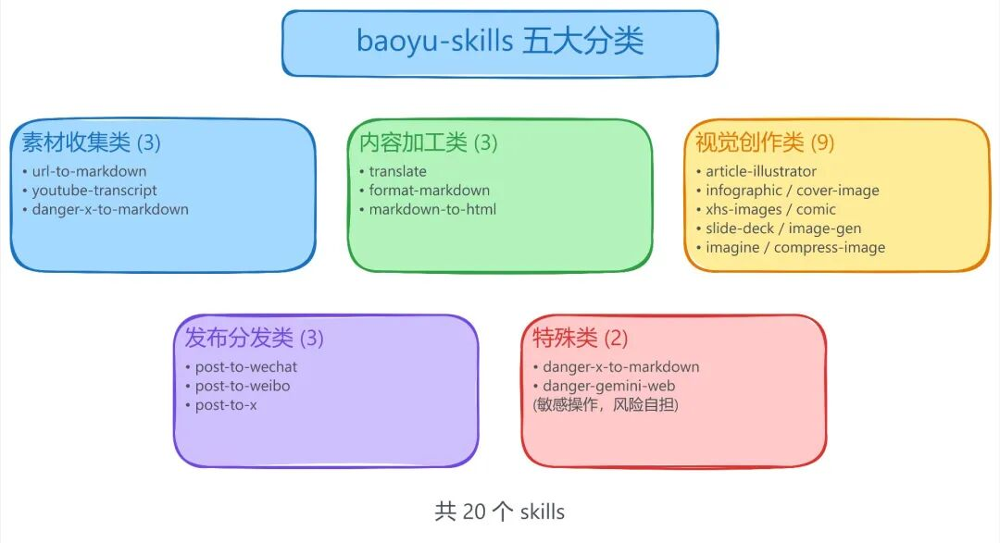
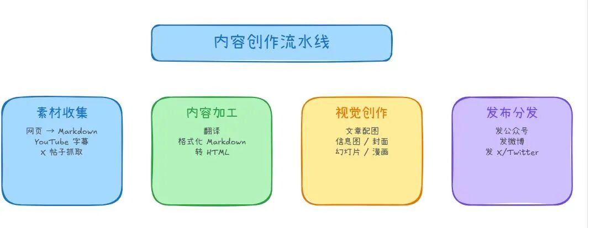

> 📎 来源: [大模型AI之旅](https://mp.weixin.qq.com/s?__biz=MzU2NTUzOTUyMg==&mid=2247484445&idx=1&sn=7bcf4d103b1df0e992cd2160db454dda&chksm=fd9a25c146e183f72759b154c34fa8520f248f411e0b551e058790bf9c7ff56f9990e814fccf&mpshare=1&scene=1&srcid=0424ODycULR2HlhrGAATq6rr&sharer_shareinfo=2c15deb9f9efe999058b0afdcd40432f&sharer_shareinfo_first=2c15deb9f9efe999058b0afdcd40432f) | 时间: 2026-04-24 00:15

---

# 每日一 Skills 推荐｜baoyu-skills：13000 Star 的内容创作全家桶，从选题到发一条龙

Skills 生态里有个有趣的现象：大部分 skill 解决的是单一问题。翻译就是翻译，配图就是配图，发微博就是发微博。

但内容创作不是单一动作。写一篇公众号，你要找素材、写初稿、配插图、调格式、发平台、做封面。每个环节换一个工具，光是记住不同工具的命令就要花半天。

baoyu-skills 是另一个思路。它把整个内容创作流程拆开，每个环节做一个 skill，最后串成一条完整的生产线。

13000 Star，1472 Fork。这不是一个工具，是一整套工具箱。

## 到底有多少个 skill？

打开仓库一看，20 个。

按功能分，大概能分成 5 类：

**素材收集类**

- baoyu-url-to-markdown： 把任意网页转成 Markdown
- baoyu-youtube-transcript： 提取 YouTube 视频字幕
- baoyu-danger-x-to-markdown： 把 X/Twitter 帖子转成 Markdown（为什么叫 danger 后面说）

**内容加工类**

- baoyu-translate： 翻译
- baoyu-format-markdown： 格式化 Markdown
- baoyu-markdown-to-html： Markdown 转 HTML

**视觉创作类**

- baoyu-article-illustrator： 给文章配图，Type × Style 二维矩阵
- baoyu-infographic： 生成信息图
- baoyu-cover-image： 生成封面图
- baoyu-xhs-images： 小红书风格图片
- baoyu-comic： 漫画风格
- baoyu-slide-deck： 幻灯片
- baoyu-image-gen： 通用图片生成
- baoyu-imagine： 创意想象
- baoyu-compress-image： 压缩图片

**发布分发类**

- baoyu-post-to-wechat： 发到微信公众号
- baoyu-post-to-weibo： 发到微博
- baoyu-post-to-x： 发到 X/Twitter

**特殊类**

- baoyu-danger-gemini-web： 让 AI 控制浏览器访问 Gemini

看到这儿你可能已经明白了：这是一条从“我要写点东西”到“发出去”的完整链路。



配图 1：baoyu-skills 五大分类

## 最值得说的几个 skill

**baoyu-article-illustrator：给文章配图的正确方式**

这个 skill 的设计思路很清晰。它没有试图“智能生成一张图”，而是先把配图问题拆成两个维度：

| 维度 | 控制什么 | 例子 |
| --- | --- | --- |
| Type | 信息结构 | 信息图、场景图、流程图、对比图、框架图、时间线 |
| Style | 视觉风格 | Notion 风、暖色调、极简、蓝图、水彩、优雅 |

两个维度自由组合：

```
--type infographic --style blueprint
```

。

还提供了预设：

```
--preset tech-explainer
```

，一条命令搞定类型+风格。

工作流程也很规范：预检查 → 分析内容 → 确认设置 → 生成大纲 → 生成图片 → 收尾。每一步都有明确的检查点。

**baoyu-post-to-wechat：发公众号这件事终于自动化了**

公众号发布一直是个痛点。官方没有开放 API，第三方工具要么不稳定要么收费。

这个 skill 的方案是模拟登录 + 自动化操作。你提供账号信息，它帮你完成发布流程。风险当然有——账号安全、频率限制——但如果你是高频内容生产者，这个工具能省大量时间。

**baoyu-danger 系列：为什么要加 danger 前缀？**

作者给某些 skill 加了 danger 前缀，比如 

```
baoyu-danger-x-to-markdown
```

、

```
baoyu-danger-gemini-web
```

。

这不是噱头。这些 skill 涉及敏感操作：

- danger-x-to-markdown： 需要登录 X 账号，有被封号风险
- danger-gemini-web： 让 AI 控制你的浏览器，访问你的 Gemini 账号

作者的态度很明确：能用，但风险自担。这种坦诚反而让人更信任。

**baoyu-youtube-transcript：研究者的利器**

YouTube 是个被低估的知识库。很多技术分享、产品评测、行业洞察只在视频里存在。

这个 skill 提取视频字幕，转成 Markdown。配合其他 skill，你可以：

1. 提取视频字幕
2. 翻译成中文
3. 生成信息图摘要
4. 发布到公众号

一条完整的“视频内容再生产”流水线。



配图 2：内容创作流水线

## 为什么这套 skill 能火？

看了一下更新记录，这个项目从 2026 年 1 月开始，三个月冲到 13000 Star。原因大概是这几个：

**完整的生态定位**

它没有试图做一个“万能工具”，而是聚焦在“内容创作”这个场景。这个场景足够具体，又足够宽：自媒体、技术博客、产品文档、运营物料都在范围内。

**跨平台支持**

支持 Claude、Codex、OpenClaw 多个 Agent 平台。这不是选边站，而是承认现实：今天的 AI 生态是多平台并存的。

**模块化设计**

每个 skill 独立可用，也可以组合。你不需要装全套，只装自己需要的几个就行。

**持续更新**

CHANGELOG 写到 68KB，更新频率很高。这种维护力度在开源项目里不多见。

## 适合谁？

**适合：内容创作者**

如果你经常写公众号、技术博客、运营文案，这套工具能覆盖你 80% 的需求。从素材收集到发布分发，一条龙。

**适合：多平台运营者**

微博、公众号、X 三端同步发？这套 skill 支持多平台发布，省去逐个平台操作的麻烦。

**适合：技术文档写作者**

YouTube 视频转 Markdown、代码格式化、信息图生成，这些功能对技术文档特别有用。

**不太适合：追求极致质量的人**

自动化意味着标准化。如果你对每一篇文章、每一张图都有独特要求，这套工具可能太“流水线”了。

## 判断

baoyu-skills 是 Skills 生态里最成熟的“场景化 skill 集合”。

它不是在做一个工具，而是在定义一个工作流。内容创作这件事，从选题、素材、写作、配图、格式化到发布，每个环节都被覆盖到了。

13000 Star 的背后，是大量内容创作者的真实需求。没有试图做一个大而全的 AI 助手，而是老老实实地把“写东西、发东西”这件事拆解清楚，然后逐个环节做工具。

这种思路值得学习。

开源地址：https://github.com/JimLiu/baoyu-skills

---

以上，既然看到这里了，

如果觉得不错，随手点个赞、在看、转发三连吧，

如果想第一时间收到推送，也可以给我个星标⭐～

谢谢你看我的文章

---

## 后台回复skill，也可以获取全套skill～

*我创建了一个skill分享交流群，有兴趣的可以加入*


