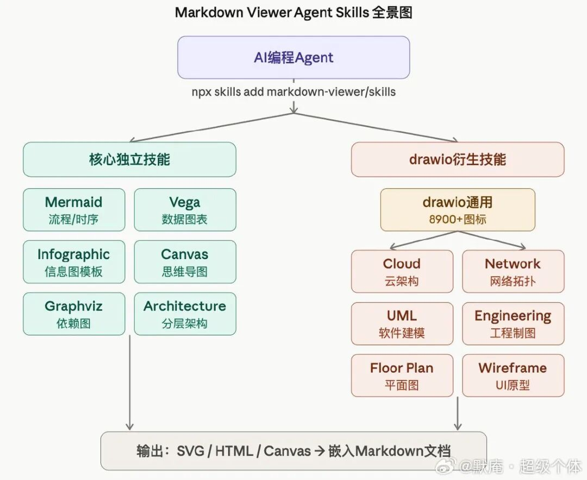
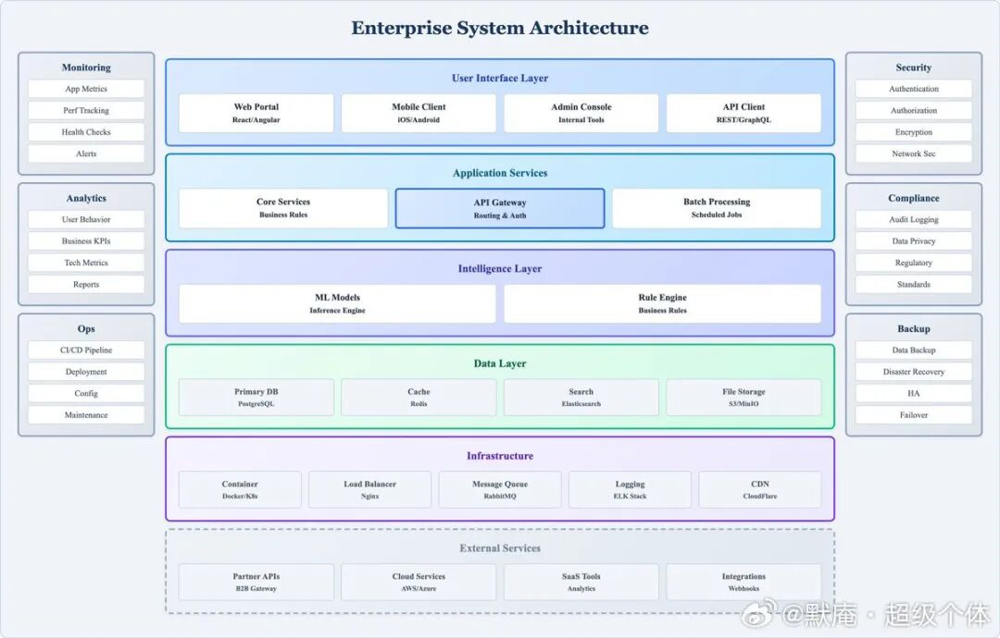
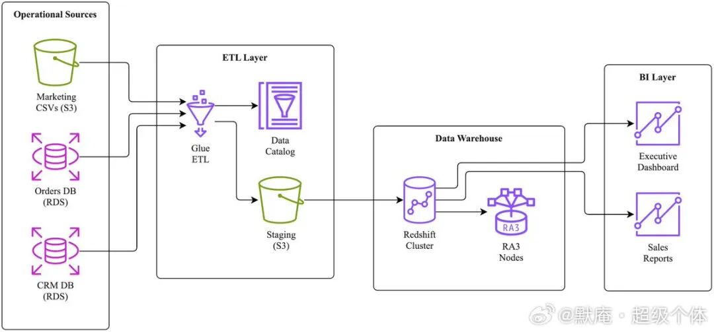
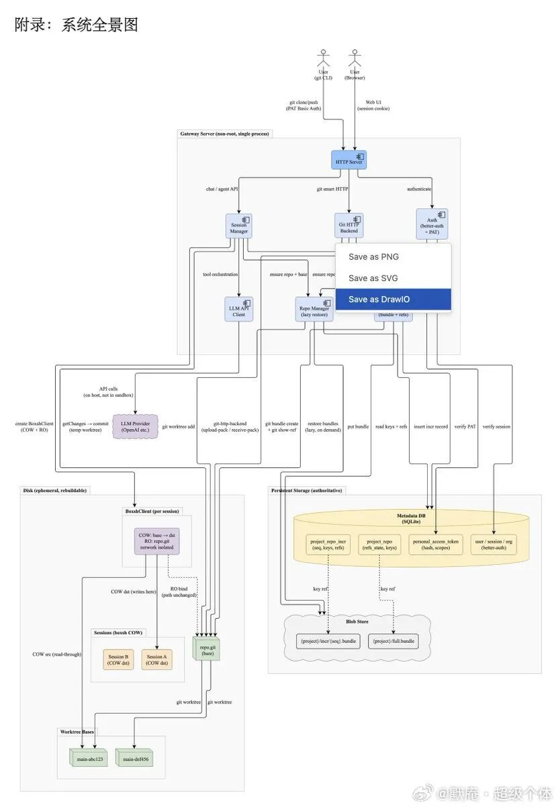

> 📎 来源: [Aspheer玩AI](https://mp.weixin.qq.com/s?__biz=Mzk3NTA0MTA3MA==&mid=2247484600&idx=1&sn=cde010eae5792356413201ac7d69fd75&chksm=c5e69c1939f3aac9b52de0364672eeda9c5f704442d71243ddb653583e04d2a886add168ac3f&mpshare=1&scene=1&srcid=0512SJoeBdgIE8YaXtK24YAT&sharer_shareinfo=9f6681327e8ce040b8ef9e93fae9aabe&sharer_shareinfo_first=9f6681327e8ce040b8ef9e93fae9aabe) | 时间: 2026-05-12 10:17

---

分享一个特别牛逼的 Skill ，叫：Markdown Viewer Skill 。

这个 Skill 里包含了一百多个图例，6000 多精选矢量图标，一句话就可以根据你的 Markdown 内容自动定制各种图表和配图。

使用方式就是：把你的 MarkDown 文件让给 Claude Code 这类工具，然后说：充分了解这个 Skills ，然后给我的这份文档生成配图或者图表。

然后，就会自动生成各类的图表，比如：流程图、架构图等，最牛的是可以自动插入到你的 MarkDown 文件里。

安装方式：

```

npx skills add markdown-viewer/skills

```

传送门地址：github.com/markdown-viewer/skills

#科技先锋官##How I AI#









