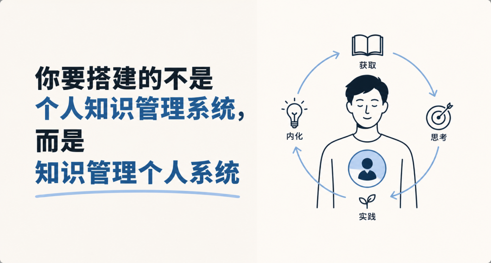

> 📎 来源: [Johnny学个啥](https://mp.weixin.qq.com/s?__biz=MzI3Nzg1NTM4MQ==&mid=2247484867&idx=1&sn=1f2bc2758d118d9bc6ff63d031c7d0d3&chksm=ead299d1b037dc8cc64ecadf08903ca46a5ced2241d415242663083967da27079b5a04c653cc&mpshare=1&scene=1&srcid=0509yWXE37nDRcmNjRUbRyv2&sharer_shareinfo=c75284bfdacc47c984281b269d11e453&sharer_shareinfo_first=c75284bfdacc47c984281b269d11e453) | 时间: 2026-05-09 21:07

---

你要搭建的不是个人知识管理系统，而是知识管理个人系统

> "I don't believe knowledge can be managed." 我不相信知识可以被管理。

多年以前，卡尔·埃里克·斯威比在自己的网站上写下了这句话。

斯威比，可不是什么网红知识博主。

他是瑞典管理学家，上世纪90年代，他出版了世界上第一本以"知识管理"为题的著作。

因此，他也是公认的知识管理之父。

后来，在一次学术研讨中，有人请他定义"知识管理"，他直接回答：

> "KM(Knowledge Management) is an oxymoron. K cannot be managed." 知识管理，是一个自相矛盾的词组。知识，无法被管理。

知识管理之父，却认为知识不能被管理。

但这不是反悔和自我否定，而是斯威比在发现知识管理这个词被误解了，于是把话说得更直白一些。

在早期，斯威比谈"知识管理"，指的是如何让组织更好地利用知识、让知识型员工发挥作用；但随着这个概念流行开来，它逐渐被简化成另一件事——

> 建系统、存信息、管文档。

于是他不得不出来纠偏。

斯威比认为，知识不等于信息。知识是个体在特定情境中，基于经验和理解，采取有效行动的能力。

这也是他真正想说的：知识管理，真正应该管理的，是使用知识的那个人。在个人知识管理中，我们真正应该管理的，就是我们自己。

# 一、我们管理的，从来都不是知识

我们习惯性认为：知识是一种可以像文件一样被管理的东西。

但我们一直管理的，从来都不是知识。

有一个经典的信息学模型，叫做 DIKW 模型，它把人类认知的层级分为四层：

Data（数据）——原始的事实碎片，没有上下文。你收藏的一篇文章的链接，是数据。

Information（信息）——经过整理和关联的数据，有了意义。你写下的读书摘要，是信息。

Knowledge（知识）——信息经过一个人的理解和内化，能够真正指导他的判断和行动。

Wisdom（智慧）——知识在复杂情境中的灵活运用，能回答"为什么"，也能回答"在这个具体情况下，我应该怎么做"。

这四层，有一道关键的分水岭，划在I 和 K 之间。

分水岭的两侧，有一个根本性的差异：Data 和 Information 可以脱离人而独立存在——它们住在硬盘里、数据库里、笔记软件里，不需要任何人理解它们，它们依然在那里。而 Knowledge 和 Wisdom，必须依附于人——没有一个具体的人在理解、运用、实践它们，K 和 W 就根本不存在。

现在，回头看看你的笔记系统在做什么。

你在收集链接——那是 Data。你在整理摘要、打标签、建立双向链接——那是 Information。你的系统做得再好，它触碰的，也只是 DIKW 的前两层。

Knowledge 和 Wisdom，从来就不在那里。

# 二、为什么我们热衷于管理数据和信息

打开你的笔记软件，看看那些整齐的分类、精心设计的标签、双向链接编织成的知识网络——有没有一种感觉，叫做"我正在进步"？

这种感觉很真实，但它是一个陷阱。

心理学家把它的一种形态叫做"结构性拖延"——用看起来有意义的行为，替代真正困难的事情。整理笔记，比真正去写一篇文章、完成一个项目、在压力下做出判断，要容易得多，舒适得多。它给你进步的感觉，却不给你进步本身。

# 三、知识和智慧为什么只能住在人身上

这不是一个比喻，而是知识本身的结构决定的。

哲学家吉尔伯特·赖尔（Gilbert Ryle）在1945年做过一个经典区分，他把知识分成两种："knowing that"（知道是什么）和"knowing how"（知道怎么做）。

对应到 DIKW，Data 和 Information 对应的是"knowing that"——你知道某件事是什么，你能把它写下来，存起来，传递给别人。而 Knowledge 和 Wisdom 对应的是"knowing how"——你真正能用它做成某件事，你能在复杂情境中调动它，你的判断和行动因为它而不同。

赖尔指出，第二种知识不能被简化为第一种。你可以把所有游泳教材的要点整理成一份完美的笔记，但跳进水里，你依然可能沉下去。"Knowing how to swim"是无法从笔记里读出来的，它只能从水里游出来。

哲学家迈克尔·波兰尼（Michael Polanyi）把这个洞见推进得更深。他说："我们所知道的，远比我们所能言说的要多。"（We can know more than we can tell.）

他把那些无法被言说的知识，称为"隐性知识"（Tacit Knowledge）。

他最喜欢用的例子是认人——你能从人群中一眼认出一张熟悉的脸，但你无法向从未见过这张脸的人精确描述它的特征：鼻梁多高、眼距多宽、笑起来时嘴角的弧度。你拥有这个能力，但你无法言说它，更无法把它存进任何软件。

这样的知识在生活里无处不在。一个在某行业深耕十年的人，对行业趋势的直觉和嗅觉，是任何行研报告都无法复制的。一个优秀的编辑，看完一篇稿子的开头就知道这个作者有没有真正想清楚，这种判断力不是来自某条写在笔记本上的"好文章标准"，而是来自对几千篇文章的浸泡和无数次的经验校准。

这就是 DIKW 模型里 K 和 W 的真实面目——它们是隐性的，是长在人身上的，是无法被外化和存储的。

它们不能被管理，只能被生成。而生成它们的唯一方式，是改变那个人。

所以，当斯威比说"知识无法被管理"，他的意思并不神秘：真正意义上的知识，根本就不住在任何可以被管理的地方。它住在人身上，或者，它根本就还不存在。

# 四、我们的系统，卡在了信息和知识之间

理解了这一点，再回头看我们的知识实践，会看到一个令人警醒的缺口。

日本管理学家野中郁次郎在他的知识创造理论中，把知识的流转分为四个阶段：社会化（Socialization）、外化（Externalization）、组合（Combination）、内化（Internalization），合称 SECI 模型。

如果借助 DIKW 的框架来理解这四个阶段，E（外化）和 C（组合）对应的是 Data 和 Information 的层级——把隐性的想法写出来，把信息整理和关联。而S（社会化）和 I（内化）对应的是 Knowledge 和 Wisdom 的层级——在与人的真实接触中习得他人的隐性知识，通过行动和反思将信息转化为自己的判断力和能力。

我们几乎所有的笔记工具和方法，只覆盖了 E 和 C。S 和 I——恰恰是让人从 Information 跃迁到 Knowledge 的那两个关键环节——在我们的系统里完全缺席。

我们的系统在 I 和 K 之间，挖了一条很宽的沟，然后假装那条沟不存在。

更危险的是，这还会制造一种幻觉——因为信息被整齐地存储着，我们以为自己"掌握"了它。直到真正需要用它的时候，才发现根本调用不出来：想不起，用不上，或者用错了场合。因为我们从未真正越过那条沟。

# 五、越过那条沟，只有一条路

从 Information 到 Knowledge，从显性到隐性，这道跃迁只有一条路：

行动 → 反馈 → 修正。

以写作为例。

你可以整理三百条写作技巧，但这只是 Information，不会让你成为更好的写作者。真正让写作能力生长的，是你坐下来写，写不出来，卡住，然后去查，找到一个方法，试了，发现有效，这个感受被刻进你的经验回路——它开始从 Information 变成你的 Knowledge；或者试了，发现在这个语境里根本不管用，这个边界条件也被悄悄记录进你的直觉——这是更深层的 Knowledge。

反复经历足够多的这种循环，某些判断开始变得不需要思考，它们变成了你对写作的本能感知——那是 Wisdom 的雏形。

这个过程，笔记是次要的，甚至是可有可无的。主角是那个在真实情境里一次次被现实检验、被反馈校准的人。

# 六、管理对象换掉，一切随之改变

如果把"管理对象"从 Data 和 Information，换成那个需要积累 Knowledge 和 Wisdom 的人——你会发现，你问的问题会完全不同。

你不再问：这条笔记该放在哪个文件夹？你开始问：我上一次真正用到学过的东西，是什么时候？

你不再问：我的系统结构是否足够优雅？你开始问：我有没有在这件事上比三个月前判断得更准？

你不再问：我应该收藏这篇文章吗？你开始问：我现在最需要发展的能力是什么，我有没有为它创造足够多的练习机会？

管理的对象一旦换掉，评估的标准就变了。评估标准变了，你的时间和注意力的分配就会随之改变。这个改变，比选择哪个笔记软件、用什么方法论，重要得多。

# 七、工具该被放在哪里

说到这里，我想澄清一件事：笔记工具本身没有任何问题，问题在于我们赋予了它错误的期待。

工具在 Data 和 Information 的层级，是有真实价值的——它帮你外化思维，减轻工作记忆的负担，在信息之间建立关联，在需要的时候帮你找回某个细节。这些功能值得使用。

但工具能做的，仅此而已。它可以存储你读到的东西，却无法替你消化它。它可以帮你整理信息，却无法帮你越过 I 和 K 之间的那道沟。它可以记录你的想法，却无法代替你去行动、犯错、从错误中生长。

把工具从"知识管理的核心"降格为"处理 Data 和 Information 的配件"——这个位置的调整，可能比你花多少时间优化系统都重要。

一个好的系统，不是让你更舒适地存储，而是让你更容易地行动。如果你的系统让笔记越来越多，却没有让你在任何一件真实的事情上变得更好，那它不是在帮助你，它是在安慰你。

# 结语：系统变简单了，但你变强了

斯威比在否定"知识管理"这个词的时候，并不是说知识不重要，也不是说管理没有意义。他是在说：你真正想要的那种知识——Knowledge 和 Wisdom——根本就不在任何可以被管理的地方。它在人身上，或者，它还不存在。

真正以"人"为中心的知识实践，往往长得不那么壮观。

笔记更少，但每一条都嵌入了真实的行动情境。工具更简单，但使用它的人在持续地改变。收藏越来越克制，但实践越来越密集。

它不会给你那种"我的系统真的好棒"的满足感。但它会给你另一种感觉，一种更扎实、更难被自我怀疑撼动的感觉：

我比上个季度，好像真的变强了一点。

那才是你一直想要的东西。而那个东西，从来不在 Data 和 Information 的层级里，它在 Knowledge 和 Wisdom 里，它在你身上。
