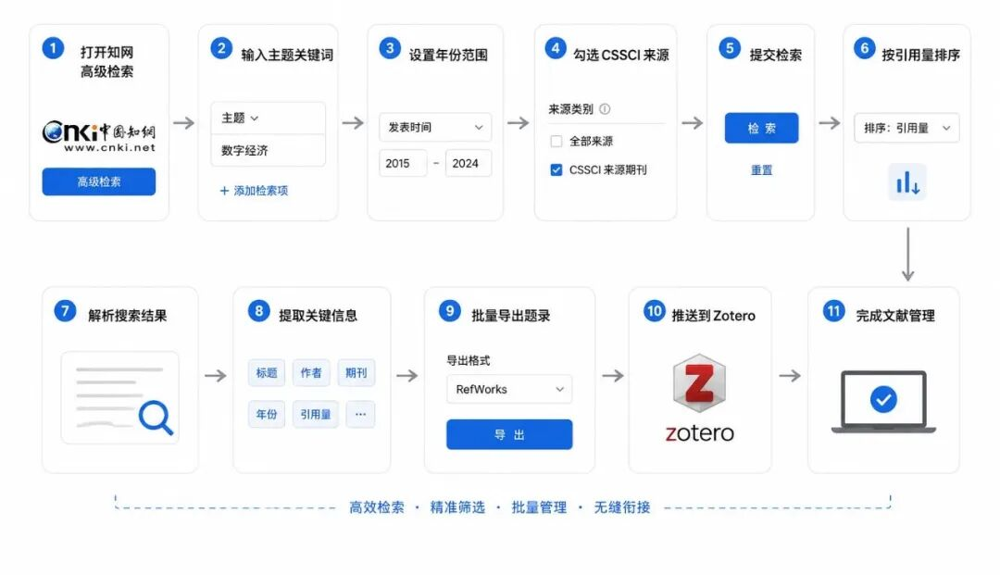
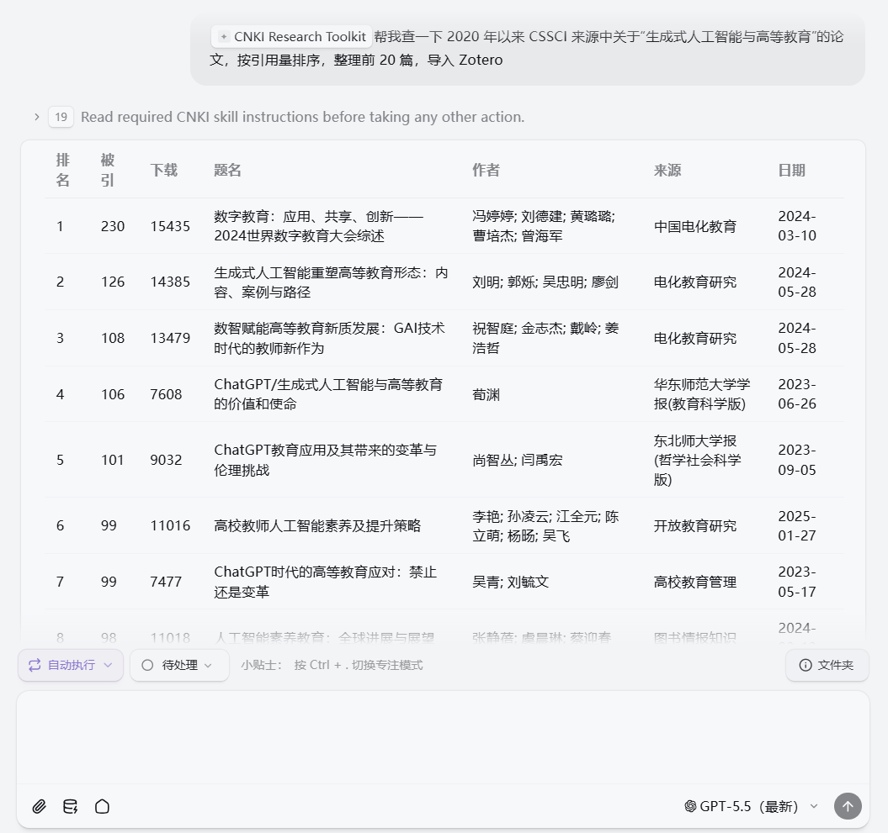
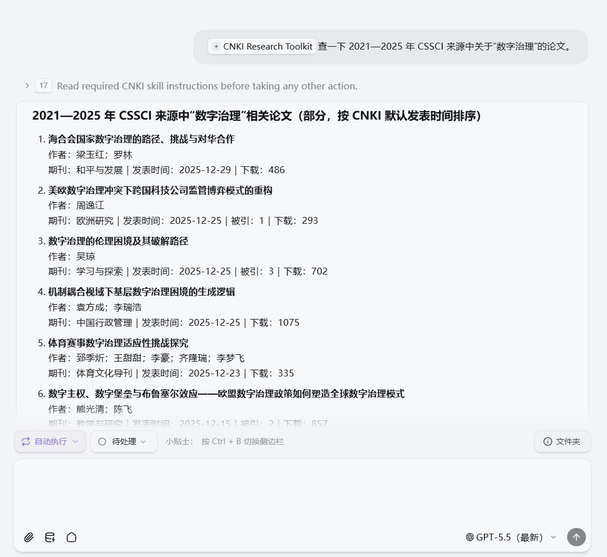
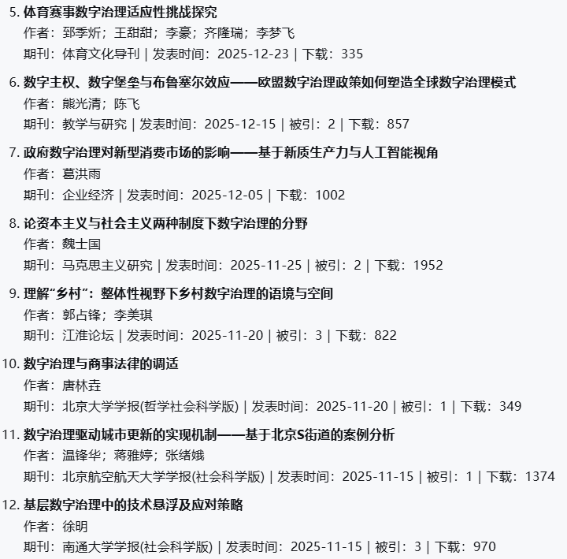
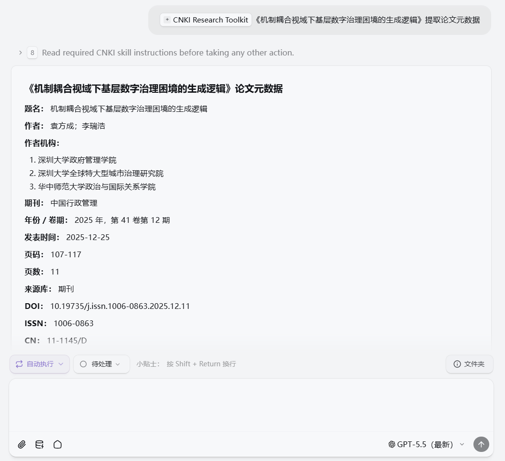
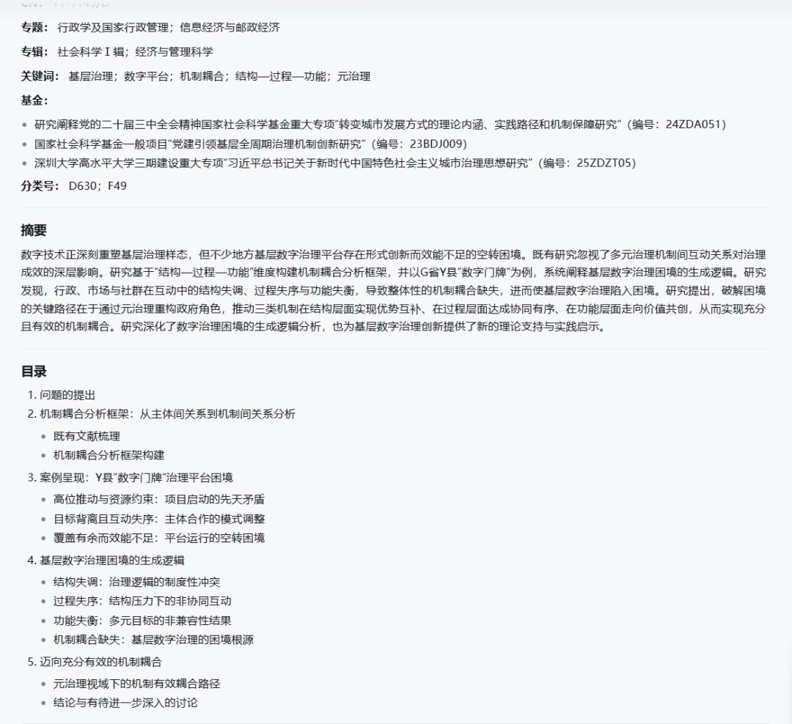
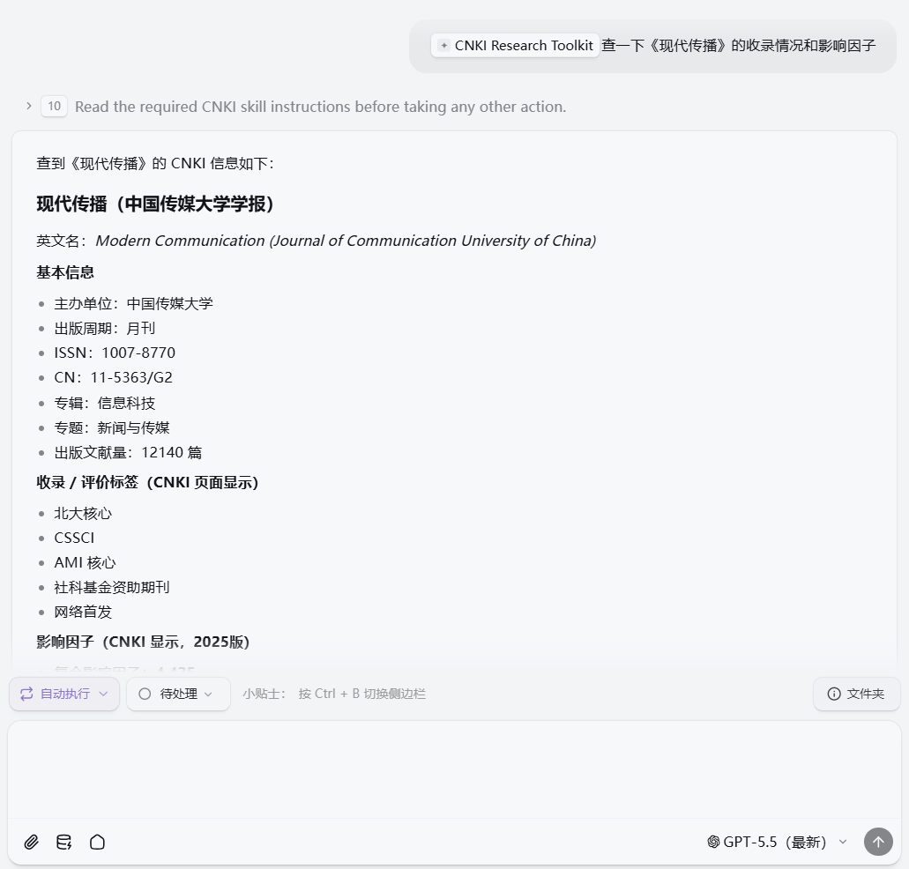
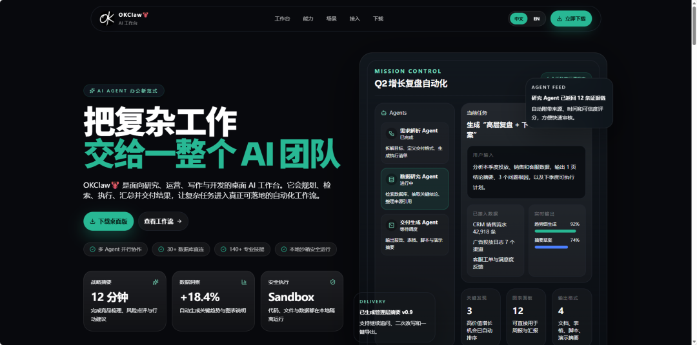
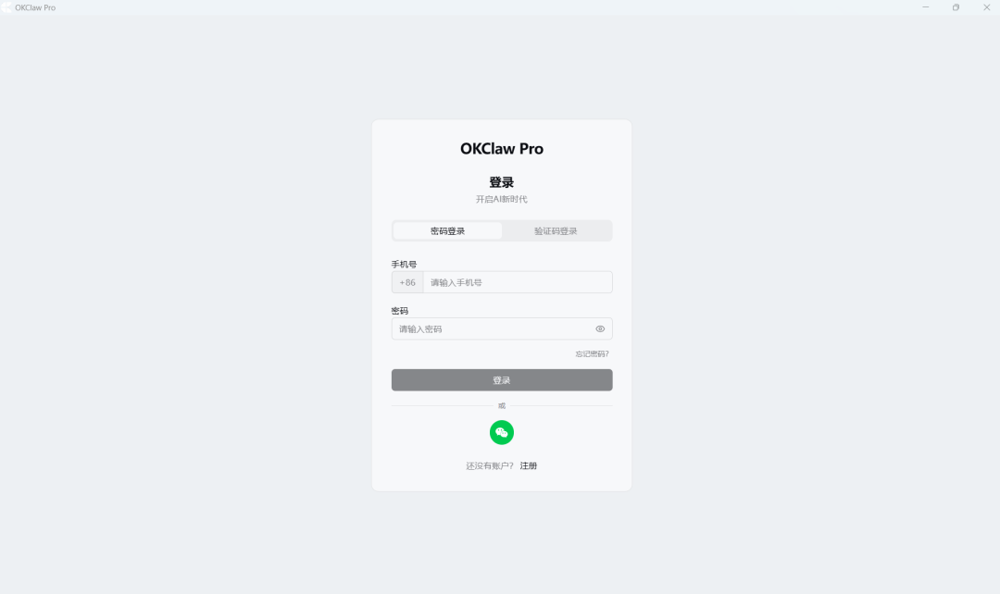
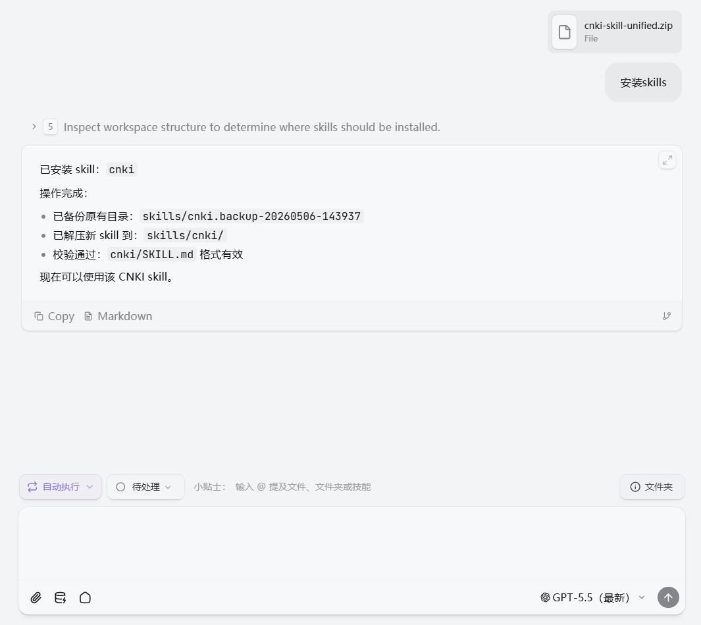

> 📎 来源: [学术Pro](https://mp.weixin.qq.com/s?__biz=MzkxMjY4NjkzNw==&mid=2247485823&idx=1&sn=4fd8c47dbe534780908dd6f2220fc93c&chksm=c0b05b9b1d290c10b7b46f2b346a1a82fb1f655f8549ada7c18a7cd8f8577a4f42f824f8624a&mpshare=1&scene=1&srcid=0519rUyDMyoBD5meBsYO4kpg&sharer_shareinfo=8d5d1f7604d26b8a30ded0ad8d058026&sharer_shareinfo_first=8d5d1f7604d26b8a30ded0ad8d058026) | 时间: 2026-05-19 01:58

---

做文献调研时，很多人的流程大概是这样的：

这一套流程并不复杂，但非常琐碎。尤其是写文献综述、做课题申报、准备论文选题，或者投稿前调研期刊时，真正消耗时间的往往不是阅读本身，而是大量重复性的操作：找、筛、点、复制、整理。

问题是：这些机械重复的动作，能不能交给 AI？

答案是可以。CNKI Research Toolkit 就是为这个场景准备的一套工具。

01.CNKI Research Toolkit：用一句话让 AI 帮你查知网

CNKI Research Toolkit 是一个中国知网研究工具。它可以通过浏览器操作知网，完成论文检索、结果解析、详情提取、PDF/CAJ 下载、引用导出、Zotero 导入、期刊收录查询和期刊目录浏览等任务。

简单说，你用自然语言告诉 AI 要查什么，AI 帮你打开知网、设置检索条件、筛选结果、提取信息，甚至把论文题录导入 Zotero。

它不是一个单独的“搜索命令”，而是一套可以串起来使用的知网科研工作流。

比如，你可以直接对 AI 说：

帮我查一下 2020 年以来 CSSCI 来源中关于“生成式人工智能与高等教育”的论文，按引用量排序，整理前 20 篇，并导入 Zotero。

这句话背后，AI 会自动拆解成一串操作：

- 打开知网高级检索；

- 输入主题关键词；

- 设置年份范围；

- 勾选 CSSCI 来源；

- 提交检索；

- 按引用量排序；

- 解析搜索结果；

- 提取标题、作者、期刊、年份、引用量等信息；

- 批量导出题录；

- 推送到 Zotero。

这就是 CNKI Research Toolkit 最核心的价值：把原本需要手动操作十几步的知网流程，变成一句自然语言指令。

02.它不只是“搜索论文”，而是覆盖完整科研检索流程

如果只把它理解成“AI 帮我搜论文”，其实低估了它。CNKI Research Toolkit 更像是一个围绕知网的科研助手，覆盖从找论文、筛论文、看论文，到存论文、查期刊的完整链路。

1. 找论文：关键词检索与高级检索

最基础的能力，是帮你在知网中检索论文。它既支持普通关键词检索，也支持更细致的高级检索。

你可以让它查：

- 某个主题的论文；

- 某位作者的论文；

- 某本期刊中的论文；

- 某个年份范围内的论文；

- CSSCI、北大核心、CSCD、SCI、EI 等来源论文。

例如，你可以说：

查一下 2021—2025 年 CSSCI 来源中关于“数字治理”的论文。

它不是简单帮你把关键词输进搜索框，而是能理解“年份”“来源类别”“作者”“期刊”等筛选条件，并自动完成知网高级检索。

2. 筛论文：自动解析结果、翻页、排序

检索之后，更麻烦的是看结果。CNKI Research Toolkit 可以自动解析搜索结果页，把页面上的论文信息整理成结构化清单。

它可以提取：

- 论文标题；

- 作者；

- 来源期刊；

- 发表时间；

- 引用量；

- 下载量。

同时，它还可以继续执行翻页和排序操作，比如：

- 查看下一页或上一页；

- 跳转到指定页；

- 按发表时间排序；

- 按引用量排序；

- 按下载量排序。

过去你需要一页页浏览，现在可以让 AI 先把搜索结果整理成清单，再帮你进一步判断哪些论文值得读。

3. 看论文：提取摘要、关键词和元数据

找到论文之后，并不一定每篇都要下载全文。很多时候，我们只是想先看摘要和关键词，判断这篇文章是否值得精读。

CNKI Research Toolkit 可以进入论文详情页，提取论文元数据，包括：

- 标题；

- 作者；

- 作者单位；

- 摘要；

- 关键词；
- 目录；
- 部分摘要；

- 来源期刊；

- 发表时间；

- DOI；

- 基金项目；

- 引用和下载信息。

这一步很适合做文献初筛：先让 AI 帮你看摘要和关键词，再决定哪些论文需要下载和精读。

4. 存论文：下载 PDF / CAJ，导入 Zotero

如果你已经确定某些论文需要保存，CNKI Research Toolkit 还可以继续完成后续动作。

它支持：

- 下载 PDF；

- 下载 CAJ；

- 导出 RIS；

- 生成 GB/T 7714 格式引用；

- 推送到 Zotero。

其中，Zotero 导入是非常实用的部分。文献管理最麻烦的地方，往往不是下载论文，而是让论文文件、题录信息和引用格式对应起来。现在可以让 AI 直接从知网搜索结果页批量提取题录，并推送到 Zotero。

 需要注意的是，PDF/CAJ 下载仍然取决于你的知网账号或机构权限；Zotero 导入也需要本地 Zotero 桌面端正在运行。AI 可以帮你自动执行流程，但不能绕过正常的访问规则。

5. 查期刊：投稿前快速判断期刊信息

除了查论文，CNKI Research Toolkit 还可以查期刊。这对于投稿前调研尤其有用。

它可以帮你：

- 按期刊名称搜索；

- 查询 ISSN / CN；

- 查询主办单位；

- 查看 CSSCI、北大核心、CSCD、SCI、EI 等收录情况；

- 查询影响因子；

- 浏览某年某期目录。

例如：

查一下《现代传播》的收录情况和影响因子。

这类功能适合在投稿前快速了解目标期刊，也适合追踪某本期刊最近几期的选题方向。

03.为什么它值得关注？

1. 用自然语言操作知网

过去查知网，你需要记住页面在哪里、筛选条件怎么点、结果怎么导出。现在你只需要描述任务。

比如：只看 2020 年以后的 CSSCI 论文；下载前 10 篇 PDF；把当前结果页导入 Zotero；查一下这本期刊是什么级别。

AI 会根据你的意图调用相应能力，把操作流程拆解并执行。

2. 覆盖完整科研检索链路

它不是只解决一个点，而是覆盖了从检索到管理的完整流程：

检索 → 筛选 → 解析 → 查看详情 → 下载 → 引用导出 → Zotero 管理

这意味着它可以真正嵌入科研工作流，而不是停留在“帮我搜一下”的层面。

3. 特别适合重复性强的科研任务

CNKI Research Toolkit 特别适合以下场景：

- 文献综述前期检索；

- 课题申报资料准备；

- 论文选题调研；

- 投稿前期刊调研；

- 学术热点追踪；

- 批量文献整理。

这些任务都有一个共同点：流程固定、步骤重复、信息量大。AI 接管的正是这些机械环节。

04.如何安装和使用？

使用前需要准备：OKClaw、Cnki-skills。

1. 安装OKClaw

打开OKClaw官网，选择合适的版本进行安装并登陆。

2. 安装skills

将准备好的安装包上传到聊天框内，输出“安装skills”。【需要skills的小伙伴可以在后台输出“知网skills”获得噢】

如果使用 CNKI Research Toolkit 的统一入口，则可以通过一个综合 skill 完成搜索、下载、导出、查期刊等任务，不必分别记住每个子命令。

05.注意事项

这类工具的定位是“自动化助手”，不是权限绕过工具。使用时需要注意：

- 知网登录仍然需要用户自己完成，尤其是下载 PDF / CAJ 时；

- 下载权限取决于账号或机构权限，AI 不能绕过知网访问限制；

- 遇到验证码时，需要用户手动处理，工具可以检测验证码并暂停等待；

- AI 适合做检索和整理，但不能替代学术判断，哪些论文重要、哪些观点可靠，仍然需要研究者自己判断。

换句话说，它可以帮你节省操作时间，但不会替你完成真正的学术判断。

如果你经常需要查知网、整理文献、管理 Zotero，CNKI Research Toolkit 值得一试。

---

关注我，学习更多ai知识~
OKClaw:https://okclaw.dafoai.com
