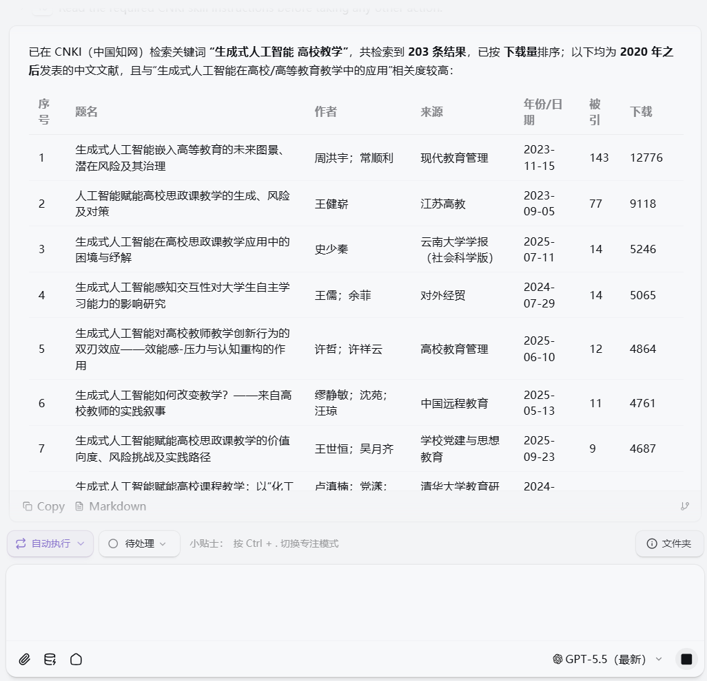
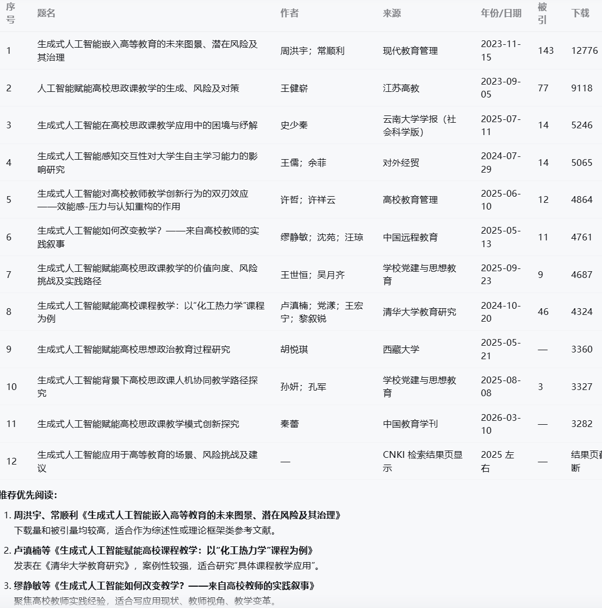
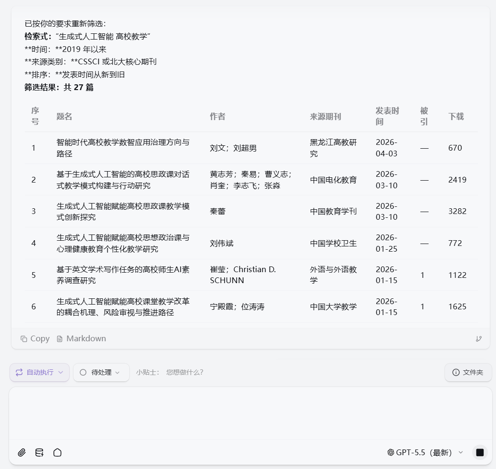
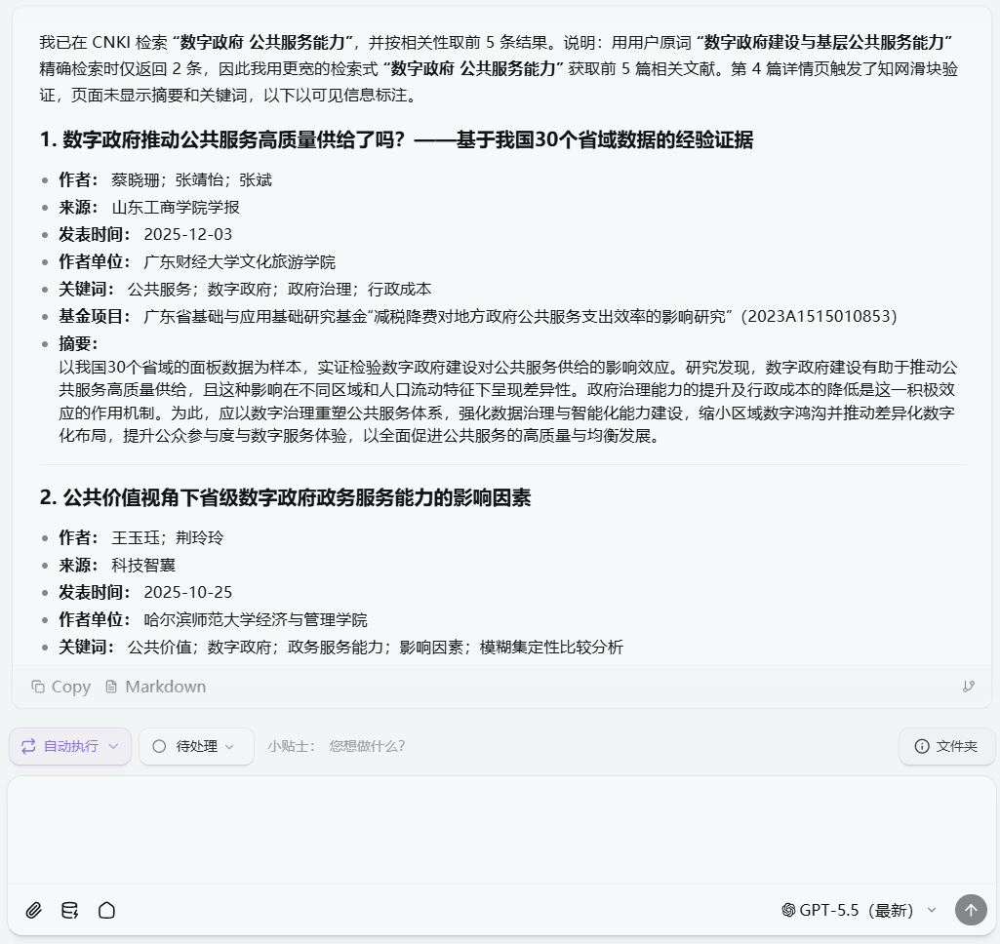
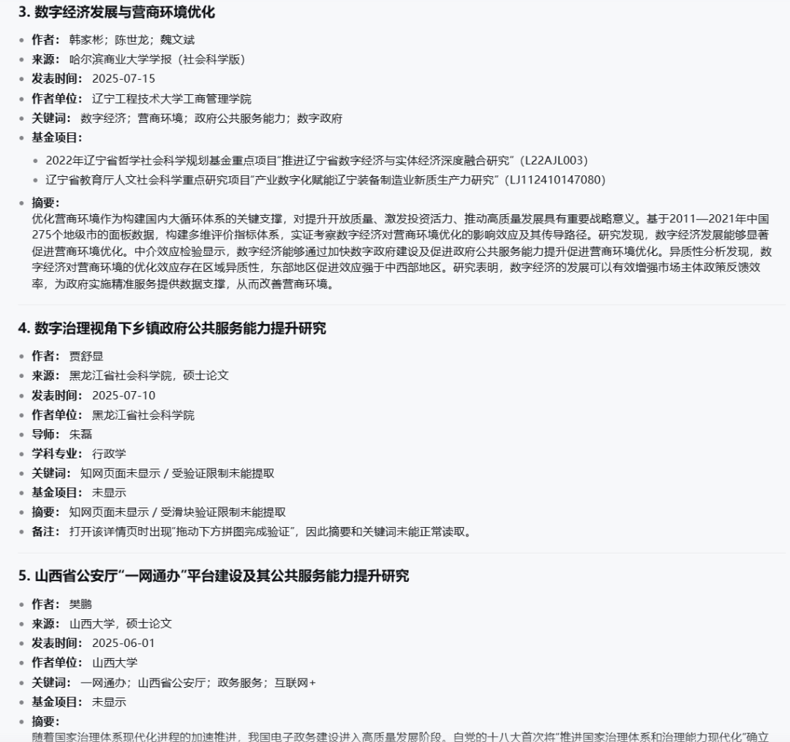
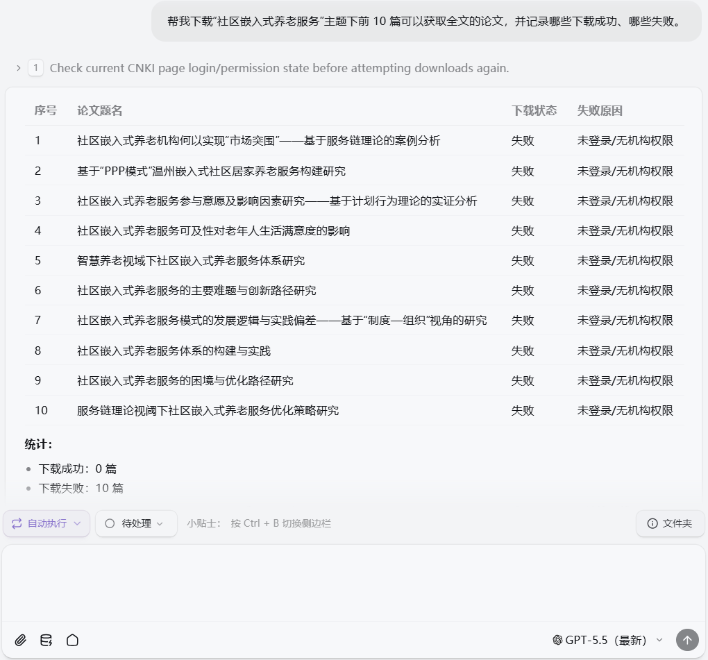

> 📎 来源: [BioinfoCloud 天意生信云](https://mp.weixin.qq.com/s?__biz=Mzk1NzY3MDQ2MQ==&mid=2247490077&idx=1&sn=192ee55dc92b71274f4ef8893444ba94&chksm=c25aeb68fea37bbb13ff80834aa496aa799f6bda06e60d70d9f9537d1e0e3480d7e68c78f3d3&mpshare=1&scene=1&srcid=05153cOsR6UWbVf4kUJSH8ec&sharer_shareinfo=c99c6e0d5ae33594b7bd0f558d5c3d6a&sharer_shareinfo_first=c99c6e0d5ae33594b7bd0f558d5c3d6a) | 时间: 2026-05-15 13:45

---

有没有发现，写论文最烦的不是打开 Word，而是打开知网。

关键词搜出来几百条，真正能用的没几篇。你要筛年份、看来源、查是不是核心，还要一篇篇点开摘要。好不容易找到合适的，又要下载全文、复制引用、整理到 Zotero。

这套流程不难，但很耗人。

所以我更关心的不是“AI 能不能写论文”，而是：

AI 能不能先帮我把文献找好、筛好、整理好？

CNKI Skills for Claude Code就是这样一个工具。

它可以让 Claude Code 通过浏览器操作知网，把检索、筛选、解析、下载、导出这些重复动作，变成一句自然语言指令。

01

CNKI Skills 是什么？

一句话介绍：CNKI Skills 是一套知网自动化技能集。

它把知网里的常见操作拆成一个个 AI 可以调用的能力，比如：

- 关键词检索；

- 高级筛选；

- 论文详情解析；

- 期刊信息查询；

- 期刊目录抓取；

- PDF/CAJ 下载；

- 引用导出；

- Zotero 入库。

你不需要写代码，也不需要研究知网网页结构，只需要告诉它你想要什么结果。

例如：

帮我检索“生成式 AI 在高校教学中的应用”相关论文，筛选 2020 年之后的核心期刊文献，并整理成表格。

它就可以根据你的指令去执行对应流程。

需要说明的是，CNKI Skills 不是用来绕过知网权限的。它不会破解下载限制，也不会替你获取没有权限访问的论文。

它做的是：通过 Chrome 浏览器，模拟和执行你原本需要手动完成的操作。

也就是说：

- 你能正常访问的页面，它可以帮你打开；

- 你有权限下载的论文，它可以帮你点击下载；

- 你没权限获取的全文，它也无法绕过限制。

所以它更像一个「文献检索助理」，而不是权限绕过工具。

它适合谁？

CNKI Skills 特别适合这些人：

- 正在写毕业论文的本科生；

- 需要做文献综述的研究生；

- 经常查中文文献的高校教师；

- 做课题申报、项目调研的人；

- 需要批量整理文献资料的人；

- 使用 Zotero 管理文献的人；

- 投稿前需要查询期刊信息的人。

简单来说，只要你经常在知网上重复搜索、筛选、下载和整理文献，它就有用。

02

CNKI Skills 能帮你做什么？

这一部分不单纯罗列功能，而是按这个结构展开：

痛点→ 案例指令 → AI 执行结果 → 最终得到什么

关键词检索：从一个选题快速找到相关文献

很多人写论文时，第一步就卡在「不知道怎么查」。你可能只有一个大概方向，但不知道该用哪些关键词，也不知道哪些文献真正相关。

你可以直接说：

帮我检索“生成式人工智能在高校教学中的应用”相关中文论文，优先选择 2020 年之后发表的文献。

AI 会通过知网完成检索，并从结果页中提取基础信息，包括：

- 论文标题；

- 作者；

- 期刊来源；

- 发表年份；

- 关键词；

- 摘要片段。

如果检索结果不够精准，它还可以根据主题继续扩展关键词，比如：

- 生成式人工智能；

- ChatGPT；

- 高校教学；

- 智能教育；

- 教育数字化；

- 教学评价。

最终，你会得到一份初步文献清单。

它可以帮你快速判断这个选题下面有哪些代表性论文、研究集中在哪些方向，以及后续还可以用哪些关键词继续检索。

高级筛选：从海量结果里筛出高质量文献

知网搜索结果多，并不代表有用。真正写论文时，你通常需要的是近几年、核心期刊、CSSCI 或者和主题高度相关的文献，而不是几百条杂乱结果。

你可以说：

在刚才的检索结果中，只保留 2019 年以来发表在 CSSCI 或北大核心期刊上的论文，并按照发表时间从新到旧排序。

AI 会根据你的要求调整检索或筛选条件，例如：

- 设置发表时间范围；

- 选择来源类别；

- 按相关度或发表时间排序；

- 去除明显低相关结果。

最终，你得到的不再是一堆杂乱结果，而是一份经过条件过滤的高质量文献列表。

这一步特别适合：

- 写文献综述；

- 做开题报告；

- 课题申报前调研；

- 快速确认某个选题是否已有充分研究。

论文详情解析：不用一篇篇点开看摘要

标题看起来相关，不代表内容真的有用。很多时候，你必须点进详情页，看摘要、关键词、作者单位、基金项目，才能判断这篇文章值不值得读。

你可以说：

打开“数字政府建设与基层公共服务能力”相关性最高的前 5 篇论文，提取摘要、关键词、作者单位和基金项目信息。

AI 会逐篇打开论文详情页，并整理出结构化信息，例如：

- 标题；

- 作者；

- 作者单位；

- 期刊名称；

- 发表年份；

- 摘要；

- 关键词；

- 基金项目；

- DOI；

- 下载入口状态。

最终，你会得到一组「文献卡片」。

每篇文章的核心信息都被整理出来，你不用反复打开网页，也能快速判断：

- 哪些文章值得下载；

- 哪些适合放进文献综述；

- 哪些只是标题相关但内容无关；

- 哪些文献可能是该领域的重要研究。

批量下载：把能获取的论文集中保存下来

找到文献之后，下载本身也是重复劳动。你需要一篇篇打开详情页，找 PDF 或 CAJ 下载按钮，判断有没有权限，再保存文件。

你可以说：

帮我下载“社区嵌入式养老服务”主题下前 10 篇可以获取全文的论文，并记录哪些下载成功、哪些失败。

AI 会逐篇检查下载入口，尝试下载可访问的全文，并记录状态，例如：

- 已成功下载 PDF；

- 已成功下载 CAJ；

- 无全文入口；

- 当前账号无权限；

- 页面异常，需手动处理。

最终，你会得到两类结果：

已经下载好的论文文件；

一份下载状态清单。

这样你不用手动重复点开每一篇，也能清楚知道哪些文献已经拿到，哪些需要后续通过学校、图书馆或其他渠道获取。

这里要强调一句：

CNKI Skills 不会绕过知网权限。能否下载，仍然取决于你的账号或机构访问权限。

引用导出和 Zotero 入库：把文献整理变成一步操作

很多人查完文献后，真正麻烦的是整理。标题、作者、期刊、年份、卷期、页码、摘要、PDF 附件，都要手动复制或导入文献管理软件。

你可以说：

把“绿色金融与企业低碳转型”相关的 15 篇核心期刊论文导入 Zotero，并创建一个“绿色金融研究”分类。

AI 会尝试提取文献元数据，并配合 Zotero 完成整理，包括：

- 标题；

- 作者；

- 期刊；

- 年份；

- 卷期页码；

- 摘要；

- 关键词；

- 附件状态；

- 所属分类。

最终，你会得到一个初步整理好的 Zotero 文献库。

后续写论文时，可以直接在 Zotero 中管理、标注、引用这些文献，不用再从零开始复制参考文献信息。

这一功能特别适合：

- 做文献综述；

- 写毕业论文；

- 申报课题；

- 长期跟踪某个研究方向。

03

为什么 CNKI Skills 有用？

它节省的是重复劳动

CNKI Skills 最大的价值不是替你写论文，而是替你处理那些机械操作：

- 搜索；

- 筛选；

- 打开详情页；

- 提取摘要；

- 下载文件；

- 导出引用；

- 整理到 Zotero。

这些事情本来就不应该占用太多研究时间。

它让文献检索变成工作流

传统方式是：

人打开知网，一篇篇点，一条条复制，一个文件一个文件下载。

使用 CNKI Skills 后，可以变成：

人提出目标，AI 拆解任务，浏览器执行操作，最后返回结构化结果。

这才是它真正有价值的地方。

它适合做第一轮文献准备

CNKI Skills 特别适合完成「从 0 到 1」的文献准备：

- 初步了解一个选题；

- 找到一批相关文献；

- 筛出核心和 CSSCI；

- 整理摘要和关键词；

- 下载可访问全文；

- 建立 Zotero 文献库。

但它不能替代你的学术判断。

哪些文献重要、哪些观点值得引用、哪些研究方法值得借鉴，最终还是要自己读、自己判断。

04

安装办法

使用前需要准备：OKClaw、Cnki-skills。

1. 安装OKClaw

打开OKClaw官网，选择合适的版本进行安装并登陆。

2. 安装skills

将准备好的安装包上传到聊天框内，输出“安装skills”。【需要skills的小伙伴可以在后台输出“知网skills”获得噢】

如果使用 CNKI Research Toolkit 的统一入口，则可以通过一个综合 skill 完成搜索、下载、导出、查期刊等任务，不必分别记住每个子命令。

05

结尾总结

CNKI Skills 的价值，不在于让 AI 替你写论文，而在于让 AI 接管那些重复、机械、耗时的知网操作。

以前查文献，你需要自己搜索、筛选、点开详情、复制信息、下载文件、整理引用。

现在，你可以直接告诉 Claude Code：我要研究什么、限定什么条件、最后希望得到什么格式。

剩下的检索、筛选、解析、下载和整理，就可以交给 AI 去跑。

它不能替代你的阅读和判断，也不能绕过知网权限，但它可以帮你更快完成第一轮文献准备，把时间留给真正重要的分析、思考和写作。

---

让AI更好地服务生信研究～
OKClaw:https://okclaw.dafoai.com
