> 📎 来源: [AI不白学](https://mp.weixin.qq.com/s?__biz=MzkyMDY0MjI0MQ==&mid=2247484373&idx=1&sn=53caa75ac61272f2b001c40302ff3fca&chksm=c09f07c7dc9997d33b91f3a2b817e4ea5a6351d4dde75b1d07766e85c719827d22396ee4530b&mpshare=1&scene=1&srcid=05153E4xEVjpg45nI3CaqRxc&sharer_shareinfo=96e52e0ebdce145572e889348f1ca2e4&sharer_shareinfo_first=96e52e0ebdce145572e889348f1ca2e4) | 时间: 2026-05-15 03:48

---

今天给大家介绍一款**开源封神插件**——**Superpowers，他能够让AI严格按照你的思路写出复杂的代码和项目。他的核心理念是：****Process over Prompt（流程大于提示词）**，给 AI 套上软件工程的 “纪律与护栏”，让它像资深工程师一样**先思考、再规划、后编码、必验证**。

**1.介绍**

VibeCoding好不好？好！它极大的解放了编程生产力，成几何倍数的增加了程序员的效率，但正因为这种野蛮生长，也造成了AI编程的一些问题，比如：

```
需求理解偏差，比如你让它"加个登录功能"，AI 立刻开始写代码，不问清是 OAuth、JWT 还是 Session缺乏标准化工程流程，全靠用户手动引导容易跳过需求分析、架构设计、测试验证等关键环节长会话漂移，复杂项目容易失控，代码质量参差不齐,连续工作 1 小时后，AI 忘记最初的架构约定，代码风格混乱团队协作时，每个人 “调教 AI” 的方式不一样，难以统一
```

这些问题，其实并不是AI大模型能力的问题，而是**缺乏工程纪律**的表现。

今天给大家介绍一款**开源封神插件**——**Superpowers**，它是由 Jesse Vincent（obra）打造的**开源 AI 编程****工作流****框架**，核心理念是：**Process over Prompt（流程大于提示词）**，给 AI 套上软件工程的 “纪律与护栏”，让它像资深工程师一样**先思考、再规划、后编码、必验证**。

该项目于 2025 年 10 月开源，2026 年初进入 Anthropic 官方插件市场后迅速爆发，截止目前，总星数突破 177k，且一度成为 GitHub Trending 榜首。

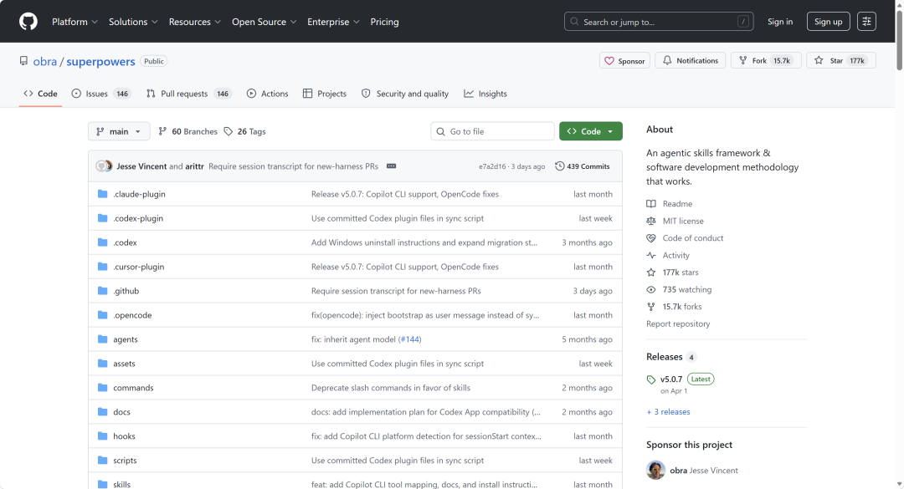

Superpowers是一套基于 Anthropic Agent Skills **技能****工作流****框架（Skills Framework）**，或者说它是**一套完整的 AI 开发方法论 + 可组合技能库**，它通过拦截 Claude Code 的关键决策点，将单次对话转变为结构化的软件工程流程。利用它，可以让AI**强制遵循经过验证的软件工程方法论**。从而为 Claude Code 注入一整套工程师思维。

通俗一点来说，它是把软件工程最佳实践（TDD、Code Review、Spec-Driven等）全部封装成 AI 可自动执行的 Skills，让大模型从“代码生成器”变成“真正懂工程的 Junior Engineer”。

```
TDD 即 Test-Driven Development（测试驱动开发），是敏捷开发的核心实践之一，核心逻辑与传统 “先写代码再补测试” 的模式完全相反，主张先针对最小功能点编写自动化单元测试用例，明确可量化的功能验收标准，再围绕测试要求编写业务代码，其核心执行闭环为经典的 “红 - 绿 - 重构” 循环：先编写无对应业务代码、运行必然失败的测试用例（红），再编写最少、刚好能让测试通过的业务代码实现基础功能（绿），最后在测试全程保持通过的安全兜底下，不改变代码外部行为地完成代码结构优化、冗余消除等重构操作，它严格遵循 “仅为通过失败测试编写生产代码、仅编写刚好足以让测试失败的用例、仅编写刚好让当前失败测试通过的生产代码” 三大核心定律，核心优势是实现缺陷前置大幅降低 bug 率、为代码重构提供零风险保障、倒逼代码实现高内聚低耦合的合理设计，同时测试用例本身也成为可执行的精准功能文档，该方法更适配逻辑密集型的长期维护项目，不适用于需求极度模糊的探索性原型、纯 UI 交互开发等场景。
```

```
Spec-Driven即规格驱动开发，核心是先为要落地的功能、产品或系统，敲定一份全团队对齐、无歧义、可验证的规格说明书（简称Spec，常见形式包括产品功能验收标准、API接口契约、系统交互规则、合规约束等），并将这份规格作为项目全流程唯一的“真理基准”，后续所有需求迭代、代码开发、测试编写、跨团队联调、上线验收全环节，都必须严格遵循这份规格执行，任何需求或实现的变更都必须先更新规格并完成全团队对齐，而非边做边定需求、边写代码边改规则；它从源头消除了开发、产品、测试等跨角色、跨团队的理解歧义，避免了各执一词的扯皮问题，把需求偏差、实现走形的风险前置到项目最早期，尤其适配跨团队协作的大型项目、API接口开发、合规要求高的企业级系统，OpenAPI接口契约开发、需求规格说明书驱动落地、契约测试都是它的典型实践形式。
```

**2.安装**

**Superpowers** 支持 `Claude Code`、`Cursor`、`Codex`、`OpenCode`、`Gemini CLI` 等主流 AI 编码工具，我们以 **Claude Code**为例，来介绍一下，它的安装步骤和使用方法：

```
# 全局安装（所有项目生效）/plugin install superpowers@claude-plugins-official --global# 项目级安装（仅当前项目生效）/plugin install superpowers@claude-plugins-official
```

**3.常用命令**

Superpowers 把整个软件开发过程编排成七个阶段，你可以方便的通过命令来执行哪个阶段。

```
头脑风暴 → 方案设计 → 编写计划 → 执行开发 → TDD 测试 → 代码审查 → 系统化调试
```

|  |  |  |
| --- | --- | --- |
| Skill | 触发方式 | 作用 |
| brainstorming | /superpowers:brainstorm | 开写代码前的苏格拉底式问答，理清需求 |
| writing-plans | /superpowers:write-plan | 生成详细的实现计划文档 |
| executing-plans | /superpowers:execute-plan | 按计划用子 Agent 执行 |
| test-driven-development | 自动触发 | 强制 TDD：先写失败的测试，再写实现 |
| systematic-debugging | 自动触发 | 4 阶段调试法：复现→定位→修复→验证 |
| dispatching-parallel-agents | 自动触发 | 多个独立任务并行分发给子 Agent |
| verification-before-completion | 自动触发 | 完成前必须跑验证，不能"我觉得没问题" |
| requesting-code-review | /superpowers:requesting-code-review | 完成后发起代码审查 |
| using-git-worktrees | 自动触发 | 用 Git Worktree 隔离每个任务 |

**4.项目案例**

我们以实现用户及权限体系的开发举例，看看superpowers如何引导我们一步步实现生产级代码。

**（1）阶段一：头脑风暴（Brainstorming）**

这是最容易被低估的阶段，也是价值最高的阶段。当你告诉 Claude「我要做用户权限功能」时，Superpowers 不会让它直接动手。它会启动苏格拉底式对话，通过递进式提问挖掘需求细节。

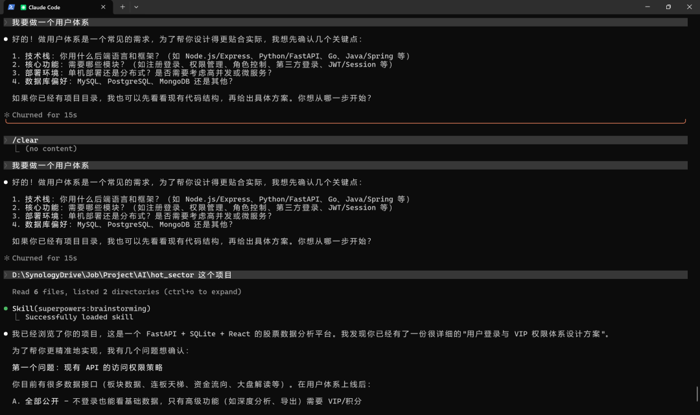

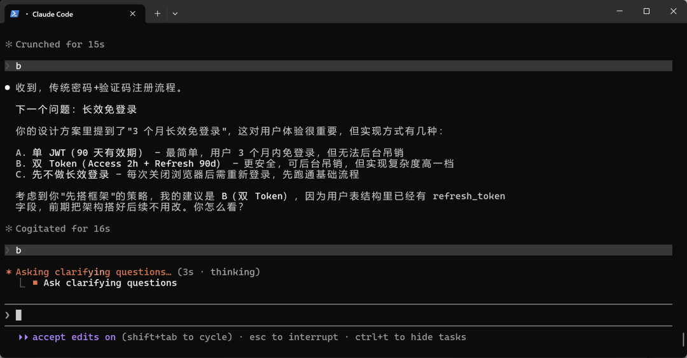

**（2）方案设计**

需求澄清后，Claude 把设计方案拆成小块，逐块让你确认，并最终形成specs目录中的design文件。

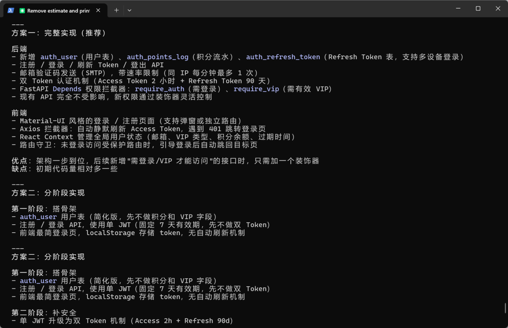

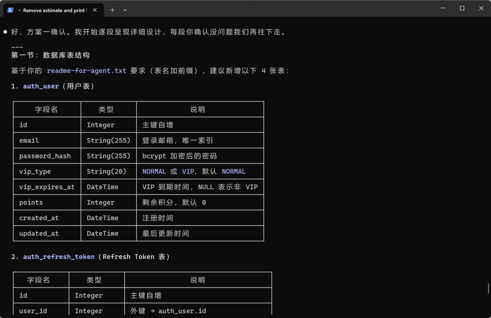

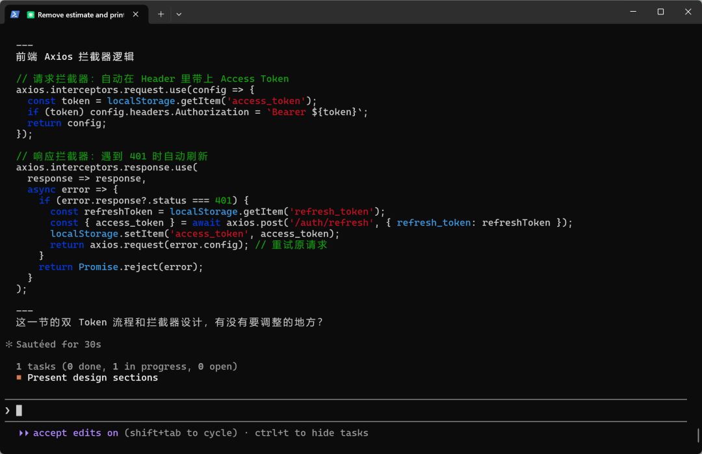

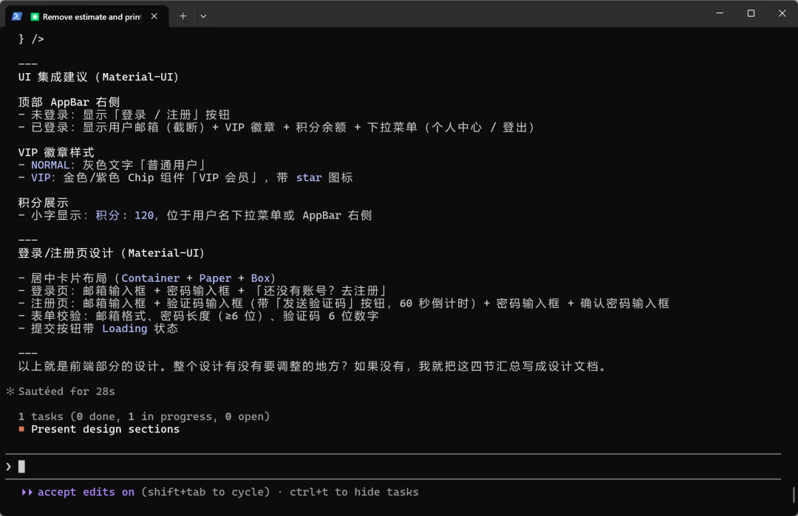

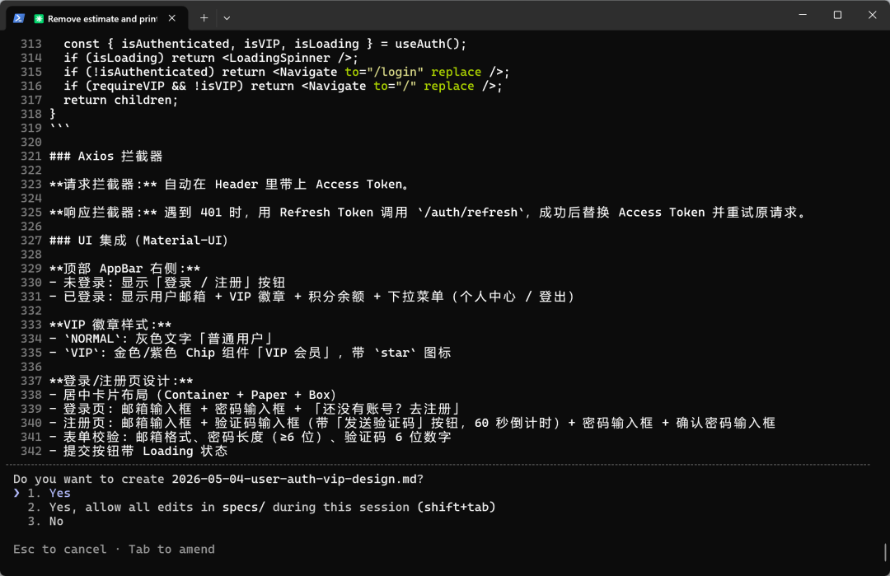

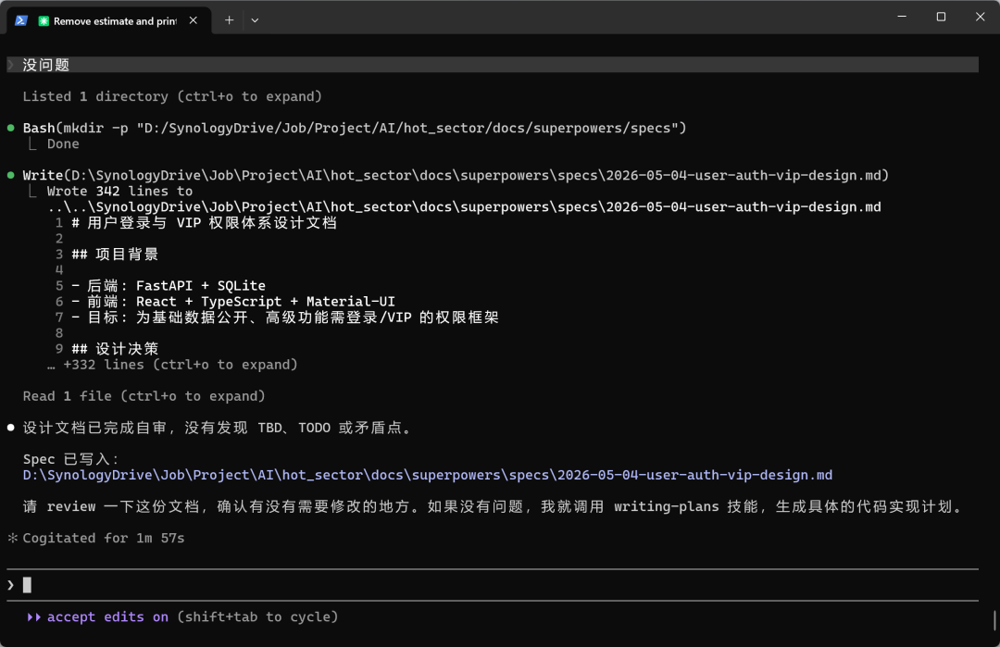

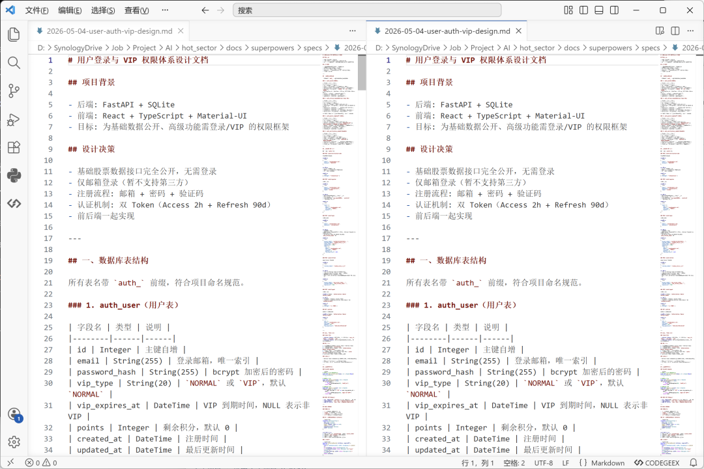

**（3）编写计划**

Claude 把上一步的设计方案拆解成具体的实施计划。每个任务包含：

```
精确的文件路径：不是「大概在 src 下面的某个地方」，而是 src/services/PermissionService.ts完整的实现步骤：按顺序列出每一步该做什么明确的验收标准：怎样才算完成任务粒度控制在 2-5 分钟，这个长度足够一个子代理独立完成，又不会大到失控。
```

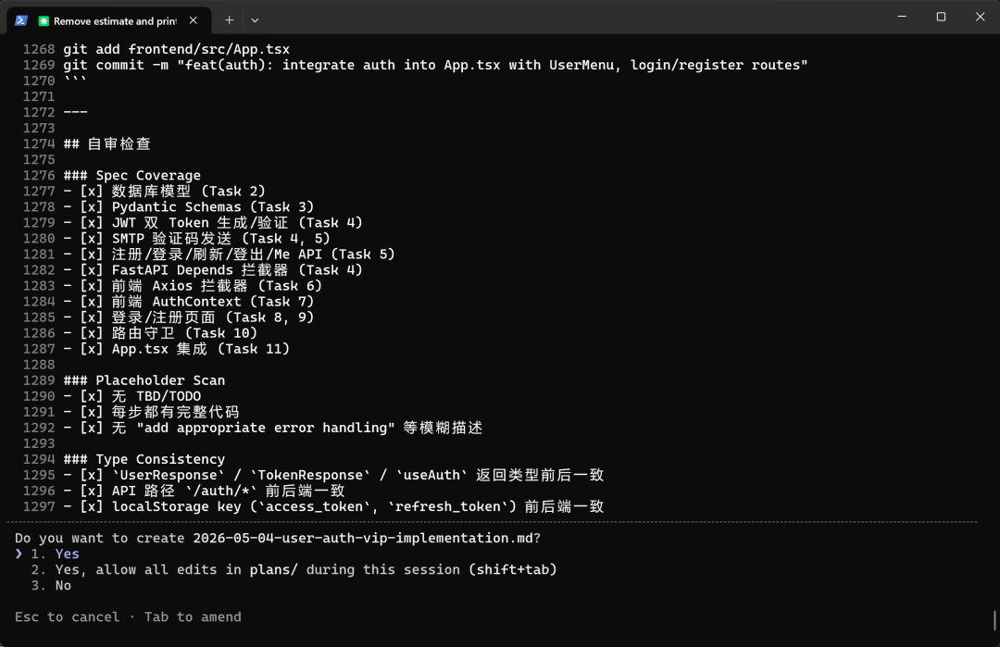

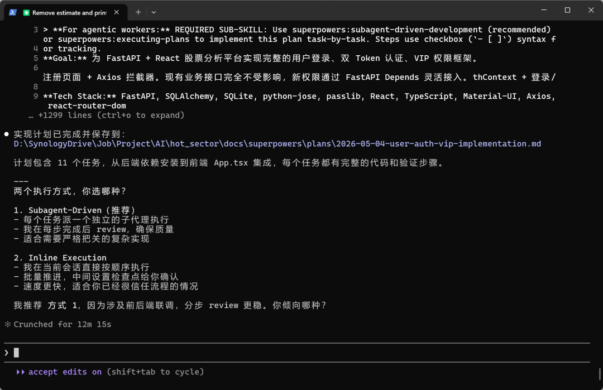

**（4）TDD驱动开发**

Claude 把上一步的设计方案拆解

```
TDD 即 Test-Driven Development（测试驱动开发），是敏捷开发的核心实践之一，核心逻辑与传统 “先写代码再补测试” 的模式完全相反，主张先针对最小功能点编写自动化单元测试用例，明确可量化的功能验收标准，再围绕测试要求编写业务代码，其核心执行闭环为经典的 “红 - 绿 - 重构” 循环：先编写无对应业务代码、运行必然失败的测试用例（红），再编写最少、刚好能让测试通过的业务代码实现基础功能（绿），最后在测试全程保持通过的安全兜底下，不改变代码外部行为地完成代码结构优化、冗余消除等重构操作，它严格遵循 “仅为通过失败测试编写生产代码、仅编写刚好足以让测试失败的用例、仅编写刚好让当前失败测试通过的生产代码” 三大核心定律，核心优势是实现缺陷前置大幅降低 bug 率、为代码重构提供零风险保障、倒逼代码实现高内聚低耦合的合理设计，同时测试用例本身也成为可执行的精准功能文档，该方法更适配逻辑密集型的长期维护项目，不适用于需求极度模糊的探索性原型、纯 UI 交互开发等场景。
```

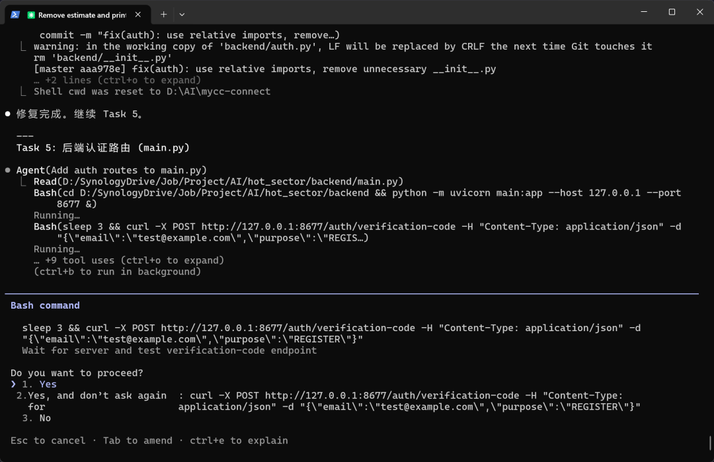

**（5）代码审查**

每个任务完成后自动调用 requesting-code-review 进行两阶段审查：

```
A.是否符合计划（规范符合性）
```

若所有审查通过，继续下一任务；若发现关键问题，AI 会暂停并通知你介入。

**（6）系统化测试**

所有任务完成后，AI 调用 finishing-a-development-branch：

运行完整测试套件并合并到主分支（或丢弃所有更改），开发闭环完成。

下面是最终的成品：

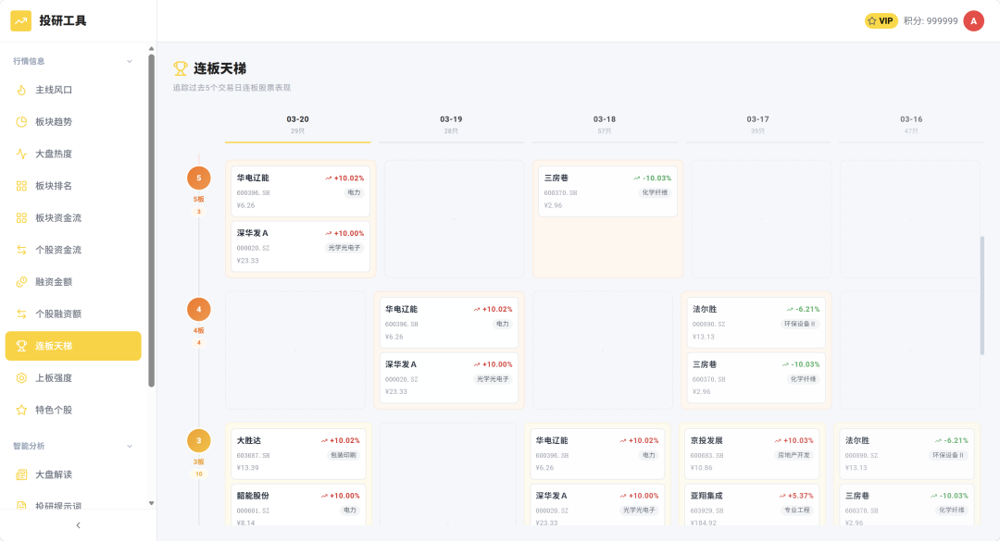
