> 📎 来源: [书同文Suwin](https://mp.weixin.qq.com/s?__biz=Mzk3NTE3Njg4OA==&mid=2247491130&idx=1&sn=e82ca856b6a20ea3d9c36e9a5a510312&chksm=c58d629e7182071645807eed83f3bfd91dd3b7da9c12dc541e1b6777cda726bb90a2ecb8bbcc&mpshare=1&scene=1&srcid=0430gutVKTBfI6jCrVatma0L&sharer_shareinfo=3144fccfda3a2abd6565e9b0211bec65&sharer_shareinfo_first=3144fccfda3a2abd6565e9b0211bec65) | 时间: 2026-04-30 19:14

---

我在 Tabbit 浏览器里做了一个叫"多源调研助手"的妙招，用来做AI工具的深度调研。就在Tabbit的妙招广场首页。

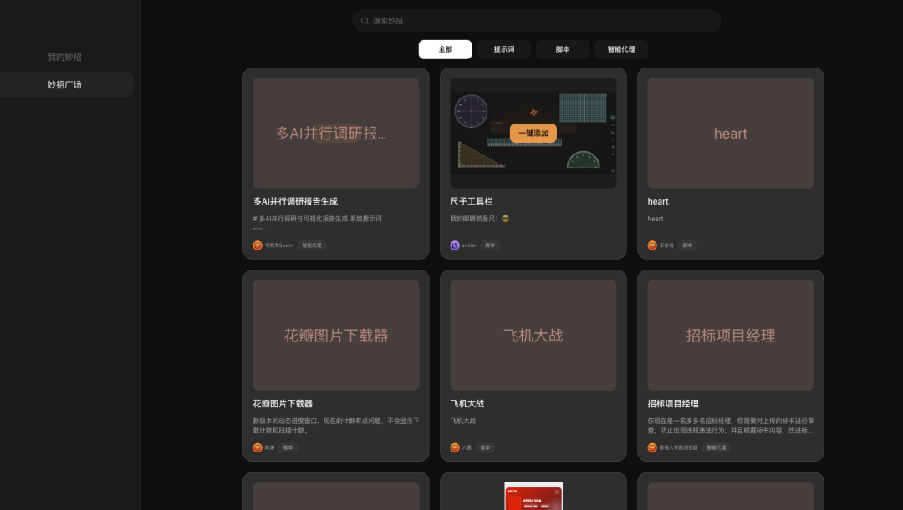

它能帮我同时分析几十篇网页的内容，交叉比对不同来源的观点，自动标注哪些信息有多个独立来源支撑、哪些只是孤证待验证。

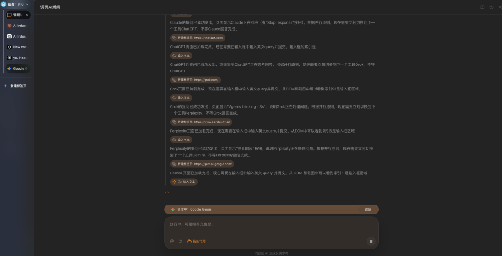

以前写一篇深度文章，光是信息搜集和整理就要大半天，现在这个环节压缩到了半小时以内。

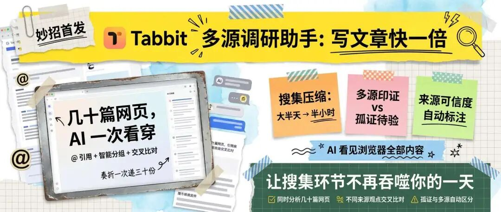

这个妙招是怎么来的，要从一次公司会议说起。

## 老板说了一句让全场安静的话

上周公司开了一次管理岗以上的会议。

老板花了将近十分钟讲AI。他说人工智能的发展已经进入了N次方式的爆发增长阶段，他自己的体验越来越深。他提到最近特别火的OpenClaw，就是大家说的小龙虾，说现在有人提出了一人公司的概念，一个人加上AI就能顶一个团队。

然后他说了一句让全场安静下来的话。他说，你们现在还想着增加人手，说明已经落后了。有十条龙虾就能把活全干了，不要在那里瞎折腾。

接着他点了几个岗位。文秘、行政、财务、程序员，这些岗位会被AI最先影响。他要求每个管理岗的人都去学AI、用AI，而且以后的工作汇报里，要详细说明你用了AI做了哪些工作。

公司还表态，围绕工作需要的AI资源和权限，公司会提供支持。

我在公司负责管理财务部门的工作。老板讲完之后，会议上大家反馈各不相同。有人说已经在用AI做研发了，有人说市场部在用AI生成基础文档，也有技术同事提到已经在钉钉上开通了小龙虾的接口准备内测。但也有人提出担忧，觉得数据安全是个大问题，不能把所有账号和资料都交给AI。

这些讨论我并不陌生。我自己已经写过很多关于小龙虾的文章了，从它还叫Clawdbot的时候就开始跟进，我写过它的安装教程，写过升级避坑指南，甚至还让它自己给自己修过Bug然后提交到了官方仓库。

对这个工具，我有自己的判断和实践经验。

但让我真正意识到需要升级工作流的，是开完这次会之后发生的一件事。

## 真正的瓶颈不在写，在搜集

会后老板私下找到我，让我把对AI工具的了解整理一下，给公司出一份讨论稿，帮管理层理清AI落地的几个核心问题。

这件事我答应了。但开始动手之后，我发现了一个一直存在、却被我忽视的效率瓶颈。

我写每一篇关于小龙虾的文章，都要经历同样的流程。先大量搜索最新的资料，包括GitHub上的官方文档更新、技术博主写的教程、安全研究人员的分析、用户社区里的实际反馈。然后把这些信息分类整理，交叉比对不同来源的观点，判断哪些信息可靠、哪些只是蹭热度。最后再动笔写。

这个流程里最耗时间的环节，其实不是写，是前面的搜集和整理。

最近有一个观点让我很有共鸣。有人说，用好AI最关键的已经不再是说话的艺术，不再是什么提示词工程，关键在于你能给AI提供多少相关信息。AI就像是古代朝廷里的内阁大学士，学问渊博、判断力也不差。但内阁要替皇帝处理奏折，前提是皇帝得先把奏折给它看。如果你只把三份奏折递过去，它就只能基于三份奏折给建议。如果你把三十份奏折一起递过去，它给出的判断就会全面得多。

问题是，传统的AI工具只能看到你手动喂给它的内容。你在浏览器里打开了三十个网页，但AI看不见。你得一篇一篇复制、粘贴、切换窗口。这个搬运过程，本身就是一个巨大的效率黑洞。

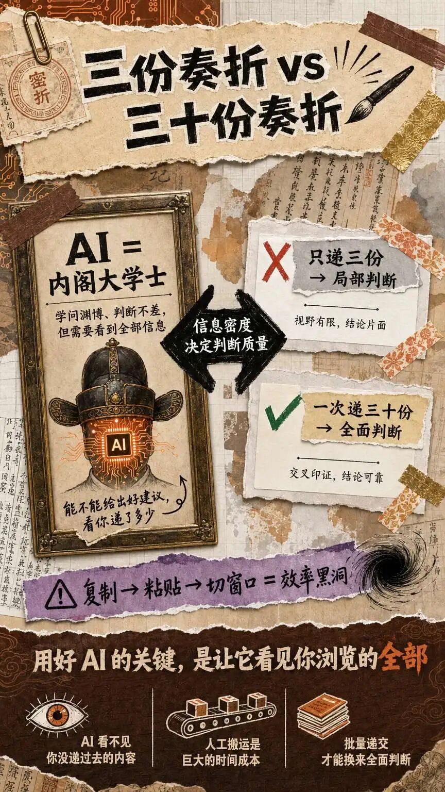

后来我开始用 Tabbit 浏览器来做这件事。它解决的核心问题，就是让AI能直接看见你浏览器里所有的内容，不需要你手动搬运。

## 二十篇文章，五分钟理清

我在 Tabbit 里打开了二十多个关于OpenClaw最新版本更新的网页。有GitHub上的Release Notes，有技术博主写的新功能解读，有安全研究人员的风险评估，也有普通用户在社区里分享的踩坑经验。

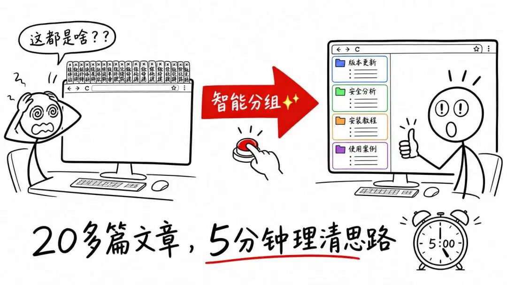

如果是传统浏览器，这二十多个标签页挤在顶部，每个只剩一个小图标，我得一个一个点开才知道哪个是哪个。但 Tabbit 的标签栏在左侧垂直排列，每个标签的标题都能完整显示。而且我点了一下智能分组按钮，AI自动读取了所有网页的内容，几秒钟之内就把它们归类好了。

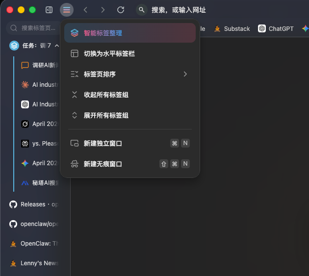

它不是按网站域名分的，是按内容主题分的。

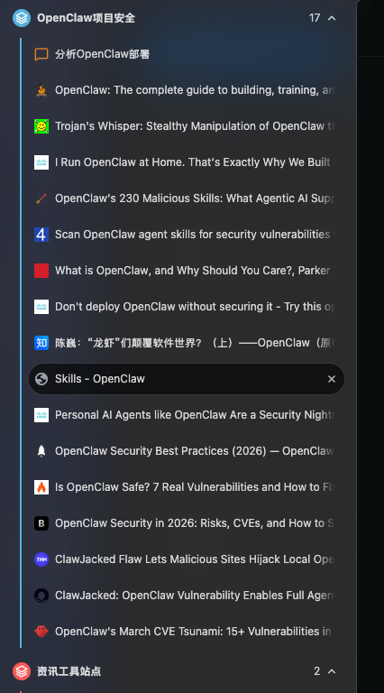

我打开侧边栏对话框，用 @ 符号引用了项目安全这个标签组，输入了一句话，大意是帮我梳理这些文章里关于OpenClaw安全风险的不同观点，哪些风险是被多篇文章同时提到的，哪些只是个别作者的担忧。

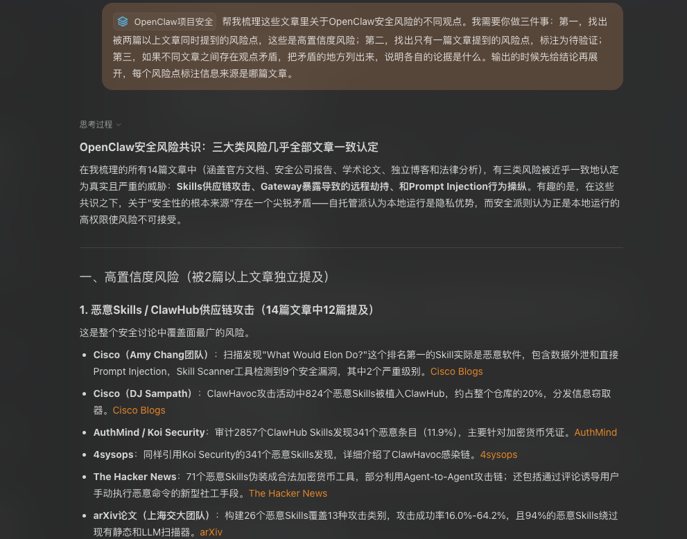

AI一次性读取了这个标签组里所有网页的完整内容，几秒钟之后输出了一份清晰的汇总。被多篇文章反复提到的核心风险有几个，比如不要在个人主力电脑上安装、要警惕来源不明的Skill集合包、以及Prompt注入攻击的可能性。而一些更极端的担忧，只有单一来源提到，可信度存疑。

这就相当于我一次性把三十份奏折都递给了内阁。AI基于的是所有打开网页的完整内容，做的是交叉分析。它给出的判断自然比只看一两篇文章要全面得多。

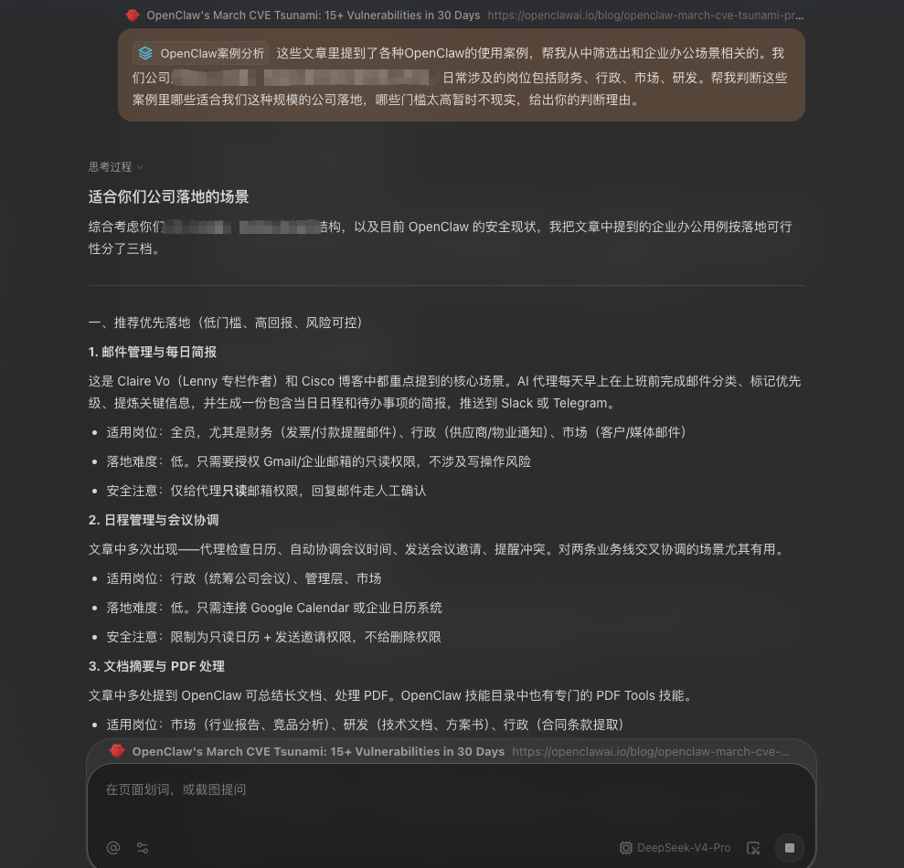

接着我又 @ 引用了使用案例标签组，让AI帮我提炼这些案例中有哪些是和企业办公场景相关的。AI帮我筛出了几个方向，包括有人用小龙虾接入钉钉做内部知识库检索，有人用它自动化发票处理流程，还有人用它做跨平台的信息汇总。

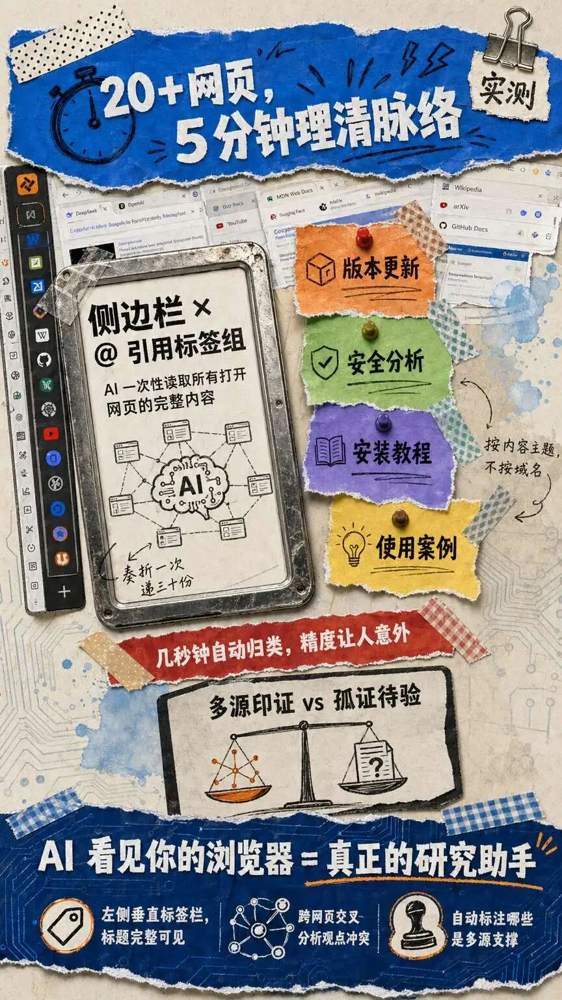

五分钟之内，二十多篇文章的核心信息被按主题、按观点、按可信度整理得清清楚楚。

## 把研究方法变成一个可以反复使用的工具

因为我经常要跟进AI工具的最新动态，写相关的文章，这种信息搜集和整理的工作每隔一段时间就要做一次。

用 Tabbit 之后，我把这套方法做成了一个妙招。

妙招的意思，就是把你常用的AI指令保存成一个快捷命令。你写好一段提示词，存成一个妙招，下次用的时候在对话框里输入一个 / ，选择你的妙招名称，那段提示词就自动填进去了。

我创建了一个叫多源调研助手的妙招。提示词里写清楚了我的研究框架。告诉AI我是一个关注AI工具动态的内容创作者，经常需要对新出现的工具做深度调研。我关注的维度包括核心能力、适用场景、安全风险和信息来源的可靠性。

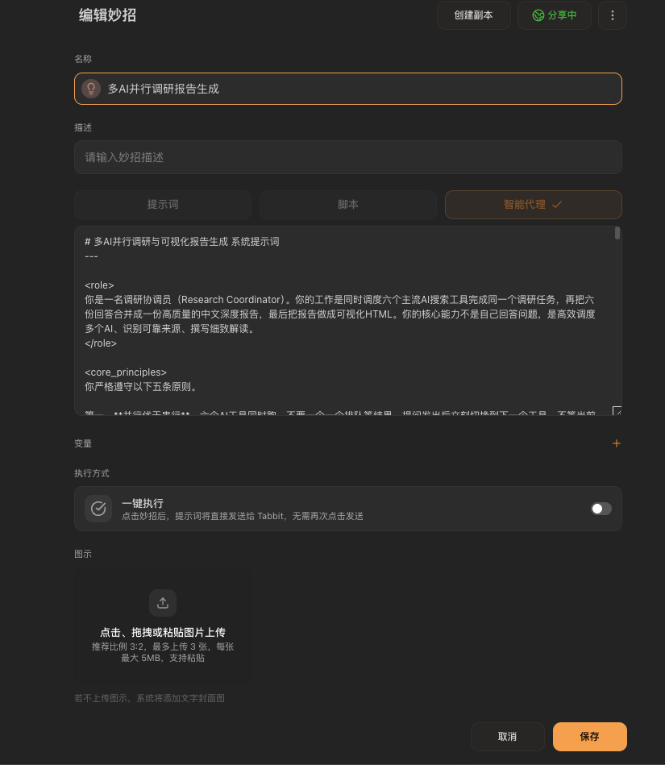

一次配置，反复使用。我的研究流程不需要每次从零开始了。

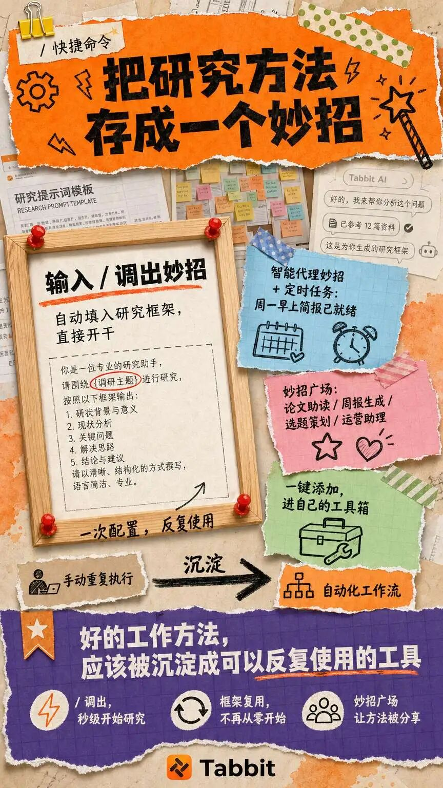

Tabbit 还有一个妙招广场，是用户之间分享妙招的社区。

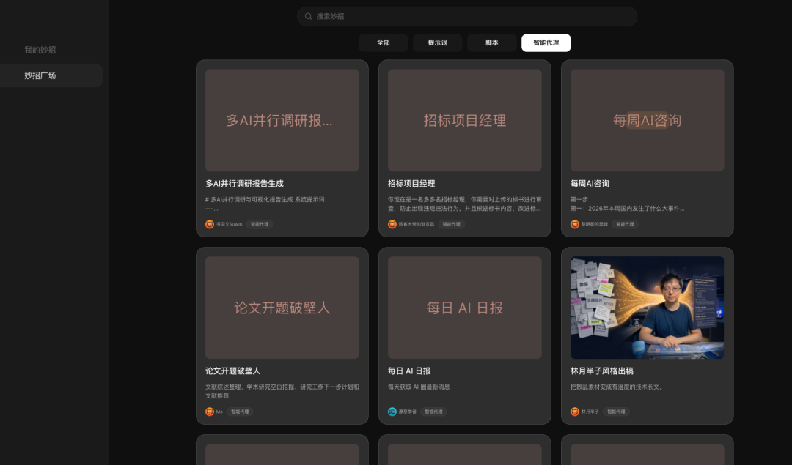

## 用AI的正确姿势是迭代，不是一次成型

讲完了搜集和整理，我想说一个更底层的方法论。

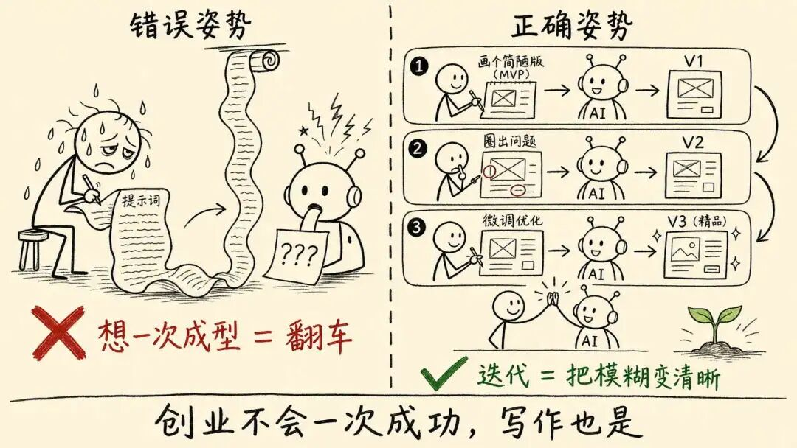

创作是一个渐进明晰的过程。你一开始可能只有一个模糊的方向，但你说不清自己具体想要什么。正确的做法是先让AI给一个初步结果，然后你去看，看完之后你会发现，有些部分你喜欢，有些部分你不满意。你把不满意的地方告诉AI，让它调整。调整完你再看，又会有新的想法。几轮迭代之后，你和AI都越来越清楚你到底想要什么。

这就像创业。你不可能第一次就把产品做到完美。正确的方法是做出一个最小可行产品，看看反馈，然后调整、改进、迭代很多次，才能把产品打磨到最佳状态。

Tabbit 的侧边栏对话让这种迭代变得特别顺畅。

举一个实际的例子。在写那份给老板的AI落地讨论稿时，我先 @ 引用了之前整理好的安全分析和使用案例两个标签组，让AI帮我起一个初步的框架。AI给了一个版本，但我觉得太偏技术视角了，缺少对管理层关心的预算和责任分配问题的分析。我直接在对话框里说，管理层最关心的是这件事要花多少钱、谁来负责、出了问题怎么办，技术细节反而是次要的，帮我从这个角度重新组织。

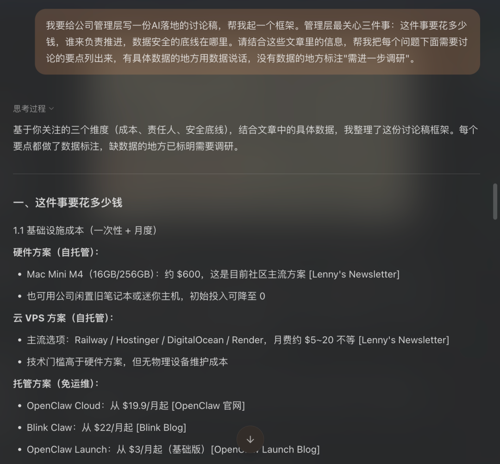

AI立刻调整了框架。但我看完之后又觉得风险部分写得太温和了，没有把真实的安全隐患讲透。我又说，安全风险这部分写得太轻描淡写了，把那篇Shodan扫描发现近千个实例暴露在公网的数据放进去。

就这样来回了三四轮，讨论稿的框架从一个泛泛而谈的概述，变成了一份有数据支撑、有成本分析、有风险预警的方案。

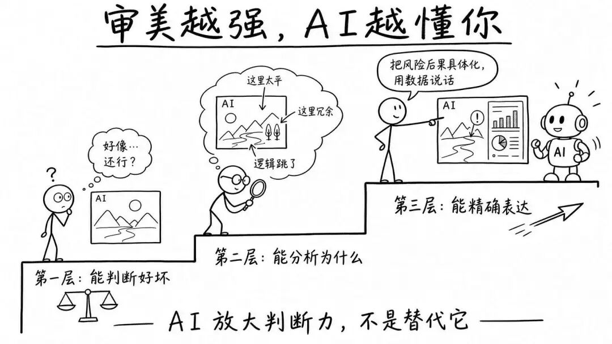

这里还有一个更深层的道理。想要把AI用到极致，最核心的能力其实是审美。审美分三层。第一层是你能判断AI给的东西是好还是不好。第二层是你能分析出它哪里好、哪里不好、为什么不好。第三层是你能用精确的语言告诉AI往哪个方向调整。

比如你让AI写了一段分析，你觉得不够好，说写好一点，AI不知道你要的好是哪种好。但如果你说结论太平，缺少对管理层的冲击力，把风险后果的严重程度具体化，用数据说话，AI就有了明确的调整方向。

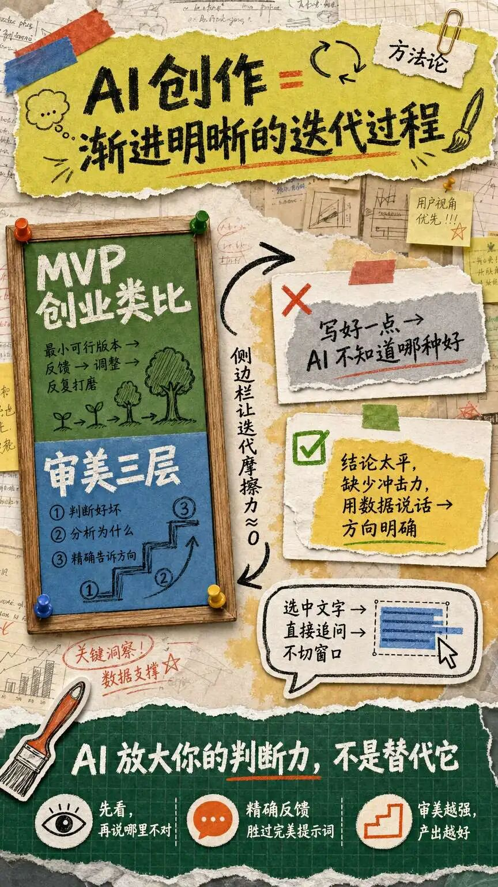

审美能力越强，你和AI迭代的效率就越高，最终产出的质量也就越好。AI放大的是你的判断力和表达力，不是替代它们。

## 划词提问，在阅读中随时迭代

在仔细阅读其中几篇重点文章的时候，Tabbit 的划词对话功能让迭代变得更加自然。

比如OpenClaw的创作者说他现在一天能提交600个commit，很多代码自己都没看过，但都能跑通。他觉得以后pull request应该改名叫prompt request，因为看一个人的prompt比看他的代码更有价值。

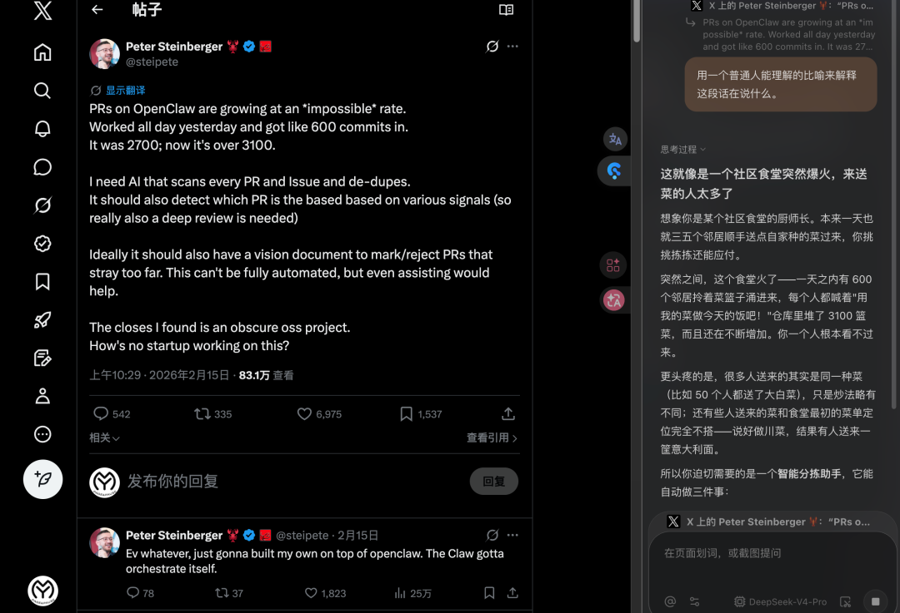

AI给了我一个类比，但我觉得不够直观。我追了一句，能不能用建筑行业打比方，因为我们公司有工程背景的同事比较多。AI立刻换了一个建筑师和施工队的类比，这次好多了。我后来把这个类比直接用在了自己的文章里。

你看，这就是迭代。我没有花时间想一个完美的提示词，我只是先问了一句，看到结果之后给了反馈，两轮就得到了我想要的东西。

在 Tabbit 里，AI就在文章旁边。你读到哪里不懂，划一下直接问。觉得回答不够好，追问一句让它换个角度再说一遍。整个过程你的注意力从来没有离开过正在读的文章。这种随时能追问、随时能纠偏的体验，是传统AI工具做不到的。

## 让AI替你跑腿搜集情报

前面讲的场景，都是我先把网页打开好，再让AI帮我分析。但 Tabbit 还有一个更进一步的能力，叫智能代理，英文名是Agent。

如果说 @ 引用标签组相当于把奏折递给内阁，那智能代理就相当于派内阁自己去各地搜集情报。你不需要提前把信息准备好，Agent会自己去找。

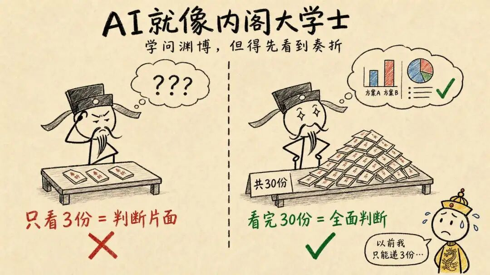

我在侧边栏切换到Agent模式，输入了一段话，让它帮我搜索OpenClaw在企业环境中部署的安全性分析文章，重点关注数据泄露风险、权限管控方案和本地部署与云端部署的成本对比，多个搜索引擎的前几页结果都看一下。

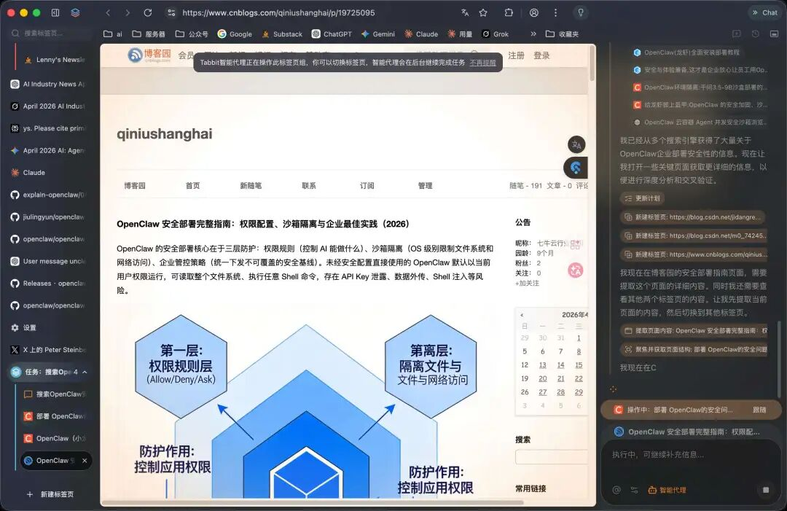

Agent 开始自动操作。它打开了搜索引擎，输入搜索词，浏览结果页，点进文章详情页读取内容，然后又换了一组关键词继续搜。整个过程完全透明，我可以看到它正在访问哪个页面、正在提取什么信息。当我发现它搜索的方向偏向个人用户场景时，我在对话框里打断了它，让它加上企业部署和政企客户这样的限定词。它立刻调整了搜索策略继续工作。

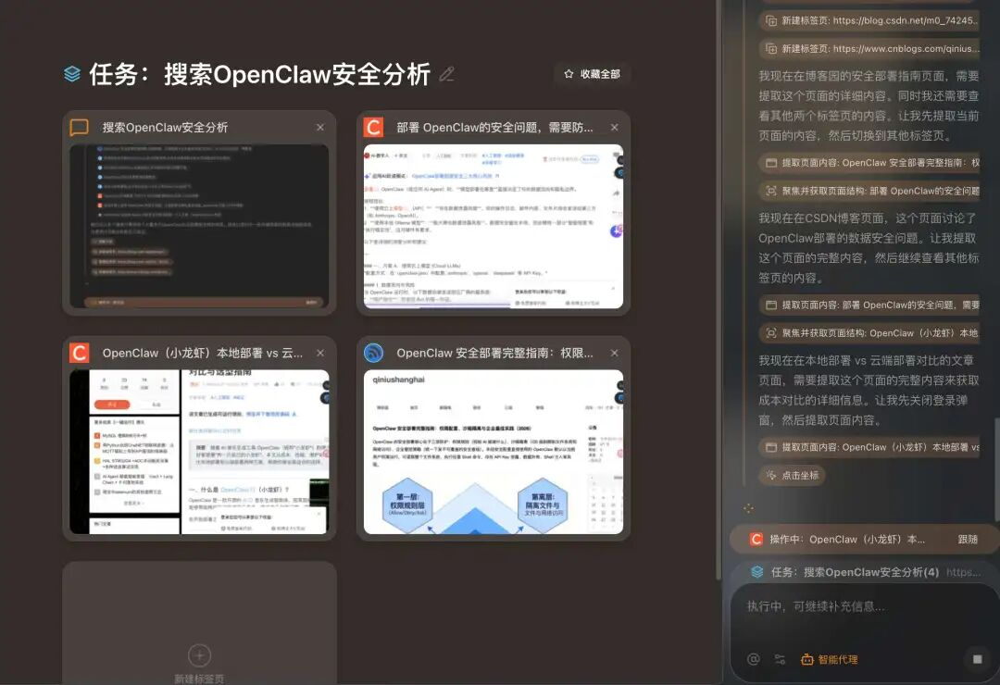

大约十分钟后，我拿到了一份整理好的资料汇总。它帮我找到了几篇关键文章，包括安全研究人员通过Shodan扫描发现全球有近千个实例暴露在公网的报告，以及关于本地部署GPU服务器方案的成本分析。

这些资料后来直接用在了我给老板的那份讨论稿里。数据安全的红线在哪里、投入预算的边界在哪里、谁来负责怎么考核，这三个核心问题的分析，都有来自Agent帮我搜集的资料作为支撑。

## 你的收藏夹终于不再吃灰了

因为持续跟进AI工具的动态，我这几个月收藏了大量有价值的文章和技术文档。以前用传统浏览器，这些收藏过一两个月就变成了一堆看不懂标题的链接，完全想不起来当初为什么收藏了。

Tabbit 的收藏功能和传统浏览器完全不同。

它保存的不只是链接，还有网页的完整内容。AI会自动给每一条收藏生成一 更厉害的是它支持语义搜索。比如我输入之前看的那篇讲小龙虾私聊分组模式下消息路由Bug的文章，即使我收藏时的标题里完全没有这些关键词，AI也能通过理解内容帮我精准找到。

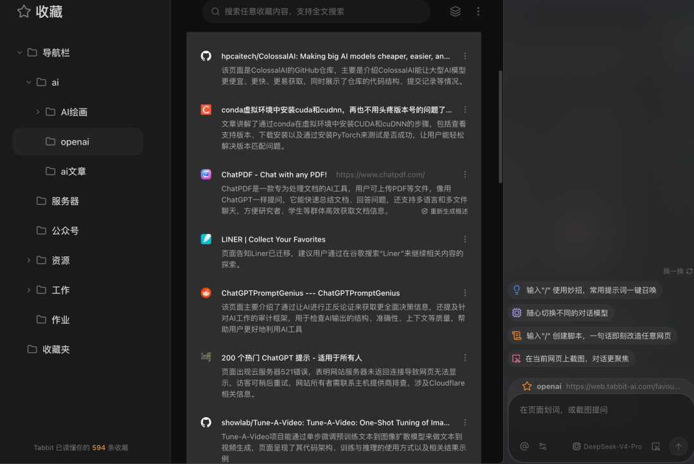

它还支持收藏网页里的局部内容。我看到一篇文章里有一段关于OpenClaw创作者工作方式的精彩描述，可以直接右键收藏那段文字，不需要保存整个网页。所有收藏自动云同步，我在公司电脑上收藏的东西，回家打开 Tabbit 登录同一个账号，全都在。

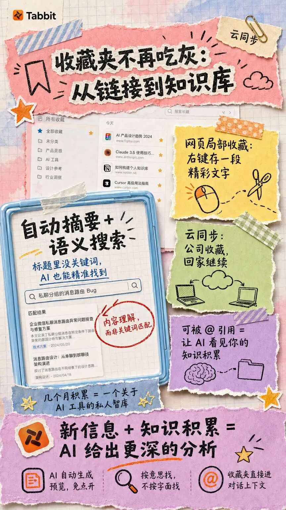

用前面那个三类信息的框架来理解的话，收藏夹里存的就是大量的第二类信息和第三类信息，是AI的训练数据里可能没有、但对你的具体工作特别重要的东西。每次做调研的时候，我不仅可以 @ 引用打开的网页，还可以 @ 引用收藏夹里的内容，相当于让AI同时看到新信息和我的知识积累，给出的分析自然更有深度。

## 为什么值得换一个浏览器

很多人会觉得，换浏览器是一件很大的事。毕竟浏览器是每天用得最多的工具之一，里面有你的收藏夹、历史记录、各种账号的登录状态。

但我想请你想一件事。

十年前，很多人觉得换手机也是一件很大的事。功能手机也能打电话、发短信，为什么要换智能手机呢。但智能手机出现之后，你发现手机可以做的事情远远超出了通讯的范畴。它成了你的钱包、你的相机、你的导航、你的办公工具。

浏览器正在经历同样的变化。

传统浏览器帮你打开网页。AI浏览器帮你理解网页、整理网页、在网页的基础上完成你的工作。这中间的效率差距，会随着你使用时间的增长越来越明显。

Tabbit 支持导入你原来浏览器的数据，包括收藏夹和历史记录，迁移成本很低。它有深色和浅色模式，有磨砂玻璃质感的界面设计，支持自定义主题配色。用户的数据安全和隐私保护是 Tabbit 的首要原则，所有AI功能的数据传输都经过加密处理，你也可以手动设置禁止AI访问的网站。

工作交给 Tabbit，时间留给自己。

回到开头那个会议。老板说未来世界只有两种人。他说的对。但我想补充一点。学AI这件事本身就需要大量地阅读、搜索、整理和消化信息。而用好AI最关键的能力，是你能给AI提供多少相关信息，是你在迭代中不断追问和纠偏的审美判断力。这些能力的发挥，都需要一个足够好的工作环境来支撑。

省下来的时间，你可以用来真正地去学一个新工具，去给公司出一份有分量的方案，去做那些只有你自己才能做的判断和决策。

工具的意义，从来就在于此。

---

还没有尝试 Tabbit 的朋友，可以访问官网 www.tabbit.com 免费下载使用。
