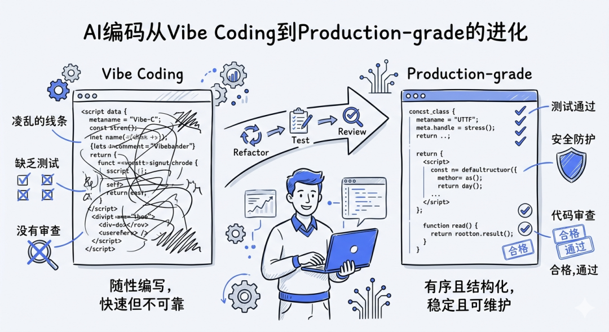
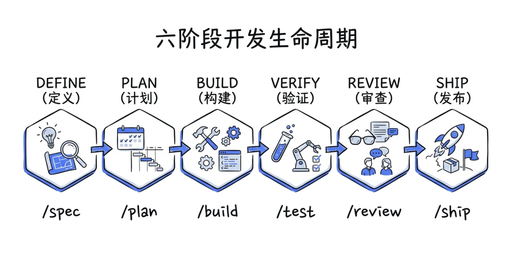
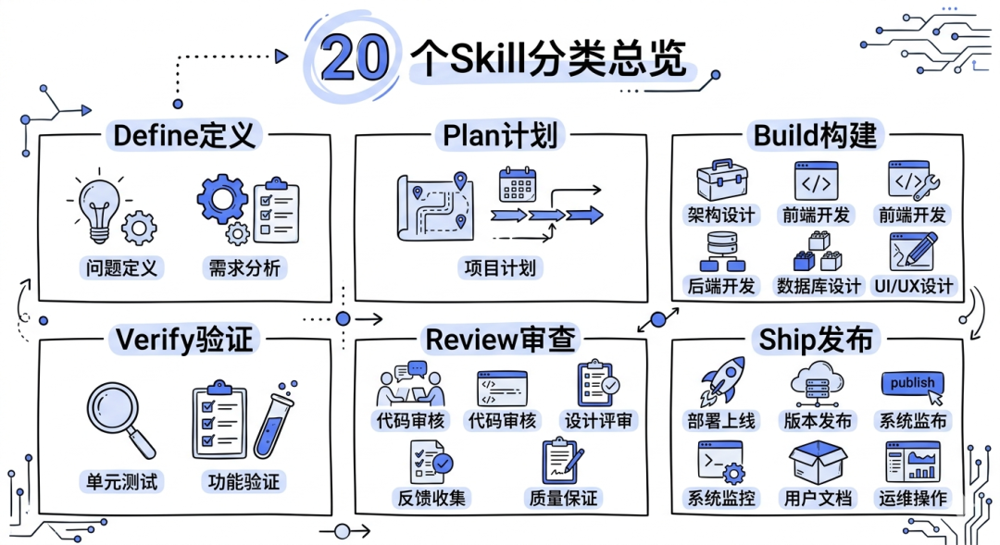
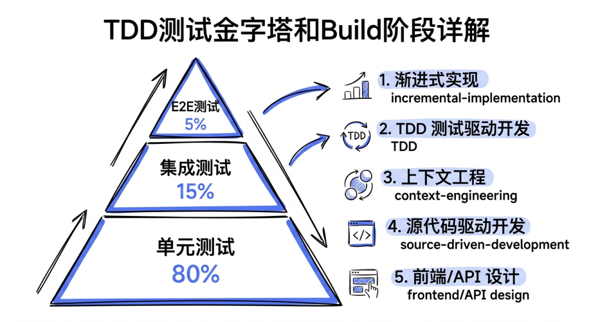
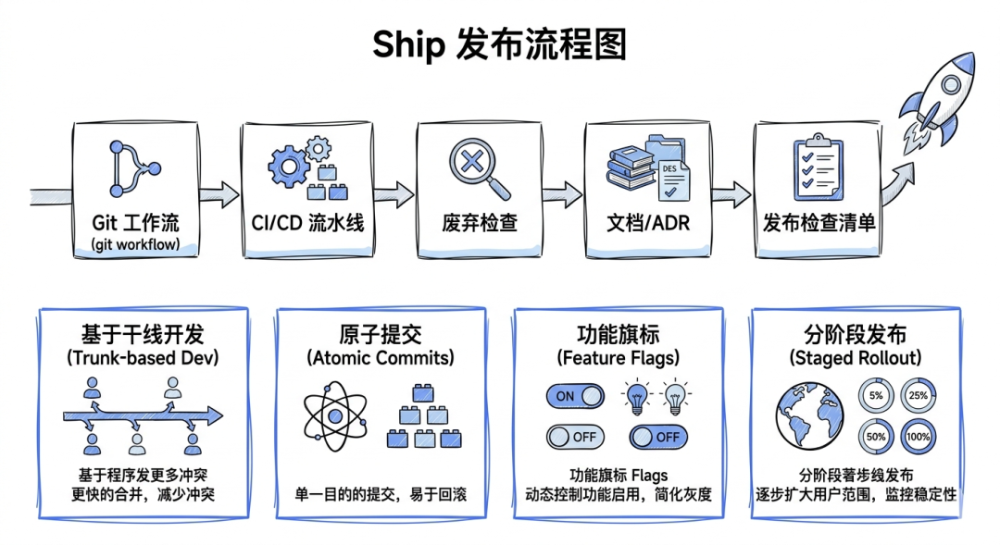
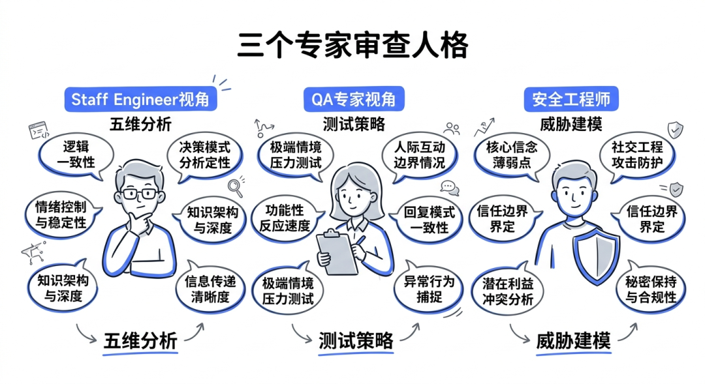
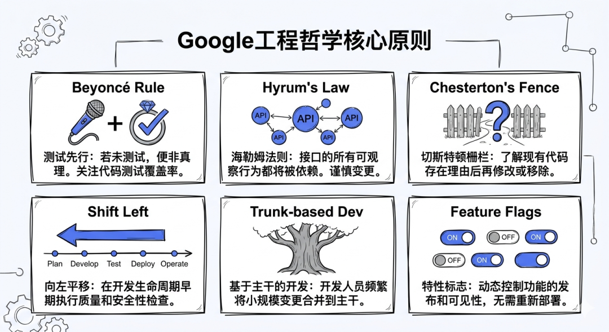

> 📎 来源: [蒜是哪根葱](https://mp.weixin.qq.com/s?__biz=MzI1MzQ3NzcwNg==&mid=2247484664&idx=1&sn=73f9d744198c75527e95b8bb967e4136&chksm=e85247e0dd132ce4784dd0d469ef0fbbd9123cefffe31d21bb0f14b0038e9affb61e65625bc7&mpshare=1&scene=1&srcid=0429VpRUOhJ2H5JELOvIDrvo&sharer_shareinfo=0fca845847c76b0e5b86402815a8c46d&sharer_shareinfo_first=0fca845847c76b0e5b86402815a8c46d) | 时间: 2026-04-29 03:51

---

> Addy Osmani 把 Google 内部的工程纪律打包成了 20 个 Skill，让 AI 编码从"能跑就行"升级到"能上线"。17,900 颗星，不是没有道理的。



Addy Osmani的agent-skills项目概念图：从Vibe Coding到Production-grade的进化

## AI 写代码很快，但出事也很快

这破玩意，相信做过正经项目的人都懂——让 Claude 或 Cursor 帮你写代码，速度确实快，三下五除二就能搞出一个能跑的 demo。但等你要上线的时候，问题全来了：没有测试、没有安全审查、commit 历史一团糟、API 设计随手一拍、部署流程约等于手动 scp。

这就是所谓的 **Vibe Coding**——氛围到了，代码就出来了，但质量嘛……

Addy Osmani（对，就是那个在 Google 当工程总监的 Addy Osmani，Chrome DevTools 和 Lighthouse 背后的人）在 GitHub 上开源了一个项目叫 **agent-skills**，专门解决这个问题。

> 他的核心观点很直白：AI 编码 Agent 默认走最短路径——跳过 spec、跳过测试、跳过安全审查。agent-skills 就是用来堵住这些漏洞的。



agent-skills的六阶段开发生命周期：DEFINE→PLAN→BUILD→VERIFY→REVIEW→SHIP

## 六阶段生命周期：DEFINE → PLAN → BUILD → VERIFY → REVIEW → SHIP

整个项目的核心思路是把软件开发拆成六个阶段，每个阶段有对应的 Skill。Agent 必须按阶段走，不能跳步。

```
DEFINE → PLAN → BUILD → VERIFY → REVIEW → SHIP
```

每个阶段都有对应的斜杠命令：

- ●

  ```
  /spec
  ```

   —— 先写规格说明，再动手写代码
- ●

  ```
  /plan
  ```

   —— 把需求拆成原子级、可验证的任务
- ●

  ```
  /build
  ```

   —— 增量实现，薄切片，feature flag
- ●

  ```
  /test
  ```

   —— 全方位测试，不能"看起来对了就行"
- ●

  ```
  /review
  ```

   —— 质量门禁
- ●

  ```
  /code-simplify
  ```

   —— 降低复杂度
- ●

  ```
  /ship
  ```

   —— 安全上线

讲真，这六个阶段本身不新鲜，任何一本软件工程教科书都会讲。但关键在于：**它把这些流程编码成了 AI Agent 必须遵守的 Skill**，不是建议，是约束。



20个核心Skill的分类展示：按六个阶段分组

## 20 个 Skill 逐个拆解

每个 Skill 不是一篇文档，而是一个结构化的工作流程。统一格式长这样：

```
SKILL.md
├── Frontmatter（名称、描述、触发条件）
├── Overview（这个 Skill 干什么）
├── When to Use（什么时候触发）
├── Process（一步步怎么做）
├── Rationalizations（常见借口 + 反驳）
├── Red Flags（危险信号）
└── Verification（验证标准）
```

这里最狠的设计是 **Rationalizations**——它预判了 AI Agent 偷懒的借口，然后提前堵死。比如：

| Agent 的借口 | Skill 的反驳 |
| --- | --- |
| "这个改动太小了，不需要测试" | 小改动引发的回归 bug 比大改动还多 |
| "先上线再补测试" | 从来没人真的"后面"补过测试 |
| "这只是个原型" | 原型最终都会变成生产代码 |
| "规格说明太耗时间" | 不写 spec 的返工时间更长 |

### Define 阶段（2 个 Skill）

**idea-refine**：不让你一上来就写代码，先做发散-收敛思考。你有个模糊的想法？先把它结构化，搞清楚你到底要做什么。

**spec-driven-development**：写 PRD（产品需求文档），包括目标、结构、边界。这一步要求你定义清楚"什么在范围内，什么不在"。

### Plan 阶段（1 个 Skill）

**planning-and-task-breakdown**：把 spec 拆成小的、可验证的工作单元，标注依赖关系。每个任务必须足够小，能独立验证。

### Build 阶段（5 个 Skill）

**incremental-implementation**：薄垂直切片，每次只实现一个可以独立交付的薄层。用 feature flag 控制发布，所有改动支持回滚。

**test-driven-development**：经典的红-绿-重构。测试金字塔比例：80% 单元测试、15% 集成测试、5% 端到端测试。

**context-engineering**：教 Agent 怎么给自己喂最优信息——通过规则文件和 MCP 集成，而不是把整个代码库塞进上下文窗口。

**source-driven-development**：所有技术决策必须基于官方文档，附带引用。不能凭"我记得大概是这样"来写代码。

**frontend-ui-engineering** 和 **api-and-interface-design**：分别处理前端组件架构（WCAG 2.1 AA 无障碍标准）和 API 设计（契约优先、Hyrum's Law）。

> 这里的 Hyrum's Law 值得解释一下：你的 API 有多少用户，你的 API 的所有可观察行为就会被多少用户依赖——不管这个行为是不是你故意设计的。所以 API 设计必须极其谨慎。



Build阶段的5个Skill详细展开图：TDD金字塔、薄切片、上下文工程

### Verify 阶段（2 个 Skill）

**browser-testing-with-devtools**：用 Chrome DevTools MCP 做运行时检查和性能分析。不是"在浏览器里点一点看看"，而是自动化的运行时检查。

**debugging-and-error-recovery**：五步排错法——复现、定位、简化、修复、防护。修了 bug 必须加回归测试，否则这个 bug 迟早会回来。

### Review 阶段（4 个 Skill）

**code-review-and-quality**：五维代码审查，每次改动控制在 100 行以内。超过 100 行的 PR？拆。

**code-simplification**：应用 Chesterton's Fence 原则（删代码之前先搞清楚它为什么存在）和 Rule of 500（函数超过 500 行就该拆）。

**security-and-hardening**：OWASP Top 10 防护、认证模式、密钥管理。

**performance-optimization**：先测量再优化。Core Web Vitals 目标值，不是"感觉快了"。

### Ship 阶段（5 个 Skill）

**git-workflow-and-versioning**：主干开发，原子提交。不搞长生命周期的特性分支。

**ci-cd-and-automation**：左移策略——质量检查越早越好。

**deprecation-and-migration**：代码即负债，迁移模式，废弃流程。

**documentation-and-adrs**：架构决策记录（ADR）。每个重大决策记录"为什么这样做"，不只是"做了什么"。

**shipping-and-launch**：上线检查清单、feature flag 生命周期、分阶段发布。



Ship阶段的完整流程图：从git workflow到分阶段发布

## 三个专家人格：让 Agent 换个脑子审查

除了 20 个 Skill，项目还提供了三个预配置的 Agent 人格：

1. **code-reviewer**：资深 Staff Engineer 视角，五维分析
3. **test-engineer**：QA 专家视角，聚焦测试策略和覆盖率
5. **security-auditor**：安全工程师视角，漏洞检测和威胁建模

这三个人格本质上是不同的 system prompt，让同一个 AI 模型从不同角色视角审查同一份代码。自己写的代码自己审，但至少换三个角度。



三个专家人格的审查维度对比图

## 跨平台支持：不只是 Claude Code

这套 Skill 不绑死在 Claude Code 上。安装方式支持：

```
# Claude Code（推荐）
/plugin marketplace add addyosmani/agent-skills

# 本地开发
git clone https://github.com/addyosmani/agent-skills.git
claude --plugin-dir /path/to/agent-skills
```

其他平台也能用：

- ●**Cursor**：复制 Skill 文件到

  ```
  .cursor/rules/
  ```
- ●**Gemini CLI**：

  ```
  gemini skills install ./agent-skills/skills/
  ```
- ●**Windsurf**：添加到 Windsurf 规则配置
- ●**GitHub Copilot**：从

  ```
  agents/
  ```

   目录引用
- ●**Kiro IDE**：存放在

  ```
  .kiro/skills/
  ```

   下

这说明一个趋势：**AI 编码 Skill 正在成为跨平台的标准化工程资产**，不再是某个工具的私有配置。

## 背后的工程哲学

整个项目底层有一套清晰的工程哲学，直接来自 Google 的工程文化：

- ●**Beyoncé Rule**："If you liked it, you should've put a test on it."——喜欢你写的代码？那就给它写测试
- ●**Hyrum's Law**——API 的所有可观察行为都会被依赖
- ●**Chesterton's Fence**——删代码前先理解它存在的理由
- ●**Shift Left**——质量检查越早越好
- ●**Trunk-based Development**——频繁小提交，不搞长分支
- ●**Feature Flags**——代码部署和功能发布解耦

> Addy 自己说过："Anthropic 内部 Claude Code 的 90% 代码都是 Claude Code 自己写的。"但关键不在于 AI 写了多少代码，而在于这些代码能不能通过 Google 级别的工程审查。



工程哲学关键原则的信息图

## 这套东西值不值得用

讲真，这 20 个 Skill 里有些内容对于有经验的工程师来说是常识。但它的价值不在于教你什么新东西，而在于：

**把你已经知道但经常偷懒不做的事情，变成了 AI Agent 的硬约束。**

你知道应该写测试，但赶工的时候总会跳过。你知道应该做安全审查，但"就这么个小功能应该没事"。你知道 commit 应该原子化，但"先全部提交了再说"。

agent-skills 把这些"应该但没有"变成了"必须而且自动"。

**一些数据**：

- ●20 个核心 Skill + 7 个斜杠命令
- ●3 个专家审查人格
- ●4 份参考检查清单（测试、安全、性能、无障碍）
- ●支持 6+ 个 AI 编码平台
- ●17,900+ GitHub 星标
- ●MIT 开源协议

```
项目地址：github.com/addyosmani/agent-skills
Addy 的博客文章：addyosmani.com/blog/ai-coding-workflow/
```

## 写在最后

AI 编码工具的竞争已经不在"谁能写更多代码"这个维度了。代码产量上去了，但如果没有对应的工程纪律跟上，产出的就不是软件，是技术债。

agent-skills 代表的方向是对的：与其让 AI 更快地写出更多代码，不如让 AI 更严格地遵守工程规范。

当然，这玩意也有局限。20 个 Skill 全开，开发速度肯定会慢下来。在原型阶段，你未必需要这么重的流程。但如果你的代码最终要上线、要维护、要被其他人接手——这套东西值得认真看一遍。

毕竟，Vibe Coding 出来的东西，最后总得有人收拾。
