> 📎 来源: [NEWPM](https://mp.weixin.qq.com/s?__biz=MzU4Nzc2Nzc5MQ==&mid=2247485093&idx=1&sn=e6236e5881ff906280c12b4e052c6971&chksm=fc4cf899173607755673a6510aae3ffd70944c75d4d21c1aabe5321b06b03568cc9a464bcb7d&mpshare=1&scene=1&srcid=0429Ql721lORndLIUQk9WjWd&sharer_shareinfo=1990e1770c790640554b03da58f28bbb&sharer_shareinfo_first=1990e1770c790640554b03da58f28bbb) | 时间: 2026-04-29 11:57

---

**Vibe Coding 如何重塑产品、设计和工程研发协同**

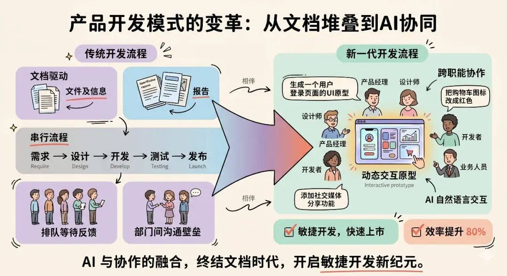

Vibe Coding 最早是用来形容程序员的新工作方式：不再逐行敲代码，而是用自然语言描述意图，让 AI 生成实现。很多人以为这只是开发圈的事——程序员换了个写代码的方式，跟产品经理和设计师有什么关系？

但如果你仔细看过去几个月发生的事，会发现这个判断大错特错。

作为产品经理，我现在的日常工作方式是这样的：有一个新功能的想法，不是打开文档工具写 PRD，而是直接跟 原生ide工具 对话。

几轮对话下来，一个可以点击、可以体验的高保真交互原型就出来了。然后把这个原型交给团队讨论，30 分钟内完成对齐，最后用skill对原型进行细化补全、逻辑审查，补充闭环。PRD 最后再补——作为原型的配套说明。

这不是个例。我了解到越来越多的团队在发生类似的变化：

- 产品经理 用 vibe coding 三轮对话出高保真交互原型
- 设计师用 vibe coding 产出的不是静态图，而是可运行的 React 代码
- 产品经理 在 Cursor 里验证技术可行性，写 PRD 之前先把想法跑通
- 工程师用 Claude Code 自动生成测试、文档，直接参与产品讨论

当每个角色都开始"用自然语言驱动 AI 做事"时，变化的就不只是单个环节的效率了——是整条产品开发流水线在被重写。

这让我开始思考一个更根本的问题：传统的"PRD → 设计稿 → 代码开发"流程，是为"动手成本高"的时代设计的。当动手成本趋近于零，这条流水线本身还成立吗？

**旧流水线为什么撑不住了**

**实现速度变了，但流程没变**

CREAO 创始人 Peter Pang 有一个很精准的观察：

“产品经理花几周调研、设计和详细规划功能，AI 智能体实现一个功能只需要两小时。当开发时间从几个月压缩到几个小时，长达数周的规划周期就成了最大的拖油瓶。”

这不是个别公司的问题，而是一个结构性矛盾：AI 让"实现"的成本暴跌，但"定义需求"和"传递需求"的成本没有变。

仔细想想，大多数团队用 AI 的方式其实挺可惜的——产品经理 用 ChatGPT 写 PRD 写得更快了，设计师用 Figma AI 出图更快了，工程师用 Cursor 写代码更快了。每个环节各自提速了 30%，但环节之间的串行等待和信息损耗一点没变。

流水线还是那条流水线，只是每台机器转得快了一点。

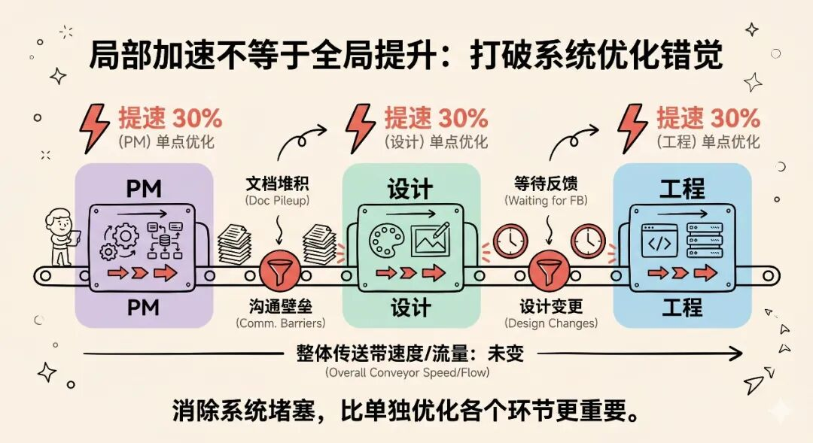

**底层假设在失效**

这条流水线的底层假设是：动手成本很高，所以要先想清楚再做。产品经理 花两周写 PRD 是为了确保开发不返工，设计师花一周出高保真稿是为了确保开发不走样。每个环节都在用文档降低下游的返工风险。

但这个假设正在失效。

Lovable 几分钟出前端 UI，Cursor 两小时跑通后端逻辑，vibe coding 一轮对话出高保真交互原型。当"做一个出来看看"比"写一份文档描述它应该长什么样"更快的时候，花两周写文档来降低返工风险反而是最大的浪费——因为返工本身也就两小时。

这就好比你有一台 3D 打印机，打一个样品只要 10 分钟。你还会花三天画图纸来"确保打出来是对的"吗？不会。你会直接打一个出来，看一眼，不对就改，再打一个。

**串行协作的真正成本**

传统协作最大的成本不是每个人做自己那部分的时间，而是交接的等待时间和信息损耗。

产品经理 写"用户可以筛选和排序列表"，设计师理解的是一种交互，工程师理解的是另一种。评审会上花一小时讨论一个交互细节，其实做一个原型出来看一眼就明白了。需求变更时，改文档 → 重新评审 → 改设计 → 再评审，每一轮都在传话。

文档描述的是一个"想象中的产品"，原型展示的是一个"可以体验的产品"。后者对齐认知的效率高一个数量级。

我在实际工作中反复验证了这一点：一个可以点击的原型，胜过一万字的需求文档。

**不是文档没价值，而是在对齐团队认知这件事上，"体验"远比"阅读"高效。**

**新流水线：以可交互原型为中心**

**不是"产品经理 也要学写代码"**

每次说到 产品经理 要用 Cursor、用 Claude Code，马上有人说"所以 产品经理 也要学写代码了？"

不是。

Aman Khan，Arize AI 的产品负责人说得很清楚：

产品经理 需要的不是学会写代码，而是学会如何利用 AI 工具来放大自己的能力。

看看他的工作流：

- 用 Lovable 或 Bolt 快速生成前端 UI——不需要写一行代码
- 需要深入调整功能逻辑时，把代码导入 Cursor 继续——AI 写代码，产品经理 审阅
- PRD 在 Notion 里写，但写之前会先在 Cursor 里研究技术可行性
- 设计在 Figma 做，但实现时会在 Cursor 里验证设计在技术上是否合理

产品经理 不是在"学编程"，而是在用 AI 作为验证想法的工具。

vibe coding 更进一步。三轮对话从模糊想法到可交互原型：Claude 主动问你需求细节，给你多个方案选择，自检自纠，最终产出可运行的 html 代码。

整个过程中，产品经理 做的事情只有一件——判断。**判断哪个方案更好，判断哪个交互更合理，判断什么值得做。**

这恰恰是 产品经理 最该做的事。

**先原型，再文档**

旧流程是这样的：想法 → PRD → 评审 → 设计稿 → 评审 → 代码开发 → 测试。

新流程变成了：想法 → AI 可交互原型（快速验证）→ 团队基于原型讨论迭代 → 确定方向 → 需求文档作为原型的配套附件 → 工程落地。

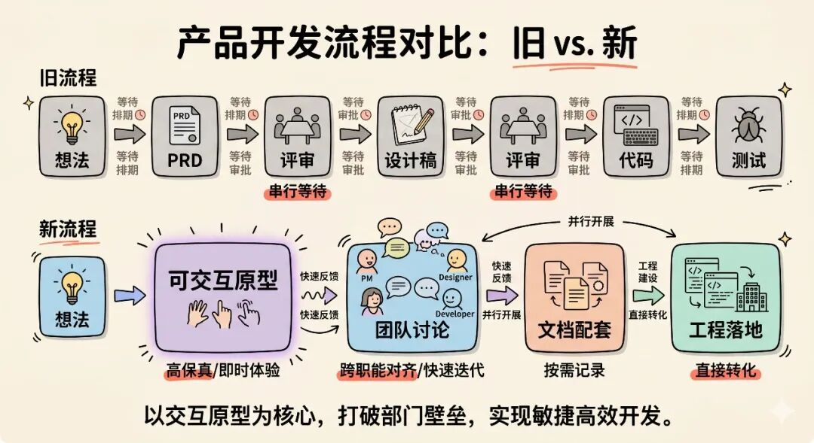

关键转变在于：传统的 PRD 流程过时了，但用于描述产品需求的文字内容依然极具价值。区别在哪？文档不再是流程的起点和驱动力，而是原型的配套附件。

在交付评审之前，需求文档应当作为原型的必备附件存在，记录产品决策的背景、边界条件、验收标准、以及原型中无法直观体现的业务规则。

原型回答的是"做成什么样"，文档回答的是"为什么这样做"和"不做什么"。两者配合，才是完整的产品交付物。

**我们正在践行的产品：readbearPM**

这不是空想。我们自己做了一个产品管理平台 readbear产品经理，它的产品设计本身就是围绕"原型 + 文档配套"这个协作理念构建的。

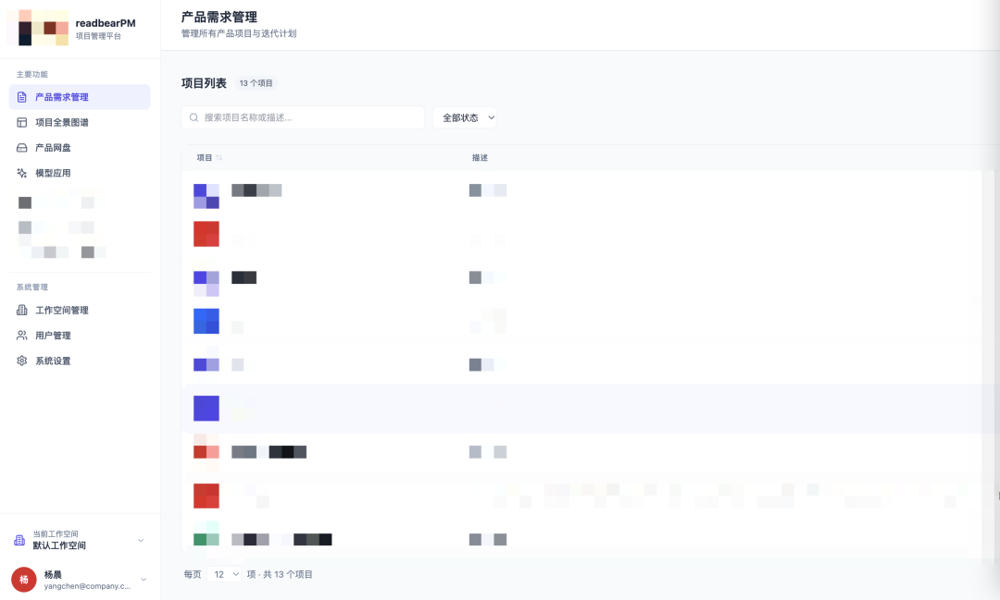

传统的产品协作工具是割裂的：需求写在 Jira 或 Tapd 里，原型画在 Figma 里，文档存在 Notion 里，讨论散落在飞书群和钉钉群里。产品经理 写完需求贴个 Figma 链接，设计师改完原型在群里 @ 工程师来看，工程师看完有问题在 Jira 评论里回复——信息在四五个工具之间反复跳转，每跳一次就丢一层上下文。

readbearPM 要解决的核心问题就一个：让需求、原型、评审讨论在同一个上下文里闭环。

怎么做到的？

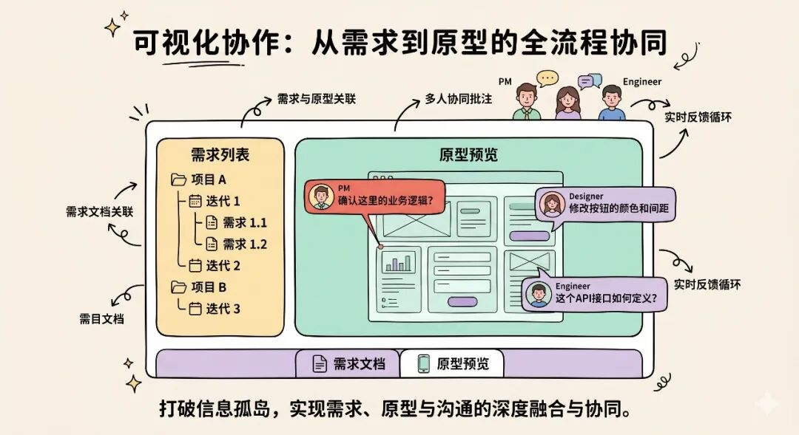

首先，需求与原型天然绑定。产品需求的层级是"项目 → 迭代 → 需求"。

每条需求不是一个孤立的文字描述——点击需求标题，直接进入该需求关联的原型协作页面。产品经理 写的需求描述和可交互原型在同一个界面里共存。不需要"在 Jira 里找到需求 → 复制 Figma 链接 → 打开 Figma → 找到对应画板"这条四步跳转链路。

然后，原型上可以直接批注评审。团队成员直接在原型页面上打批注，批注锚定到具体的 UI 元素上。设计师标注"这个按钮间距不对"，工程师标注"这个交互在移动端可能有问题"——讨论发生在"看得见、摸得着"的原型上，而不是在需求文档的评论区里猜对方说的是哪个交互。评审不再需要单独组会，批注本身就是异步评审的载体。

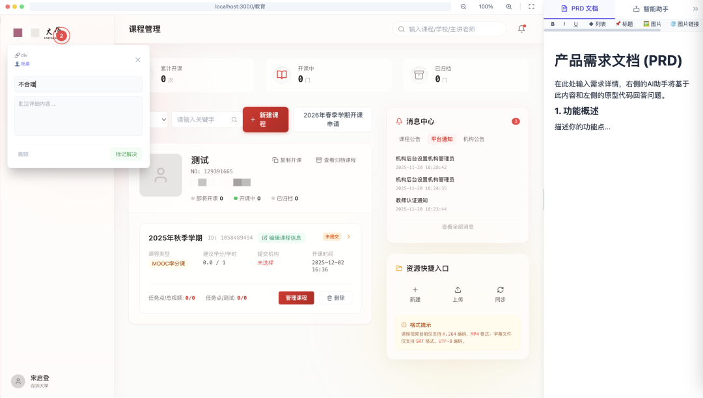

还有项目全景图谱，用可视化的方式展示项目、迭代、需求之间的关系和状态。产品经理 可以一眼看到整个产品的结构和进度，而不是在线性的需求列表里上下翻找。你能直观看到哪些需求属于同一个功能模块，哪些迭代的需求过于密集——这对需求拆分和迭代规划特别有价值。

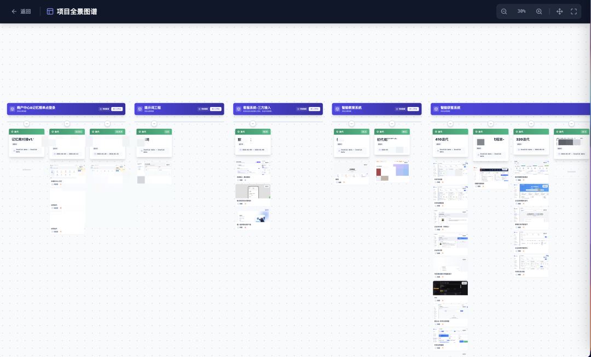

平台还内置了 AI 能力入口，产品经理 可以直接在产品管理环境里调用 AI 辅助工作，比如用文生图快速生成概念插图，不需要切换到外部工具再把结果搬回来。而协作者可以直接通过页面的ai助手提出问题，模型会读取基于html页面代码切片的知识库回答问题。

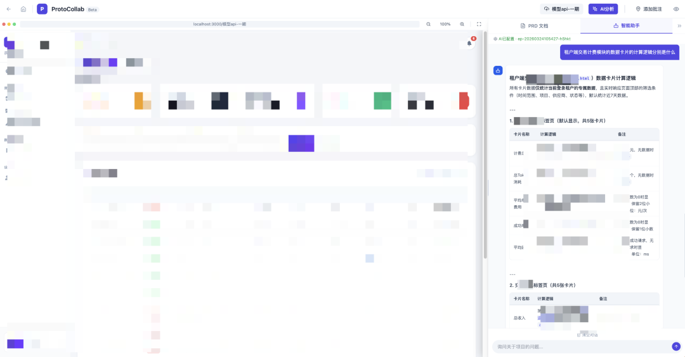

Readbear PM 本身也是用 Vibe Coding 方式构建的——这个平台的前端就是由 AI 生成的可交互原型演化而来。它不只是一个案例，也是"新流程"理念的产品化验证：当需求文档和原型在同一个工具里天然绑定，串行的"写文档 → 画原型 → 转代码"流程自然就变成了并行的"边做原型边补文档"。

工具的形态决定了协作的形态。

**Skill：把专业知识封装成可复用的 AI 能力模块**

新流程看起来很美，但有个现实问题：AI 生成的原型怎么自动符合团队的设计规范？原型里的产品逻辑怎么沉淀为可追溯的需求文档？原型代码怎么无缝对接到工程项目？不同角色之间的衔接靠什么？

答案是 Skill——可复用的 AI 能力模块。

每个 Skill 封装了特定领域的专业知识、规范和转换逻辑。你可以把 Skill 理解为"教会 AI 按你们团队的方式做事的配方"。

Skill 的应用场景远不止一两个环节，它几乎可以覆盖产品开发流水线上的每一个节点。

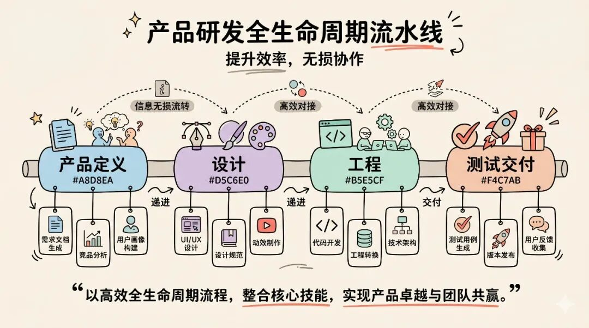

在产品定义环节，Skill 可以从可交互的 HTML 原型反向生成结构化需求文档——功能清单、交互逻辑、边界条件，让文档成为原型的配套"说明书"。可以自动做竞品分析：输入竞品 URL，提取功能矩阵、定价模型、差异化点。可以把一句模糊的需求描述拆成符合团队标准的用户故事和验收标准。

在设计环节，Skill 可以封装品牌色、字体、间距、组件库、交互规范，AI 生成原型时自动遵循，设计师不再需要逐像素校对一致性。可以自动检查原型的对比度、标签、键盘导航是否符合无障碍标准。可以把一个 Web 原型自动适配为移动端、平板端的布局方案。

在工程环节，Skill 可以将 HTML 原型转换为符合团队技术栈的前端工程代码，工程师从"在已经能跑的代码上接入后端"开始，而不是从零还原设计稿。可以从原型的数据结构和交互逻辑中提取前后端接口契约。可以自动扫描原型代码中的常见安全风险。

在测试与交付环节，Skill 可以从原型的交互逻辑和需求文档中自动生成测试用例矩阵，可以根据产品需求自动生成数据埋点方案，可以根据团队的发布规范自动生成上线前检查清单。

这些只是举例。每个团队都可以根据自己的工作方式和痛点，沉淀出自己的 Skill 库。

Skill 的核心价值不是单环节提效，而是消除环节之间的"翻译成本"。传统流程里，产品经理 的 PRD 要被设计师"翻译"成设计稿，设计稿要被工程师"翻译"成代码，每次翻译都会丢失信息。Skill 驱动的流水线里，每个环节的输出可以直接成为下一个环节的输入，信息零损耗地向下游流动。

更重要的是，Skill 让专家的判断力变成了团队的基础设施。高级设计师定义一次设计规范 Skill，全团队所有原型自动遵循；资深工程师调通一次工程转换 Skill，所有 产品经理 出的原型都能标准化地导入工程项目。个人的专业能力通过 Skill 在整个团队中复用和放大。

**更大的图景：角色边界正在消失**

**能力交集越来越大**

产品经理 能用 vibe coding 出高保真设计，用 Cursor 验证技术可行性。设计师能用 vibe coding 出可运行代码，不再交付静态图。工程师能用 Claude Code 自动生成测试和文档，直接参与产品讨论。

以前三个角色的协作方式是"文档接力赛"：产品经理 写 PRD → 设计师出设计稿 → 工程师写代码 → QA 测试。每一棒交接都需要一份文档来传递信息，每一次交接都会丢失上下文。

现在，三个角色可以在同一个 AI 环境里共建原型。产品经理 在 vibe coding 里出原型，加载设计规范 Skill 确保品牌一致性；设计师在同一个环境里精修交互细节；工程师用工程转换 Skill 直接将原型导入自己的代码库。中间可以随时调用竞品分析、无障碍审查、API 契约生成等各种 Skill 来补充不同维度的专业判断。

不需要三份文档来做三次翻译。

**从串行传递到并行共建**

当 AI 工具和 Skill 让每个角色都能越过传统边界——产品经理 能出原型、设计师能出代码、工程师能参与设计讨论——协作从"你做完我再做"变成了"我们一起在同一个东西上工作"。

产品经理 等设计排期、设计等开发排期的日子正在过去。更常见的场景是：产品经理 出了一个可交互原型，设计师和工程师基于这个原型给反馈，产品经理 当场用 AI 迭代，30 分钟内完成以前需要三轮评审会才能对齐的事情。

**不是角色消亡，是角色重心的迁移**

我不会说"产品经理 已死""设计师要被替代"这种话。但每个角色的核心价值确实在迁移。

产品经理 的价值，从"写清楚需求"迁移到"判断什么值得做"和"定义什么是好的"。

设计师的价值，从"画像素级完美的界面"迁移到"定义设计规范、品牌方向、关键决策"——这些经验沉淀为 Skill，放大设计师的影响力。

工程师的价值，从"照着设计稿写代码"迁移到"架构决策、系统边界、质量把关"——同样，架构规范和工程标准沉淀为 Skill，让整个团队受益。

80% 的执行工作被 AI 接走了，留下来的 20% 反而是最值钱的部分。

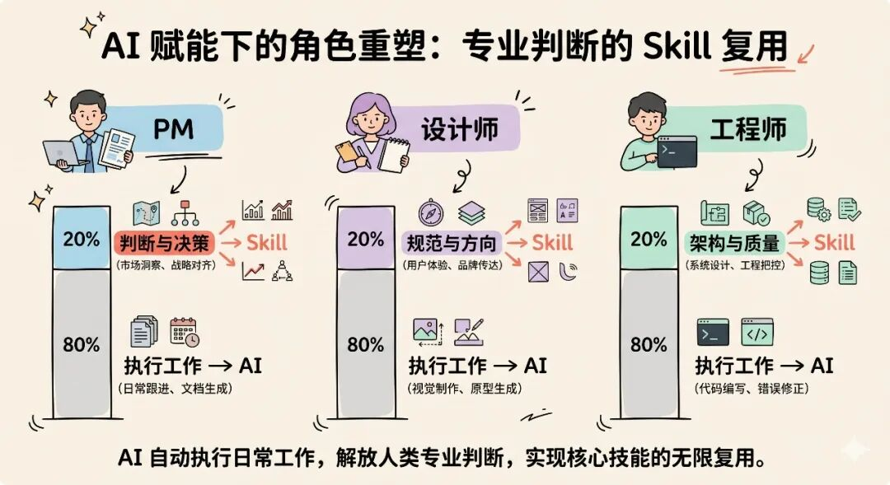

而 Skill 是这些专业判断力的载体——每个角色最有价值的经验和决策，都可以通过 Skill 在整个团队中复用。

**落地：新流水线长什么样**

**一个功能从想法到上线**

以 readbear产品经理 的实际开发流程为例。假设我们要给需求详情页增加一个原型版本对比功能，看看这个需求怎么走完新流水线。

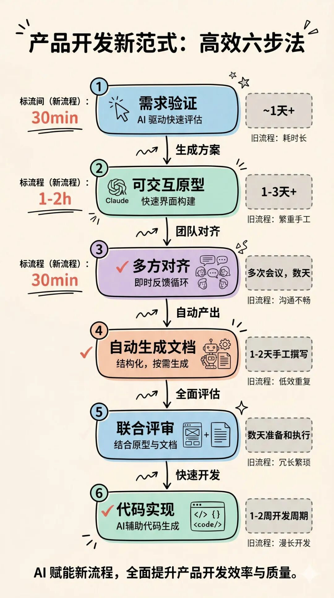

第一步，验证阶段，大概 30 分钟。在 Cursor 里让 AI 快速评估技术可行性——版本对比需要什么样的数据结构支持？现有的原型管理模块能否扩展？快速确认关键风险，而不是在 PRD 里写一堆"需要技术评估"的待定项。

第二步，原型阶段，大概 1-2 小时。用 vibe coding 或 Lovable 生成可交互原型。加载团队沉淀的设计规范 Skill，确保输出直接符合现有产品的视觉风格。产出的不是静态截图，而是能点击切换版本、能看到差异高亮的可交互页面。

第三步，对齐阶段，大概 30 分钟。原型直接上传到 readbear产品经理 对应需求的原型协作页面。设计师和工程师在原型上直接打批注——“版本切换建议用 Tab 而不是下拉，操作路径更短”“差异高亮的颜色和批注标记冲突了，建议换一个色系”——讨论发生在具体的 UI 元素上，不需要另开评审会。

第四步，文档阶段。从确认后的原型中自动提取结构化需求文档。产品经理 补充业务背景——为什么做版本对比：用户在原型迭代过程中经常搞混版本差异；决策理由——为什么选择并排而不是叠加：用户测试发现并排对比的认知负荷更低；以及原型中无法体现的业务规则——版本数量上限、存储策略、历史版本保留周期。同步调用 Skill 生成 API 契约、测试用例等下游配套产出。这些文档在 readbear产品经理 的需求详情里与原型并存，共同构成完整的交付物。

第五步，交付评审。评审者点击需求，一个界面里同时看到可交互原型和需求文档。体验完整交互流程的同时查看决策背景，批注里的讨论记录本身就是评审意见的归档——不需要额外写评审纪要。

第六步，工程落地。工程师基于已经确认的原型代码开始工程化，不再是"照着设计稿从零还原"，而是"在能跑的原型基础上接入后端、处理边界情况、优化性能"。

对比旧流程：省掉了至少两轮评审会、一次设计 - 工程交接，以及无数次"你说的那个交互是什么意思"的来回沟通。同时，需求文档依然完整保留——只是它从流程的起点变成了流程中段的配套产出，和原型在同一个系统里绑定共存。

**什么场景适合，什么场景不适合**

新流程不是万能的。

适合的场景：新功能探索，方向不确定的时候；交互密集的功能，文字描述不清楚的时候；小团队，沟通链条短的时候；需要快速验证假设的时候。

仍然需要传统流程的场景：涉及多系统、多团队协调的大型项目，需要正式的契约文档作为前置；合规要求必须有前置的书面需求记录；底层架构变更，需要详细的技术设计文档先行；团队规模大、信息不对称严重的情况。

不是非此即彼。核心判断标准很简单：如果"做一个原型验证"的成本低于"写一份文档描述"的成本，就应该先做原型。

**产品经理 需要补的不是技术能力**

很多人觉得新流程对 产品经理 的技术要求变高了。其实不是。产品经理 需要补的是两个思维转变。

第一，从"描述清楚交给别人做"到"自己先验证再决定值不值得做"。这需要三个能力升级：会用 AI 工具快速验证技术可行性——不需要会写代码，但要知道"这个想法技术上能不能做"；会用 AI 工具把脑子里的想法变成可交互的东西——让别人体验而不是阅读；会给 AI 描述清楚需求、会审阅 AI 的产出、会在 AI 给的多个方案中做判断。

第二，建立"Skill 意识"——把重复的专业判断沉淀为可复用的 AI 能力模块。好的 产品经理 不只是自己用 AI 工具提效，还应该推动团队将各环节的专业知识 Skill 化。从设计规范、竞品分析框架、需求拆解模板，到工程转换规则、测试用例生成、发布检查清单——每一个被反复执行的专业判断，都值得考虑是否可以封装为 Skill。

Skill 的意义在于：个人的专业能力通过 Skill 变成团队的基础设施。一个人定义一次规范或流程，全团队在所有项目中自动受益。产品经理 的角色也因此多了一层——不只是定义产品做什么，还要推动团队沉淀"怎么做"的标准化能力。

**结尾：重塑的不是工具，是协作方式**

回到开头的问题。

Vibe Coding 从"程序员用自然语言写代码"这个起点出发，正在向上游蔓延——产品经理可以用自然语言出原型，设计师可以用自然语言做设计，工程师可以用自然语言接入后端。当每个角色都在用同一种方式工作时，角色之间的边界自然开始消融，串行的文档传递自然被并行的原型共建替代。

传统的 PRD 流程过时了，但产品思考没有过时。文档依然有价值，只是它的位置变了——从流程的入口变成了原型的配套。Skill 让各环节的衔接变得自动化，让专家的判断力可以被复用和放大。

这不是一次工具升级，是整个产品开发协作方式的范式转变。它不会淘汰 产品经理、设计师或工程师中的任何一个，但会重新定义每个角色最值钱的部分。

下次你准备花两周写一份 PRD 的时候，试试先花两小时做个可交互原型，再基于原型生成需求文档。

你可能会发现，团队对齐的速度比以前快了十倍——而那份文档反而写得更准确了，因为它描述的是一个已经被验证过的东西，而不是一个还在想象中的东西。
