> 📎 来源: [K姐研究社](https://mp.weixin.qq.com/s?__biz=MzkxNDczMjA4Ng==&mid=2247504338&idx=1&sn=10d86b9d7f16e255e346a7c9cd191711&chksm=c03b900d998489f3dc53781f5209b5b2fa92600013313bdccae5cb23384c3b3037b8f609d728&mpshare=1&scene=1&srcid=051388AJtUKZQnE5LNJVVIho&sharer_shareinfo=f45362a0b5c248f85d2a84481f8d3b5f&sharer_shareinfo_first=f45362a0b5c248f85d2a84481f8d3b5f) | 时间: 2026-05-13 01:59

---

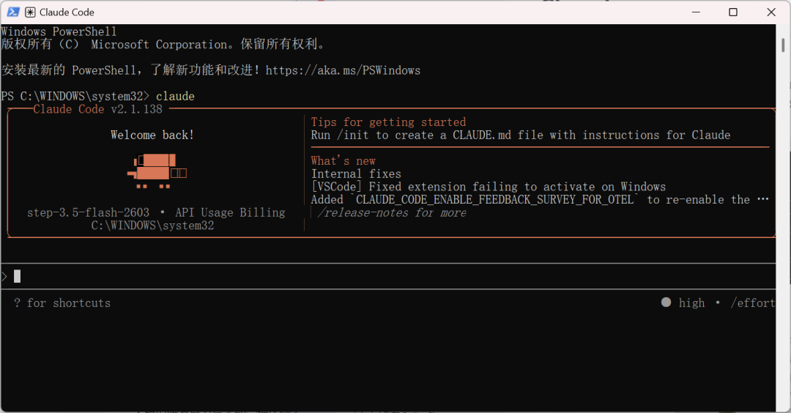

**大家好，这里是K姐。**

**一个帮助你把AI真正用起来的女子。**

不知道大家有没有这样的感觉，开会时间一长，脑子就容易不受控制的放空了。

一边想努力跟上发言人的思路，一边匆匆记笔记，会上的我频频点头，会后一回想细节全忘了...

虽说现在也有不少会议录音转文本工具，要么免费时长比较有限，要么长录音处理慢，最麻烦的是拿到逐字稿之后，我还要花时间自己整理会议重点、提炼待办事项。

这周末，我干脆自己 Vibe  Coding 了一个本地运行的会议助手。

这是我下载的一段多人对谈的博客录音，会议助手不仅帮我梳理出逐字稿，还用 AI 分析出了会议要点，分别提炼出了 4 位发言人的观点以及下一步的建议，全程不到一分钟！

我自己用来梳理会议内容，听讲座、博客、分析长视频，效果还是挺满意的，整个开发过程也非常简单，大概可以分为 4 步： 

1. 梳理需求
2. 选择 Vibe Coding 工具
3. 把想法转成提示词，交给 AI 写代码
4. 让 AI 修 bug，完善功能

这篇文章，我会把整个应用的搭建思路、工具配置，给 AI 的 prompt，毫无保留地分享给大家。如果你也想彻底告别那些昂贵的订阅制软件，哪怕完全没写过代码，也可以按照这个流程自己开发应用。

**0 基础开发本地会议助手**

我对会议助手的能力需求是这样的：

1. 我直接上传会议录音，ASR 模型会将语音转为文本，并且要区分发言人。
2. 拿到文稿后，用 LLM 大模型分析重点，整理核心内容。

- **选择工具**

**Vibe Coding 开发应用，选对工具就成功了 80%。我用的是 Claude Code 搭配阶跃星辰的 Step Plan。**

Claude Code 负责敲代码、改报错、调试接口；Step Plan 提供模型能力，重点是 Step Plan 的模型能力比较全，既有适合做内容分析的 step-3.5-flash、step-3.5-flash-2603，也有专门做语音识别的 stepaudio-2.5-asr。正好能满足我的开发需求。

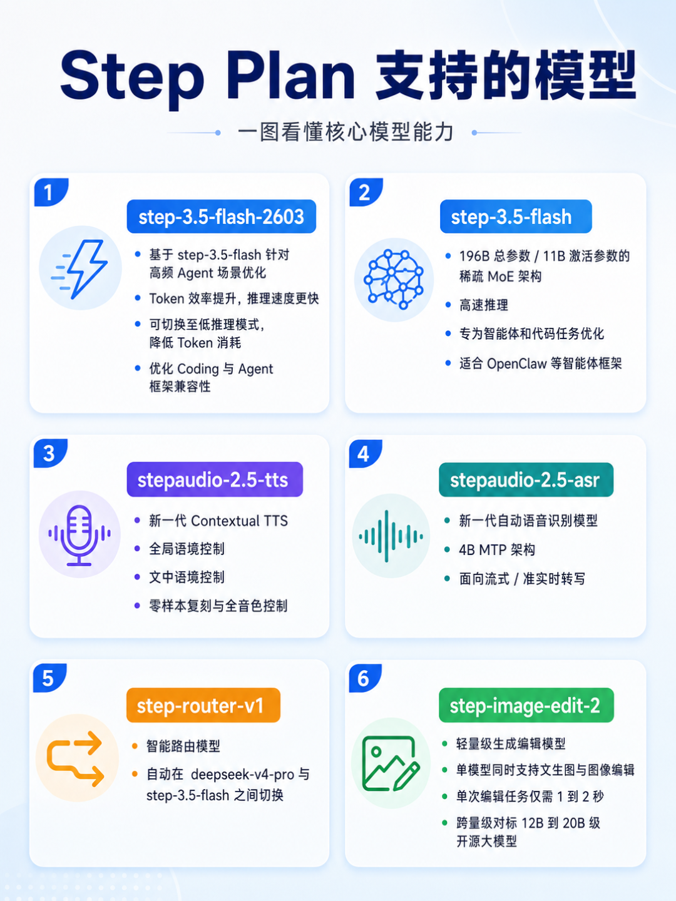

Step Plan 用量还是按 Prompt 次数计，5 小时限额 100 次 prompt，每周 400 次，性价比非常不错的~

看看整体的花费，我花了半天时间疯狂调试，把整个应用开发完，连每周额度的 25% 都没用到。

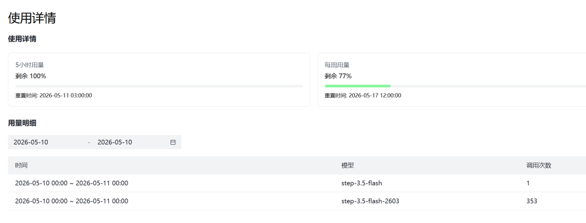

我测试了几段语音，40 分钟左右的音频，API 消耗才 0.135 元，相当于后续的使用成本几乎为 0~

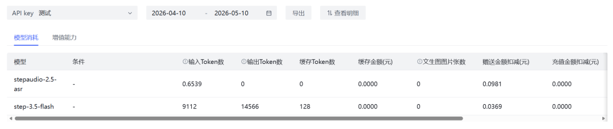

- **Vibe Coding 过程**

选好工具，我们把提示词发给 Claude Code 开始生成代码。

提示词：我要开发一个本地运行的会议录音转文本和会议分析 MVP 应用，请你直接帮我从零搭建项目并写代码。

这个应用安装或运行在用户本地电脑上，用户可以在本地打开使用。音频文件、会议记录、转写结果、分析结果都优先保存在本机。语音识别和会议分析能力通过外部 API 调用完成。

应用目标是：用户上传一段会议录音，系统调用 ASR API 把录音转成文字，并尽量区分不同发言人。转写完成后，系统再调用 LLM API，对会议内容进行总结和分析，生成会议主题、核心结论、待办事项、风险点、争议点、每位发言人的主要观点和下一步建议。

技术栈使用 Next.js、TypeScript、Tailwind CSS。第一版先做成本地 Web App，运行在 localhost。数据存储使用 SQLite。音频文件保存在本地 uploads 目录。后续可以再封装成 Electron 或 Tauri 桌面应用。

请实现这些核心功能：用户进入首页后可以看到历史会议列表，可以创建新会议并上传音频文件。上传文件支持 mp3、wav、m4a、mp4。上传后后端保存音频文件到本地 uploads 目录，并创建一条会议记录，状态显示为处理中。

后端需要封装 ASR 调用模块，文件名可以叫 lib/asr.ts。ASR API 的供应商、API Key、Base URL、模型名都从 .env.local 读取，方便后续切换不同 ASR 服务。环境变量包括 ASR\_PROVIDER、ASR\_API\_KEY、ASR\_BASE\_URL、ASR\_MODEL。ASR 返回结果要统一转换成项目内部格式，每一段包含 speaker、startTime、endTime、text。如果 API 暂时无法返回 speaker，也要保留转写文本，并默认标记为 Speaker 1。

后端还需要封装 LLM 调用模块，文件名可以叫 lib/llm.ts。LLM API 的供应商、API Key、Base URL、模型名都从 .env.local 读取，方便后续切换不同大模型。环境变量包括 LLM\_PROVIDER、LLM\_API\_KEY、LLM\_BASE\_URL、LLM\_MODEL。LLM 接收完整 transcript 后，需要输出稳定 JSON，包含 meetingTitle、summary、keyDecisions、actionItems、risks、disagreements、speakerInsights、nextSteps。actionItems 里需要包含任务内容、负责人、截止时间、优先级。speakerInsights 需要按发言人总结他的主要观点、关注点和态度。

前端需要三个主要页面：首页会议列表、上传会议页面、会议详情页面。会议详情页要分成转写全文和智能分析两个区域。转写全文按时间顺序展示，显示发言人、时间戳和文本内容。发言人名称要支持手动编辑，比如把 Speaker 1 改成张三，把 Speaker 2 改成李四。智能分析区域展示会议总结、核心结论、待办事项、风险点、争议点、发言人观点和下一步建议。

请注意本地应用体验。上传后要显示处理中状态，ASR 失败要显示明确错误，LLM 分析失败也要保留已经完成的转写结果。不要因为分析失败导致整条会议记录丢失。页面风格要简洁清爽，适合工作工具，重点信息一眼能看懂。

请生成完整项目结构，包括 package.json、SQLite 初始化逻辑、环境变量示例文件、API 路由、ASR 封装、LLM 封装、本地文件保存模块、数据库读写模块、类型定义、README 启动说明。

直接创建一个能本地运行的完整 MVP 项目。完成后请检查 TypeScript 类型错误、路由错误、环境变量读取错误、文件上传逻辑和 SQLite 存储逻辑。最后告诉我如何安装依赖、如何配置 .env.local、如何本地启动。

▲上下滑动查看全文

对于看不懂代码的小白来说，接下来我们要做的，就是在终端里一路敲回车，选择 Yes 让 Claude Code 自动建文件、写逻辑。

不到十分钟，应用的雏形就跑起来了。极简风的界面非常清爽，看着相当顺眼。

我兴冲冲地上传了一段录音，结果迎头就是一个报错。

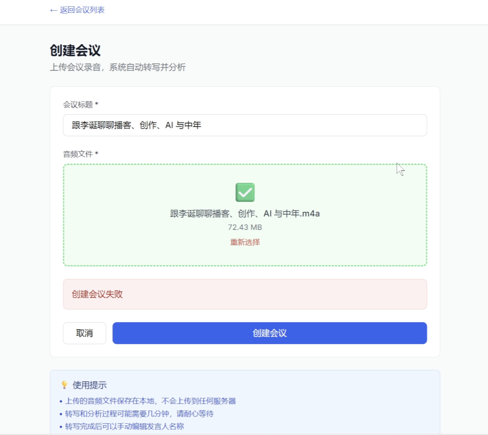

虽然咱看不懂代码，遇到报错也不用慌，我们直接把前端页面中的红色报错内容发给 Claude Code。

怎么创建会议会失败呢。

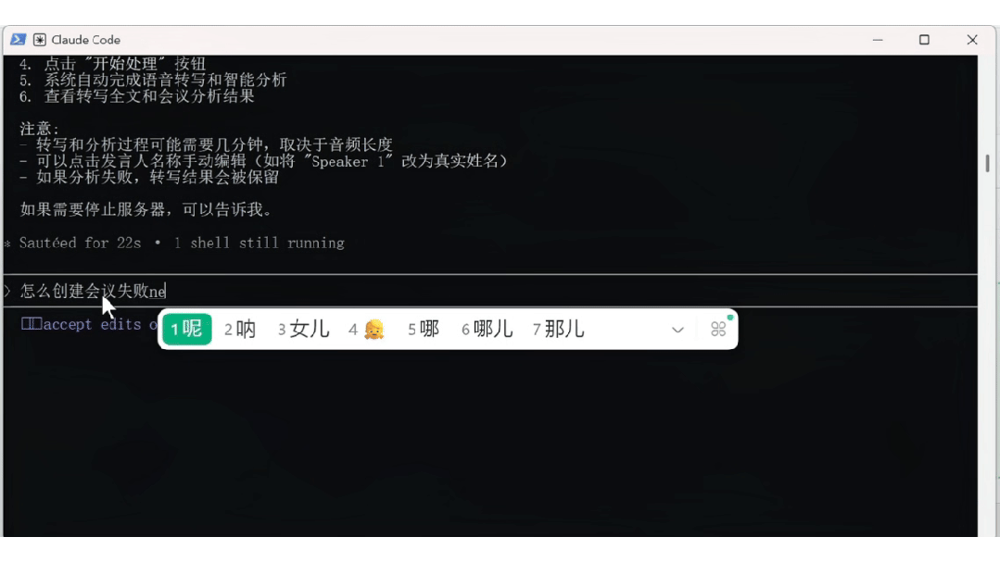

Claude Code 会自动排查问题，并且修复。

再次尝试，这次创建会议成功了，但是到处理音频这一步又卡住了。而且我发现一个尴尬的问题，我每次上传测试的录音记录都在，首页累计了一堆运行中的会议任务...

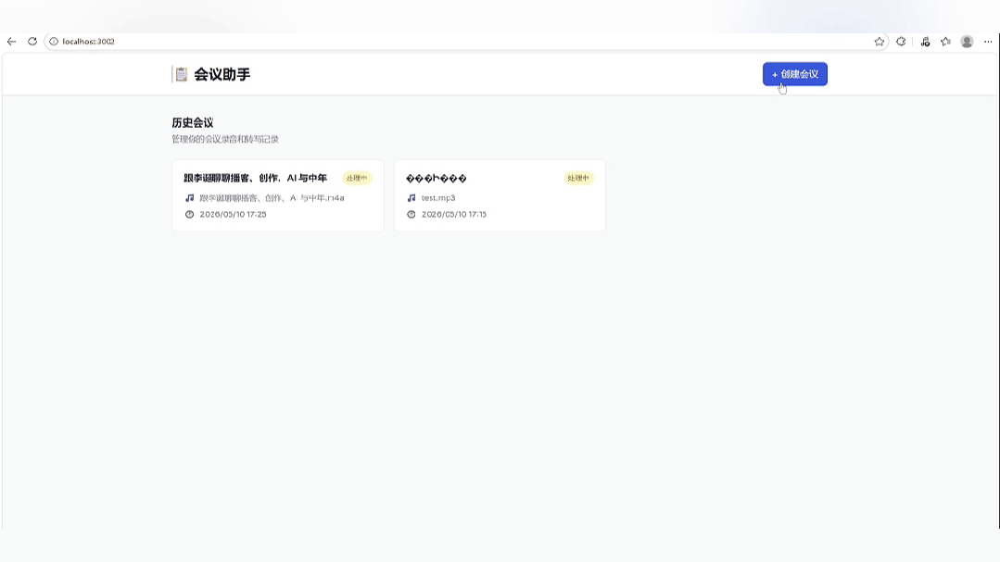

于是，我临时让 Claude Code 提了个新需求：

添加删除会议的功能。

不负众望，五分钟后我们再次点击会议查看详情，页面右上角就多了一个删除按钮。

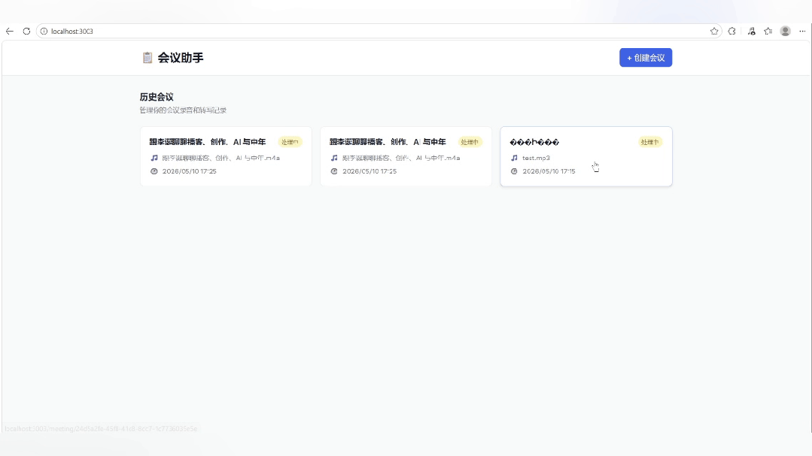

清理完垃圾数据，我们继续解决卡点问题，这次尝试录音转写文本成功了，但智能分析却提示：转写成功，但分析失败: Error: LLM 返回内容为空。

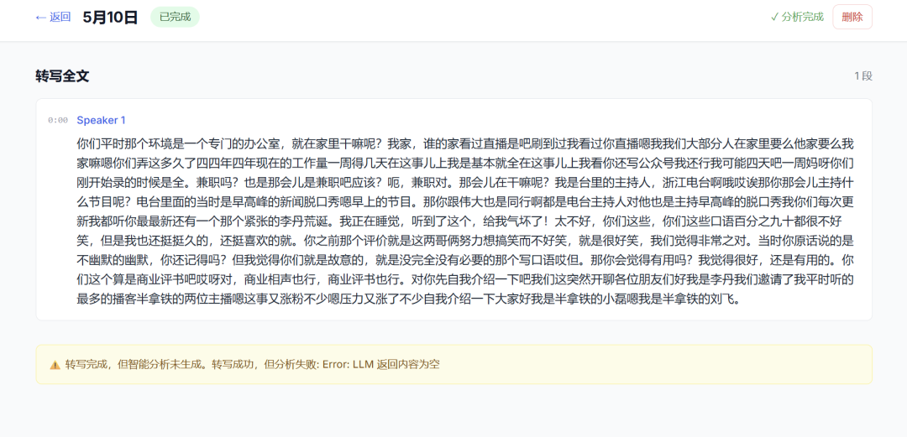

一开始我以为是哪个接口又出错了，排查了一圈才发现，大概率是因为音频太长，转写和分析耗时太久，单个请求很容易超时。

于是我让 Claude Code 查询一下对导入音频文件的时长、大小、转写字数限制要求。果然，就是卡在 API 请求时长上。

Claude Code 回复显示单次处理的音频最好在 10-30 分钟，转写文本对应在 5000-10000 字符。如果太长的话，需要提前切片处理一下。

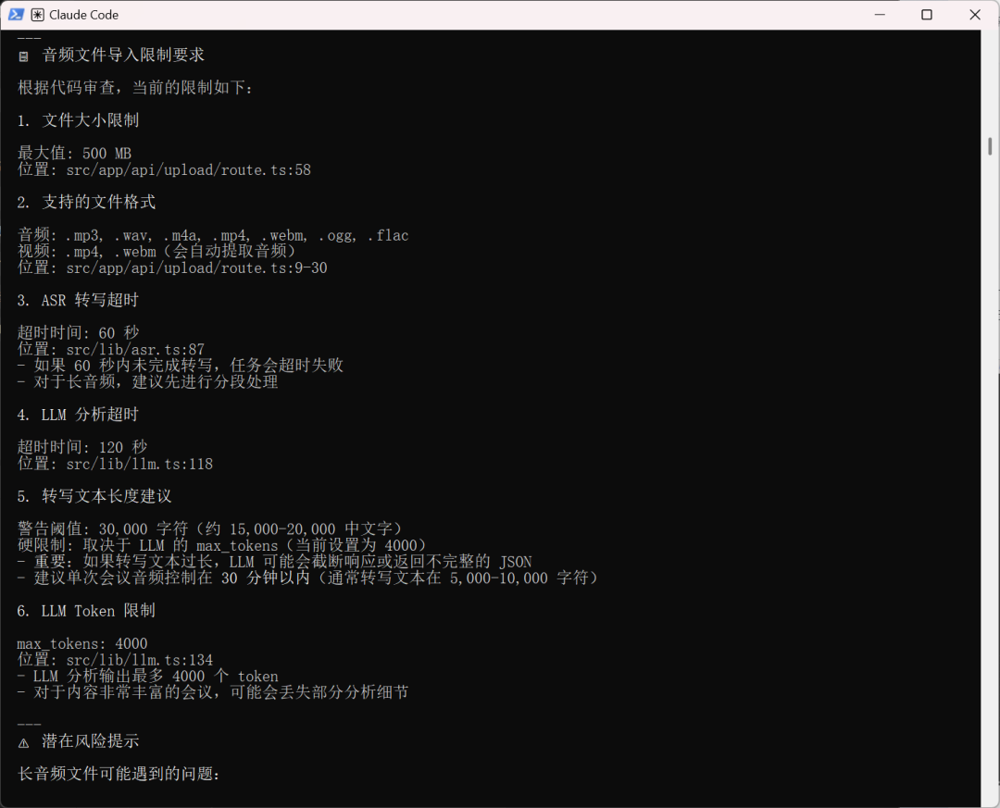

既然不是模型能力问题，那我们继续优化，毕竟日常会议时长普遍在 30 分钟以上，如果每次都要前置处理也太麻烦的了。

把超过10分钟的长音频处理改成异步任务 + 切片处理。上传接口只返回 jobId，不要让前端一直等请求完成。后端按 jobId 异步切片、转写、总结、合并结果。前端轮询 jobId 状态，展示上传、切片中、转写中、总结中、完成、失败。保留 maxDuration 配置，但不要依赖单个 API 请求长时间运行。

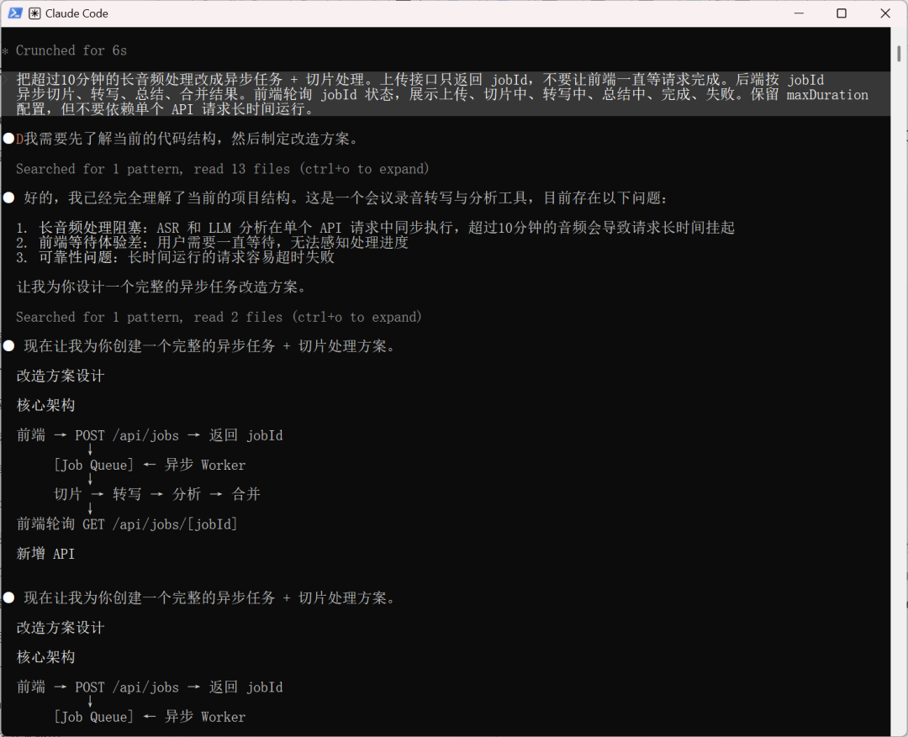

这次改动时间久了很多，咱们依旧是一路选 Yes。

这次我直接上传了 78 分钟的录音素材，会议助手一次就搞定了转写和分析，结果非常清晰。

而且我发现它不仅适合做会议记录，还能用来了解和学习各种音频内容，比如视频访谈、播客等等。

**一些分享**

从上传音频、调用 ASR、生成逐字稿，到再调用大模型做会议总结、提炼待办、分析发言人观点，放在以前，这至少是一个完整 SaaS 工具的核心功能。但现在，借助 Claude Code 和 Step Plan，一个普通用户在本地电脑上也能很快搭出自己的工作流。

更关键的是，它不是只能跑一个 Demo。我可以根据自己的使用习惯继续加功能，自由度无限高。

Step Plan 真正有价值的地方，在于降低了 Vibe Coding 的试错成本。

做这种本地会议助手，最费的其实是中间反复调试。接口报错要改，ASR 返回格式要适配，LLM 分析失败要排查，长音频还要继续优化。如果全部按普通 API 计费，用户很容易一边调试一边心疼成本，最后就不敢多试。

Step Plan 就是专门为 Coding 设计的月卡，让模型调用成本可预期，让我可以放心让 Claude Code 多跑几轮、多修几次、多试几个方案。

对普通人来说，没了成本焦虑，敢试、敢用才是最关键的。

作者：K姐

投稿邮箱：tougao@kseek.ai
