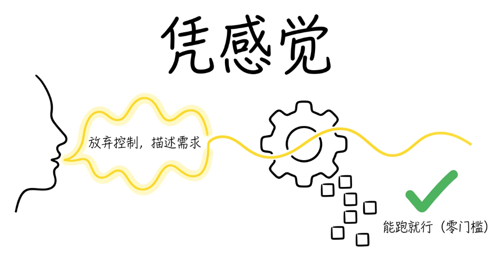
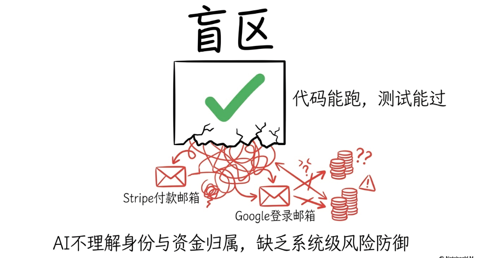
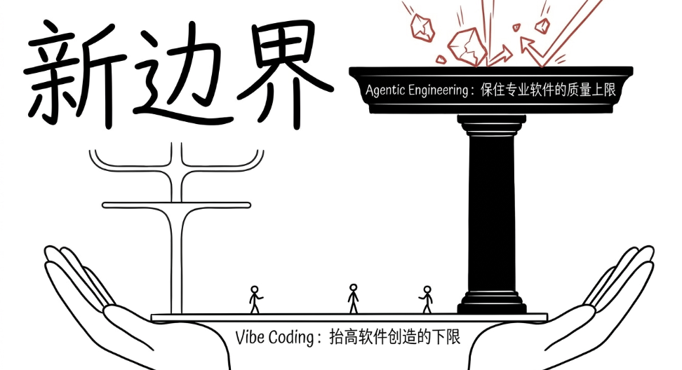
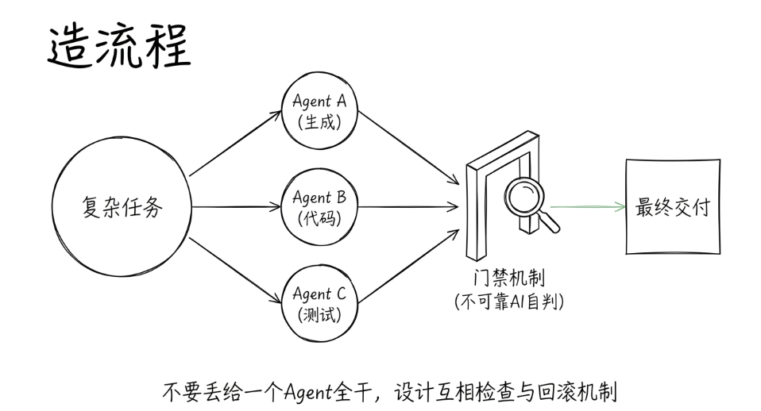
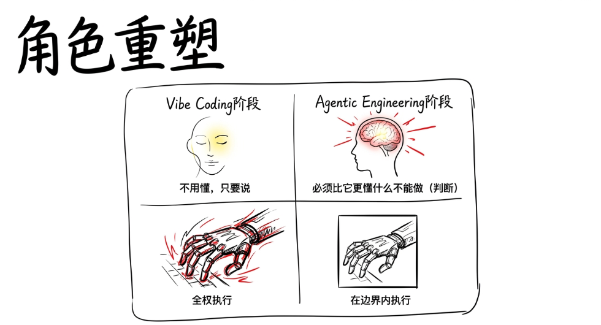
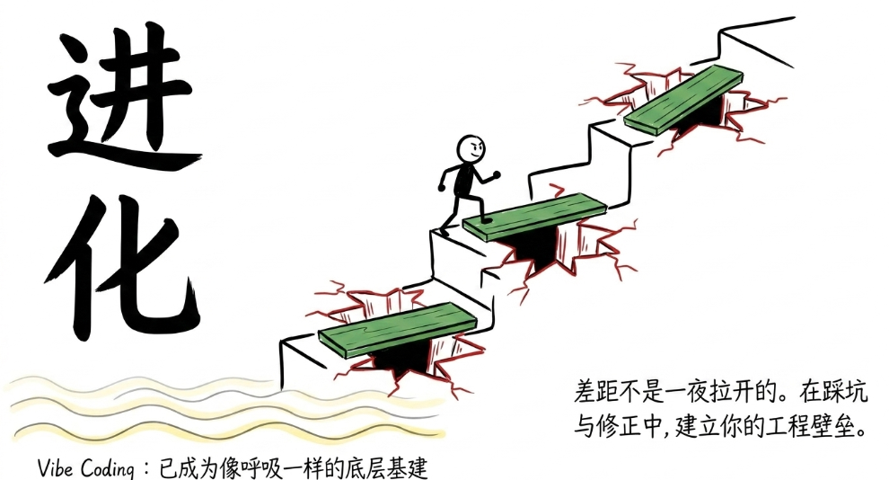

> 📎 来源: [金技局](https://mp.weixin.qq.com/s?__biz=MzE5ODU0NjU0Mg==&mid=2247484953&idx=1&sn=20c4348c6492e2beec791dd1e2a76800&chksm=97ca833d0e99007588a16748ccfbd728b86d4e6706ebfaf813c7c2dbf23c42fde0e15ea97091&mpshare=1&scene=1&srcid=0520gWPXC0CCCsFfAS3fXNEG&sharer_shareinfo=36df27ece93d78cb81ec8d04797aca65&sharer_shareinfo_first=36df27ece93d78cb81ec8d04797aca65) | 时间: 2026-05-20 11:55

---

Andrej Karpathy大概是AI圈最有"埋自己人"精神的人。

2025年2月，他在X上随手发了一条帖子，造了一个词叫Vibe Coding。意思是写代码不用管语法、不用管逻辑，跟AI说你想要什么，让它帮你搞定，你只管感受"氛围"就好。这个词瞬间引爆了整个开发者社区，一年之内全球92%的美国开发者开始在日常工作中使用这种方式。

然后近期，他在红杉资本的AI Ascent大会上说了一句让所有人愣住的话：Vibe Coding已经过时了。

发明这个词的人，亲手宣布它死了。

他给出的接替者叫Agentic Engineering。这不是一次简单的术语迭代，而是一个关于"人和AI在编程中到底各自该负责什么"的根本重新划分。

## Vibe Coding的问题出在哪里

先说清楚Vibe Coding为什么需要被"超越"。

Vibe Coding的核心理念是"放弃对代码的直接控制，顺着感觉让模型往前走"。你描述你想要什么，AI帮你生成代码，代码能跑就行，你不需要逐行理解它。对于快速做原型、做个人小工具、验证一个想法来说，这确实是革命性的。它把软件创造的门槛从"必须会写代码"降低到了"能说清楚你想要什么"。

但问题来了。当你用Vibe Coding做出来的东西需要上线、需要被真实用户使用、需要处理支付逻辑、需要保障数据安全的时候，"凭感觉"就不够了。

Karpathy在访谈里举了一个非常具体的例子。他在做一个叫MenuGen的应用时，让Agent实现购买功能的用户积分归属逻辑。Agent的做法是：用Stripe付款邮箱去匹配Google登录邮箱，以此来确定这笔钱归属于哪个用户。

代码能跑。测试能过。逻辑看起来合理。

但这是一个极其危险的设计。因为一个人完全可以用不同的邮箱登录和付款，用邮箱交叉关联资金会导致资金错配。正确做法是使用系统内部稳定的persistent user ID。

这就是Vibe Coding的致命软肋：AI生成的东西"看起来对"，能跑，能通过测试，但它不理解系统设计层面的风险。它没有对"身份"、"资金归属"、"攻击面"这些概念的真正理解。你如果凭感觉放行了，上线之后就是一个等着被人利用的漏洞。

Karpathy把当前的Agent比作"带刺的实体"和实习生。执行能力极强，但具有随机性和不稳定性，会在人类觉得显而易见的地方犯下危险的低级错误。面对这样的"队友"，你不能靠Vibe。

## Agentic Engineering到底要求什么

那Agentic Engineering和Vibe Coding的本质区别是什么？

Karpathy的原话是：Vibe Coding抬高了所有人做软件的下限，Agentic Engineering保住了专业软件的质量上限。前者让不会写代码的人也能做东西，后者确保那些做出来的东西不会在生产环境里出事。

具体来说，Agentic Engineering要求你做三件Vibe Coding不要求的事。

第一件是你必须负责Spec。Spec就是规格说明，就是你告诉Agent"哪些事绝对不能做"的约束条件。比如"所有资金必须绑定内部ID而非外部邮箱"，比如"支付逻辑不允许依赖第三方平台的任何标识符"。这些约束不是Agent能自己想出来的，因为它不理解风险，它只理解"怎么跑通"。你不写Spec，Agent就会用"能跑通"的方式去实现，而"能跑通"和"安全正确"之间的距离可能是灾难性的。

第二件是你必须设计Agent之间的协作流程。不是把一个大任务丢给一个Agent让它全干了，而是把它拆成多个步骤，让不同的Agent各自生成方案、写代码、跑测试、互相检查。系统要有边界、有验证、有回滚机制。这跟局长之前文章里写的"Harness Engineering"的思路完全一致：门禁不能靠AI自己说了算，分阶段流程让每一步都有检查点。

第三件是你必须保持对代码的"品味"判断。Karpathy说Agent写出的代码经常让他"心脏病发作"。代码能跑，但极其臃肿，充满复制粘贴，抽象别扭，结构脆弱。当他要求Agent做"极简抽象"的时候，就像拔牙一样困难。因为代码的审美和极简，不在模型当前被强化学习训练的目标范围内。目前品味、判断和审美仍然必须由人来把关。

总结一下这三件事：定义约束、设计流程、把控品味。它们的共同点是什么？都是"不能外包给AI"的判断力工作。

## 这对普通人意味着什么

你可能会想，我又不是专业开发者，Agentic Engineering跟我有什么关系？

关系很大。因为这个范式转变背后的逻辑是通用的：AI越来越强之后，人的价值不在于"能做什么"，而在于"能判断什么"。

Vibe Coding阶段的隐含假设是"AI帮你做，你不用懂"。Agentic Engineering阶段的核心要求是"AI帮你做，但你必须比它更懂什么不能做"。

这跟局长前几篇文章里的观察完全对得上。局长之前说过，做Skill的harness工程时发现最重要的设计原则是"反模式先行"和"门禁不能靠AI自判"。Karpathy讲的Agentic Engineering本质上是同一套逻辑在编程领域的表达：不是你写不写代码的问题，而是你能不能在AI执行之前定义好"什么不能做"，在AI执行之后判断出"什么做歪了"。

再往前推一步，这跟Notion产品负责人Max Schoening说的"品味"也是一回事。AI可以帮你生成一百个方案，但选哪个、什么不该做、质量线在哪里，这些判断力就是你的不可替代性。

Karpathy在访谈最后说了一句话让我印象很深：你可以外包你的思考，但不能外包你的理解。Agent可以记住所有API细节，但你必须理解内存效率。Agent可以写支付逻辑，但你必须理解资金归属。Agent可以帮你生成大量代码，但你必须判断结构是否脆弱。

细节可以外包，理解不能外包。这大概是2026年最重要的一句职业建议。

## 最后说两句

Karpathy亲手杀死Vibe Coding这件事，本身就很有意思。一个人能对自己创造的概念保持这种诚实和清醒，说明他真的在持续观察和思考，而不是在守护自己的"品牌"。

更有意思的是时间线。从Vibe Coding到Agentic Engineering，只过了一年。一年前"凭感觉写代码"还是最前沿的姿势，一年后它就变成了入门级的低阶玩法。这个速度本身就说明了AI领域的演进有多快。

不过我不觉得Vibe Coding真的"死了"。它只是变成了一个底层能力，像呼吸一样融入了日常。你当然可以继续用自然语言描述需求让AI生成代码，但这已经不是一个值得拿出来说的能力了。就像"会打字"曾经也是一项技能，但今天没有人把它写在简历上。

真正值得你关注和投入的，是那些AI目前还做不好的事情：定义约束、设计规格、把控品味、在模型生成的大量输出中识别出那些"能跑但有毒"的东西。

这些能力没有捷径。它们只能在一次又一次的"踩坑然后修正"中长出来。

但好消息是，只要你在做，每踩一次坑就离Agentic Engineer近了一步。而大多数人还停留在Vibe Coding的阶段，觉得AI帮自己生成了代码就算完事了。

差距就是这么拉开的。不是一夜之间，是每天一点点。

关联阅读：

[快不是壁垒，方向才是](https://mp.weixin.qq.com/s?__biz=MzE5ODU0NjU0Mg==&mid=2247484940&idx=1&sn=90310b3d218ee63012937001fbafc03e&scene=21#wechat_redirect)

[金融终端的AI时刻：Wind做对了什么，又漏掉了什么](https://mp.weixin.qq.com/s?__biz=MzE5ODU0NjU0Mg==&mid=2247484939&idx=1&sn=fafe103df46c469b69261b8ce0e8cb83&scene=21#wechat_redirect)

[OpenAI 和 Anthropic 同一天抢华尔街，金融 AI 大战的真正赛点是什么](https://mp.weixin.qq.com/s?__biz=MzE5ODU0NjU0Mg==&mid=2247484938&idx=1&sn=b60c136cbffa848292046509fbdfa99d&scene=21#wechat_redirect)

[你用AI做了50个项目，但高产不等于进化](https://mp.weixin.qq.com/s?__biz=MzE5ODU0NjU0Mg==&mid=2247484892&idx=1&sn=cebf9b80661f2884dc0e7ba9fa81bec3&scene=21#wechat_redirect)

[AI时代的团队，需要更多的"团长"](https://mp.weixin.qq.com/s?__biz=MzE5ODU0NjU0Mg==&mid=2247484879&idx=1&sn=4a642edf58d63302e2688fc14995d08d&scene=21#wechat_redirect)

[一个HTML文件，就是最小的AI产品](https://mp.weixin.qq.com/s?__biz=MzE5ODU0NjU0Mg==&mid=2247484866&idx=1&sn=a88a25e4be69272d31ff51a3e1e32abf&scene=21#wechat_redirect)

[守住不变、局部试错、建立"组织AI感"](https://mp.weixin.qq.com/s?__biz=MzE5ODU0NjU0Mg==&mid=2247484865&idx=1&sn=3bb4fd00b288f3b0c208346a74f5dbe1&scene=21#wechat_redirect)
