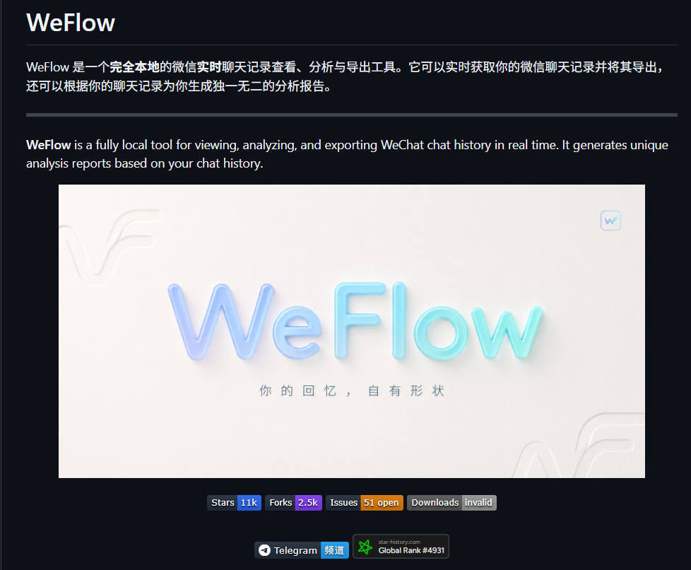

> 📎 来源: [思之行研习社](https://mp.weixin.qq.com/s?__biz=MzYzNTc1OTc0MQ==&mid=2247484274&idx=1&sn=019bb8591ba76cc9b79b4e5f551c0c57&chksm=f1a2de13afbe5c9854d4425382ef3ca2876514d405b5a5dcbada449f9be63b945dd09af1ba1c&mpshare=1&scene=1&srcid=0529r65iVfqZb3R4EWJ7SDAD&sharer_shareinfo=389e10a75b23823b3e771e8ebe75a4e7&sharer_shareinfo_first=389e10a75b23823b3e771e8ebe75a4e7) | 时间: 2026-05-29 12:11

---


> **文章概览**

> - **文章字数**：约 2200 字
> - **预计阅读时间**：约 5 分钟
> - **内容摘要**：本文介绍 WeFlow，一款完全在本地运行的微信聊天记录查看、分析与导出工具。全文围绕普通用户在聊天记录管理中的核心痛点，梳理 WeFlow 的安装步骤与核心能力，涵盖私聊分析、群聊分析、年度报告、多种格式导出等实际使用场景，并附各类常见问题解答。帮助读者判断这款工具是否适合自身需求。

## 你有没有为微信聊天记录发过愁？

微信里存着很多重要的东西——和家人的日常、和朋友的聊天、工作群的讨论、甚至是一些再也不会联系的人留下的最后一点消息。

但你可能也遇到过这种尴尬：

有一天想翻聊天记录，发现历史消息已经被吞了；想换个手机，聊天记录迁移失败；想做一次年度总结，却发现朋友圈那些花里胡哨的报告你一个都打不开。

试过网上那些"导出工具"——要么要付费，要么要绑账号，要么干脆就是病毒。

如果你也有过这种时候——**想留住的聊天记录，好像永远都不在自己手里**——那这篇文章就是写给你的。

## 问题的根源在哪？

普通用户面对聊天记录管理，无非三个槛：

**一是不知怎么搞。** 微信没有提供一键导出全部聊天记录的功能，唯一的备份方式是微信自带的迁移功能，但只能在手机之间迁移，无法打包保存成你想要的格式。

**二是不敢随便搞。** 聊天记录涉及大量隐私，很多人聊天记录导出工具都是需要联网上传的，数据送到别人的服务器上，谁放心？

**三是不想花冤枉钱。** 市面上的第三方工具要么要付费、要么要订阅，收费逻辑五花八门，关键是花完钱能不能用、安不安全，谁也说不准。

这三个槛卡住了绝大多数人。但最近 GitHub 上一个叫 **WeFlow** 的开源项目突然火了，上线不到 5 个月，Star 数突破 1 万。很多人试了之后说：终于有一个能用的了。

## 它是什么？

一句话说清楚：

> **WeFlow 是一个安装在你电脑上就能用的微信聊天记录管理工具，不需要联网、不需要上传、不需要付费。**



它直接读取你电脑上微信客户端本地的数据库，帮你把聊天记录展示出来，还能导出成多种格式永久保存，甚至能生成年度报告——这些全部在你的电脑上完成，不经过任何第三方服务器。

### 支持哪些电脑？

| 你的电脑 | 能不能用 | 安装包 |
| --- | --- | --- |
| **Windows** （Win10 及以上，64位） | ✅ 可用 | .exe 安装包 |
| **Mac** （M系列芯片） | ✅ 可用 | .dmg 安装包 |
| **Linux** （64位） | ✅ 可用 | .AppImage 或 .tar.gz |

**注意**：要求微信版本是 **4.0 及以上**。如果你的微信还是旧版本，需要先升级一下微信。

## 核心功能一览

### 💬 聊天查看

安装后打开，能直接看到你电脑上登录过的微信账号。选择之后，所有聊天记录就展示出来了——文字、图片、视频、表情包、文件，都能看。

不用等它生成什么中间文件，打开就能看，新消息也会实时刷新。它甚至支持**消息防撤回**——别人撤回的消息，你也能看到。

### 👤 私聊分析

和某个朋友聊了多久？谁发的消息更多？一般什么时候聊得最欢？选一个好友，工具自动帮你统计出来。

### 👥 群聊分析

群里谁是最活跃的人？谁只抢红包不说话？群消息的高峰时段在什么时候？这些都能分析出来。对于管理社群、了解群活跃情况来说，挺实用的。

### 📊 年度报告

这个是很多人最喜欢的功能。它能自动生成**按年的年度报告**（也支持跨年的长期报告），用图表展示你的消息量变化、活跃时段、聊天热词、互动热力图等等。

这个报告完全在你本地生成，不用担心数据泄露，也不会像有些第三方年度报告那样需要授权你的微信账号。

### 📤 聊天记录导出

支持导出为这些格式：

| 导出格式 | 适合做什么 |
| --- | --- |
| **HTML** | 浏览器直接打开查看，最推荐 |
| **JSON** | 数据存档，方便以后用其他工具处理 |
| **TXT** | 纯文本备份，简单直接 |
| **Excel** | 表格形式，适合整理归档 |
| **CSV** | 通用数据格式，各种软件都能打开 |
| **PGSQL** | 适合懂数据库的用户 |

### 📸 朋友圈管理

微信朋友圈里的图片、视频、实况照片也能解密查看。还能拦截朋友圈的删除和隐藏操作，以及突破时间访问限制——不过这个功能大家要自行判断使用场景。

### 📇 联系人导出

可以导出好友、群聊、公众号信息。还有一个"找回已删好友"的尝试功能，但作者也说了这个功能还不完善。

### 🔌 HTTP API（进阶功能）

如果你懂一点技术，还可以开启本地 API 服务（默认端口 5031），把聊天记录的能力通过接口暴露出来，方便对接其他自动化工具。当然，这个普通用户可以不关心。

## 怎么下载和安装？

### 第一步：下载（学长已经帮大家下载好，点击文末“阅读原文”就能得到安装包）

打开 WeFlow 官方发布页，找到最新的稳定版（写这篇文章时最新版是 **v4.5.1**），根据你的电脑系统下载对应版本：

- **Windows 用户**：下载 `WeFlow-4.5.1-x64-Setup.exe`
- **Mac 用户**：下载 `WeFlow-4.5.1-Setup.dmg`
- **Linux 用户**：下载 `WeFlow-4.5.1-Setup.AppImage`

如果觉得下载速度慢，可以借助国内的 GitHub 镜像站下载。

### 第二步：安装

Windows 直接双击 exe 安装。Mac 安装后如果提示"文件已损坏"，别紧张，打开终端执行以下命令：

```
xattr -dr com.apple.quarantine "/Applications/WeFlow.app"
```

执行后再重新打开就行。

### 第三步：打开使用

启动后它会自动识别你电脑上的微信，选择你想查看的账号就能开始用了。

## 用之前要知道的事

✅ **完全本地，不联网不上传**——隐私安全有保障

✅ **开源免费**——只要不搞商业闭源，零成本使用

✅ **开发活跃**——项目每天都有开发版更新，5个月更新到 4.5.1，作者团队很拼

⚠️ \*\*仅支持微信 4.0+\*\*——需要确保微信版本足够新

⚠️ **只读本机数据**——它只能读取你当前电脑上微信客户端已经同步过的本地数据，不是远程导手机记录。如果需要导出手机上的记录，得先在电脑上登录微信微信同步到本地

⚠️ **开发早期**——项目 2026 年 1 月才创建，个别功能（如找回已删好友）还在打磨中

## 同类工具对比

市面上其实还有几款类似的开源工具：

- **WeChatMsg**（LC044/WeChatMsg）：比 WeFlow 早，但架构相对老一些，需要 Python 环境，对普通用户不太友好
- **EchoTrace**（ycccccccy/echotrace）：功能相似，也是本地的聊天记录导出分析工具
- **MemoTrace**：打包好的工具，需要先装旧版微信 3.x 迁移数据

相比之下，WeFlow 最大的优势是**安装即用**——不需要配 Python 环境、不需要手动找数据库路径、不需要敲命令行。打开就能用，对非技术用户最友好。

## 写在最后

> 如果你一直想备份聊天记录但无从下手，或者做一份属于自己的年度聊天报告，WeFlow 是目前门槛最低、体验最好的选择。

有人可能会问：这工具安全吗？答案是：**它不需要任何联网权限**，网络请求全部在本地完成，你可以在安装后断网运行来验证。代码也是开源的，任何人都可以审查。

工具怎么用，全看使用者自己。WeFlow 给了大家管理自己数据的自由，这份自由值得珍惜。

## 参考资料

1. WeFlow GitHub 仓库 — https://github.com/hicccc77/WeFlow
2. WeFlow Releases（版本发布页） — https://github.com/hicccc77/WeFlow/releases
3. WeFlow 使用教程（什么值得买） — https://post.smzdm.com/p/az8w9v3o
4. 两款完全本地的聊天记录查看工具（SegmentFault） — https://segmentfault.com/a/1190000047577919
5. WeFlow 评测（软件个锤子网） — https://www.rjgcz.com/14757.html
