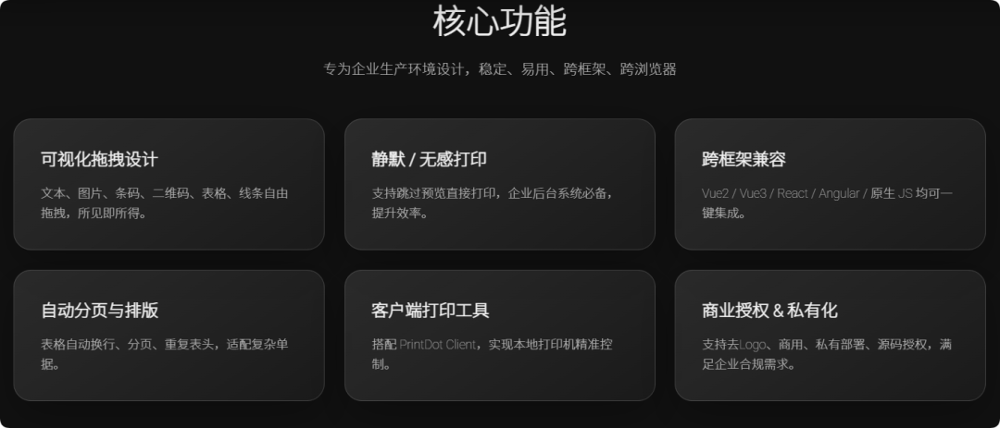
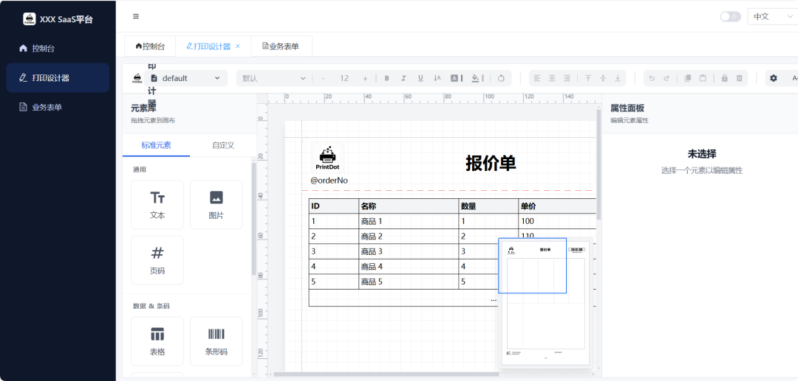
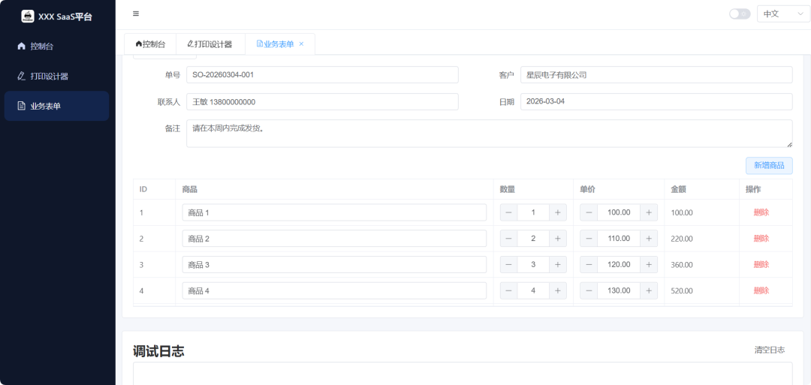
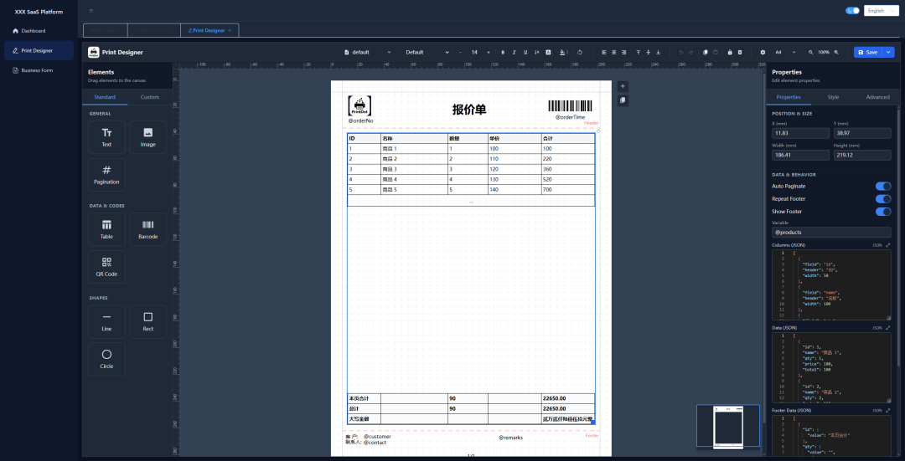
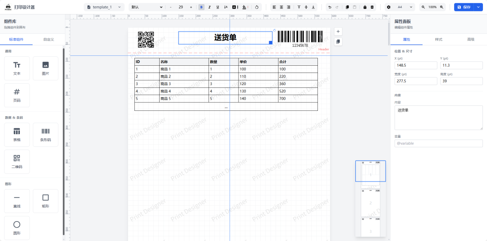
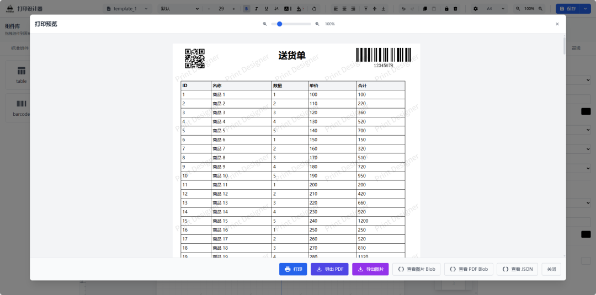
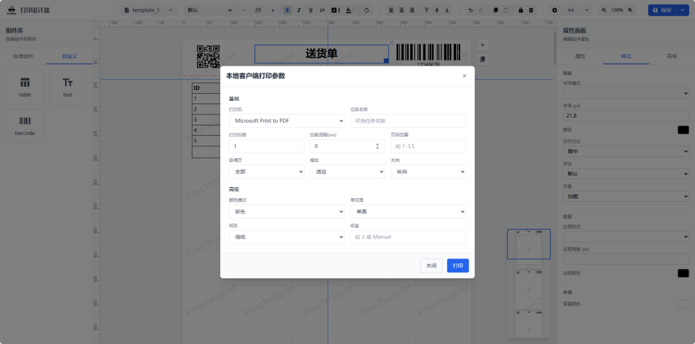
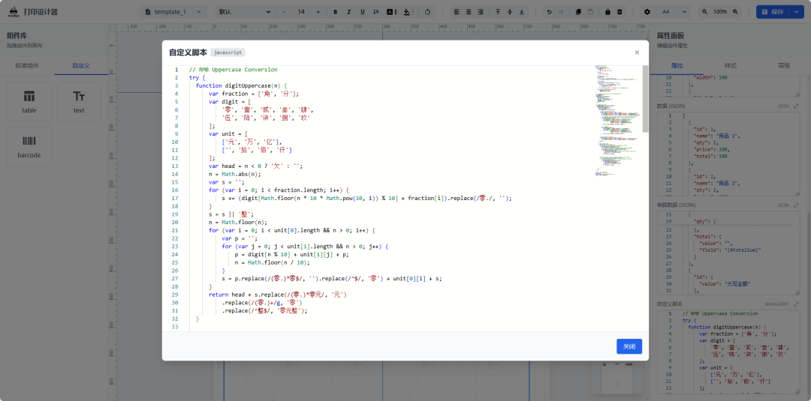
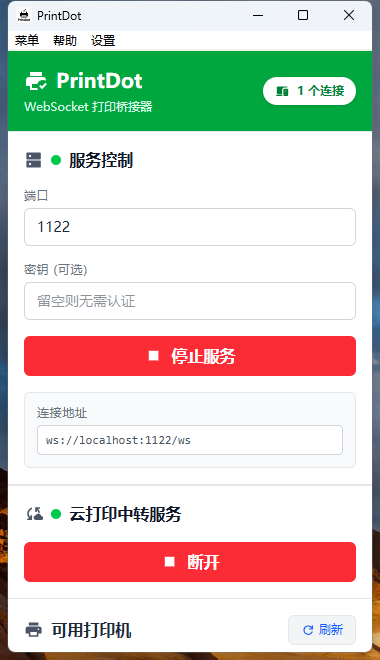
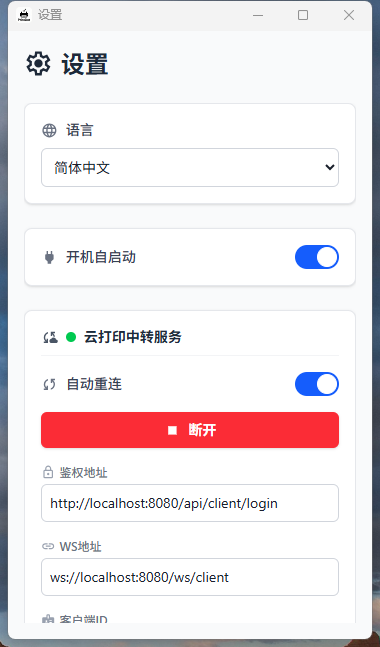

> 📎 来源: [程序员开源栈](https://mp.weixin.qq.com/s?__biz=Mzk3NTQ4MjAzNg==&mid=2247489532&idx=1&sn=4c821c5920fa1c3f0701d09aa761ac0e&chksm=c568cd0d7dd930580e9d0d7a1e6f7af2de7a6ceaa196d85d3b22873f1409615a4ded1cee8c2e&mpshare=1&scene=1&srcid=0421x79ZDrupffIviq1qfh4X&sharer_shareinfo=2834b8c5ce6be5bde24ccd15d01eff74&sharer_shareinfo_first=2834b8c5ce6be5bde24ccd15d01eff74) | 时间: 2026-04-21 11:54

---

# 一款功能强大的可视化打印设计器技术解析

企业级应用开发中，打印功能往往是一个令人头疼的环节。从简单的票据到复杂的报表，如何实现灵活、精准且高效的打印输出，一直是开发面临的挑战。

传统的打印方案往往需要编写大量复杂的CSS样式或后端代码，且难以做到"所见即所得"。今天推荐一款开源可视化打印设计器，它在解决上述痛点，为大家提供一套完整的打印解决方案。


## 项目介绍

一个面向业务表单、标签、票据、快递单等场景的开源打印设计器。它不仅仅是一个简单的打印插件，而是一个集成了设计、预览、打印和导出功能的完整生态系统。

该项目支持模板化与变量化操作，能够处理从简单的文本到复杂的条码、二维码及表格的打印需求。同时，它提供了静默打印与云打印能力，并兼容多种导出方式，极大地简化了业务系统中打印功能的开发流程。

## 项目功能

**可视化拖拽设计**：提供全功能的拖拽式设计器，支持文本、图片、表格、条码、二维码及各种形状组件的自由摆放。

**智能分页处理**：自动处理长表格的分页逻辑，支持表头和表尾的自动重复，无需开发者手写复杂的分页代码。

**多场景打印支持**：

- **浏览器打印**：支持原生的浏览器预览与打印。
- **导出功能**：支持生成 PDF、图片（支持拼接与分片）、HTML 以及 Blob 对象。
- **客户端打印**：支持静默打印（无弹窗直接打印）与云打印（远程任务下发）。

**企业级配置**：支持自定义纸张大小、API 数据对接、模板的导入导出，以及精细的打印参数控制（如打印机选择、份数、单双面、DPI等）。

**配套客户端**：配套的 

```
PrintDot Client
```

 桌面助手，用于设备发现、连接管理与任务转发，确保本地打印链路的稳定性。



## 项目特点

| 特点 | 描述 |
| --- | --- |
| **跨框架支持** | 基于 Web Components 构建，零依赖，可无缝适配 Vue、React、Angular 以及原生 HTML 等所有技术栈。 |
| **所见即所得** | 内置标尺、网格与辅助对齐功能，配合智能分页，确保设计效果与打印输出高度一致。 |
| **生态完善** | 提供了从设计器到打印客户端（PrintDot Client）的完整生态，覆盖了从设计到物理输出的全链路。 |
| **高度可定制** | 支持自定义元素扩展、主题配置以及品牌化设置，满足不同业务场景的个性化需求。 |
| **全平台兼容** | 配套客户端支持 Windows、macOS 和 Linux 平台，确保了跨平台的打印稳定性。 |

## 项目技术

**核心框架**：基于 Vue 3 构建，利用其 Composition API 提供了清晰的代码结构和高效的性能。

**语言支持**：采用 TypeScript 进行开发，提供了完整的类型声明，增强了代码的健壮性和开发体验。

**构建工具**：使用 Vite 作为构建工具，提供了极速的冷启动和热更新体验。

**UI 组件库**：集成了 Element Plus，提供了美观且易用的界面组件。

**组件化架构**：通过 Web Components 技术封装，实现了与框架的解耦，使其能够运行在任何支持 Web Components 的环境中。

**桌面端技术**：配套的 

```
PrintDot Client
```

 采用 Wails + Vue 技术栈开发，实现了轻量级的桌面应用运行。

## 在线演示

https://0ldfive.github.io/Vue-Print-Designer/

## 项目效果



















## 项目源码

项目是完全开源的，开可以根据需要下载源码进行二次开发或直接集成到自己的项目中。

GitHub：https://github.com/0ldFive/Vue-Print-Designer

**集成示例**

示例项目：https://github.com/0ldFive/vue-designer-sample

示例演示：https://0ldfive.github.io/vue-designer-sample/#/designer

**配套客户端**

PrintDot Client：https://github.com/0ldFive/PrintDot-Client

**快速集成（NPM 方式）**

对于大多数项目，可以通过 NPM 安装并使用：

```
npm i vue-print-designer# 或使用 pnpmpnpm add vue-print-designer# 或使用 yarnyarn add vue-print-designer
```

安装后，在入口文件中引入并使用自定义元素即可：

```
// main.tsimport 'vue-print-designer';import 'vue-print-designer/style.css';
```

```
<template>  <print-designer id="designer">print-designer>template
```

## 总结

一款功能强大且灵活的可视化打印设计器。它通过可视化的拖拽操作，将复杂的打印逻辑简化为直观的设计过程，极大地降低了开发门槛。

其基于 Web Components 的架构设计，使其具备了极强的通用性，能够适应各种技术栈的项目。无论是需要快速集成打印功能的初创团队，还是对打印有复杂定制需求的大型企业，这款开源项目都提供了一个值得考虑的优秀解决方案。

## 关键词

Vue Print Designer、#可视化打印、Web Components、#静默打印、#云打印、 #Vue3、#TypeScript、#Element Plus、#表单设计、#票据打印

作者：小码编匠

出处：gitee.com/smallcore/DotNetCore

声明：网络内容，仅供学习，尊重版权，侵权速删，歉意致谢！

**END**

往

期

精

彩

[免费可商用的开源CMS系统，SpringBoot2/3快速开发业务系统](https://mp.weixin.qq.com/s?__biz=Mzk3NTQ4MjAzNg==&mid=2247489514&idx=1&sn=bfee5256c156c4313ed16305d3f94776&scene=21#wechat_redirect)

[基于微服务架构的低代码工作流平台（Spring Boot + Vue3）](https://mp.weixin.qq.com/s?__biz=Mzk3NTQ4MjAzNg==&mid=2247489511&idx=1&sn=184182d9f1d72570ff2c29ac26c2b51d&scene=21#wechat_redirect)

[基于 Spring Boot + Echarts 的开源 MES 工业可视化平台](https://mp.weixin.qq.com/s?__biz=Mzk3NTQ4MjAzNg==&mid=2247489508&idx=1&sn=275c33f32738f6c02f1439e0a06240d6&scene=21#wechat_redirect)

[基于 Spring Boot 一套完整的、易于使用的权限管理系统（含桌面客户端）](https://mp.weixin.qq.com/s?__biz=Mzk3NTQ4MjAzNg==&mid=2247489505&idx=1&sn=032c5e6acec3af36e81165c39a64a461&scene=21#wechat_redirect)

[国内首发！国密级 SpringBoot 3 + Vue 3 全栈快速开发平台（开源免费商用）](https://mp.weixin.qq.com/s?__biz=Mzk3NTQ4MjAzNg==&mid=2247489502&idx=1&sn=965e2d628e1767442ef6b824c8247481&scene=21#wechat_redirect)

[开源 Spring Boot+ Mybatis Plus 的智慧云教育平台（支持多题型与在线考试）](https://mp.weixin.qq.com/s?__biz=Mzk3NTQ4MjAzNg==&mid=2247489499&idx=1&sn=53dfc91c8851f4c39fc0675012e791c2&scene=21#wechat_redirect)

[TMS智能物流平台：GPS实时调度+数据驱动配载+全链路追踪](https://mp.weixin.qq.com/s?__biz=Mzk3NTQ4MjAzNg==&mid=2247489496&idx=1&sn=4734bf50408c1e7cedbd2c2d131c07a3&scene=21#wechat_redirect)

[拒绝硬件绑架：这款 MIT 开源的边缘 AI，4GB 内存就能跑](https://mp.weixin.qq.com/s?__biz=Mzk3NTQ4MjAzNg==&mid=2247489489&idx=1&sn=600b66d666283d323b87f63f43b249f1&scene=21#wechat_redirect)

[纯国产开源！基于AI与低代码的BPM工作流与表单引擎平台](https://mp.weixin.qq.com/s?__biz=Mzk3NTQ4MjAzNg==&mid=2247489478&idx=1&sn=19615b1796ba63a8f4d051d37ba9e394&scene=21#wechat_redirect)

[一套代码多硬件部署：基于 MAX30102 的开源生命体征监测平台](https://mp.weixin.qq.com/s?__biz=Mzk3NTQ4MjAzNg==&mid=2247489475&idx=1&sn=a36534bfdc33c24949e98ed5e32c835b&scene=21#wechat_redirect)

[免费开源｜轻量级全栈开发框架：集成JWT安全认证+RBAC动态权限控制](https://mp.weixin.qq.com/s?__biz=Mzk3NTQ4MjAzNg==&mid=2247489472&idx=1&sn=668bfdb3288337699ea6feeafa494677&scene=21#wechat_redirect)

[一款国产开源免费、跨平台的数据库建模工具PDManer](https://mp.weixin.qq.com/s?__biz=Mzk3NTQ4MjAzNg==&mid=2247489469&idx=1&sn=da37527e75c89b33e84fd213b90e2448&scene=21#wechat_redirect)

[国产首发，Spring Cloud 微服务化 RBAC 权限管理平台](https://mp.weixin.qq.com/s?__biz=Mzk3NTQ4MjAzNg==&mid=2247489466&idx=1&sn=cfe61de260770071c116c0d21fc116f2&scene=21#wechat_redirect)

[Vue 3 + Three.js 3D 虚拟工厂解决方案](https://mp.weixin.qq.com/s?__biz=Mzk3NTQ4MjAzNg==&mid=2247489463&idx=1&sn=c000f490f7cb47f280c1fb9e76ee941b&scene=21#wechat_redirect)

[从数据采集到预防维护，Web SCADA 引领工业监控](https://mp.weixin.qq.com/s?__biz=Mzk3NTQ4MjAzNg==&mid=2247489460&idx=1&sn=74000d2e08f166aa67e718e20b9aac1e&scene=21#wechat_redirect)

[ECharts + DataV 一款功能强大、灵活易用的数据可视化工具](https://mp.weixin.qq.com/s?__biz=Mzk3NTQ4MjAzNg==&mid=2247489457&idx=1&sn=de4a386d3bb891515e9afdb37c8e8d56&scene=21#wechat_redirect)

[开源免费的智能制造系统，MES+WMS+ERP+QMS+IoTS五合一](https://mp.weixin.qq.com/s?__biz=Mzk3NTQ4MjAzNg==&mid=2247489454&idx=1&sn=6fda57d0a0910d7a390f3cbf92b67feb&scene=21#wechat_redirect)

[全自动立体仓库WMS：打通EBS/MES/WCS，集成自动化设备集群](https://mp.weixin.qq.com/s?__biz=Mzk3NTQ4MjAzNg==&mid=2247489431&idx=1&sn=d5455f12376c5498f4e9913fd7eff092&scene=21#wechat_redirect)

[用了10年的亚马逊ERP开源了、免费、可商用](https://mp.weixin.qq.com/s?__biz=Mzk3NTQ4MjAzNg==&mid=2247489428&idx=1&sn=f4fe066618d76df967be749539e106c4&scene=21#wechat_redirect)

[一站式开源监控平台，支持多组件实时告警与可视化运维](https://mp.weixin.qq.com/s?__biz=Mzk3NTQ4MjAzNg==&mid=2247489425&idx=1&sn=8f5cdb291c52d1f981056c4f3803a6c6&scene=21#wechat_redirect)

[企业级 AI 中台大模型+小模型，开箱即用](https://mp.weixin.qq.com/s?__biz=Mzk3NTQ4MjAzNg==&mid=2247489420&idx=1&sn=6ac189d04240e45f3da55885823cfc19&scene=21#wechat_redirect)

[不用金蝶了！这个开源系统把 ERP、CRM、HRM 全包了](https://mp.weixin.qq.com/s?__biz=Mzk3NTQ4MjAzNg==&mid=2247489256&idx=1&sn=54abe080c1fbdf0c90249ad2a3e82212&scene=21#wechat_redirect)

[开源电子合同：双模式引擎+多端支持，3分钟拖拽签发，私有化部署永久免费](https://mp.weixin.qq.com/s?__biz=Mzk3NTQ4MjAzNg==&mid=2247489402&idx=1&sn=890903c0c8cb6ed21d8fd80edff81e79&scene=21#wechat_redirect)

[这款免费开源 MES 太能打了，支持物联网+多租户](https://mp.weixin.qq.com/s?__biz=Mzk3NTQ4MjAzNg==&mid=2247489388&idx=1&sn=c9fe203a1b22e737477f6f1b1f468d3f&scene=21#wechat_redirect)

[一款开源的分布式大数据集成与治理平台](https://mp.weixin.qq.com/s?__biz=Mzk3NTQ4MjAzNg==&mid=2247489355&idx=1&sn=81cb1d1d6e4000e14dd6d05ffc65adef&scene=21#wechat_redirect)

[OpenClaw 让本地大模型秒级接入，小白也能用](https://mp.weixin.qq.com/s?__biz=Mzk3NTQ4MjAzNg==&mid=2247489342&idx=1&sn=3d4e7ec33e826363b432763424b22735&scene=21#wechat_redirect)

[更快更准！深度视觉智能图像标注工具 LabelmeAI](https://mp.weixin.qq.com/s?__biz=Mzk3NTQ4MjAzNg==&mid=2247489320&idx=1&sn=b891d6c643aeface3812f91c31ab4bc3&scene=21#wechat_redirect)

[开源 AI 训练观测平台：支持30+主流框架，云/自托管一键部署](https://mp.weixin.qq.com/s?__biz=Mzk3NTQ4MjAzNg==&mid=2247489315&idx=1&sn=e99e825d7855e4bc1693c86e36d1455f&scene=21#wechat_redirect)

[还在用老旧串口工具？这款开源助手支持智能高亮+数据图形化](https://mp.weixin.qq.com/s?__biz=Mzk3NTQ4MjAzNg==&mid=2247489314&idx=1&sn=36827beb7372d64925db43c07ce1042a&scene=21#wechat_redirect)

[还在手撸后台？MineAdmin 开源免费、轻量全新架构、可商用的企业级后台系统](https://mp.weixin.qq.com/s?__biz=Mzk3NTQ4MjAzNg==&mid=2247489321&idx=1&sn=740730b913bfa7bb85feae6e571fb9f8&scene=21#wechat_redirect)

[一款支持多协议的轻量级运维审计系统](https://mp.weixin.qq.com/s?__biz=Mzk3NTQ4MjAzNg==&mid=2247489311&idx=1&sn=58ecc596e54130283e8ab1e994f2d0a0&scene=21#wechat_redirect)

[开箱即用微服务、网关、认证与 IoT 融合的一站式低代码平台](https://mp.weixin.qq.com/s?__biz=Mzk3NTQ4MjAzNg==&mid=2247489308&idx=1&sn=c2d2f5b0d89662d350f92ab7a9497501&scene=21#wechat_redirect)

[一个轻量级、组件化、支持 MQTT/Modbus 的开源 IoT 平台](https://mp.weixin.qq.com/s?__biz=Mzk3NTQ4MjAzNg==&mid=2247489307&idx=1&sn=8495196321bf95c824137810fcc0be3d&scene=21#wechat_redirect)

[一个轻量级全栈文档管理系统 Vue 3 + Spring Boot 3.0 实现](https://mp.weixin.qq.com/s?__biz=Mzk3NTQ4MjAzNg==&mid=2247489302&idx=1&sn=fed060b36fddf734af75ca38fdc624db&scene=21#wechat_redirect)


**备注【开源】**

方便大家交流、资源共享和共同成长

纯技术交流群、需要的小伙伴请扫码

有收获？不妨分享让更多人受益

关注「程序员开源栈」，共同提升技术实力


**点分享**


**点收藏**


**点在看**


**点点赞**
