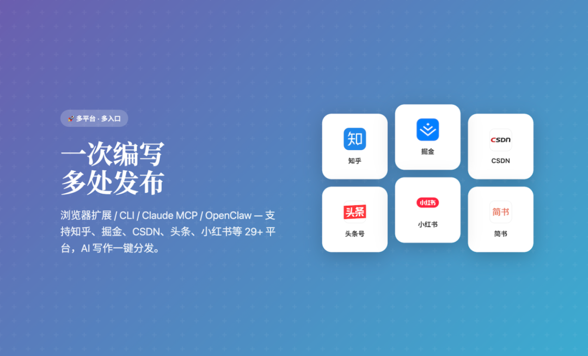
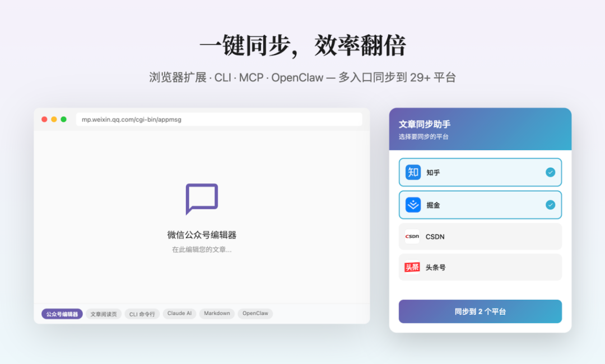
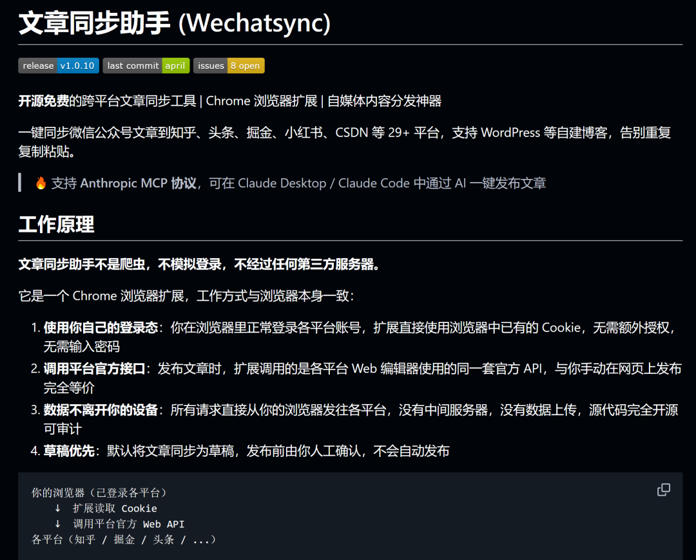
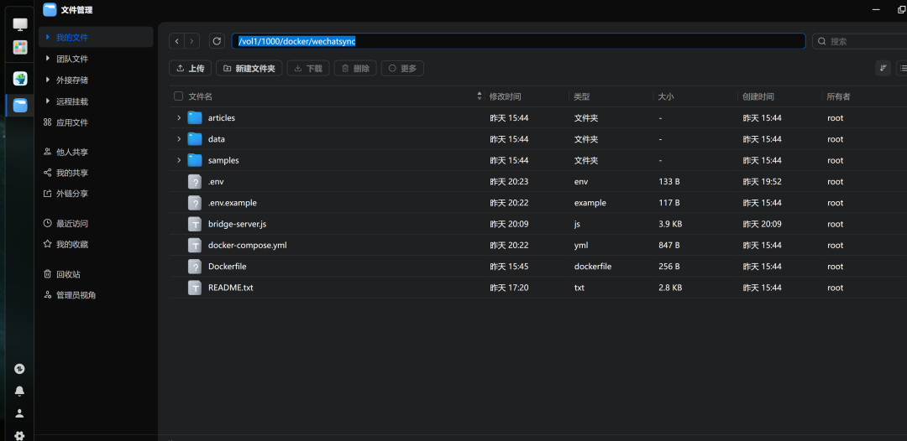
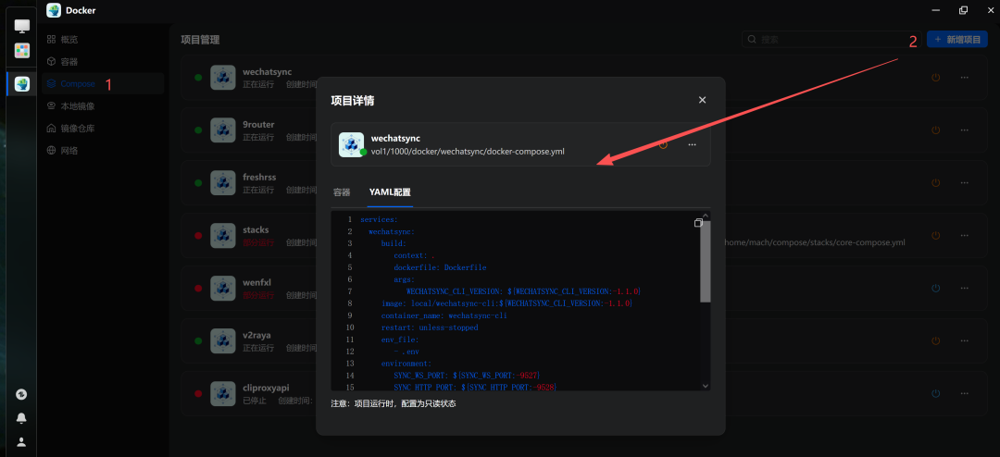
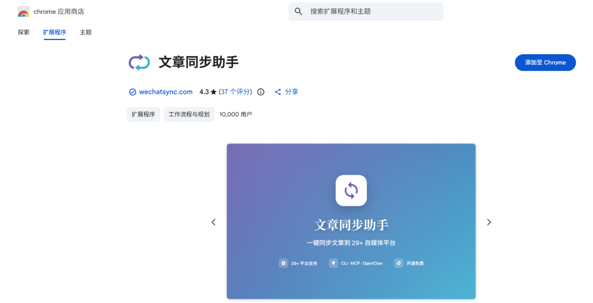
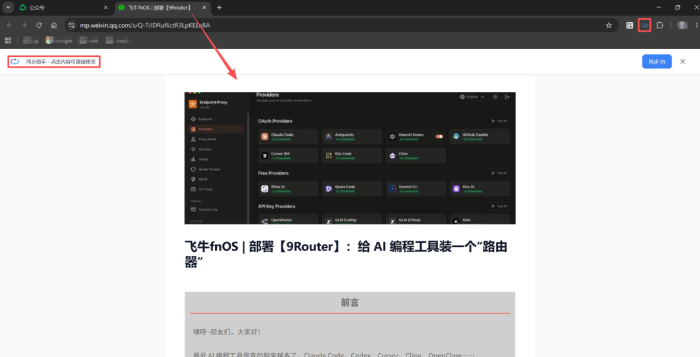
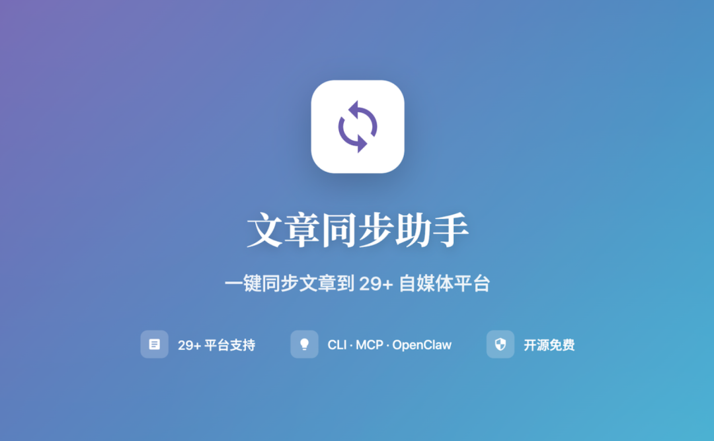
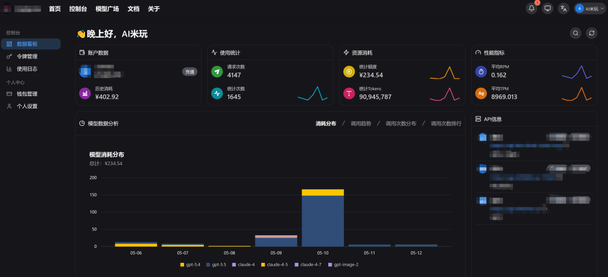

> 📎 来源: [AI米玩](https://mp.weixin.qq.com/s?__biz=Mzk0NDYyODU1Ng==&mid=2247491491&idx=1&sn=a657f2b5696972d6898205cdbfbab7a9&chksm=c2be95edf27ec4444fe7973ea562ef81a087ad887f913ea58899abc8a927c131b4a7ee40b273&mpshare=1&scene=1&srcid=052979xmkPTXJrb3HqqG6kTs&sharer_shareinfo=53291ed6677cd81d123194a3c584e69f&sharer_shareinfo_first=53291ed6677cd81d123194a3c584e69f) | 时间: 2026-05-29 12:42

---

# 前言

嘿呀~朋友们，大家好！

如果你平时也写公众号、博客、技术文章，大概率遇到过一个很烦的问题：

一篇文章写完之后，还要手动复制到知乎、掘金、CSDN、头条、WordPress、小红书……

**标题复制一遍，正文复制一遍，图片再修一遍，格式还可能乱一遍。**

文章还没发出去，人已经先萎了。

那么有没有一个工具，能把“多平台分发”这一步尽量自动化？

哟，还真有。

本期速推一个项目：**Wechatsync**。



它可以理解成一个开源免费的“文章同步助手”：写好一篇文章后，通过浏览器扩展 / CLI / MCP，把内容同步到多个内容平台，减少重复复制粘贴。

**推荐点**：开源免费、Chrome 扩展、本地浏览器登录态、多平台同步、默认草稿、还能接 AI 工作流。



### 关于

> Wechatsync 是一个开源免费的跨平台文章同步工具，支持将文章同步到微信公众号、知乎、掘金、CSDN、WordPress、Typecho、小红书、头条、X 等29+ 平台，一次发布，多平台同步。



简单说：

它不是传统意义上的“网页服务”，也不是那种让你把账号密码交给第三方平台的 SaaS。

它的核心逻辑是：

```
你的浏览器已经登录各个平台↓Wechatsync Chrome 扩展读取浏览器当前登录态↓CLI / MCP通过 WebSocket 把文章任务发给扩展↓扩展调用各平台网页端接口↓文章进入目标平台草稿箱
```

所以它更像是：**把你手动复制粘贴发文章这件事，变成一个半自动化流程。**

项目地址：

```
https://github.com/wechatsync/Wechatsync
```

# 安装使用

操作环境参考：

```
fnOS / Linux NASDockerDocker ComposeChrome / Edge 浏览器Wechatsync 浏览器扩展
```

本机部署路径：

```
/vol1/1000/docker/wechatsync
```

如果是小白读者，建议直接在 NAS 文件管理器中新建目录：

```
../docker/wechatsync
```

然后把本期资源包里的文件上传进去：

```
Dockerfiledocker-compose.yml.env.exampleREADME.txtsamples/demo.md
```



> 后台回复 **wechatsync** 获取本期资源包。资源包里只放可公开分享的模板文件，不包含我的真实 

> ```
> .env
> ```

> 、Token、内网 IP、账号 Cookie、文章数据或运行数据。

这次我用的是 **Wechatsync CLI Docker 化部署**。

注意一下：Wechatsync 官方主项目更偏“浏览器扩展 + CLI / MCP”，不是那种打开网页后台就能用的服务。

所以 Docker这边部署的是 CLI 环境，主要负责：

- 安装 

  ```
  @wechatsync/cli
  ```
- 暴露 WebSocket 桥接端口 

  ```
  9527
  ```
- 挂载 Markdown文章目录 -让浏览器扩展连接到 NAS 上的 CLI 容器

#### `.env`说明

复制模板：

```
cp .env.example .env
```

重点改这几个：

```
WECHATSYNC_CLI_VERSION=1.1.0SYNC_WS_PORT=9527SYNC_HTTP_PORT=9528WECHATSYNC_TOKEN=改成你自己的长随机Token
```

其中：

- ```
  SYNC_WS_PORT
  ```

  ：浏览器扩展连接服务端的 WebSocket 端口
- ```
  SYNC_HTTP_PORT
  ```

  ：服务端给 CLI 转发请求用的 HTTP API 端口
- ```
  WECHATSYNC_TOKEN
  ```

  ：扩展和服务端之间的校验 Token
- Token 要和浏览器扩展里设置的一致

#### docker-compose.yml

```
services:  wechatsync:    build:      context: .      dockerfile: Dockerfile      args:        WECHATSYNC_CLI_VERSION: ${WECHATSYNC_CLI_VERSION:-1.1.0}    image: local/wechatsync-cli:${WECHATSYNC_CLI_VERSION:-1.1.0}    container_name: wechatsync-cli    restart: unless-stopped    env_file:      - .env    environment:      SYNC_WS_PORT: ${SYNC_WS_PORT:-9527}      SYNC_HTTP_PORT: ${SYNC_HTTP_PORT:-9528}      WECHATSYNC_TOKEN: ${WECHATSYNC_TOKEN}    ports:      - "${SYNC_WS_PORT:-9527}:${SYNC_WS_PORT:-9527}"      - "${SYNC_HTTP_PORT:-9528}:${SYNC_HTTP_PORT:-9528}"    volumes:      - ./articles:/workspace/articles      - ./samples:/workspace/samples:ro      - ./data:/workspace/data      - ./bridge-server.js:/workspace/bridge-server.js:ro    working_dir: /workspace    command: ["node", "/workspace/bridge-server.js"]
```

这里我额外放了一个 

```
bridge-server.js
```

，用来把 Wechatsync 的桥接能力做成长期服务：

- ```
  9527
  ```

  ：给客户端浏览器插件连接
- ```
  9528
  ```

  ：给服务端 CLI 命令转发请求

这样插件可以长期连着 NAS，不用每次同步文章时才临时等待连接。

#### 启动

进入

```
docker-compose
```

，进行部署：



我这边自测结果：

```
local/wechatsync-cli:1.1.0 Builtwechatsync-cli Up0.0.0.0:9527-9528->9527-9528/tcp
```

日志里能看到：

```
[Bridge] WebSocket listening on 0.0.0.0:9527[Bridge] HTTP API listening on 0.0.0.0:9528[Bridge] Extension connected from 客户端IP
```

也可以用这个检查桥接状态：

```
curl http://NAS-IP:9528/status
```

正常会返回类似：

```
{"connected":true,"mode":"primary","wsPort":9527,"httpPort":9528}
```

注意：

```
9527
```

 是 WebSocket，不是网页后台；浏览器直接打开 

```
http://NAS-IP:9527
```

 失败是正常的。

#### 浏览器扩展设置

接下来在你的电脑浏览器里安装 Wechatsync 扩展，然后进入扩展设置：

```
服务器地址：ws://NAS-IP:9527Token：和 .env里的 WECHATSYNC_TOKEN 保持一致
```

目标平台也要先在浏览器里正常登录，比如知乎、掘金、CSDN、WordPress 等。

#### 怎么用

服务端和客户端都连好后，日常主要有两种用法。

**第一种：客户端浏览器直接点插件。**

你在客户端浏览器里登录目标平台，打开要同步的文章页面，然后点击 Wechatsync / 文章同步助手插件，选择目标平台，同步到草稿箱。



这个方式最直观，适合临时搬一篇网页文章。



**第二种：服务端 CLI 发起同步。**

这才是这次 Docker 部署最适合的玩法。

先把 Markdown 文件放进：

```
/vol1/1000/docker/wechatsync/articles
```

比如：

```
articles/demo.md
```

先检查插件是否连上：

```
curl http://NAS-IP:9528/status
```

再看支持的平台和登录状态：

```
cd /vol1/1000/docker/wechatsyncdocker compose run --rm --no-deps wechatsync wechatsync platformsdocker compose run --rm --no-deps wechatsync wechatsync platforms --auth
```

检查单个平台：

```
docker compose run --rm --no-deps wechatsync wechatsync auth zhihudocker compose run --rm --no-deps wechatsync wechatsync auth juejin
```

建议先 dry-run，不要一上来就真同步：

```
docker compose run --rm --no-deps wechatsync \  wechatsync sync samples/demo.md -p zhihu --dry-run
```

确认没问题后，再同步到目标平台草稿：

```
docker compose run --rm --no-deps wechatsync \  wechatsync sync articles/demo.md -p zhihu,juejin,csdn
```

如果想从客户端当前浏览器页面提取文章，也可以执行：

```
docker compose run --rm --no-deps wechatsync \  wechatsync extract -o articles/extracted.md
```

提取完成后，再把 

```
articles/extracted.md
```

 同步到目标平台。

常用平台 ID 可以参考：

```
zhihu 知乎juejin 掘金csdn CSDNtoutiao 头条weibo 微博wordpress WordPresstypecho Typechox X / Twitter
```

### 使用体验

这个项目最适合的不是“替你写文章”，而是负责文章完成后的分发环节。

我的理解是，它比较适合接到这种工作流里：

```
AI / Markdown 编辑器写文章↓服务端保存 md 文件↓Docker 里的 Wechatsync CLI 发起同步任务↓常驻 bridge 通过 9528/9527 转给客户端插件↓客户端浏览器扩展使用当前登录态↓各平台草稿箱人工检查↓确认发布
```

也就是说，这套部署里分工很明确：

- 服务端容器：负责命令、文章文件和桥接
- 客户端插件：负责浏览器登录态和实际同步
- 平台后台：负责最终草稿检查和发布

我实际更推荐把它当成“服务端内容分发入口”，而不是网页后台。平时文章放到 

```
articles/
```

，命令一跑，客户端插件就接力把文章送到各平台草稿箱。

比较舒服的点：

- 不用把账号密码交给第三方
- 不用每个平台重复复制粘贴
- 支持的平台很多
- 支持 CLI / MCP，后面可以接进 AI 工作流
- 默认草稿模式，安全感更高一点

但它也不是完全无脑的“一键全自动发布神器”。

因为不同平台的编辑器、图片、格式、审核规则都不一样，最终发布前还是建议进草稿箱检查一遍。

### 打个分

综合评价：👍👍👍👍

适合人群：自媒体作者 / 技术博主 / 独立开发者 / 内容分发党

部署难度：😄😄😄

折腾指数：🦞🦞🦞

个人感觉，它像是给内容创作者装了一个“分发传送带”。

文章写完之后，不用一个平台一个平台搬砖，先让它统一送进草稿箱，再由你人工把最后一道关。

#### 注意事项

1. 不建议直接公网裸奔

- ```
  9527
  ```

   是扩展和 CLI 通信的桥接端口
- Token可能明文传输
- 更建议放在可信内网、VPN 或 SSH 隧道里使用

2. ```
   .env
   ```

    不要公开 -里面有 

   ```
   WECHATSYNC_TOKEN
   ```

   -资源包只建议分享 

   ```
   .env.example
   ```

- 不要把真实 Token、NAS-IP、账号信息打包出去

3. 它依赖浏览器登录态 -目标平台要先在浏览器里登录

- Cookie过期后需要重新登录
- 平台接口变动时，也可能需要等项目适配

4. 建议先 dry-run -先确认标题、正文、平台参数

- 再同步到草稿箱
- 最终发布前人工检查格式和图片

5. 不要把它理解成纯 Docker Web 服务

- Docker里跑的是 CLI / bridge 环境
- ```
  9527
  ```

   是 WebSocket，不是网页后台
- ```
  9528
  ```

   是本地 CLI 转发用的 HTTP API
- 真正和各平台交互的是客户端浏览器扩展
- NAS 容器和本地浏览器之间要能互通 

  ```
  ws://NAS-IP:9527
  ```

6. 临时 run 容器可以清理

- 日常同步时会出现 

  ```
  wechatsync-wechatsync-run-xxxx
  ```

   这类临时容器
- 如果命令执行完没有自动删除，可以手动清理
- 常驻服务只保留 

  ```
  wechatsync-cli
  ```

   即可

# 结语

最后，本期 **Wechatsync**以项目官方为准，如有疑问可以访问项目地址：

```
https://github.com/wechatsync/Wechatsync
```



如果你平时也经常一篇文章多平台分发，Wechatsync还是挺值得试试的。

它不是替你按下发布键的“无人驾驶”，更像是一个靠谱的“搬运小车”：先把文章送到各个平台草稿箱，最后一脚刹车和油门，还是你自己掌握。

后台回复 **260514** 获取本期资源包。资源包里包含：

```
Dockerfiledocker-compose.yml.env.exampleREADME.txtsamples/demo.md
```

资源包不包含真实 

```
.env
```

、Token、内网 IP、账号 Cookie、平台账号信息、文章数据或运行数据。

顺手提一嘴：本文是项目部署在飞牛设备服务端，测试是在win设备客户端的浏览器，体验极差；（说白了，小编沙壁的这样去分布部署...）

换句话说，在win设备去部署本期项目，然后浏览器体验，还是不错的~

```
友情赞助：群友-微信@何**，提供本文相关的token消费；十分感谢~
```



**声明**：

部分图文数据源于网络，如有版权和其他问题，联系号主（AIE\_gzh）处理。

欢迎转载分享，但自行承担相应的法律责任和后果。

专注分享：不限小米、飞牛的资讯分享、扫盲闲聊及保姆教程。
