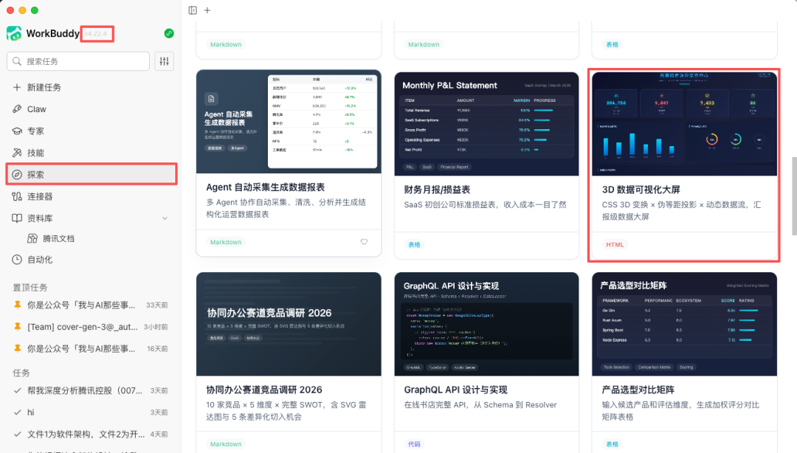
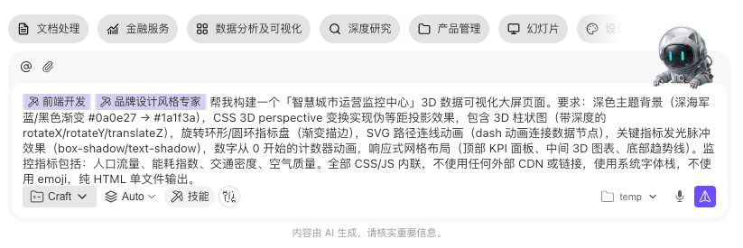
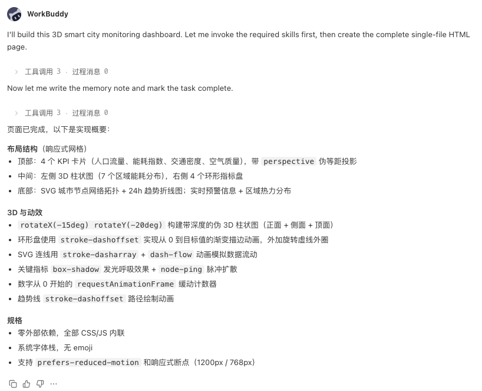
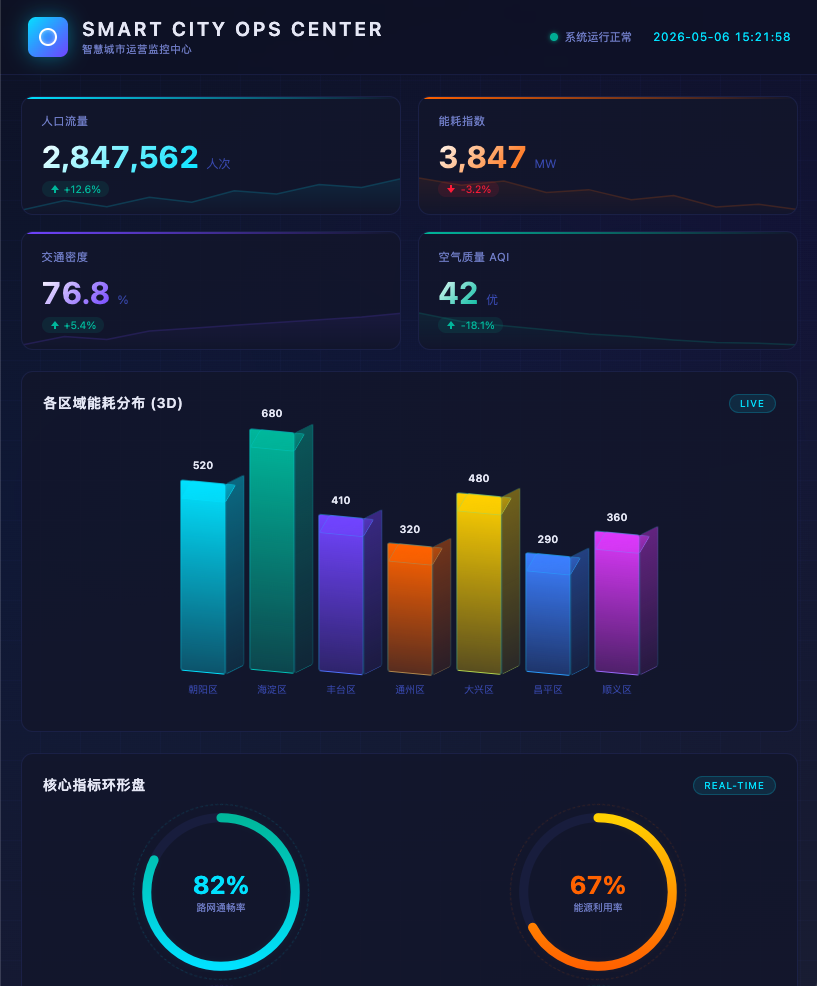
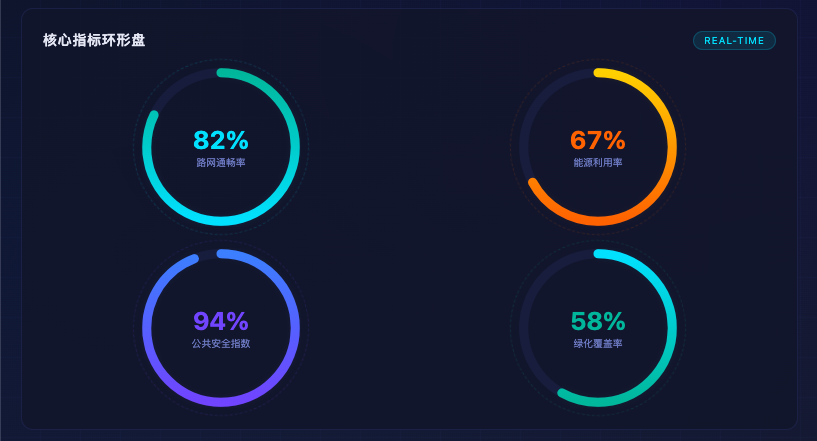
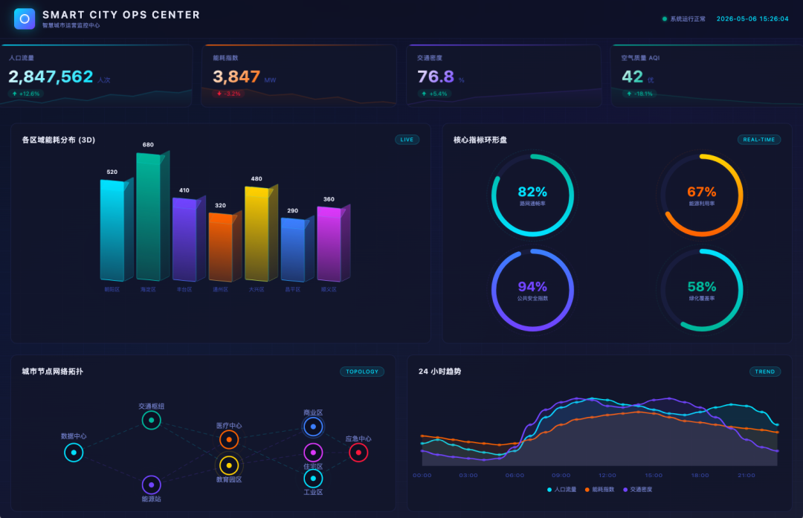
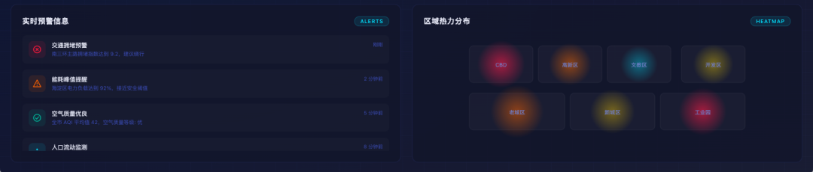

> 📎 来源: [我与ai的那些事](https://mp.weixin.qq.com/s?__biz=MzA4OTE4MjYzMg==&mid=2648328766&idx=1&sn=f3fe06f817b4b71c3afcdfce23eadf09&chksm=892fb3886bf57f3b94d9111013567b56b42b9beeb5979eaf335ab6ab82e4c2b43e90248d2cd5&mpshare=1&scene=1&srcid=0521AZwQ92272slAjnt89HVM&sharer_shareinfo=3ea2682b95f3739a4480f26afcfb3f78&sharer_shareinfo_first=3ea2682b95f3739a4480f26afcfb3f78) | 时间: 2026-05-21 23:14

---

# 背景：朋友的一句话

前几天，一个做智慧城市项目的朋友突然问我：

> 「那种很酷的数据大屏，是不是得专门雇个前端才能搞？」

我愣了一下。

正好这两天 WorkBuddy 升级完，我好像看到多出来一个「探索」模块，里面有什么 3D 功能来着……

打开看了一眼——

还真有。里面可以直接生成 3D 可视化大屏。

那一瞬间我就想：正好，给朋友演示一下。

你也可以先点这里感受一下最终效果：**https://panda.yaniw.com/3dcity**

---

## 第一步：说清楚你想要什么

我一开始也没抱太大期望，就试着在探索模块的对话框里，把我想到的大屏需求一次性全丢进去了：

> 帮我构建一个「智慧城市运营监控中心」3D 数据可视化大屏，要求：

> - 深色主题背景（#0a0e27 → #1a1f3a 渐变）
> - CSS 3D perspective 伪等距投影
> - 3D 柱状图（rotateX/rotateY/translateZ）
> - 旋转环形指标盘（渐变描边）
> - SVG 路径 dash 连线动画
> - 关键指标发光脉冲效果
> - 数字从 0 开始的计数器动画
> - 响应式网格布局（顶部 KPI、中间 3D 图表、底部趋势线）
> - 监控指标：人口流量、能耗指数、交通密度、空气质量
> - 全部 CSS/JS 内联，无外部 CDN，系统字体栈，无 emoji

看起来很多，但对 AI 来说，越详细越好。

---

## 第二步：它真的开始写代码了

我本来以为它会说「这个太复杂了，我做不了」。

结果没有——它直接开始写代码了。

它生成的是一个完整的单文件 HTML，啥都有：

**页面布局**

- 顶部 4 张 KPI 卡片：人口流量、能耗指数、交通密度、空气质量，带发光脉冲
- 中间：左边是 CSS 3D 透视的柱状图，右边是 4 个环形仪表盘
- 底部：Canvas 画的 sparkline 趋势折线

**动画效果**

- 数字从 0 滚动到目标值，带缓动
- 环形盘有 2 秒的缓入动画
- 3D 柱状图有透视变换
- 连线还有流动的 dash 动画

**技术细节**

- 纯 CSS + JS 内联，零外部依赖
- 一个文件，双击就能在浏览器里打开

---

## 第三步：出了个 Bug，它自己修了

第一版跑起来之后，我发现一个问题：

**环形仪表盘是灰色的静态圆环，没有颜色，也没有动画。**

我直接跟它说：

> 「核心指标环形盘中的为什么是用的图片，不是动态的？」

它没有问我「你说的 Bug 是哪部分」，而是直接去查代码，然后告诉我：

> 第一版所有环形盘的 SVG 共用了页面顶部一个隐藏 SVG 里的渐变定义。但跨 SVG 引用 `url(#grad-cyan)` 这种写法，在大部分浏览器里其实是失效的。这是一个经典的 SVG 渐变作用域 Bug。

修复方案也不复杂：每个环形盘的 SVG 里面单独声明渐变，同时把 CSS transition 改成用 JavaScript 的 `requestAnimationFrame` 来控制动画。

修完之后再跑——渐变描边、2 秒缓入动画，和设计预期完全对得上。

---

## 最终效果

说再多，不如直接看效果。

👉 **在线体验地址：https://panda.yaniw.com/3dcit**

整个大屏的层次感还挺强的：

- **顶部 KPI 卡片**：发光脉冲边框，数字从 0 开始滚动进场
- **中间**：左边 CSS 3D 柱状图（有点透视感），右边 4 个环形仪表盘（有渐变动画）
- **底部**：Canvas sparkline，带区域填充

一个 HTML 文件，打开就能用，不用联网，不用装任何东西。

朋友看完说了一句：「这也太方便了吧。」

---

## 几个实用建议

这次用下来，总结几个提需求的小技巧：

**① 颜色直接给色值，别写「深色」** 写 `#0a0e27 → #1a1f3a 深色渐变背景`，比写「深色背景」精准多了。AI 对颜色的描述理解会有歧义，直接给 HEX 值最省事。

**② 想用什么技术，直接写进去** 如果你明确想用 `CSS 3D perspective` 而不是 `Canvas`，就直接说。它会按你指定的技术路线走，不会自己乱发挥。

**③ 遇到 Bug，直接描述你看到了什么** 不用解释「这是什么 Bug、为什么会出现」，直接说现象（比如「环形盘没有动画」），它会自己排查原因。

**④ 单文件优先** 要求「全部 CSS/JS 内联，无外部 CDN」这个很关键——这样生成的文件，发给谁都能直接打开。

---

## 写在最后

数据大屏以前是「要有前端团队才能玩」的东西。

现在呢，WorkBuddy 探索模块里点几下，或者说一段话，几分钟就能拿到一个能跑的 Demo。

不是所有场景都需要生产级别的大屏系统。很多时候，**一个能撑场子的 Demo，就够了**。

---

这是《WorkBuddy 100 种用法》系列的第 **37** 篇，日更一篇，记录 WorkBuddy 的各种真实使用场景。

从自动化办公、内容创作，到法律咨询、数据分析、3D 可视化……100 种玩法，我来帮你一一踩坑。

> 你有什么想可视化的数据？欢迎留言告诉我，下一篇说不定就是你的需求。
