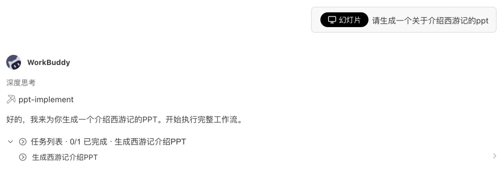
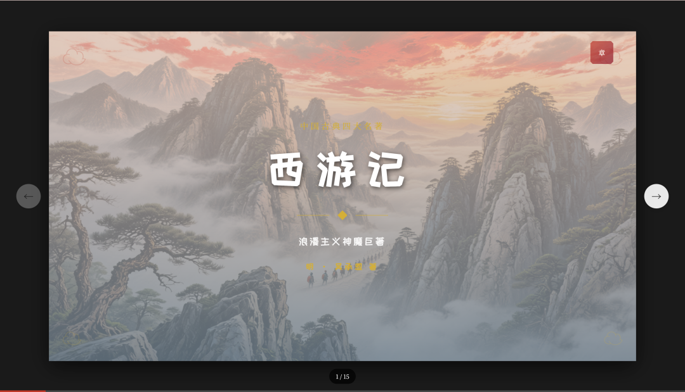
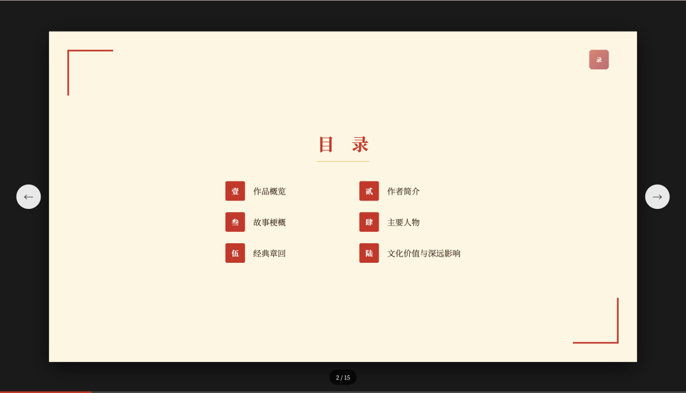
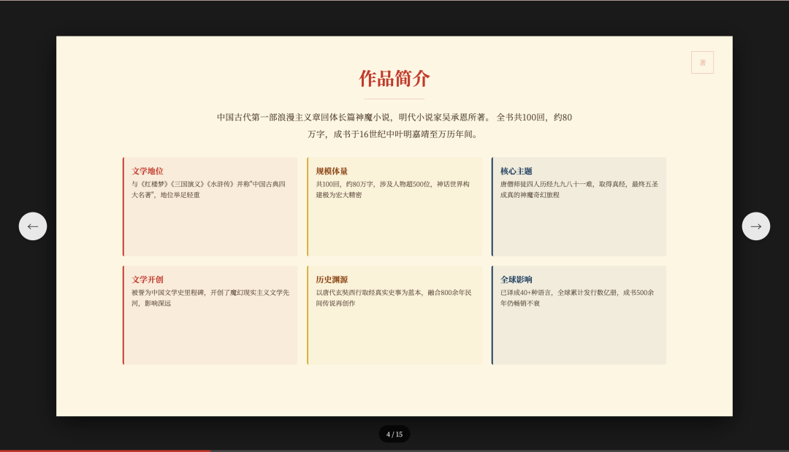
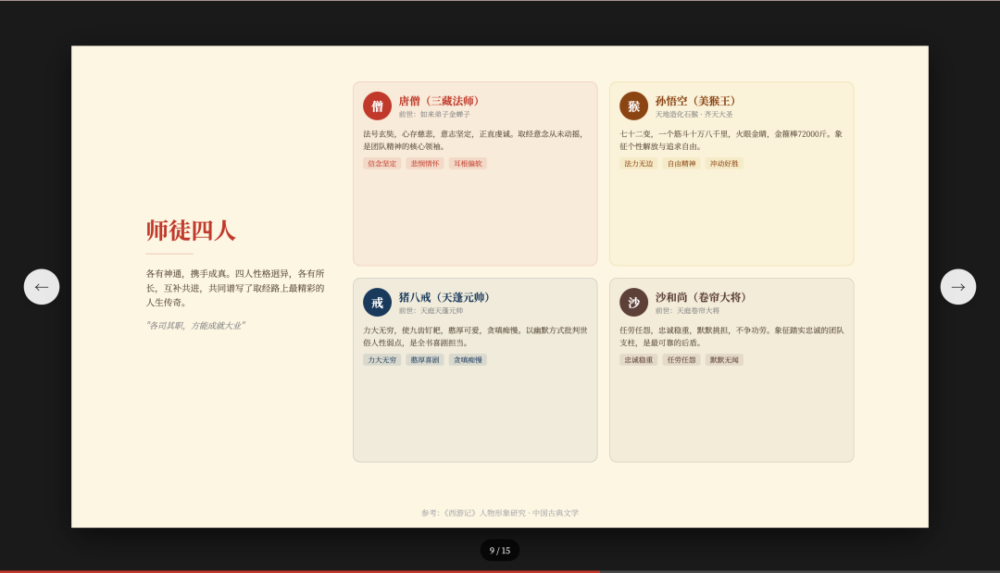
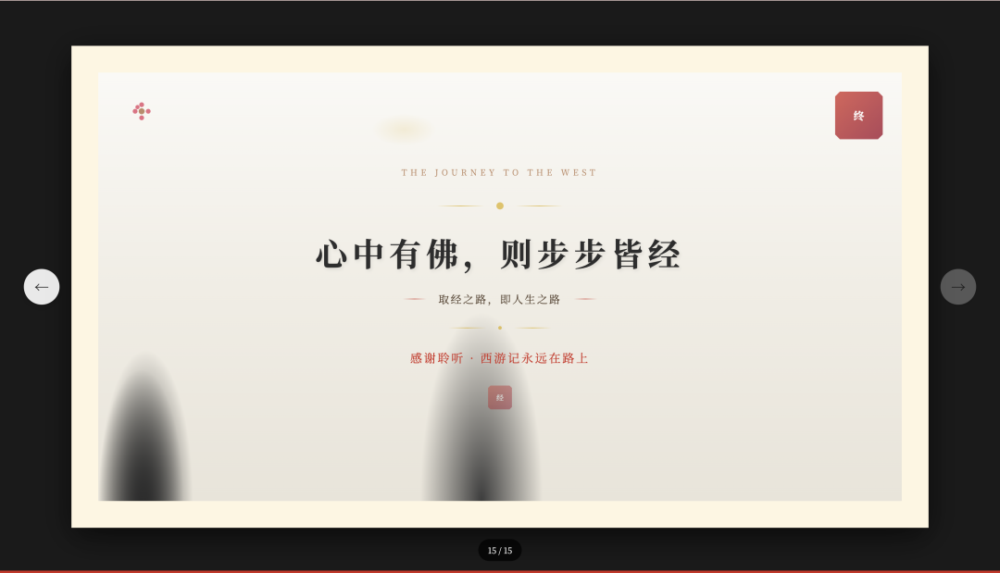
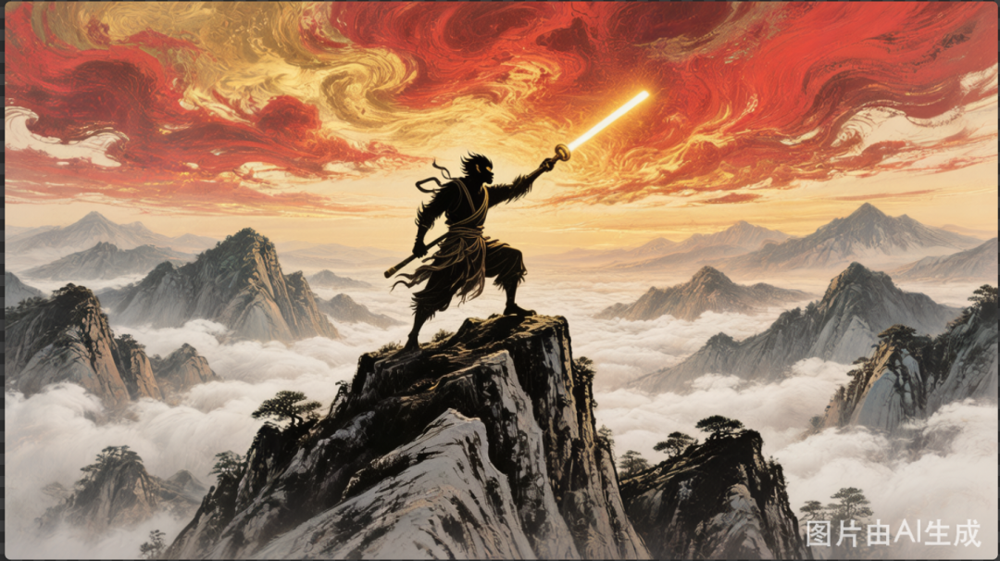
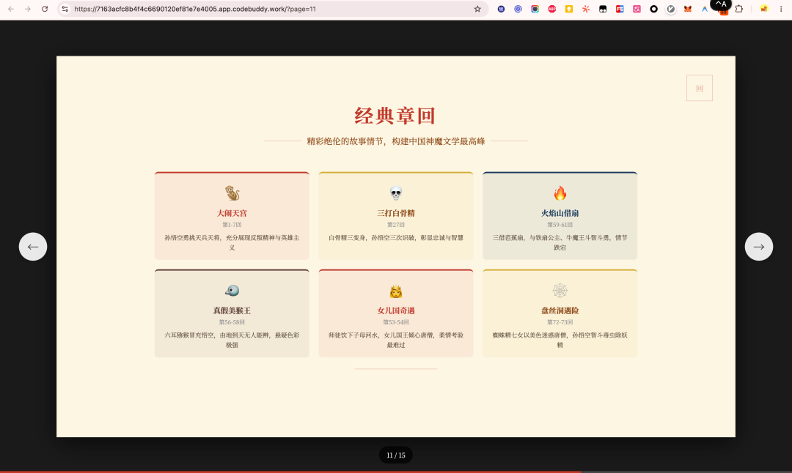

> 📎 来源: [我与ai的那些事](https://mp.weixin.qq.com/s?__biz=MzA4OTE4MjYzMg==&mid=2648329155&idx=1&sn=f217c62300feea47f9364499547bed59&chksm=89fcaa988be459944efebc14e23cec09343d2f01de11565b7ec29c7217414801117f443aa7f2&mpshare=1&scene=1&srcid=05265ihJxwtxDGVTmYk8Zklp&sharer_shareinfo=7275ff3678940d9eb264a3f0bea4452b&sharer_shareinfo_first=7275ff3678940d9eb264a3f0bea4452b) | 时间: 2026-05-26 20:41

---

昨天下午，我在群里看到有人问"有没有快速做PPT的工具？下周要汇报，PPT还没动。"

我随口回了一句："你试试直接在WorkBuddy里说'帮我做个PPT'。"

然后为了验证这句话不是吹牛，我当场在WorkBuddy里敲了一句：

> "请生成一个关于介绍西游记的PPT。"

结果你猜怎么着？**从一句话到15页精致的HTML PPT，全程不用我动一下手指。** 而且不是那种蹩脚的模板拼凑——是有封面、目录、章节过渡、内容页、结束页的完整演示文稿，最后还直接部署到了线上，打开链接就能翻页浏览。

今天就把这个完整过程记录下来。

> **先说清楚一个关键点**：WorkBuddy 生成的"PPT"不是传统的 `.pptx` 文件，而是**一个完整的 HTML 网页演示文稿**。说白了，它是一套带翻页动效、自适应手机屏幕的网页，不是你电脑里 PowerPoint 做的那种文件。用起来像PPT，本质上是个网站。理解了这一点，后面的内容你才能看懂为什么它能"一句话生成 → 自动部署 → 打开链接直接播"。

## 一句话丢进去，它干了多少事？

我的输入就一句话，但WorkBuddy在后台做了这些事情：

| 阶段 | 做了什么 | 我干了什么 |
| --- | --- | --- |
| 素材收集 | 自动搜索西游记背景、人物、经典情节、文化价值 | 什么都没干 |
| 风格定义 | 定下中国古典风配色（朱砂红/金色/深蓝/米色底） | 什么都没干 |
| 内容规划 | 拆成5个章节、15页幻灯片的具体内容 | 什么都没干 |
| 模板选择 | 从模板库里挑了11个中国风模板匹配每一页 | 什么都没干 |
| 逐页生成 | 写了15个HTML页面（封面/目录/3个过渡页/7个内容页/结束页） | 什么都没干 |
| AI生图 | 生成封面背景（国风山水）和取经路线图 | 什么都没干 |
| 部署上线 | build完自动部署到CloudStudio，返回公网链接 | 什么都没干 |

全部自动化，没有任何一步需要我选择或确认。它就像一个助理，把PPT从头到尾给你做好了，然后说"链接在这儿，你看看"。

> 

## PPT长什么样？看一眼

15页，页面结构是这样的：

| 页码 | 类型 | 内容 |
| --- | --- | --- |
| 1 | 封面 | "西游记"大字标题 + "中国古典四大名著"副标题 + 国风山水背景 |
| 2 | 目录 | 5个章节导航 |
| 3 | 过渡页 | 第一章：作品概览 |
| 4 | 内容页 | 作品简介 — 文学地位、规模体量、核心主题等6个信息卡 |
| 5 | 内容页 | 作者吴承恩 — 生平 + 数据卡 + 创作背景 |
| 6 | 过渡页 | 第二章：故事梗概 |
| 7 | 内容页 | 故事结构 — 三大部分 + 取经路线图 |
| 8 | 过渡页 | 第三章：主要人物 |
| 9 | 内容页 | 师徒四人 — 孙悟空/唐僧/猪八戒/沙僧四人对比卡 |
| 10 | 过渡页 | 第四章：经典章回 |
| 11 | 内容页 | 经典故事 — 大闹天宫/三打白骨精/真假美猴王 |
| 12 | 过渡页 | 第五章：文化价值与深远影响 |
| 13 | 内容页 | 文化价值 — 儒释道三栏 |
| 14 | 内容页 | 深远影响 — 影视改编/全球传播/衍生作品 |
| 15 | 结束页 | 印章设计 + "谢谢观看" |

每一页都有固定的中国古典风格：朱砂红标题、金色装饰线、米色纸底、云纹元素。过渡页统一红黑渐变，章节数字淡入背景。

> 

> 

> 

> 

> 

## 一个小插曲：水印问题

PPT生成完成后，AI生成的图片带水印。

第一次我让它换图，它用ImageGen重新出了两张，但还是有水印。

第二次我说"用混元无水印生图"，它才反应过来——调用混元3.0的 `LogoAdd=0` 参数，出了干净的国风山水封底和取经路线图。

> 

> 

这个细节提醒我：**跟AI说需求的时候，明确工具名比模糊描述更有效。** 说"换张无水印图"不如说"用混元无水印技能给我重出"。

## 部署：生成完不是终点，上线才是

PPT写完了，但我总不能把代码发给别人吧？而且这不是 `.pptx` 文件——它是一套 HTML 网页代码，没法像传统PPT那样"发个附件"。

所以下一步是部署。WorkBuddy在build完之后，使用昨天这篇[WorkBuddy 100种用法 #55 | 写完网页不会部署？Cloudflare 技能一键搞定](https://mp.weixin.qq.com/s?__biz=MzA4OTE4MjYzMg==&mid=2648329140&idx=1&sn=9cc0de3ccad7784f62eaaa9599fe4083&scene=21#wechat_redirect)cloudflare技能 自动调用CloudStudio沙箱部署，几秒钟后就返回了一个公网链接：

🔗`https://7163acfc8b4f4c6690120ef81e7e4005.app.codebuddy.work/?page=1`

打开链接，键盘左右键就能翻页，手机也能自适应浏览。完全不用我配服务器、域名、HTTPS——全是自动的。

> 

## 这个流程的真正价值

回顾整个过程，最让我觉得厉害的不是PPT多好看——而是**颗粒度**。

传统做PPT的流程是：打开PowerPoint → 选模板 → 一页一页填充内容 → 排版调整 → 导出 `.pptx` 文件 → 上传到某处分享。每一步都要你亲自动手。而且你做出来的 `.pptx` 文件，别人得装Office或WPS才能打开。

而WorkBuddy走的是一条完全不同的路：它不生成 `.pptx`，而是**直接用HTML+CSS写了一套网页幻灯片**。好处是——只要有个浏览器就能看，手机也行，不需要装任何软件。你只负责说"做什么"，它来负责"怎么做"。

| 你做的事 | WorkBuddy做的事 |
| --- | --- |
| 说一句话：做个西游记PPT | 搜索资料、规划内容 |
| （等着） | 选模板、写15页代码 |
| （等着） | 生成配图、部署上线 |
| 拿到一个链接 | 发出去给人看 |

这不只是效率提升——这是**工作方式的改变**。以前你的角色是"制作者"，你是PPT工厂的工人；现在你的角色是"审稿人"，PPT工厂全自动运转，你只在最后把关。

---

**互动时间** 👇 你平时做PPT用什么工具？有没有试过让AI帮你从头做一个完整的PPT？体验怎么样？评论区聊聊~

---

这是WorkBuddy 100 种用法第56篇，持续日更，每篇都是真实场景。

关注我，一起探索WorkBuddy的更多玩法。
