> 📎 来源: [AI+BI智能办公](https://mp.weixin.qq.com/s?__biz=MzA3NzM5Njk3Nw==&mid=2650247661&idx=1&sn=b5b491be46a373cfa260b0ae34f79331&chksm=86738954a790f0ecb42c63ea04938a3e6f5e3e4e08bdc154a5c1dbcf038ac8e74911a1b356fa&mpshare=1&scene=1&srcid=0513h069tdXuuPoOZSTTmHcL&sharer_shareinfo=4c73cde6ad3009079e8c2924cf3210d7&sharer_shareinfo_first=4c73cde6ad3009079e8c2924cf3210d7) | 时间: 2026-05-13 15:31

---

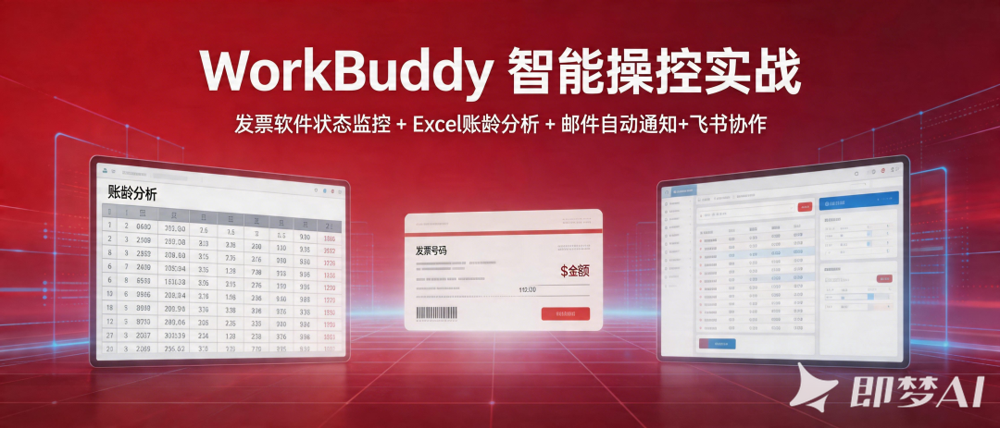

正文共： 3497字 18图

预计阅读时间： 9分钟

 

> 还在每小时打开系统刷发票状态？还在手工对账到眼花？这篇文章教你用 WorkBuddy 把发票管理从"人盯"变成"机盯"，省下的时间喝咖啡不香吗？

做过财务的都懂——

- **状态靠刷**：发票有没有付款？打开系统看一眼。过了一小时？再看一眼。一天看八遍，生怕漏了变化。
- **对账靠眼**：银行流水和发票明细，两份 Excel 来回切，金额对不上就一行行找。
- **催收靠记**：哪笔应收超期了？哪笔该催了？全凭记忆和 Excel 高亮。
- **报表靠拼**：月末三家公司合并报表，数据东一块西一块，复制粘贴到手抖。

**核心问题：信息是分散的，动作是手动的，提醒是被动的。**

如果有一个助手，能 7×24 小时替你盯着发票状态，变了就通知你，还能自动出报表、发邮件、推飞书——是不是就好了？

WorkBuddy 就是这个助手。

## 01. 有效工具与技能清单

### 一、系统内置工具（直接可用）

| 工具 | 用途 | 本次使用场景 |
| --- | --- | --- |
| **execute\_command** | 执行 PowerShell/cmd 命令 | 启动应用、运行 UI Automation 脚本、执行 Node.js 脚本 |
| **write\_to\_file** | 创建新文件 | 编写监控脚本、Python 脚本 |
| **replace\_in\_file** | 编辑已有文件 | 修改 send\_notification.js 的 .env 加载逻辑 |
| **read\_file** | 读取文件内容 | 查看 .env 配置、验证脚本输出 |
| **search\_content** | 搜索文件内容 | — |
| **todo\_write** | 任务管理 | 跟踪多步骤任务进度 |
| **automation\_update** | 创建定时自动化任务 | 设置每小时发票状态监控 |
| **deliver\_attachments** | 交付文件附件 | 发送 Excel 文件给用户 |
| **open\_result\_view** | 展示结果文件 | 展示截图和 Excel |

### 二、已安装技能（Skills）

| 技能 | 用途 | 本次使用场景 |
| --- | --- | --- |
| **xlsx** | Excel 文件创建/编辑/分析 | 导出发票数据为商务风格 Excel（openpyxl） |
| **qq-email** | QQ 邮箱收发邮件 | 发票状态变化时发送 HTML 通知邮件 |

### 三、核心技术能力（非技能，但关键）

| 技术 | 用途 | 说明 |
| --- | --- | --- |
| **UI Automation (UIAutomationClient)** | 读取/操作 WPF 桌面应用 | 读取 DataGrid 数据、点击按钮、填写表单、选择下拉项、滚动列表 |
| **openpyxl (Python)** | Excel 文件编程 | 通过 xlsx 技能间接使用 |
| **nodemailer (Node.js)** | SMTP 邮件发送 | 通过 qq-email 技能间接使用 |

> 💡 **核心结论**：读取 Contoso Invoicing 桌面应用数据，关键依赖的是 **UI Automation API**（系统内置），而非浏览器自动化技能。数据处理和输出则依赖 **xlsx** + **qq-email** 两个技能。

## 02.实战：发票状态自动监控

### 场景描述

我在 Contoso Invoicing 系统中管理 27 张发票（1001-1027），涉及 Fabrikam、Proseware、Tailspin Toys 等客户。

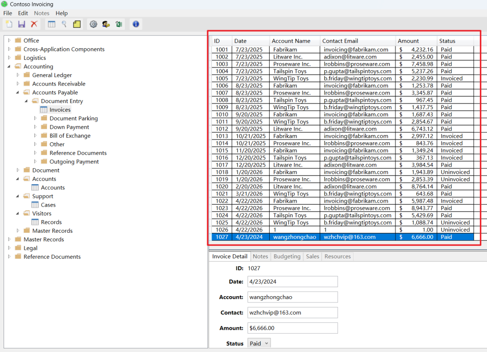

每张发票有三种状态：

| 状态 | 含义 | 财务关注点 |
| --- | --- | --- |
| **Uninvoiced** | 未开票 | 需要及时开票，避免遗漏 |
| **Invoiced** | 已开票未付款 | 重点跟踪，超期需催收 |
| **Paid** | 已付款 | 可用于对账核销 |

**我的需求**：发票状态一变，立刻通知我，不用自己刷。

### 实现思路

```
Contoso 发票系统      │      ▼ ① 每小时自动读取发票数据  WorkBuddy 监控脚本      │      ▼ ② 与上一次数据对比  检测到变化？    ├── 否 → 静默，等下一轮    └── 是 → ③ 发送邮件通知
```

三步走：**读取 → 对比 → 通知**。逻辑简单，但效果显著。

### 具体步骤

#### 第一步：让 WorkBuddy 读取软件发票数据

自动打开软件，导出所有的发票数据

```
打开桌面上Contoso Invoicing软件，列出发票窗口中的所有发票数据，导出Excel文件，商务风格
```

自动规划任务列表

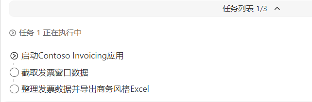

执行摘要：

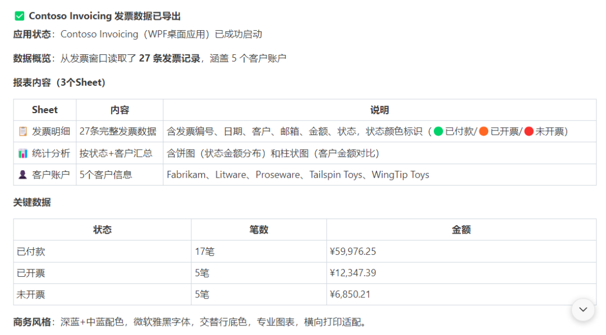

导出Excel文件

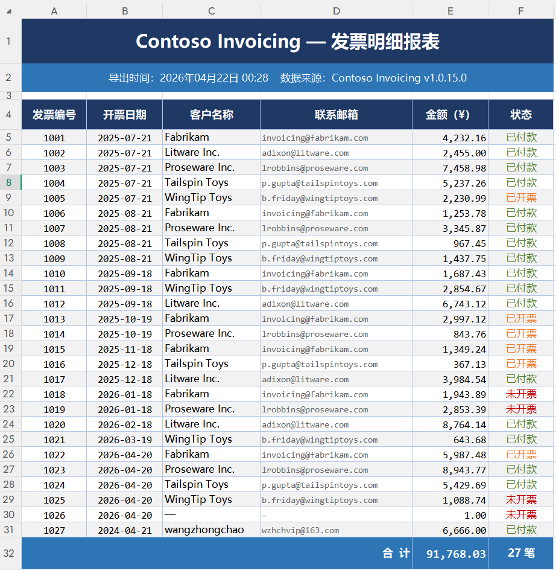

#### 第二步：设置基准和自动化提醒任务

```
设置自动化提醒Contoso Invoicing发票表格中，当前数据内容作为基准，发票数据修改或增加，就将变化的内容发邮件给wzhchvip@163.com并将新的内容存为新的比较基准
```

前提是设置好QQ邮箱的连接。
任务列表：

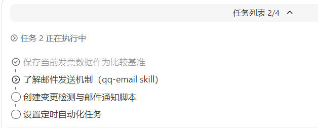

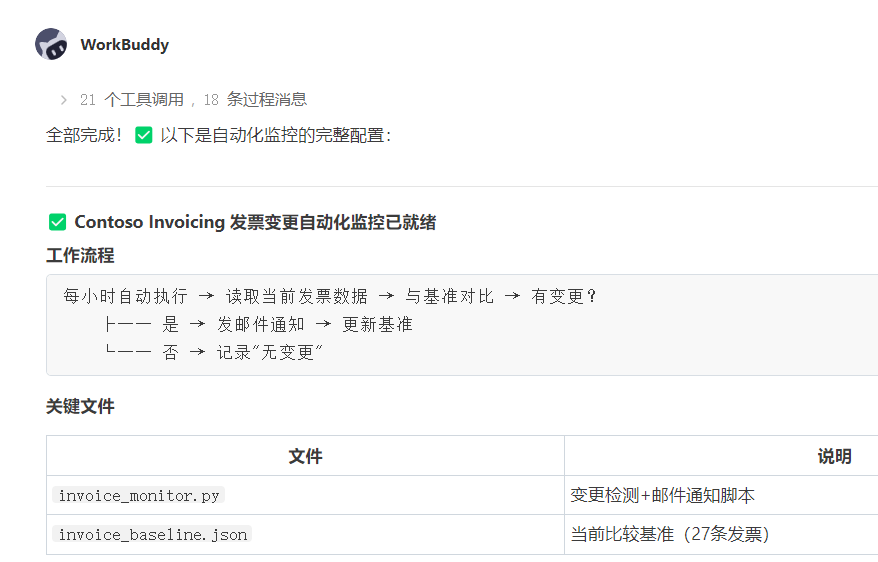

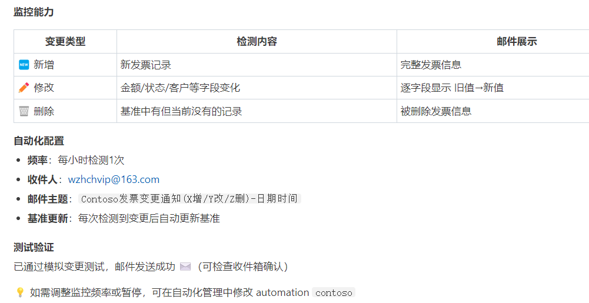

设置好了自动化任务，每小时监控一次数据变化

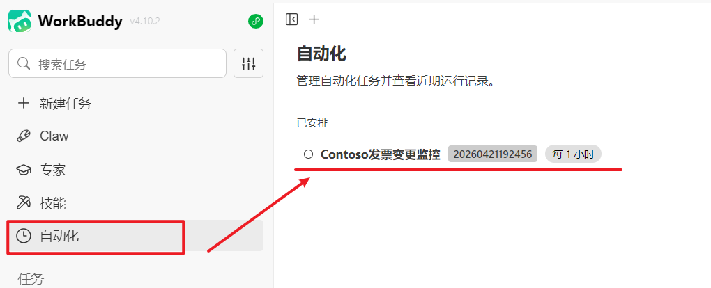

也收到了测试邮件

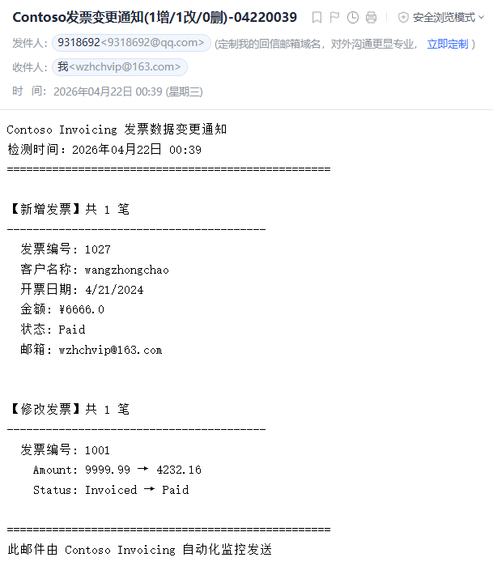

#### 第三步：邮件通知，第一时间知晓

现在操作软件，修改一条发票状态，增加一条新的记录

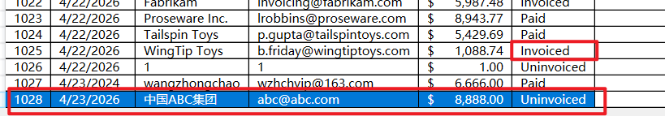

我手动执行自动化任务

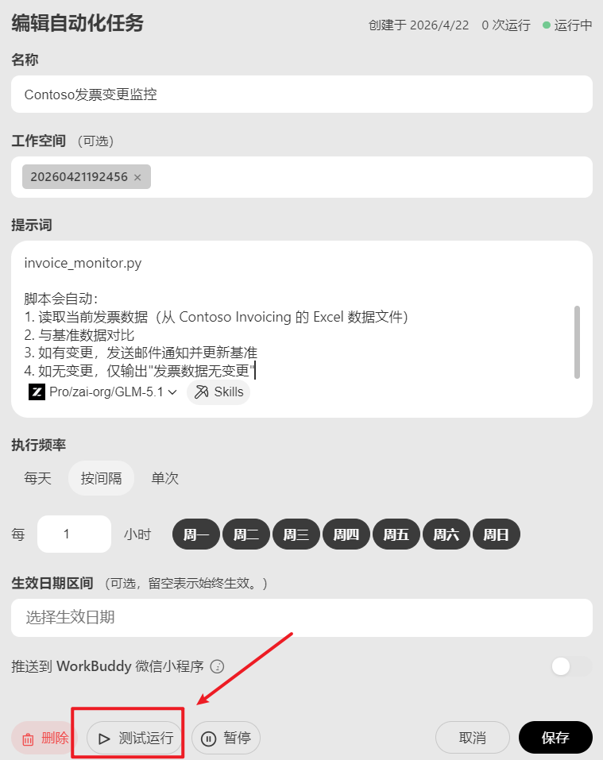

执行结果

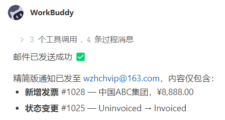

收到的邮件

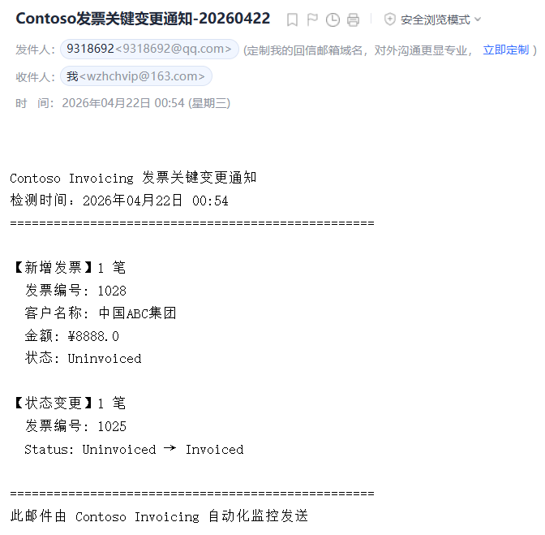

目前的邮件是文本格式，可以设置为HTML格式

```
发送的邮件内容为HTML格式，商务风格，列出该变动的表格样式：Paid 绿色、Invoiced 黄色、Uninvoiced 红色，一目了然
```

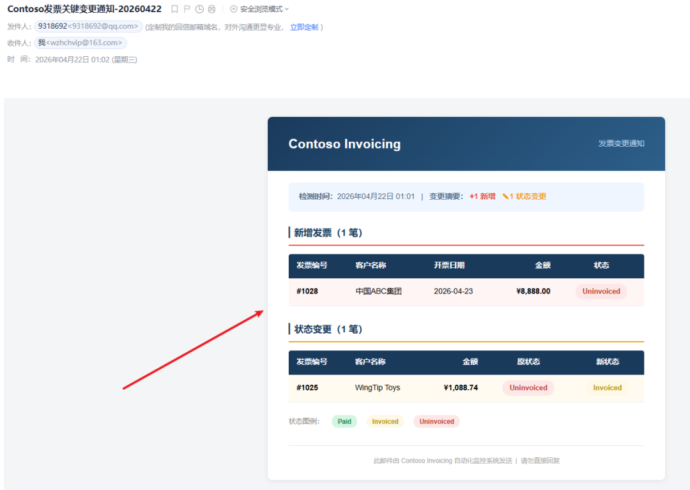

这样，每小时自动执行一次：

```
任务名：Contoso发票变更监控频率：每小时（工作时间）动作：运行监控脚本 → 检测变化 → 发邮件
```

设置完成后，**完全无需人工干预**，你只管看邮件通知就行。

## 03. 进阶 Excel × 邮箱 × 飞书联动

监控只是起点。WorkBuddy 真正强大的地方在于**跨系统联动**——把发票数据从 Contoso 流向 Excel、邮箱、飞书，形成自动化闭环。

### 场景 1：发票数据自动同步 Excel + 应收账龄分析

**痛点**：每月手工从系统抄数据到 Excel，做账龄分析表，耗时且容易出错。

**思路**：

```
Contoso ──自动读取──→ Excel 明细表 ──公式计算──→ 账龄分析
```

**安排任务**：

```
自动更新Excel文件中的发票信息，对已开票还未支付的记录，按客户统计不同账龄区间的数据表格，设置不同的颜色提醒
```

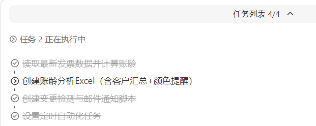

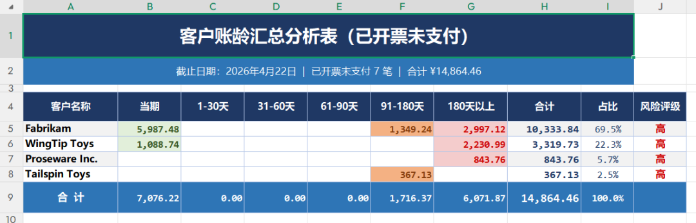

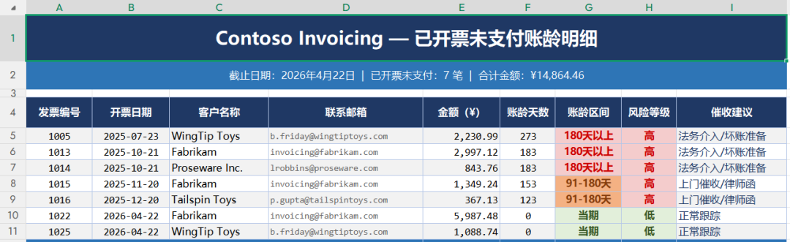

**效果**：原来每月花 2 小时做的账龄表，现在自动生成，零人工。

### 场景 2：客户对账单邮件自动发送

**痛点**：月末要给每个客户发对账单，逐个生成 PDF 再逐个发邮件，重复劳动。

**思路**：

```
Contoso 数据 ──→ 按客户分组 ──→ 生成对账单 PDF ──→ 邮件发送
```

**步骤**：

1. 1. WorkBuddy 读取 Contoso 中所有 Invoiced 和 Uninvoiced 的发票
2. 2. 按客户分组，自动生成带公司抬头的对账单 PDF
3. 3. 读取发票上的联系邮箱（如 

   ```
   adixon@litware.com
   ```

   ）
4. 4. 通过 QQ 邮箱 SMTP 自动发送，附件为 PDF 对账单

**效果**：原来半天的工作量，一键完成。客户收到对账单更及时，回款也更快。

### 场景 3：飞书机器人实时告警

**痛点**：邮件通知有延迟，团队共享不便。异常操作（如 Paid 被回退为 Uninvoiced）需要即时告警。

**思路**：

```
Contoso 状态变更 ──→ 飞书 Webhook ──→ 群消息即时推送
```

**步骤**：

1. 1. 在飞书群中添加自定义机器人，获取 Webhook 地址
2. 2. WorkBuddy 检测到发票状态变更时，同时推送消息到飞书
3. 3. 消息格式示例：

```
⚠️ 发票状态变更告警发票 #1023 | Proseware Inc. | $8,943.77状态：Invoiced → Paid时间：2026-04-20 18:49
```

1. 4. 异常操作（Paid → Uninvoiced 回退）用红色标记，高优先级提醒

**效果**：团队所有人即时可见，比邮件快，比口头通知准。

### 场景 4：月末回款核销闭环（三方联动）

**痛点**：银行回款了，但核销要手动改状态、手动通知销售、手动发回执，流程割裂。

**思路**：

```
银行流水 Excel ──→ 匹配 Contoso 发票 ──→ 自动改状态 Paid                                          │                              ┌───────────┼───────────┐                              ▼           ▼           ▼                          飞书通知     邮件回执     Excel更新                          销售确认     发给客户     核销记录
```

**步骤**：

1. 1. 导入银行流水 Excel → WorkBuddy 按金额+日期模糊匹配 Contoso 发票
2. 2. 匹配成功 → Contoso 状态自动改为 Paid
3. 3. 飞书群推送："XX 客户 ¥8,943.77 已回款，发票 #1023 已核销"
4. 4. 邮件发送回款确认给客户
5. 5. Excel 核销记录表自动更新

**效果**：原来 5 个手工步骤，现在 1 条自动化链路搞定。

## 04. 场景速查表

| 我想... | WorkBuddy 怎么做 | 涉及系统 |
| --- | --- | --- |
| 发票状态变了立刻知道 | 定时监控 + 邮件/飞书通知 | Contoso → 邮箱/飞书 |
| 每月自动出账龄分析表 | 读取数据 + 写入 Excel + 公式计算 | Contoso → Excel |
| 月末给客户发对账单 | 按客户分组 + 生成 PDF + 邮件发送 | Contoso → 邮箱 |
| 回款了自动核销 | 匹配银行流水 + 改状态 + 多方通知 | Excel → Contoso → 飞书+邮箱 |
| 异常操作即时告警 | 检测回退 + 飞书红色告警 | Contoso → 飞书 |
| 三家公司合并报表 | 分公司读取 + 汇总 Excel + 生成报告 | Contoso → Excel → Word/邮箱 |

WorkBuddy 不替代你现有的财务系统，它是**系统之间的桥梁**。Contoso 管发票、Excel 做分析、邮箱发通知、飞书做协作——WorkBuddy 让它们自动联动，减少人工搬运。

### 🔑 人工确认环节不可少

自动化不等于全自动。关键节点（如核销确认、催收发送）建议保留人工确认，避免误操作。WorkBuddy 的定位是**减少重复劳动，不是替代判断**。

> **一句话总结**
> 让机器干机器该干的事——盯盘、搬数据、发通知；让人干人该干的事——判断、决策、沟通。

 

Contoso Invoicing 是微软推出的 WPF 桌面应用示例程序，用于模拟企业发票与账户管理场景，支持发票创建、查询、状态跟踪（已开票/已付款/未开票）以及客户账户维护等核心财务流程。

[](https://mp.weixin.qq.com/s?__biz=MzA3NzM5Njk3Nw==&mid=2650247607&idx=1&sn=9afb0c74e44cfaad5d474a8ec191edf4&scene=21#wechat_redirect)

[报表分析也能“生产线化”：WorkBuddy 打造自动化财报分析 Skill](https://mp.weixin.qq.com/s?__biz=MzA3NzM5Njk3Nw==&mid=2650247607&idx=1&sn=9afb0c74e44cfaad5d474a8ec191edf4&scene=21#wechat_redirect)


[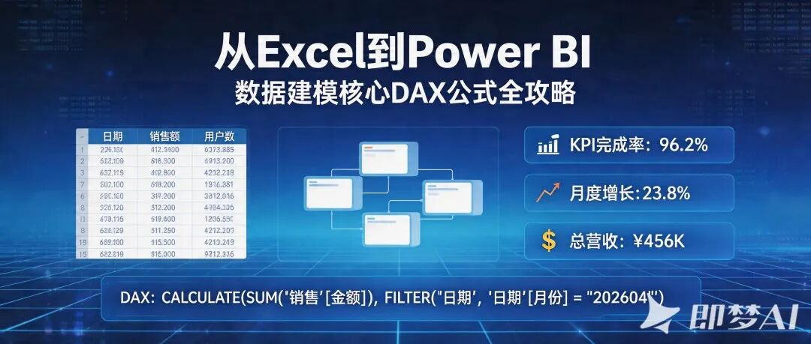](https://mp.weixin.qq.com/s?__biz=MzA3NzM5Njk3Nw==&mid=2650247542&idx=1&sn=83fb2f1b35ea43de4524d2dea7f371b3&scene=21#wechat_redirect)

[从Excel到Power BI：数据建模核心DAX公式全攻略](https://mp.weixin.qq.com/s?__biz=MzA3NzM5Njk3Nw==&mid=2650247542&idx=1&sn=83fb2f1b35ea43de4524d2dea7f371b3&scene=21#wechat_redirect)


[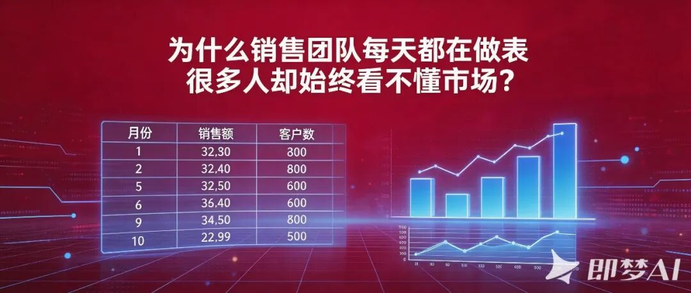](https://mp.weixin.qq.com/s?__biz=MzA3NzM5Njk3Nw==&mid=2650247536&idx=1&sn=28edb3232fb85606b5131a57dbce0b81&scene=21#wechat_redirect)

[为什么销售团队每天都在“做表”，很多人却始终看不懂市场？](https://mp.weixin.qq.com/s?__biz=MzA3NzM5Njk3Nw==&mid=2650247536&idx=1&sn=28edb3232fb85606b5131a57dbce0b81&scene=21#wechat_redirect)


[](https://mp.weixin.qq.com/s?__biz=MzA3NzM5Njk3Nw==&mid=2650247490&idx=1&sn=59c737c52c8418c4dc9b12f703f9df2d&scene=21#wechat_redirect)

[案例：一条投诉，AI大模型把质量追溯变成行动方案](https://mp.weixin.qq.com/s?__biz=MzA3NzM5Njk3Nw==&mid=2650247490&idx=1&sn=59c737c52c8418c4dc9b12f703f9df2d&scene=21#wechat_redirect)


[](https://mp.weixin.qq.com/s?__biz=MzA3NzM5Njk3Nw==&mid=2650247202&idx=1&sn=427e7b401301a330248c928690fd46bb&scene=21#wechat_redirect)

[别再把 🦞OpenClaw 只当聊天工具：快速搭建你的 AI 智能办公助手](https://mp.weixin.qq.com/s?__biz=MzA3NzM5Njk3Nw==&mid=2650247202&idx=1&sn=427e7b401301a330248c928690fd46bb&scene=21#wechat_redirect)

王忠超


AI+BI智能办公与数据决策 实战讲师

北京科技大学MBA **校外导师**

微软(中国)员工技能提升项目 **特聘讲师**

帆软FineBI 数据应用研究院 **专家**

Cherry Studio **认证讲师**

北大纵横管理咨询公司  **合伙人**

微信公众号“AI+BI智能办公”**创始人**

24年企业实战培训经验

19年企业管理咨询经验


