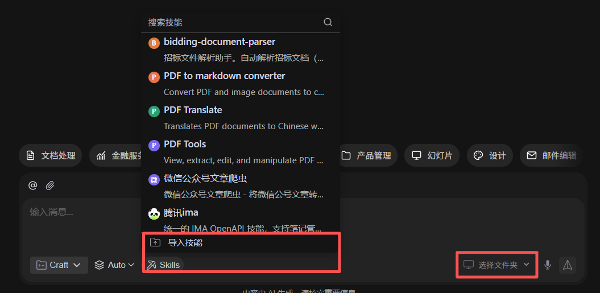
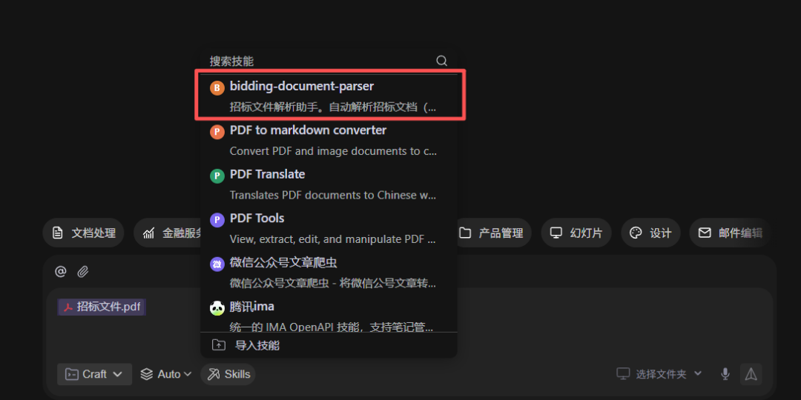

> 📎 来源: [未央书童AI](https://mp.weixin.qq.com/s?__biz=MzcwMzA5MjQ0NA==&mid=2247483769&idx=1&sn=291f8e23380eb10109ddd5c0685c4744&chksm=f54438b39edad37e02267a4cfcb0088b125b088b867cb2c375489c973046cb5d85bda313eff5&mpshare=1&scene=1&srcid=0513tuIFGIRmDLv8x3xWCIP3&sharer_shareinfo=d1cd86d1f5b3b91a1d1010e633bfcb38&sharer_shareinfo_first=d1cd86d1f5b3b91a1d1010e633bfcb38) | 时间: 2026-05-13 15:40

---

在上一期内容里，我分享了**二十万字工程标书，依靠 AI 全流程高效编制、提速数倍**的完整实操逻辑。

近期也是刚刚交付完一个60万字的标书（技术标），接下来我们分享AI编标的第一步，解析招标文件。如果大家感兴趣，我会做连载，将每一个步骤整理为一个SKILL。由浅入深、循序渐进，人人都能看懂、复制就能直接上手用。

本期我们就从投标写标书**最基础、最关键、最不能出错的第一步**开始：

**招标文件 AI 智能深度解析。**

## 一、好的投标文件不是写出来的，是策划出来的

靠硬写出来的标书只能保底不废标，真正能稳中标、拿高分的投标文件，从来不是写出来的，而是**从头到尾策划出来的**。虽然大家能参与投标都是有底气的，但是不能确定有竞争对手到底是什么打法，所以以不变应万变，做好标书响应才是万全之策。技术标上的1分易得，报价得分上的1分可就是几十万甚至上百万。

**编写只是落地手段，策划才是中标核心**。普通选手埋头写标书，高手提前策划标书；写出来的标书只能满足基本合规，策划出来的标书才能精准踩分、规避坑点、拉开差距、锁定中标。投标拼的从来不是打字速度和排版功底，而是前期拆解规则、布局得分、打造亮点、规避风险的全套策划思维。策划的依据就是招标文件，所以对招标文件的解析非常关键。

# 二、招标文件的解析

一本完整的招标文件，动辄几百上千页，文字量大、条款繁杂、规范众多。

传统人工看标文，普遍存在这些痛点：

- 逐页手动翻看，耗费大量时间精力；
- 重点分散，容易看漏、看错；
- 评分条目零散分布，人工梳理极易缺项漏项；
- 忽略隐性废标条款，标书做错直接废标，前功尽弃；
- 老旧经验对照新规，容易沿用过期规范，不符合招标最新要求；

## 三、本期专属 AI Skill 核心功能

##

这一套专属指令，专门针对工程投标、施工类招标文件深度定制，一键就能实现：

1. 全自动通读整本招标 PDF、Word 全文
2. 精准**拆分提取所有评分标准、加分项、扣分项**
3. 单独罗列**硬性资质要求、人员要求、设备要求、工期要求**
4. 高亮标注所有**废标条款、否决项、违规红线**
5. 自动梳理项目概况、施工范围、验收标准、规范依据
6. 自动整理成清晰表格、条理分明、重点分区，一目了然

不用自己逐字翻阅、不用人工摘抄汇总，AI 一次性全部梳理完毕，犄角旮旯里藏的废标条款无处遁形。

## 四、实操使用步骤

### 4.1准备工作：

1. 安装WorkBuddy（https://www.codebuddy.cn/work）
2. 下载安装skill(https://skillhub.cn/skills/bidding-document-parser)

###

### 4.2开始解析：

1. 新建任务，选择工作空间（浏览一个本地的目录）
2. 复制招标文件到会话框，选择技能“bidding-document-parser”，输入“分析”；

   
3. 等待 AI分析，结束后输出DOC分析报告；

全程无需复杂操作，简单复制粘贴，就能把几百页的标文，浓缩成一页清晰重点汇总。

## 五、这个Skill能帮你解决什么实际问题

##

- 彻底告别人工逐字翻读标文，节省大量时间
- 所有评分点完整抓取，后续写标书绝不漏答、缺项
- 提前摸清所有废标红线，从源头规避废标风险
- 精准吃透招标方所有要求，后续搭大纲、写内容完全贴合标准
- 不管是自己接单写标书、还是公司内部投标编制，都能直接套用

解析招标文件，就是高分标书、合规标书的**一切基础与根源**。

---

祝大家都能旗开得胜。大家在使用Skill的过程中有什么问题，也可以留言沟通，我会定期迭代升级。
