> 📎 来源: [AI+BI智能办公](https://mp.weixin.qq.com/s?__biz=MzA3NzM5Njk3Nw==&mid=2650247864&idx=1&sn=cffbb4739784e6ba1f583348f193cad8&chksm=862e9a0465f15607c96aca835b194b373d106d5d6a988728237a40715550bf54c554297076ee&mpshare=1&scene=1&srcid=0513tVHZVFiO3Xt2KuvyD7XE&sharer_shareinfo=3cc4cb54ae51578367056a7655fd006a&sharer_shareinfo_first=3cc4cb54ae51578367056a7655fd006a) | 时间: 2026-05-13 15:32

---


 

探索是 WorkBuddy 左侧导航栏的全新入口，汇集了海量可交互的HTML模板，按场景分类，一键调用

当你打开 WorkBuddy 客户端（v4.22.5），左侧导航栏中新增了一个醒目的「探索」按钮。这不是技能市场的翻版，而是一个**全新的模板中心** .

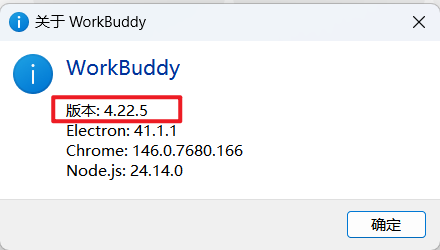

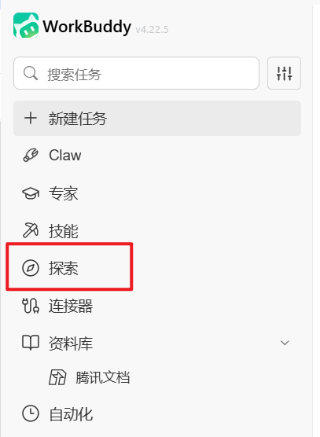

这里汇集了数百个精心设计的交互式HTML模板，涵盖数据报告、协作白板、API文档、机票比价、旅行规划、内容创作等场景。每个模板都是可直接运行、可交互的网页产物，你只需输入自己的数据，就能获得专业级的可视化输出。

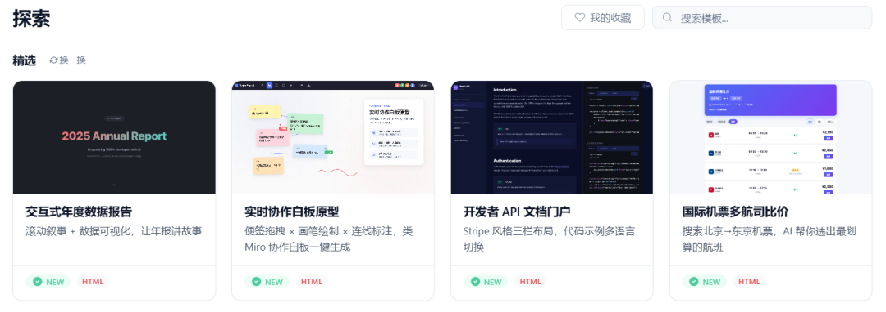

对于职场办公人员来说，探索板块的意义在于：**你不需要从零设计网页或写代码，只需要找到对应的模板，填入自己的内容，就能立刻获得专业级的交互式产物**。这是从「手动排版」到「一键生成专业页面」的效率飞跃。

## 01 探索功能详解 精选模板 + 场景分类

*精选推荐 + 11大场景分类，快速定位你需要的模板*

### 1.1 精选推荐 —— 官方筛选的优质模板

探索页面顶部是「精选」区域，这里展示的是官方团队筛选出的优质模板，每个模板都配有缩略图预览、标题和简短描述。点击「换一换」可以刷新推荐内容，发现更多新鲜模板。

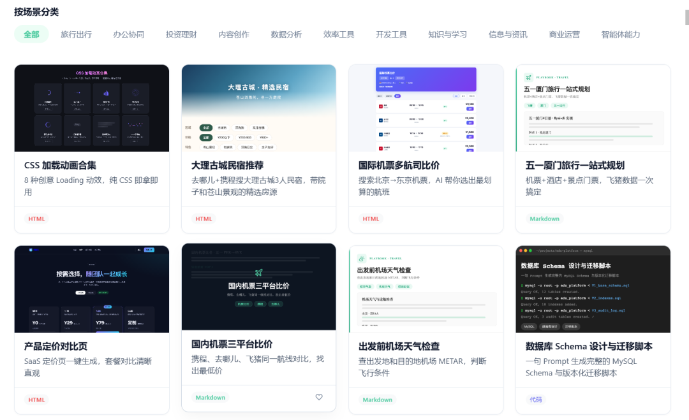

**精选模板示例** —— 每个模板都标注了 NEW 标签和 HTML 格式

| 模板名称 | 功能描述 | 适用场景 |
| --- | --- | --- |
| **交互式年度数据报告** | 滚动叙事 + 数据可视化，让年报讲故事 | 年终汇报、数据展示 |
| **实时协作白板原型** | 便签拖拽 + 画笔绘制 + 连线标注，类Miro协作白板一键生成 | 头脑风暴、流程设计 |
| **开发者 API 文档门户** | Stripe 风格三栏布局，代码示例多语言切换 | 技术文档、API说明 |
| **国际机票多航司比价** | 搜索北京→东京机票，AI帮你选出最划算的航班 | 差旅规划、出行比价 |

> 💡 **使用方式：** 点击任意模板卡片，WorkBuddy 会自动加载该模板并开启新任务，你只需填入自己的数据和内容，即可生成同款交互式页面。

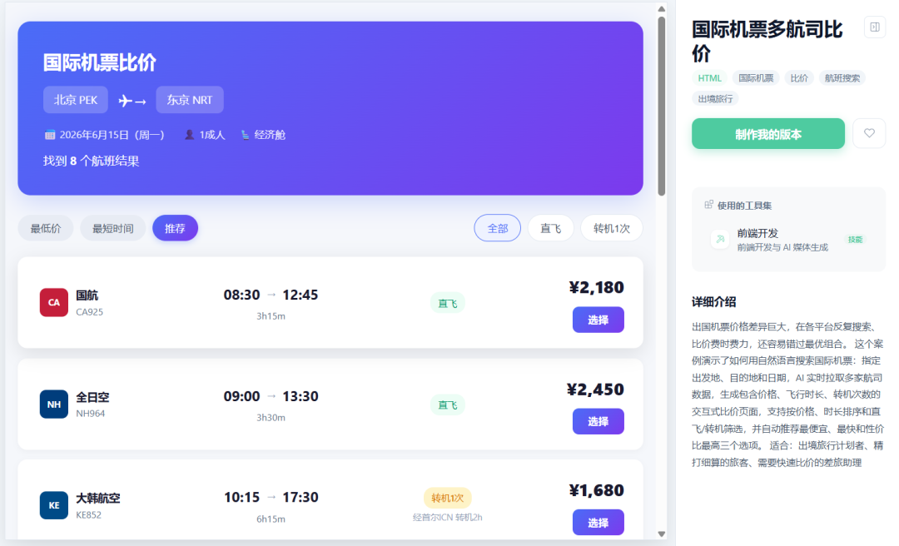

### 1.2 按场景分类 —— 11大分类精准定位

探索页面的核心导航方式是「按场景分类」，顶部有一排分类标签，点击即可筛选对应场景的模板。这是从「海量模板中大海捞针」到「按需求精准定位」的关键设计。

**11大场景分类一览**

| 分类标签 | 核心覆盖 | 典型模板示例 | 职场应用 |
| --- | --- | --- | --- |
| 全部 | 展示所有模板 | 全部精选和分类模板 | 浏览发现 |
| 旅行出行 | 行程规划、机票酒店比价 | 五一厦门旅行一站式规划、国际机票多航司比价 | 差旅安排、假期规划 |
| 办公协同 | 团队协作、项目管理、白板 | 实时协作白板原型 | 会议协作、流程梳理 |
| 投资理财 | 财务分析、投资工具 | 数据可视化看板 | 财务报告、投资分析 |
| 内容创作 | 文章、图文、多媒体 | CSS加载动画合集、图文排版模板 | 公众号文章、宣传物料 |
| 数据分析 | 报表、图表、可视化 | 交互式年度数据报告 | 业务汇报、数据展示 |
| 效率工具 | 计算器、转换器、查询工具 | 实用小工具集合 | 日常办公辅助 |
| 开发工具 | API文档、代码展示、技术模板 | 开发者API文档门户 | 技术文档、开发协作 |
| 知识与学习 | 知识库、学习卡片、教程 | 结构化知识页面 | 培训材料、知识沉淀 |
| 信息与资讯 | 新闻、资讯聚合、信息展示 | 资讯聚合页面 | 行业动态、信息汇总 |
| 商业运营 | 电商、营销、运营工具 | 产品展示页、运营看板 | 产品推广、运营分析 |
| 智能体能力 | AI交互、智能助手界面 | 智能对话界面模板 | AI应用展示、智能客服 |

**分类使用的最佳策略：**

- **有明确需求时** —— 直接点击对应分类标签，快速筛选目标模板
- **不确定用什么时** —— 先浏览「精选」区域，或逐个分类探索发现灵感
- **需要跨领域组合时** —— 比如「数据分析+内容创作」，可以分别筛选两个分类找最佳组合

### 1.3 模板产物类型 —— 统一为交互式HTML

探索板块中的所有模板，产物格式统一为 **HTML**。这意味着你获得的不是静态图片或纯文本，而是可以直接在浏览器中打开、交互、分享的完整网页。

**HTML 产物的优势：**

- 可交互：滚动、点击、筛选、切换
- 可嵌入：直接嵌入公众号、网页、邮件
- 可分享：发送链接即可查看
- 可编辑：用任意文本编辑器修改
- 跨平台：手机、电脑、平板都能打开

**与传统文档的对比：**

- Word：静态排版，无法交互
- PPT：演示专用，不适合数据探索
- PDF：只读格式，无法动态更新
- Excel：表格为主，视觉表现力弱
- HTML：交互+视觉+数据，全能型

### 1.4 我的收藏 —— 打造个人模板库

探索页面右上角有「我的收藏」按钮，你可以将常用模板收藏起来，建立自己的个人模板库。下次使用时无需重新搜索，直接从收藏夹一键调用。

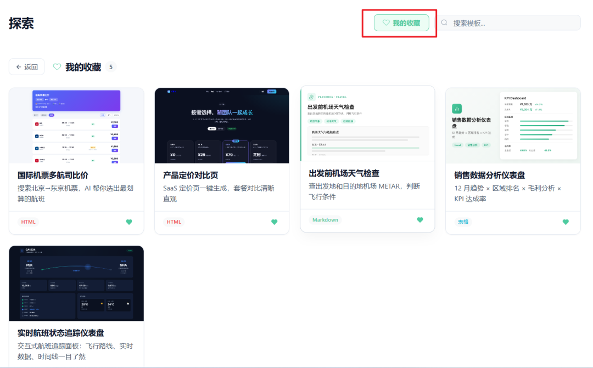

**流程：** 浏览发现 → 点击收藏（心形图标）→ 快速调用（从收藏夹一键打开）

### 1.5 搜索模板 —— 精准定位

探索页面右上角提供搜索框，输入关键词即可快速定位目标模板。比如输入「年报」可以找到所有数据报告类模板，输入「白板」可以找到协作工具类模板。

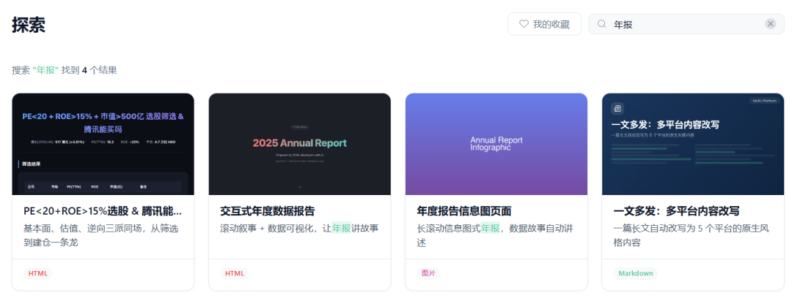

## 02 重点场景 探索模板赋能办公

*五大职场高频场景，每个场景对应哪些探索模板？怎么用？一看就懂*

### 2.1 数据分析与汇报：从Excel到交互式报告

传统方式：Excel做表 → PPT贴图 → Word写分析 → 反复调整格式。使用探索模板后：直接生成交互式HTML数据报告，滚动叙事+动态图表，让数据自己说话。

**推荐探索模板**（数据分析分类下的交互式报告模板）

| 模板类型 | 核心功能 | 输入 | 输出效果 |
| --- | --- | --- | --- |
| **交互式年度数据报告** | 滚动叙事 + 数据可视化 | 年度业务数据 | 可滚动的故事化年报，含动态图表 |
| **数据看板模板** | KPI指标 + 趋势图 + 对比分析 | 业务指标数据 | 实时更新的管理驾驶舱 |
| **财务分析模板** | 资产负债表 + 利润表可视化 | 财务报表数据 | 结构化的财务健康度分析页 |

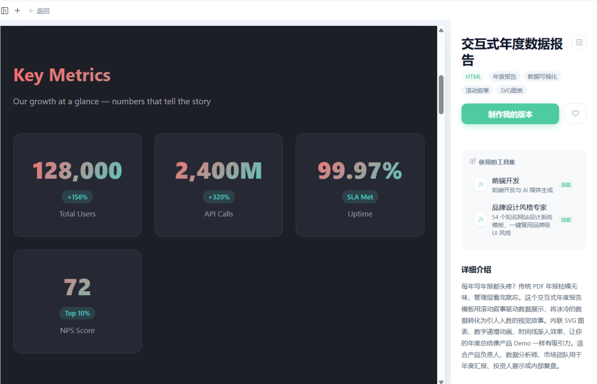

**提示词示例：**

```
请使用「交互式年度数据报告」模板，帮我生成2025年度销售数据报告：1）数据来源：@销售数据.xlsx2）包含四个季度销售额对比、区域分布、产品品类占比3）使用深蓝色主题，配合金色高亮关键数据4）每个数据点添加同比变化标注5）输出为可交互的 HTML 页面
```

### 2.2 内容创作与自媒体：从文字到交互式图文

公众号文章、宣传页面、教程文档 —— 探索模板让内容从纯文本升级为可交互的网页，阅读体验和传播效果大幅提升。

**流程：** 选择模板（在探索中筛选内容创作分类）→ 填入内容（替换示例数据为真实内容）→ 交互优化（调整配色、字体、添加动画效果）→ 发布分享（导出HTML嵌入公众号或网页）

**内容创作推荐模板**

| 模板类型 | 适用场景 | 核心特色 |
| --- | --- | --- |
| CSS加载动画合集 | 技术教程、前端展示 | 多种加载动画效果，可直接复用 |
| 教程页面模板 | 培训材料、操作指南 | 步骤化展示，含进度指示 |

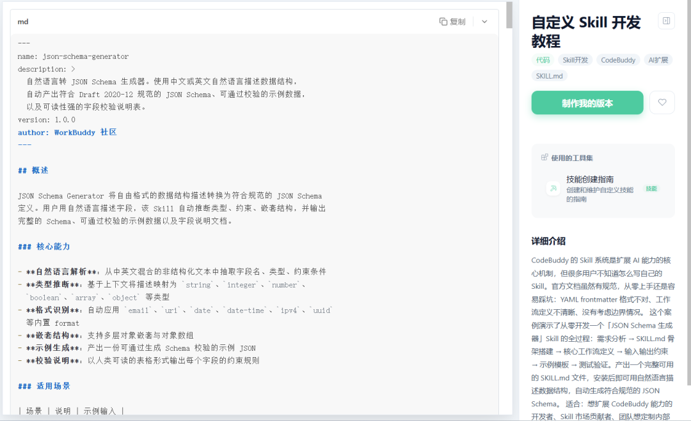

### 2.3 旅行出行与差旅规划：智能比价+行程管理

出差订票、假期规划 —— 探索中的旅行出行模板可以帮你一键生成行程规划页，甚至实现机票多航司比价。

- **A. 国际机票多航司比价**：输入出发地、目的地、日期，AI自动搜索多个航司的航班信息，按价格、时间、舒适度排序，生成可交互的比价页面。涉及分类：

  ```
  旅行出行
  ```
- **B. 一站式旅行规划**：五一厦门旅行一站式规划模板，包含行程安排、景点推荐、美食攻略、预算统计，生成完整的旅行手册页面。涉及分类：

  ```
  旅行出行
  ```

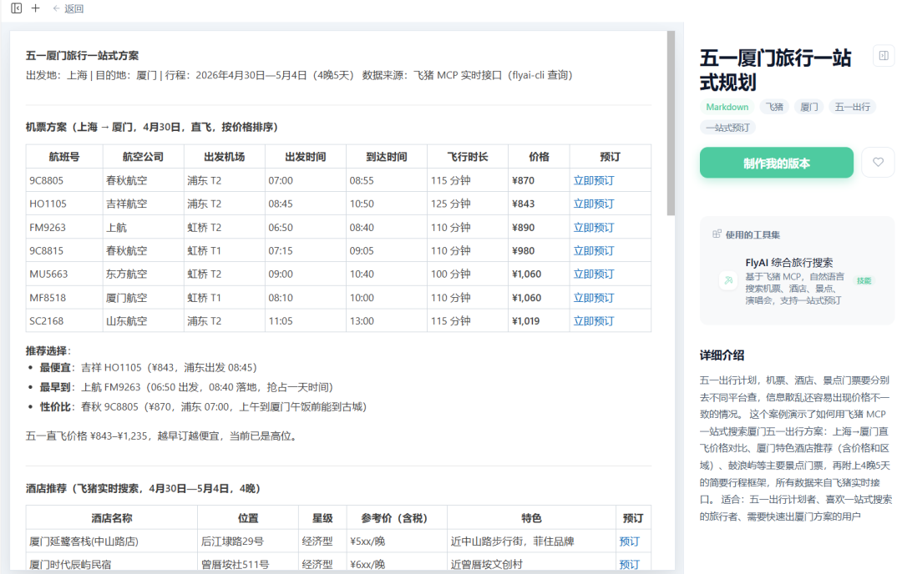

### 2.4 办公协同与项目管理：协作白板+流程设计

远程协作、头脑风暴、流程梳理 —— 实时协作白板原型模板让团队可以在线共同绘制流程图、整理思路。

**实时协作白板原型**（办公协同分类下的明星模板）

- 功能：便签拖拽 + 画笔绘制 + 连线标注，类Miro协作白板一键生成
- 适用场景：头脑风暴会议、流程设计、项目规划、思维导图
- 输出为可交互HTML，团队成员可同时查看和编辑

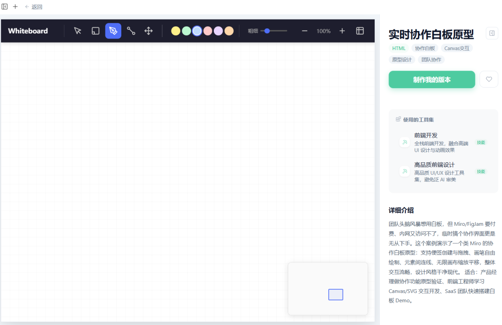

### 2.5 技术开发与文档：API文档+代码展示

开发者API文档门户模板采用Stripe风格三栏布局，支持代码示例多语言切换，是技术团队输出专业文档的利器。

- **开发者API文档门户**：三栏布局（导航目录 + 文档内容 + 代码示例），支持多语言代码切换（JavaScript/Python/cURL），适合API文档、SDK说明、技术规范。
- **智能代码审查**：规范检查 + 自动流水线 + 问题模式库 + 意见分类 + 自学习 + CI/CD集成 + 效果仪表盘 。

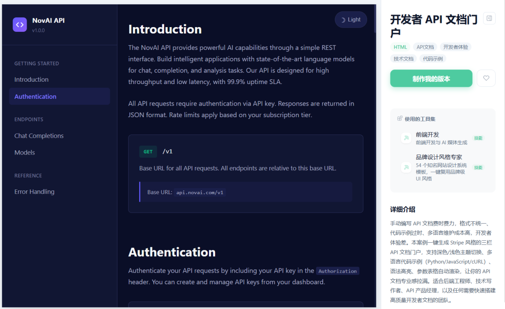

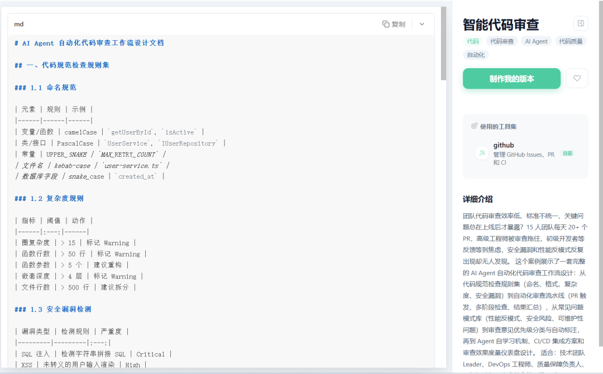

## 03 专业提示词 让模板从「能用」到「专业」

*四要素公式 + 五大高频模板，直接复制就能用*

### 3.1 四要素提示词公式

使用探索模板时，一条高质量的提示词至少包含以下四个要素，帮助AI精准调用模板并填入你的内容：

**目标 + 输入 + 格式 + 约束 = 高质量结果**

- **目标**：你要生成什么 —— "使用交互式年度数据报告模板生成Q1复盘报告"
- **输入**：你提供什么素材 —— @文件名 / 数据表格 / 参考链接
- **格式**：输出样式要求 —— 配色主题 / 图表类型 / 页面结构
- **约束**：限制条件 —— 不超过X页 / 数据标注来源 / 语气要求

**模糊版 vs 专业版**

| 模糊版 ❌ | 专业版 ✅ |
| --- | --- |
| 帮我做个年报 | 使用「交互式年度数据报告」模板，读取@销售数据.xlsx，生成Q1复盘报告，深蓝主题 |
| 生成一个网页 | 使用「图文排版模板」生成公众号文章页，包含封面图+分段正文+数据卡片 |
| 做个旅行计划 | 使用「五一厦门旅行一站式规划」模板，替换为北京目的地，5天4晚行程 |
| 写个数据报告 | 使用「数据看板模板」，展示月度KPI完成率，含趋势折线图和同比对比 |

### 3.2 五大高频提示词模板

**模板一：数据报告生成（数据分析分类）**

```
请使用「交互式年度数据报告」模板，帮我生成2025年度销售数据报告：1）数据来源：@销售数据.xlsx（包含四个季度的销售额、区域、品类数据）2）报告结构：季度对比 + 区域分布热力图 + 品类占比饼图 + 年度趋势3）配色方案：深蓝色主题 + 金色高亮关键数据4）每个数据点添加同比变化百分比标注5）输出为可交互的 HTML 页面，支持滚动叙事
```

**模板二：内容创作页面（内容创作分类）**

```
请使用「图文排版模板」生成一篇关于AI办公趋势的公众号文章页面：1）文章主题：【输入你的主题】2）包含：封面大图 + 引言段落 + 3个核心观点（每个观点配数据卡片）+ 总结3）风格：商务简约，主色深蓝，辅色金色4）响应式布局，确保手机端阅读体验良好5）输出为可直接嵌入公众号的 HTML 代码
```

**模板三：旅行规划页面（旅行出行分类）**

```
请使用「五一厦门旅行一站式规划」模板，生成我的北京5日游行程规划：1）目的地：北京，时间：5天4晚2）包含：每日行程安排 + 景点推荐 + 美食攻略 + 预算统计3）景点偏好：历史文化为主，兼顾现代地标4）预算范围：人均3000-5000元5）输出为可分享的 HTML 旅行手册
```

**模板四：协作白板页面（办公协同分类）**

```
请使用「实时协作白板原型」模板，帮我设计新产品上线流程：1）流程阶段：需求评审 → 开发 → 测试 → 上线 → 运营2）每个阶段包含：负责人、关键节点、交付物3）使用不同颜色便签区分阶段（蓝-评审、绿-开发、黄-测试、红-上线）4）添加关键路径连线标注5）输出为可交互的 HTML 白板页面
```

**模板五：API文档页面（开发工具分类）**

```
请使用「开发者API文档门户」模板，生成我们产品的API文档：1）API列表：用户认证、数据查询、文件上传、通知推送2）每个API包含：接口地址、请求参数、响应示例、错误码3）代码示例支持 JavaScript / Python / cURL 三种语言切换4）采用Stripe风格三栏布局5）输出为 HTML 文档门户
```

> ⚠️ **提示词黄金法则：** 使用探索模板时，明确指定模板名称是关键。花30秒把四要素想清楚写完整，比来回改5轮更省Credits也更省时间。不满意时不要在原对话反复调 —— **新建任务换模型重跑**，效果往往更好。

## 04 从入门到精通的 三个关键心法

*掌握了这些，你的探索模板才能真正从「套用」变成「定制」*

### 4.1 模板+技能组合策略

探索模板提供「框架」，WorkBuddy技能提供「数据处理能力」。两者组合使用，效果远超单独调用：

| 探索模板 | 配合技能 | 组合效果 |
| --- | --- | --- |
| **交互式年度数据报告** | excel-automation + Web Search | 自动读取Excel + 补充行业数据 → 完整报告 |
| **图文排版模板** | content-research-writer | AI撰写内容 + 自动排版 → 成品页面 |
| **实时协作白板** | Agent Browser | 白板设计 + 网页截图存证 → 完整协作记录 |
| **开发者API文档** | Frontend Design | 文档内容 + 前端美化 → 专业文档门户 |

> 💡 **推荐流程：** 先在探索中找到合适模板 → 用提示词描述需求 → 配合相关技能处理数据 → 一键生成交互式页面。不满意时新建任务换模型重跑，不要在原对话反复调整。

### 4.2 收藏+搜索的高效使用法

探索模板数量庞大，建立个人收藏库是提升效率的关键：

**流程：** 首次发现（浏览精选或分类）→ 测试效果（用真实数据跑一遍确认输出质量）→ 加入收藏（点击心形图标建立个人模板库）→ 快速复用（下次直接从收藏夹一键调用）

### 4.3 模板定制化：从套用到专属

最高级的用法，不是套用现成模板，而是在模板基础上进行深度定制，打造专属风格：

- **方式一：提示词定制** —— 在调用模板时，通过提示词指定配色、字体、布局等细节。例如："使用深蓝主题+金色高亮+思源黑体"。
- **方式二：内容替换** —— 生成基础页面后，用编辑工具（或让AI）替换示例数据为你的真实内容，调整结构和文案。
- **方式三：二次开发** —— 将生成的HTML代码导出，用代码编辑器进行深度定制，添加自定义交互逻辑和动画效果。

### 附录：WorkBuddy 左侧导航栏五大工具定位一览

为帮助读者更清晰地理解 WorkBuddy 各功能模块的定位与关系，以下对左侧导航栏中的五大核心工具进行系统梳理：

| 工具 | 一句话定位 | 核心能力 | 适用场景 |
| --- | --- | --- | --- |
| **专家** | 切换AI人格 | 140+位行业专家，覆盖设计、技术、营销、销售、财务等12大领域。召唤后AI以该专家的专业视角和方法论处理任务。 | 需要专业领域深度输出时，如竞品分析、品牌策略、代码审查、财务规划 |
| **技能** | 扩展AI能力 | 2万+社区技能+官方内置技能。每个技能是一套预设工作流程，安装后AI掌握完成特定任务的能力（如Excel自动化、PPT生成、PDF处理）。 | 需要AI执行特定工具操作时，如数据处理、文档转换、网页抓取、语音转写 |
| **探索** | 模板中心 | 汇集海量交互式HTML模板，按11大场景分类。每个模板都是可直接运行、可交互的网页产物，填入数据即可获得专业级输出。 | 需要生成交互式页面时，如数据报告、协作白板、旅行规划、API文档、内容页面 |
| **连接器** | 打通外部系统 | 对接腾讯文档、腾讯问卷、QQ邮箱、微云、TAPD、腾讯乐享等企业级服务，将AI能力延伸到已有工作流程中。 | 需要与现有企业系统联动时，如自动读取腾讯文档、发送QQ邮件、同步TAPD任务 |
| **资料库** | 知识沉淀 | 统一管理个人和团队的知识资产，支持文件上传、分类存储、快速检索。AI可基于资料库内容进行问答和创作。 | 需要基于私有知识创作时，如企业制度解读、产品资料整理、历史文档复用 |

**五大工具的关系图谱：**

**专家**决定「谁来做」（专业视角）
**技能**决定「用什么做」（工具能力）
**探索**决定「做成什么样」（模板框架）
**连接器**决定「从哪里取/往哪存」（系统对接）
**资料库**决定「基于什么做」（知识基础）。
五者相互独立又彼此配合，共同构成 WorkBuddy 的完整能力生态。

WorkBuddy的「探索」板块，本质上是一套**从「纯文本对话」到「交互式产物」的升级路径**。精选模板给你框架，场景分类帮你定位，HTML输出让你获得可交互的专业页面。三者组合，构成了职场内容产出的全新范式。

*—— 探索无界，效率无限 ——*

 

[](https://mp.weixin.qq.com/s?__biz=MzA3NzM5Njk3Nw==&mid=2650247796&idx=1&sn=ae7c97422b08684e0cac7b37f86ec560&scene=21#wechat_redirect)

[WorkBuddy教会你假期摄影 — 轻松拍出专业级旅行大片](https://mp.weixin.qq.com/s?__biz=MzA3NzM5Njk3Nw==&mid=2650247796&idx=1&sn=ae7c97422b08684e0cac7b37f86ec560&scene=21#wechat_redirect)


[](https://mp.weixin.qq.com/s?__biz=MzA3NzM5Njk3Nw==&mid=2650247747&idx=1&sn=8cd61cb372d22f07e8002b901c0d002a&scene=21#wechat_redirect)

[硅基流动模型广场：一站式解锁百款顶尖大模型，还有免费额度](https://mp.weixin.qq.com/s?__biz=MzA3NzM5Njk3Nw==&mid=2650247747&idx=1&sn=8cd61cb372d22f07e8002b901c0d002a&scene=21#wechat_redirect)


[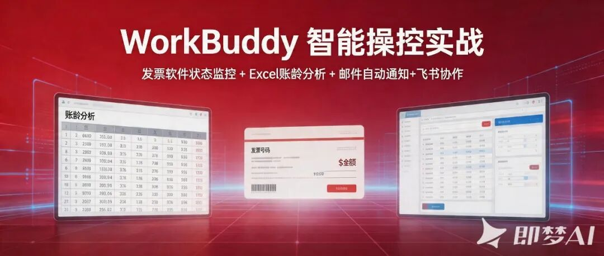](https://mp.weixin.qq.com/s?__biz=MzA3NzM5Njk3Nw==&mid=2650247661&idx=1&sn=b5b491be46a373cfa260b0ae34f79331&scene=21#wechat_redirect)

[WorkBuddy 智能操控实战：发票软件状态监控 + Excel账龄分析 + 邮件自动通知+飞书协作](https://mp.weixin.qq.com/s?__biz=MzA3NzM5Njk3Nw==&mid=2650247661&idx=1&sn=b5b491be46a373cfa260b0ae34f79331&scene=21#wechat_redirect)


[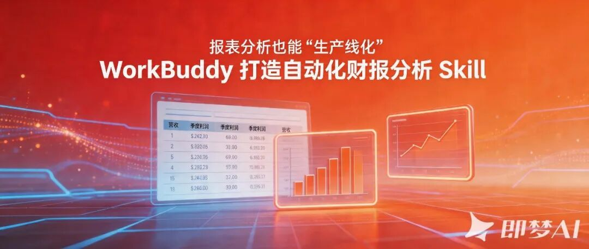](https://mp.weixin.qq.com/s?__biz=MzA3NzM5Njk3Nw==&mid=2650247607&idx=1&sn=9afb0c74e44cfaad5d474a8ec191edf4&scene=21#wechat_redirect)

[报表分析也能“生产线化”：WorkBuddy 打造自动化财报分析 Skill](https://mp.weixin.qq.com/s?__biz=MzA3NzM5Njk3Nw==&mid=2650247607&idx=1&sn=9afb0c74e44cfaad5d474a8ec191edf4&scene=21#wechat_redirect)


[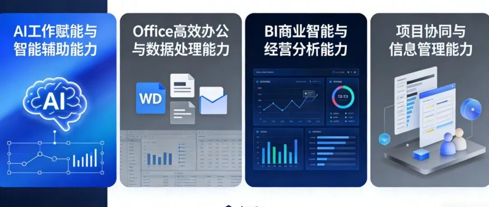](https://mp.weixin.qq.com/s?__biz=MzA3NzM5Njk3Nw==&mid=2650247106&idx=2&sn=4fa27d5d59ee02e65adc504ad349513a&scene=21#wechat_redirect)

[2026 职场跃迁必修课：AI + BI + Office 体系化学习，提升你的职场竞争力！](https://mp.weixin.qq.com/s?__biz=MzA3NzM5Njk3Nw==&mid=2650247106&idx=2&sn=4fa27d5d59ee02e65adc504ad349513a&scene=21#wechat_redirect)

王忠超


AI+BI智能办公与数据决策 实战讲师

北京科技大学MBA **校外导师**

微软(中国)员工技能提升项目 **特聘讲师**

帆软FineBI 数据应用研究院 **专家**

Cherry Studio **认证讲师**

北大纵横管理咨询公司  **合伙人**

微信公众号“AI+BI智能办公”**创始人**

24年企业实战培训经验

19年企业管理咨询经验


