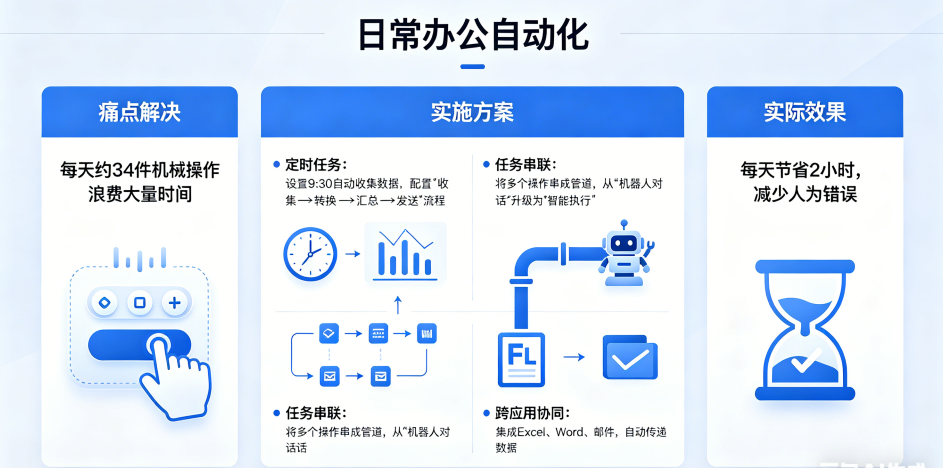
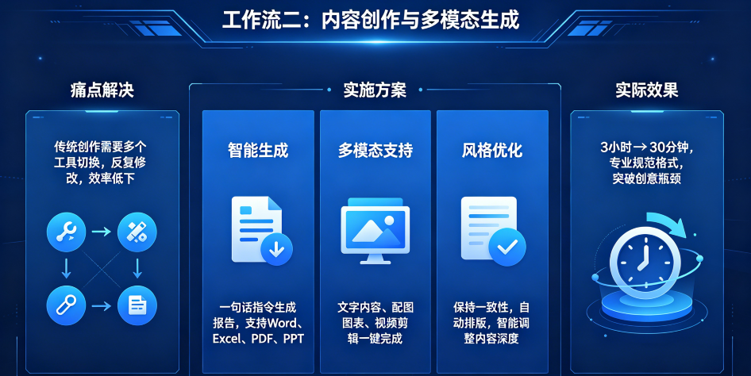
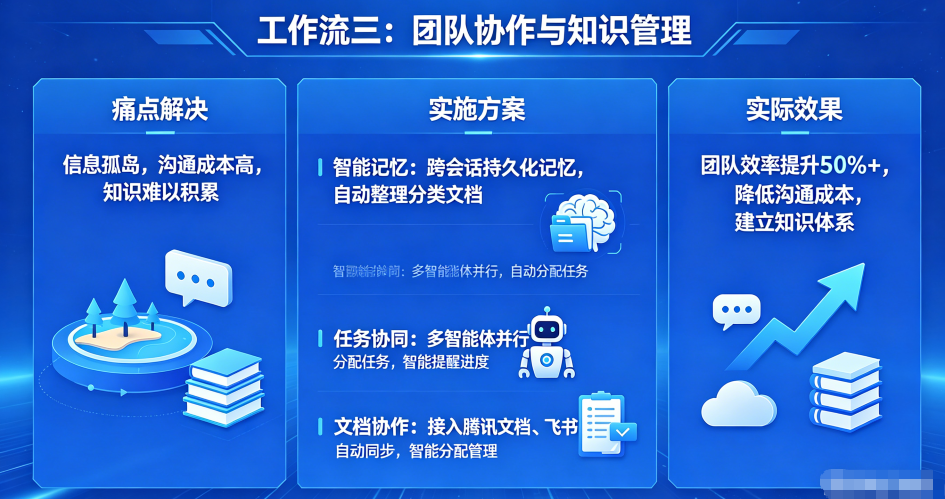
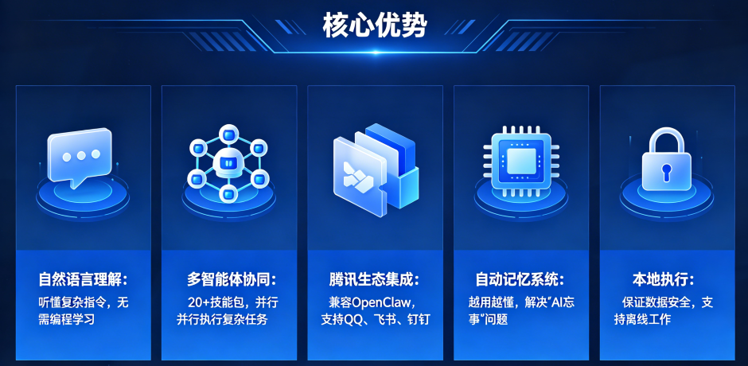
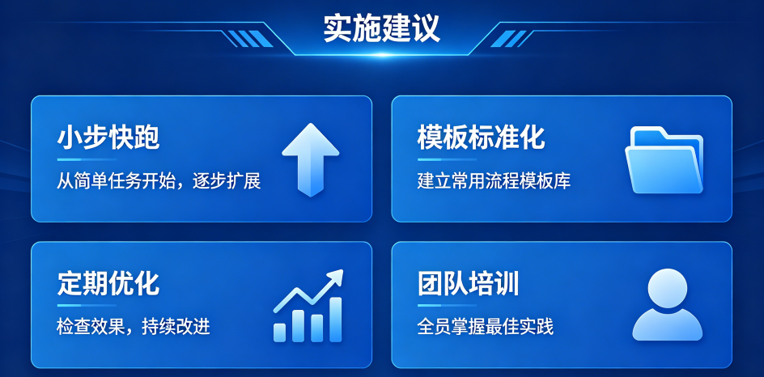
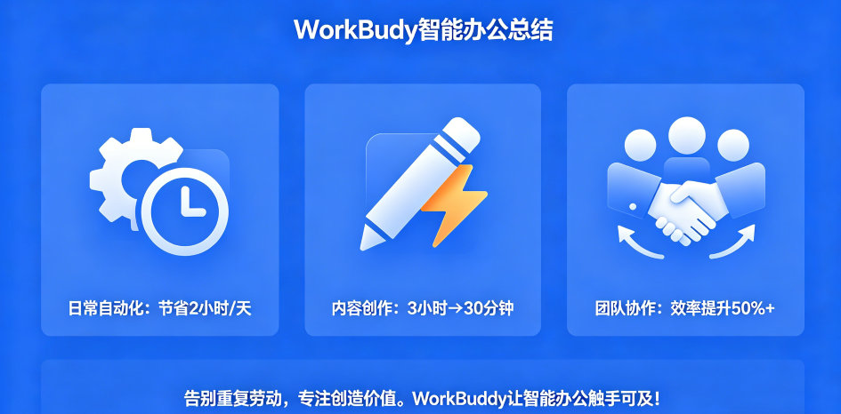

> 📎 来源: [AI转型教练](https://mp.weixin.qq.com/s?__biz=MzcwNzIxNjA3NQ==&mid=2247483996&idx=1&sn=c7a05889984666df6f95af04240a6973&chksm=f5470a2567c5f94dd32a3af2d3bb7a999381f9e4326957c58f263c981170111dcca1fc47a541&mpshare=1&scene=1&srcid=05274uytwiPQYTNTm8OVGjl6&sharer_shareinfo=62dd6d4cfe6e291aee2cbc420ec7b711&sharer_shareinfo_first=62dd6d4cfe6e291aee2cbc420ec7b711) | 时间: 2026-05-27 11:48

---

# 还在为重复性工作烦恼吗？WorkBuddy作为腾讯云AI智能体桌面工作台，能听懂自然语言指令，一句话完成复杂任务。本文分享三个实用工作流，帮你彻底改变办公方式。

##

## 工作流一：日常办公自动化

###

### 痛点解决

每天约34件机械操作（数据收集、格式转换、进度汇报）浪费大量时间。

###

### 实施方案

- **定时任务**

  ：设置9:30自动收集数据，配置"收集→转换→汇总→发送"流程

- **任务串联**

  ：将多个操作串成管道，从"机器人对话"升级为"智能执行"

- **跨应用协同**

  ：集成Excel、Word、邮件，自动传递数据，减少手动操作

### 实际效果

⏰ **每天节省2小时**，减少人为错误，提升工作专注度。

##

## 工作流二：内容创作与多模态生成

###

### 痛点解决

传统创作需要多个工具切换，反复修改，效率低下。

实施方案

- **智能生成**

  ：一句话指令生成报告，支持Word、Excel、PDF、PPT

- **多模态支持**

  ：文字内容、配图图表、视频剪辑一键完成

- **风格优化**

  ：保持一致性，自动排版，智能调整内容深度

### 实际效果

🚀 **3小时→30分钟**，专业规范格式，突破创意瓶颈。

##

## 工作流三：团队协作与知识管理

##

## 痛点解决

信息孤岛，沟通成本高，知识难以积累。

###

### 实施方案

- **智能记忆**

  ：跨会话持久化记忆，自动整理分类文档

- **任务协同**

  ：多智能体并行，自动分配任务，智能提醒进度

- **文档协作**

  ：接入腾讯文档、飞书，自动同步，智能分配管理

###

### 实际效果

📈 **团队效率提升50%+**，降低沟通成本，建立知识体系。

##

##

## 核心优势

1. **自然语言理解**

   ：听懂复杂指令，无需编程学习
2. **多智能体协同**

   ：20+技能包，并行执行复杂任务
3. **腾讯生态集成**

   ：兼容OpenClaw，支持QQ、飞书、钉钉
4. **自动记忆系统**

   ：越用越懂，解决"AI忘事"问题
5. **本地执行**

   ：保证数据安全，支持离线工作

##

## 实施建议

1. **小步快跑**

   ：从简单任务开始，逐步扩展
2. **模板标准化**

   ：建立常用流程模板库
3. **定期优化**

   ：检查效果，持续改进
4. **团队培训**

   ：全员掌握最佳实践

##

## 总结

WorkBuddy通过三个工作流为你带来：
 - ✅ 日常自动化：节省2小时/天
 - ✅ 内容创作：3小时→30分钟
 - ✅ 团队协作：效率提升50%+

掌握WorkBuddy，不仅是提高效率，更是适应智能办公的必备技能。让我们拥抱AI，开启办公新时代！

##

## 结语

告别重复劳动，专注创造价值。WorkBuddy让智能办公触手可及！

你用过WorkBuddy智能体工作台吗？体验如何？评论区聊聊 👇

**#WorkBuddy #AI办公助手 #打工人提效 #腾讯文档接入AI #职场效率工具**
