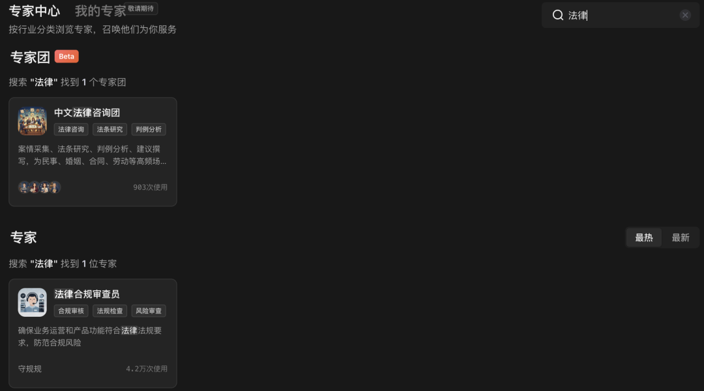
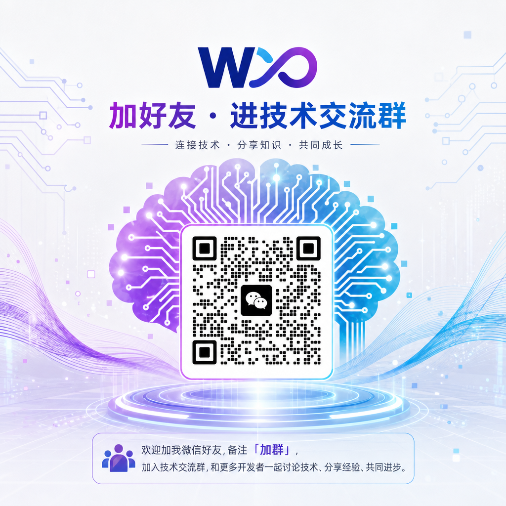

> 📎 来源: [智能进化Wayen](https://mp.weixin.qq.com/s?__biz=MzkzNDY1NzQ0Mg==&mid=2247486881&idx=1&sn=55aae295e6fb0d8711481bbab835e91d&chksm=c3e8a5b6e665ed8f527874757012a75767fe1cad89d3202166365d562c3a877d837e7529ec2b&mpshare=1&scene=1&srcid=0513WUmui1qwa2dg9zBquQ0f&sharer_shareinfo=2077da078a63e3b02b20d9a9fb6e274d&sharer_shareinfo_first=2077da078a63e3b02b20d9a9fb6e274d) | 时间: 2026-05-13 15:36

---

↑阅读之前记得关注+星标，每天第一时间接收更新

|  |  |
| --- | --- |
|  | 非法律专业人士也能起草合规合同 |

上个月，我帮一个创业朋友起草技术服务合同。

他公司刚起步，没有法务，找律师写一份合同要2000块。他问我："能不能用AI搞定？"

我说试试。

10分钟后，一份包含完整条款、风险提示、修改建议的合同摆在他面前。

他看完说："这比我自己写的专业多了。"

**今天分享这个方法。**

## 01 先说痛点：合同起草到底难在哪

你可能也遇到过：

•**条款遗漏**：不知道合同该包含哪些必备条款，签了才发现少了知识产权保护

•**措辞不专业**：自己写的条款像口语，对方一看就知道不正规

•**风险意识弱**：看不出对方埋的坑，比如不对等的违约责任

•**时间成本高**：一份合同来来回回改三四版，一周过去了

**核心问题不是"不会写"，而是"不知道标准是什么"。**

## 02 解决方案：让AI当你的合同助手

WorkBuddy的做法：

**你告诉它业务场景，它帮你生成符合规范的合同框架。**

不是替代律师，而是帮你把"从0到1"的框架搭好，关键条款不遗漏，明显风险能识别。

相比请律师起草的费用，这几乎可以忽略不计。

还有一点就是：要擅于召唤workbuddy的专家技能。



## 03 核心Prompt（直接复制使用）

这是我最常用的基础版本：

|  |
| --- |
| CODE |
| 请帮我起草一份[合同类型，如：技术服务合同]，场景如下： - 甲方：[公司A名称]，一家[行业]公司 - 乙方：[公司B名称]，提供[具体服务] - 服务期限：[起始日期]至[结束日期] - 服务费用：[金额]元 - 付款方式：[分期/一次性]  要求： 1. 包含完整的法律条款（保密、知识产权、违约责任、争议解决） 2. 标注需要法务复核的关键条款 3. 输出为Word格式，符合商务合同排版规范 4. 在【风险提示】部分列出3-5个常见风险点 |

**使用说明：**

•把 

```
[合同类型]
```

 换成实际类型：技术服务合同、保密协议、采购合同、劳动合同等

•把 

```
[公司A/B]
```

 换成实际公司名称

•把 

```
[具体服务]
```

 换成实际服务内容

•金额、期限、付款方式按实际填写

## 04 进阶用法：基于历史合同生成

如果你有历史合同模板，可以让WorkBuddy基于模板生成：

|  |
| --- |
| CODE |
| 读取"[文件夹路径]/[历史合同模板].docx"，基于该模板起草一份新的[合同类型]：  【新合同信息】 - 甲方：[公司A] - 乙方：[公司B] - 服务内容：[具体服务] - 金额：[金额] - 期限：[期限]  【要求】 1. 保持原模板的条款结构和格式 2. 替换为新合同的具体信息 3. 标注与原模板不同的条款 4. 在【风险提示】中列出需要注意的变更 |

**前提条件：**

•有历史合同模板文件

•模板结构清晰，条款完整

这样生成的合同既保持专业度，又贴合你的业务习惯。

## 05 完整操作步骤

**Step 1：明确合同基本信息**

准备以下信息：

•合同类型（技术服务/采购/保密/劳动等）

•甲乙双方名称和基本信息

•服务/产品内容和范围

•金额、付款方式、期限

•特殊要求（如有）

**Step 2：复制Prompt到WorkBuddy**

把上面的Prompt模板复制到对话框，填入具体信息。

**Step 3：发送并等待生成**

通常30-60秒生成完整合同框架。

**Step 4：人工复核关键条款**

**重要：AI生成的合同是框架，不是最终版。务必检查：**

•金额、日期、名称等事实信息是否准确

•违约责任是否对等（不要只约束一方）

•知识产权归属是否符合你的利益

•争议解决条款（仲裁/诉讼地点）是否可接受

•保密期限是否合理

**Step 5：提交法务审核**

**无论AI生成得多好，正式签署前必须经法务或律师审核。**

AI帮你省的是"从零写"的时间，不是"审核"的环节。

## 06 避坑指南：这4个错误千万别犯

**❌ 错误1：直接签署AI生成的合同**

AI生成的合同是框架，不是法律意见。直接签署风险极大。

**✅ 正确做法**：作为初稿，提交法务审核后再签署。

**❌ 错误2：输入信息不完整**

如果你只写"帮我写个合同"，AI只能生成通用模板，可能遗漏你业务特有的条款。

**✅ 正确做法**：提供详细的业务背景、双方信息、服务范围。

**❌ 错误3：忽视风险提示**

AI标注的风险提示往往是最值得关注的部分，不要跳过。

**✅ 正确做法**：逐条阅读风险提示，确认是否适用你的场景。

**❌ 错误4：使用过期模板**

法律法规会更新，比如《民法典》实施后很多合同条款需要调整。

**✅ 正确做法**：定期更新合同模板，或让AI基于最新法规生成。

## 07 Credit省钱技巧

**基础版**：

•只提供基本信息，生成标准框架

•适合常见合同类型（服务合同、保密协议）

**进阶版**：

•增加历史模板参考、特殊条款要求

•适合复杂合同（联合开发、股权投资）

**省钱秘诀：**

•把常用合同类型保存为Skill，下次直接调用

•生成框架后，自己补充细节，减少AI工作量

•同一类型合同，生成一次后作为模板复用

## 08 我的使用心得

今天在写这篇文章的时候，我突然有几个感受：

**第一，起草速度提升10倍。**

以前一份合同从零写要半天，现在10分钟出框架，自己再花半小时调整。

**第二，条款完整性大幅提高。**

AI不会遗漏"不可抗力""争议解决"这类容易被忽略的条款。

**第三，风险意识变强了。**

AI标注的风险提示让我学会了从更多维度审视合同。

## 09 总结一下

**核心逻辑：**

•你负责"提供业务信息"

•AI负责"生成标准框架"

•你负责"补充业务细节"

•法务负责"最终审核"

**4个关键：**

1信息要完整（双方信息、服务内容、金额期限）

2条款要复核（违约责任、知识产权、争议解决）

3风险要关注（AI标注的风险提示逐条看）

4法务要过审（正式签署前必须经专业审核）

## 下期预告

**方法05｜多文档合并与目录生成**

项目结项、年度总结时需要将分散的多个文档合并成一份完整报告，手动复制粘贴格式混乱、页码错乱？WorkBuddy自动合并、统一格式、自动生成目录。

Prompt模板+操作步骤+避坑指南，下周见。

**📱 扫码加好友入读者群，领取《WorkBuddy 100种方法操作手册》完整版**

群里见。

W∞ 智能进化 · 智能驱动 · 无限可能

我把麻烦事研究透，你只管拿去用。我蹚坑，你受益，有用就关注，常看就星标。

AI时代的新工具和野路子，第一时间同步你。

关于作者：Wayen，世界500强企业教练+AI职场提效专家。专注研究AI提效、人才赋能、管理提升，信奉"把重复的事交给AI，把思考的事留给自己"。


