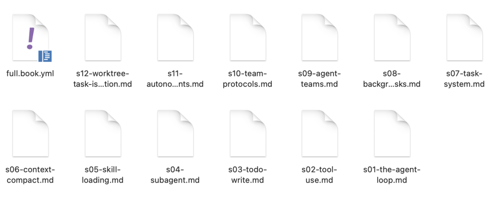
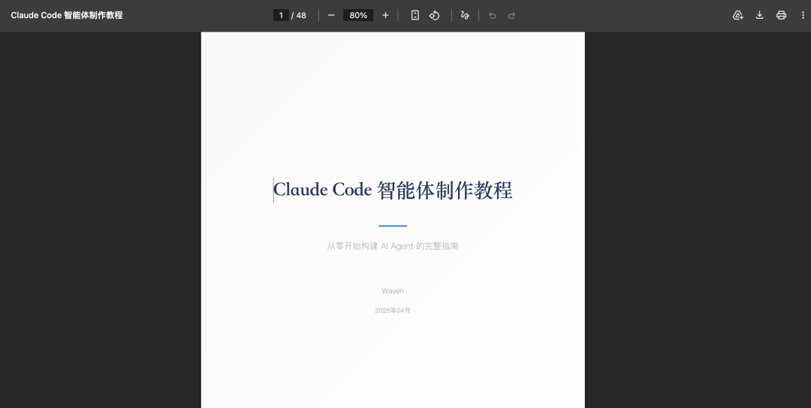

> 📎 来源: [智能进化Wayen](https://mp.weixin.qq.com/s?__biz=MzkzNDY1NzQ0Mg==&mid=2247486916&idx=1&sn=170aa353f5788bcdff28bafc47d212bc&chksm=c3e4e47cf5cbfd686e22fdc7be79fe22a1d9f6bd84bc20a29ed51d1fc79c341492f3b298c7cb&mpshare=1&scene=1&srcid=0513Tj8N17Xx38yCxUpQ7yBH&sharer_shareinfo=ca2b36da33503557c5a4cbe5c2c0b60b&sharer_shareinfo_first=ca2b36da33503557c5a4cbe5c2c0b60b) | 时间: 2026-05-13 15:36

---

↑阅读之前记得关注+星标，每天第一时间接收更新


|  |  |
| --- | --- |
|  | 项目结项、年度总结时，告别手动复制粘贴 |

最近给大家的内容，我都会做个精美的PDF发给大家。

比如《Workbuddy AI职场百法》、《姚金刚提示词合集》。。

需要把很多个文档合并成一份完整报告：封面、项目概述、执行过程、成果展示、总结与展望。

搁以前，我打开第一个文档，复制，粘贴到新建文档里。然后调整格式、改页码、调标题层级。

第二个文档、第三个……

2小时过去了，格式还是乱的，页码对不上，目录更是无从谈起。

**然后我打开了WorkBuddy。**

输入一句话，3分钟后，一份格式统一、页码正确、目录完整的报告躺在桌面上。

**今天分享这个方法。**

## 01 先说痛点：文档合并到底烦在哪

你可能也遇到过：

•**格式混乱**：不同来源的文档字体、行距、标题层级不统一

•**页码错乱**：合并后页码从头开始，需要手动调整

•**目录缺失**：手动生成目录费时，且容易遗漏

•**重复劳动**：每次合并都要重复同样的操作

**核心问题不是"不会合并"，而是"合并后的整理工作太繁琐"。**

## 02 解决方案：让AI当你的文档管家

WorkBuddy的做法：

**你指定要合并的文件和顺序，它帮你自动合并、统一格式、生成目录。**

不需要你手动复制粘贴、调整格式、更新页码。

相比手动操作2小时的时间成本，这简直就是白送。

## 03 核心Prompt（直接复制使用）

这是我最常用的基础版本：

|  |
| --- |
| CODE |
| 请将"[文件夹路径]"中的以下文档按顺序合并： 1. 封面.docx 2. 项目概述.docx 3. 执行过程.docx 4. 成果展示.docx 5. 总结与展望.docx  要求： - 统一字体为微软雅黑，正文小四号 - 自动生成目录（含页码） - 每部分从新的一页开始 - 页码从正文开始计算 - 输出为"[项目名称]\_完整报告.docx" |

**使用说明：**

•把 

```
[文件夹路径]
```

 换成实际路径，如 

```
桌面/项目报告
```

•按实际文件名称和顺序列出

•把 

```
[项目名称]
```

 换成实际项目名称

## 04 进阶用法：自动提取并合并

如果你有一堆文件需要按规则合并：

|  |
| --- |
| CODE |
| 请把"[文件夹路径]"中所有以"[前缀]"开头的Word文档按文件名排序合并：  【要求】 1. 统一标题层级（一级标题、二级标题） 2. 每份文档之间插入分页符 3. 生成总目录 4. 添加页眉（项目名称）和页脚（页码） 5. 输出为"[项目名称]\_汇总报告.docx" |

**适用场景：**

•月度报告汇总

•项目文档归档

•会议纪要合集

•培训资料汇编

## 05 完整操作步骤

**Step 1：整理待合并文件**

把所有需要合并的文档放入同一个文件夹，确保：

•文件格式一致（建议都用.docx）

•文件名能反映顺序（如01\_封面、02\_概述）

•各文档的标题层级清晰

**Step 2：复制Prompt到WorkBuddy**

把上面的Prompt模板复制到对话框，填入文件夹路径和文件列表。

**Step 3：发送并等待生成**

通常1-3分钟完成合并（取决于文件数量和大小）。

**Step 4：检查结果**

重点检查：

•文件顺序是否正确

•标题层级是否统一

•页码是否连续

•目录是否完整

•格式是否一致

**Step 5：保存并归档**

确认无误后保存，建议保留原始文件以备修改。



然后成果：



## 06 避坑指南：这3个错误千万别犯

**❌ 错误1：文件格式混用**

.doc和.docx混用可能导致格式丢失。

**✅ 正确做法**：统一转换为.md/.doc格式后再合并。

**❌ 错误2：标题层级混乱**

如果各文档的标题层级不统一，合并后的目录会错乱。

**✅ 正确做法**：合并前先用WorkBuddy统一各文档的标题层级。

**❌ 错误3：图片和表格丢失**

合并过程中可能出现图片错位、表格变形。

**✅ 正确做法**：合并后逐页检查，特别是含图片和表格的页面。

## 07 Credit省钱技巧

**基础版**：

•合并2-5个文档，统一基本格式

•适合日常报告汇总

**进阶版**：

•合并5个以上文档，生成完整目录和页眉页脚

•适合项目结项报告、年度总结

**省钱秘诀：**

•提前统一各文档的标题层级，减少AI调整工作量

•合并前先检查文件格式一致性

•把常用合并任务保存为Skill

最后我把这个工作变成的md2book skill。

## 08 我的使用心得

用了这个方法两个月，我有几个感受：

**第一，报告整理时间从2小时降到5分钟。**

以前结项报告要整理半天，现在一句话搞定。

**第二，格式一致性大幅提高。**

手动合并总有些地方对不齐，AI合并后格式统一专业。

**第三，目录生成不再是噩梦。**

以前最怕生成目录，现在自动完成，还能自动更新页码。

## 09 总结一下

**核心逻辑：**

•你负责"指定文件和顺序"

•AI负责"合并、排版、生成目录"

•你负责"最终检查"

**3个关键：**

1文件要整理好（统一格式、明确顺序）

2标题层级要清晰（便于生成目录）

3合并后要检查（特别是图片和表格）

## 下期预告

**方法06｜扫描件PDF文字提取（OCR）**

收到扫描版PDF合同、发票、证件，无法直接复制文字？WorkBuddy精准识别扫描件/图片型PDF文字，自动提取并输出可编辑文档。

Prompt模板+操作步骤+避坑指南，下周见。

**作者介绍**

Wayen，企业教练+AI职场提效专家。专注于帮助职场人用AI工具提升工作效率，把重复性工作交给机器，把时间留给自己。

我把麻烦事研究透，让你直接拿去用。

**📱 关注公众号，扫码加入读者群，领取《WorkBuddy 100种方法操作手册》完整版**

群里见。

W∞ 智能进化 · 智能驱动 · 无限可能

我把麻烦事研究透，你只管拿去用。我蹚坑，你受益，有用就关注，常看就星标。

AI时代的新工具和野路子，第一时间同步你。

关于作者：Wayen，世界500强企业教练+AI职场提效专家。专注研究AI提效、人才赋能、管理提升，信奉"把重复的事交给AI，把思考的事留给自己"。


