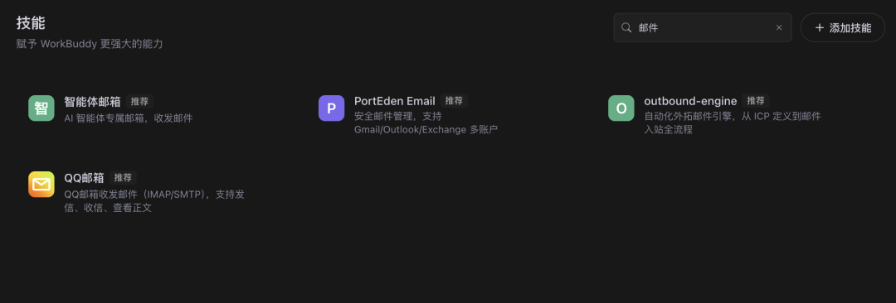
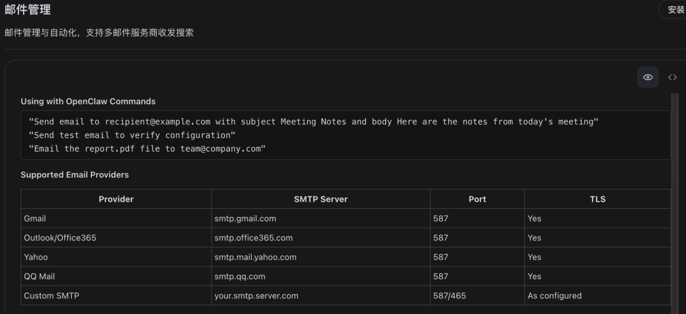

> 📎 来源: [智能进化Wayen](https://mp.weixin.qq.com/s?__biz=MzkzNDY1NzQ0Mg==&mid=2247487075&idx=1&sn=10107659f65335ff34c9f3ff4785010b&chksm=c3111a12e62bfcc3172640ab0d369949f6f8eda81812954b7723888566fae2d9ee83286c5d16&mpshare=1&scene=1&srcid=0513pkvySckae0zua4aAc5TX&sharer_shareinfo=7c5992a0c798b95fe05e53934bff1132&sharer_shareinfo_first=7c5992a0c798b95fe05e53934bff1132) | 时间: 2026-05-13 15:35

---

↑阅读之前记得关注+星标，每天第一时间接收更新

|  |  |
| --- | --- |
|  | 批量生成个性化邮件，告别重复劳动 |

你们有没有面临到这些场景：给领导发邀请函、写入职通知、写参训通知等等，每次光核对时间、名字就头大，还有机构等信息就更完犊子了。

上个月，公司一同事给我分享，公司组织员工专项培训。

HR小王的任务：给每个人发入职通知邮件，内容包括欢迎语、入职时间、地点、需携带材料、联系人等。

她打开邮箱，新建邮件，复制粘贴模板，修改姓名、岗位、日期……发送。

然后重复10次。

30分钟过去了，眼睛都花了，还担心有没有把谁的岗位写错。

**然后我让她用WorkBuddy。**

输入一句话，2分钟后，10封个性化邮件内容全部生成，直接复制到邮箱就能发。

**今天分享这个方法。**




**要先用AI绑定对接邮箱哈**



## 01 先说痛点：批量邮件到底烦在哪

你可能也遇到过：

•**重复劳动**：同样的模板，改个名字发一遍，再改个名字再发一遍

•**容易出错**：姓名、岗位、日期写错，对方一看就不专业

•**效率低下**：几十封邮件要发一上午

•**缺乏个性化**：纯群发显得敷衍，一对一又太耗时

**核心问题不是"不会写邮件"，而是"重复性工作不该由人来做"。**

## 02 解决方案：让AI当你的邮件助手

WorkBuddy的做法：

**你提供模板和收件人列表，它批量生成个性化邮件内容。**

不需要你手动修改每一封邮件，不需要担心写错信息。

相比手动发送1小时的时间成本，这简直就是白送。

## 03 核心Prompt（直接复制使用）

这是我最常用的基础版本：

|  |
| --- |
| CODE |
| 请基于以下模板，为收件人列表生成个性化邮件，我以入职培训为例：  【模板】 尊敬的[姓名]： 您好！欢迎加入[公司名]。您的入职日期为[日期]，岗位为[岗位]。 请携带[材料清单]于[时间]到[地点]准时参加培训。  【收件人列表】 读取"[Excel文件路径]"中的"入职名单"Sheet  要求： 1. 每封邮件替换对应的姓名、岗位、日期 2. 生成邮件正文列表，保存为Word 3. 标注每封邮件对应的收件人邮箱 |

**使用说明：**

•把 

```
[Excel文件路径]
```

 换成实际的收件人信息表路径

•确保Excel包含：姓名、邮箱、岗位、日期等字段

•把 

```
[公司名]
```

、

```
[材料清单]
```

、

```
[时间]
```

、

```
[地点]
```

 换成实际信息

以前的时候，熟悉Word操作的伙伴，可能会了解怎么操作，但是也是真麻烦。

有了AI，能动动嘴的事情何必动手呢，能吵吵的就不动手。

## 04 进阶用法：销售跟进邮件批量生成

如果你是销售，需要给客户发跟进邮件：

|  |
| --- |
| CODE |
| 请基于以下模板，为客户列表生成个性化跟进邮件：  【模板】 尊敬的[客户姓名]： 您好！我是[公司名]的[你的姓名]。  感谢您上周对[产品名]的关注。 根据您的需求，我为您准备了以下方案： [方案摘要]  期待与您进一步沟通。  【客户列表】 读取"[Excel文件路径]"中的"客户跟进"Sheet  【要求】 1. 每封邮件根据客户行业和需求定制方案摘要 2. 语气专业但不生硬 3. 生成邮件正文和主题行 4. 标注每封对应的客户邮箱 |

**适用场景：**

•HR：入职通知、面试邀请、节日祝福

•销售：客户跟进、方案发送、活动邀请

•行政：会议通知、政策传达、提醒邮件

•市场：活动邀请、调研问卷、 newsletter

## 05 完整操作步骤

**Step 1：准备收件人信息表**

创建Excel表格，包含以下字段：

•姓名

•邮箱

•岗位/公司（如适用）

•日期（如适用）

•其他个性化字段

**Step 2：准备邮件模板**

确定邮件内容框架，标注需要替换的变量：

•[姓名]

•[公司名]

•[日期]

•[岗位]

•其他个性化内容

**Step 3：复制Prompt到WorkBuddy**

把上面的Prompt模板复制到对话框，填入模板和文件路径。

**Step 4：发送并等待生成**

通常1-2分钟生成所有邮件内容。

**Step 5：人工复核并发送**

**重要：批量生成后务必检查：**

•姓名和邮箱是否对应正确

•日期、岗位等关键信息是否准确

•邮件语气是否合适

•然后复制到邮箱发送

## 06 避坑指南：这3个错误千万别犯

**❌ 错误1：姓名和邮箱对应错误**

如果Excel里的姓名和邮箱行对不齐，可能导致发给A的邮件写了B的名字。

**✅ 正确做法**：生成后抽样检查姓名和邮箱的对应关系。

**❌ 错误2：邮件内容过于模板化**

如果模板本身缺乏个性化，批量生成的邮件会显得敷衍。

**✅ 正确做法**：在模板中加入至少2-3个个性化字段。

**❌ 错误3：直接群发不检查**

批量生成后直接发送，可能有个别错误没发现。

**✅ 正确做法**：至少快速浏览一遍，特别是重要客户的邮件。

## 07 Credit省钱技巧

**基础版**：

•10-20封邮件批量生成

•基础模板替换

**进阶版**：

•50封以上邮件

•包含个性化内容定制

•生成邮件主题行

**省钱秘诀：**

•提前准备好完整的收件人信息表

•模板设计时预留足够的个性化字段

•把常用邮件模板保存为Skill

## 08 我的使用心得

用了这个方法两个月，我有几个感受：

**第一，邮件发送效率提升20倍。**

以前1小时的邮件工作，现在5分钟搞定。

**第二，错误率大幅降低。**

手动修改容易写错名字或日期，AI批量生成后只要检查一遍。

**第三，个性化程度反而提高了。**

因为不耗时，可以给每封邮件加入更多个性化内容。

## 09 总结一下

**核心逻辑：**

•你负责"准备模板和收件人列表"

•AI负责"批量生成个性化内容"

•你负责"复核并发送"

**3个关键：**

1信息表要准确（姓名、邮箱、岗位、日期）

2模板要预留个性化字段

3发送前要复核（特别是重要客户）

## 下期预告

**方法09｜技术文档自动生成**

项目上线前需要编写API文档、部署文档、用户手册，时间紧迫且容易遗漏？WorkBuddy从代码注释提取信息，自动生成Swagger/OpenAPI文档、架构图和说明。

Prompt模板+操作步骤+避坑指南，下周见。

**📱 扫码加入读者群，领取《WorkBuddy 100种方法操作手册》完整版**

群里见。

W∞ 智能进化 · 智能驱动 · 无限可能

我把麻烦事研究透，你只管拿去用。我蹚坑，你受益，有用就关注，常看就星标。

AI时代的新工具和野路子，第一时间同步你。

关于作者：Wayen，世界500强企业教练+AI职场提效专家。专注研究AI提效、人才赋能、管理提升，信奉"把重复的事交给AI，把思考的事留给自己"。


