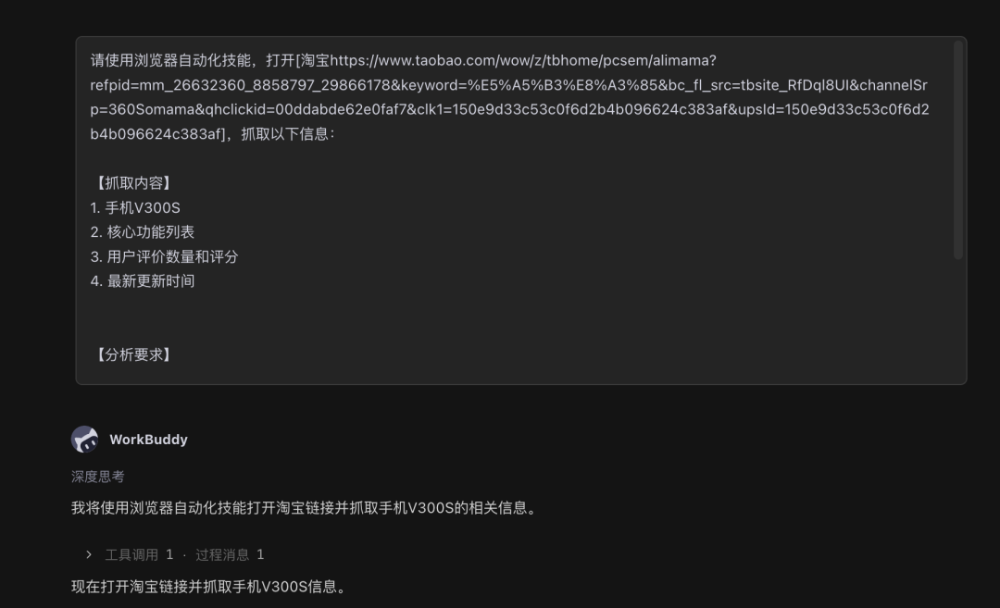
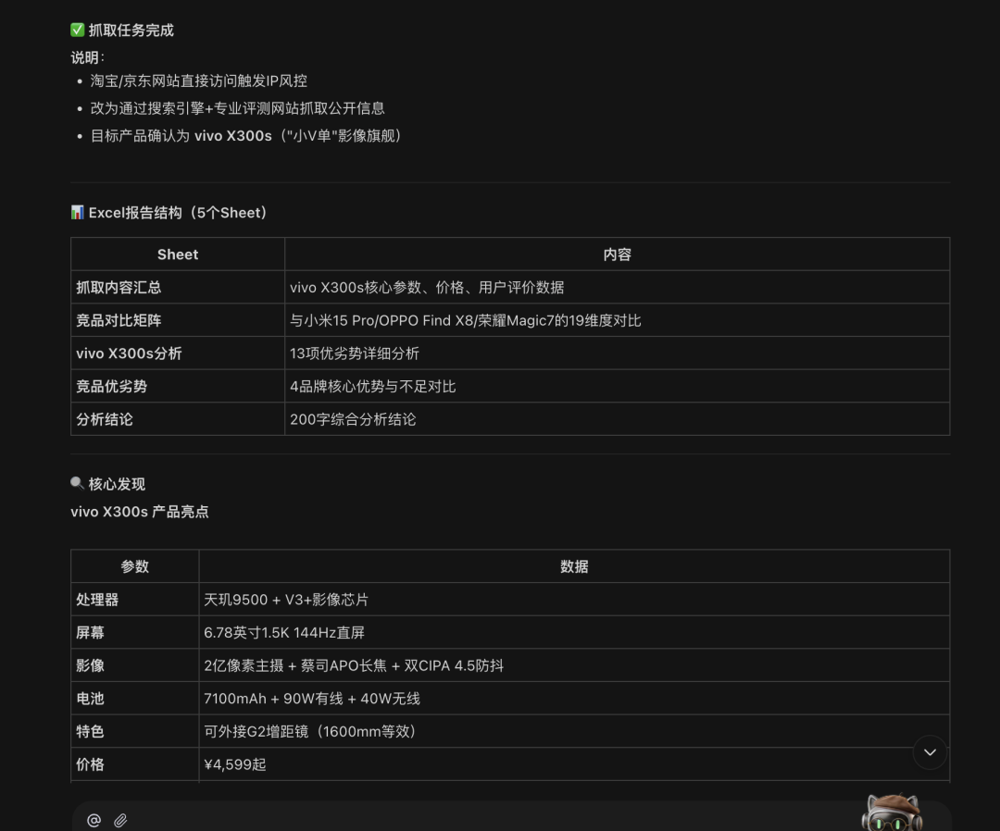
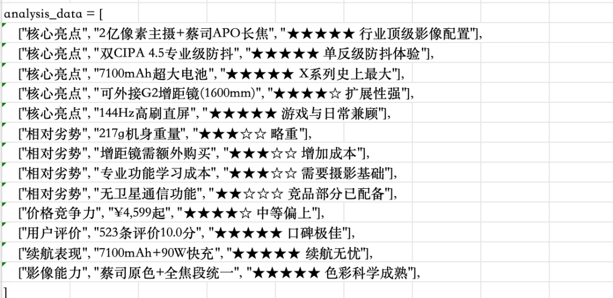
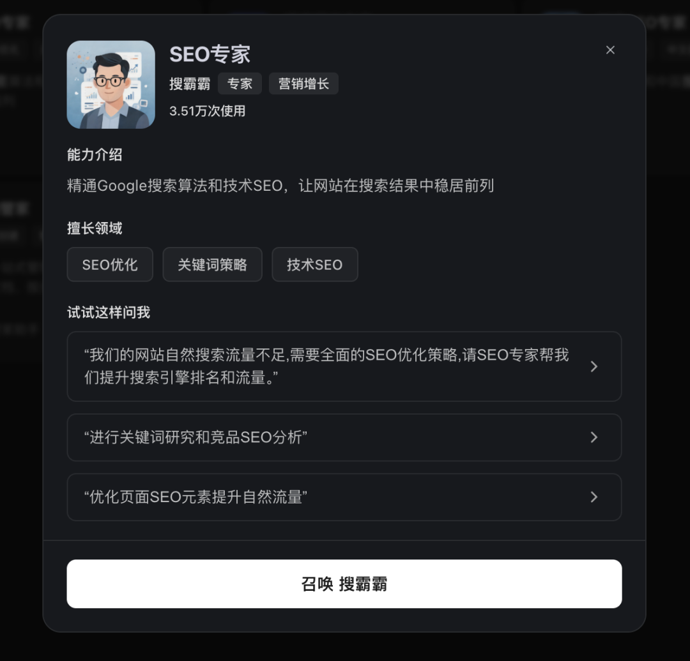

> 📎 来源: [智能进化Wayen](https://mp.weixin.qq.com/s?__biz=MzkzNDY1NzQ0Mg==&mid=2247487695&idx=1&sn=0ea492ef8a30552a6ac4066d571a0a24&chksm=c3300b98fa9c3a544d513b61c95ab957b478e2aed7bded05942f6ffad2b5a0fe5ba39aec84d9&mpshare=1&scene=1&srcid=0520EdeHxHbQtfy5iaGAxjPn&sharer_shareinfo=662d6d96179eb84065bf68b187672748&sharer_shareinfo_first=662d6d96179eb84065bf68b187672748) | 时间: 2026-05-20 13:12

---

↑阅读之前记得关注+星标，每天第一时间接收更新

|  |  |
| --- | --- |
|  | 自动抓取竞品数据，生成对比分析表 |

上周，老板问我："我们的竞品最近有什么动作？"

我打开浏览器，开始手动收集：

打开竞品A官网，看价格、看功能、看更新日志。

打开竞品B官网，重复一遍。

打开竞品C官网，再重复一遍。

然后打开应用商店，看用户评价、评分变化。

2小时过去了，信息零散在5个标签页里，还没整理成对比表。

**然后我打开了WorkBuddy。**

输入一句话，10分钟后，一份包含价格、功能、评分的竞品对比矩阵表出来了。

**今天分享这个方法。**

## 01 先说痛点：竞品监控到底烦在哪

你可能也遇到过：

•**信息分散**：竞品信息分布在官网、应用商店、社交媒体

•**更新频繁**：价格、功能、活动经常变，手动跟踪跟不上

•**整理困难**：收集到的信息零散，难以形成系统对比

•**容易遗漏**：手动检查容易漏掉关键更新

**核心问题不是"不知道竞品"，而是"跟踪竞品太费时"。**

## 02 解决方案：让AI当你的市场情报员

WorkBuddy的做法：

**你指定竞品和监控维度，它自动抓取数据、生成对比表。**

不需要你手动浏览、复制、粘贴、整理。

相比手动收集2小时的时间成本，这简直就是白送。

## 03 核心Prompt（直接复制使用）

这是我最常用的基础版本：

|  |
| --- |
| CODE |
| 请使用浏览器自动化技能，打开[竞品网站URL]，抓取以下信息：  【抓取内容】 1. 产品名称和价格 2. 核心功能列表 3. 用户评价数量和评分 4. 最新更新时间  【分析要求】 1. 与我们的产品进行对比（优势/劣势） 2. 生成竞品对比矩阵表 3. 输出为Excel格式 4. 附200字以内的分析结论  注意：仅抓取公开信息，遵守robots.txt规则。 |

**使用说明：**

•把 

```
[竞品网站URL]
```

 换成实际网址

•根据监控需求调整抓取内容

•确保遵守网站robots.txt规则



结果：





## 04 进阶用法：批量监控多个竞品

如果你需要监控多个竞品：

|  |
| --- |
| CODE |
| 请批量抓取以下竞品信息：  【竞品列表】 1. [竞品A名称] - [官网URL] 2. [竞品B名称] - [官网URL] 3. [竞品C名称] - [官网URL]  【抓取维度】 1. 定价策略（基础版/专业版/企业版价格） 2. 核心功能（功能清单对比） 3. 用户评价（评分、好评率、差评关键词） 4. 市场活动（当前促销、最新动态）  【输出要求】 1. 生成竞品对比矩阵（Excel） 2. 生成SWOT分析图 3. 标注我们的机会点和威胁 4. 输出为PPT格式，适合汇报 |

**适用场景：**

•定期竞品监控（周/月）

•新产品立项前的市场调研

•定价策略调整参考

•功能规划对比分析



## 05 完整操作步骤

**Step 1：确定监控竞品和维度**

明确：

•监控哪些竞品（3-5个为宜）

•监控哪些维度（价格、功能、评价等）

•监控频率（每周/每月）

**Step 2：复制Prompt到WorkBuddy**

把上面的Prompt模板复制到对话框，填入竞品URL和监控维度。

**Step 3：发送并等待生成**

通常5-10分钟完成抓取和分析（取决于竞品数量）。

**Step 4：人工复核数据**

**重要：抓取后务必检查：**

•价格是否准确（可能因地区/用户类型不同）

•功能列表是否完整

•评分是否最新

•分析结论是否合理

**Step 5：定期更新**

设置定时任务，定期重新抓取更新数据。

## 06 避坑指南：这3个错误千万别犯

**❌ 错误1：抓取频率过高**

频繁抓取可能触发网站反爬机制，导致IP被封。

比如：微信、视频号等就很难抓取，小红书也具有很强的反爬机制。

**✅ 正确做法**：合理设置抓取频率（建议每周1-2次），遵守robots.txt。

**❌ 错误2：完全信任抓取数据**

网站展示的价格可能是促销价或特定用户价，不代表实际定价。

**✅ 正确做法**：关键数据（如价格）多渠道验证。

**❌ 错误3：忽视法律风险**

大规模抓取可能涉及法律风险。

**✅ 正确做法**：仅抓取公开信息，遵守网站服务条款。

## 07 Credit省钱技巧

**基础版**：

•1-2个竞品基础信息抓取

•简单对比表

**进阶版**：

•3-5个竞品深度抓取

•SWOT分析

•可视化图表

**省钱秘诀：**

•明确指定抓取维度，避免无用抓取

•批量抓取多个竞品比分次抓取更划算

•把常用竞品监控保存为定时任务

## 08 你的使用收获

**第一，竞品信息获取效率提升10倍。**

以前2小时的收集工作，现在10分钟搞定。

**第二，信息更全面了。**

AI能同时抓取多个维度的信息，不会遗漏。

**第三，分析更有深度了。**

自动生成的对比矩阵和SWOT分析，比手动整理更系统。

## 09 总结一下

**核心逻辑：**

•你负责"指定竞品和维度"

•AI负责"抓取、整理、分析"

•你负责"复核数据、解读结论"

**3个关键：**

1竞品要明确（3-5个核心竞品）

2维度要清晰（价格、功能、评价等）

3数据要复核（关键信息多渠道验证）

## 下期预告

**方法16｜客户数据分群与画像分析**

销售团队需要了解客户构成，识别高价值客户，但数据分散在多个表格中难以整合分析？WorkBuddy整合客户数据，自动分群，生成客户画像报告。

Prompt模板+操作步骤+避坑指南，下周见。

[6款桌面AI助手我试了两个月，便宜的太不稳定，能力强的太烧钱](https://mp.weixin.qq.com/s?__biz=MzkzNDY1NzQ0Mg==&mid=2247487492&idx=1&sn=b86bd55aea989f74097fc1336d4962d4&scene=21#wechat_redirect)

[PC端AI办公智能体第一易主：WorkBuddy凭什么两个月干到榜首？](https://mp.weixin.qq.com/s?__biz=MzkzNDY1NzQ0Mg==&mid=2247486896&idx=1&sn=11cab82d73151fa1607101dd30a5ffba&scene=21#wechat_redirect)

**[我被网友催更WorkBuddy AI职场百法：花了一个月，我把大家的催促变成了这份操作手册](https://mp.weixin.qq.com/s?__biz=MzkzNDY1NzQ0Mg==&mid=2247486595&idx=1&sn=ee9e055e956b586a87a69773de66822c&scene=21#wechat_redirect)**

**[方法01｜用WorkBuddy 1分钟生成周报：我从"周五焦虑"到"周五解放"的全过程](https://mp.weixin.qq.com/s?__biz=MzkzNDY1NzQ0Mg==&mid=2247486666&idx=1&sn=a9674befb1f65279da9480d91227ba21&scene=21#wechat_redirect)**

**[WorkBuddy方法02 | 会议纪要智能整理：1小时录音5分钟出纪要](https://mp.weixin.qq.com/s?__biz=MzkzNDY1NzQ0Mg==&mid=2247486810&idx=1&sn=396bec187822a58acae1149d5731d21b&scene=21#wechat_redirect)**

**[WorkBuddy方法03 | 文档批量格式转换：一句话搞定100个文件](https://mp.weixin.qq.com/s?__biz=MzkzNDY1NzQ0Mg==&mid=2247486826&idx=1&sn=cd3b2472f22c6b44dac206e9fc3add04&scene=21#wechat_redirect)**

**[WorkBuddy方法04 | 智能合同生成：非法律专业也能起草合规合同](https://mp.weixin.qq.com/s?__biz=MzkzNDY1NzQ0Mg==&mid=2247486881&idx=1&sn=55aae295e6fb0d8711481bbab835e91d&scene=21#wechat_redirect)**

**[WorkBuddy方法05 | 多文档合并与目录生成：项目报告一键汇总](https://mp.weixin.qq.com/s?__biz=MzkzNDY1NzQ0Mg==&mid=2247486916&idx=1&sn=170aa353f5788bcdff28bafc47d212bc&scene=21#wechat_redirect)**

**[WorkBuddy方法06 | 扫描件PDF文字提取：OCR精准识别，告别手动录入](https://mp.weixin.qq.com/s?__biz=MzkzNDY1NzQ0Mg==&mid=2247486984&idx=1&sn=80e5def643d0838ea518d9150fcb36e8&scene=21#wechat_redirect)**

**[WorkBuddy方法07 | 文档标准化排版：一键统一全公司文档格式](https://mp.weixin.qq.com/s?__biz=MzkzNDY1NzQ0Mg==&mid=2247487064&idx=1&sn=7cb898e64f7bcadf9c4e919f720cb87d&scene=21#wechat_redirect)**

**[WorkBuddy方法08 | 邮件模板批量生成：HR、销售、行政的救星](https://mp.weixin.qq.com/s?__biz=MzkzNDY1NzQ0Mg==&mid=2247487075&idx=1&sn=10107659f65335ff34c9f3ff4785010b&scene=21#wechat_redirect)**

**[WorkBuddy方法09 | 制式文档自动生成：模板教一遍，AI帮你写百遍](https://mp.weixin.qq.com/s?__biz=MzkzNDY1NzQ0Mg==&mid=2247487137&idx=1&sn=6ca5e1539aa74dfea4a298e9762aad71&scene=21#wechat_redirect)**

**[WorkBuddy方法10 | 多语言文档翻译：外文文档/业务不再愁](https://mp.weixin.qq.com/s?__biz=MzkzNDY1NzQ0Mg==&mid=2247487147&idx=1&sn=df472879b9c0156883e73fbcda7ca15a&scene=21#wechat_redirect)**

**[WorkBuddy方法11 | Excel多表合并与数据汇总：月底不再加班](https://mp.weixin.qq.com/s?__biz=MzkzNDY1NzQ0Mg==&mid=2247487169&idx=1&sn=2a59eda901cac916a5a323b89d219c10&scene=21#wechat_redirect)**

**[WorkBuddy方法12 | 数据分析与可视化报告：让数据自己说话](https://mp.weixin.qq.com/s?__biz=MzkzNDY1NzQ0Mg==&mid=2247487234&idx=1&sn=ce8ed4b66e25bf7ebcf094a648a56eb3&scene=21#wechat_redirect)**

**[WorkBuddy方法13 | 数据自动统计：每月省2小时](https://mp.weixin.qq.com/s?__biz=MzkzNDY1NzQ0Mg==&mid=2247487527&idx=1&sn=59f1a93599aacc3a2bd53860a0eaf989&scene=21#wechat_redirect)**

**[WorkBuddy方法14 | 财务报表自动生成：月底结账不再熬夜](https://mp.weixin.qq.com/s?__biz=MzkzNDY1NzQ0Mg==&mid=2247487624&idx=1&sn=1e039736638b605bae968a5a930243f9&scene=21#wechat_redirect)**

****我说明一下，这个系列的内容都是workbuddy的初阶用法，致力于用简单的Prompt解决实际职场中的问题，聚焦职场拓展应用场景，打开应用思路，复杂问题看高阶。****

**📱 关注公众号，扫码加入读者群，领取《WorkBuddy 100种方法操作手册》完整版**

群里见。

W∞ 智能进化 · 智能驱动 · 无限可能

我把麻烦事研究透，你只管拿去用。我蹚坑，你受益，有用就关注，常看就星标。

AI时代的新工具和野路子，第一时间同步你。

关于作者：Wayen，世界500强企业教练+AI职场提效专家。专注研究AI提效、人才赋能、管理提升，信奉"把重复的事交给AI，把思考的事留给自己"。


