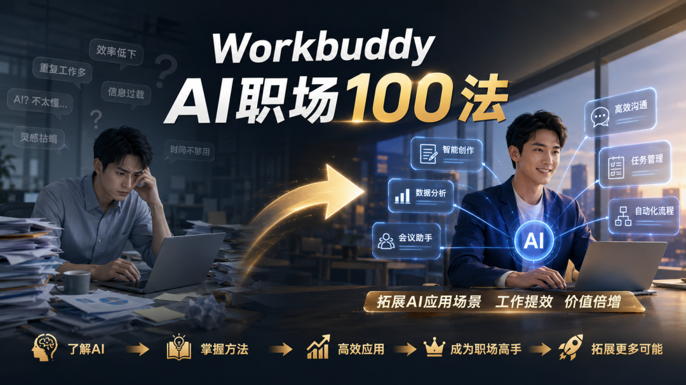
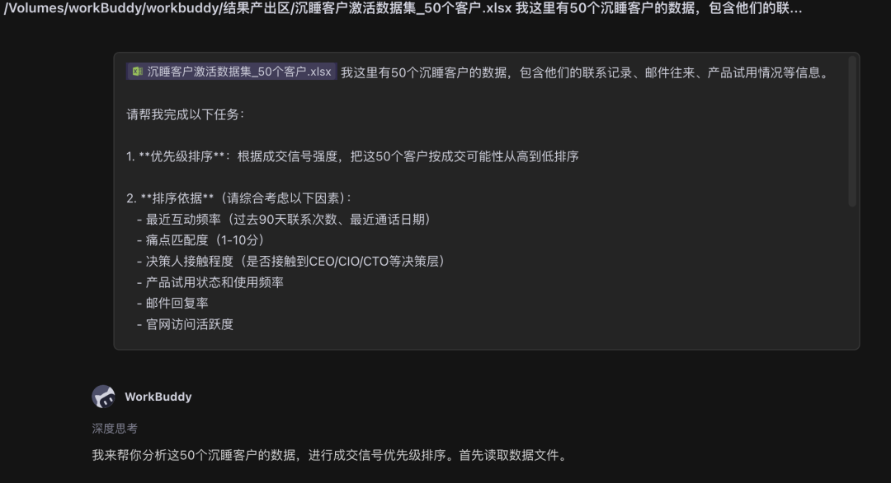
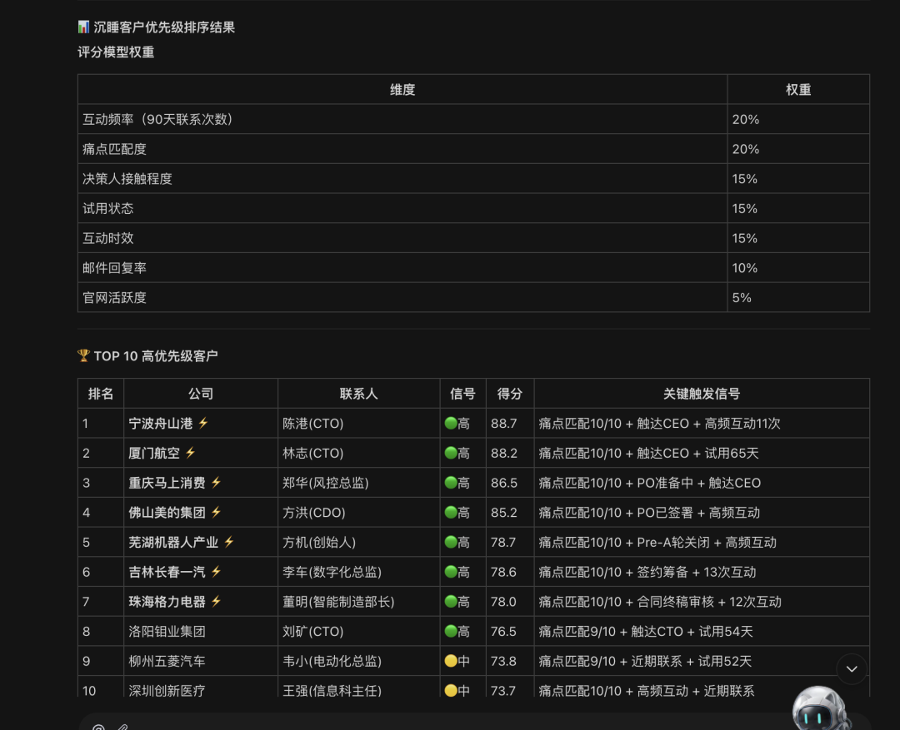
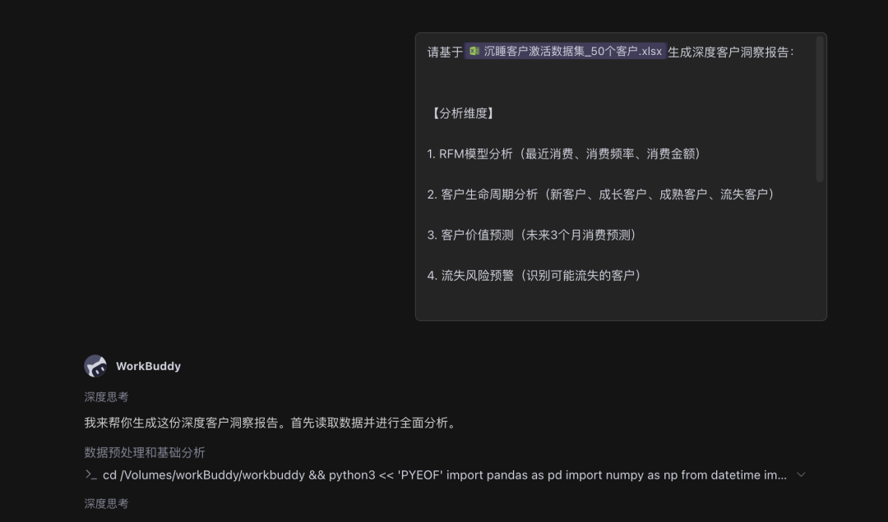
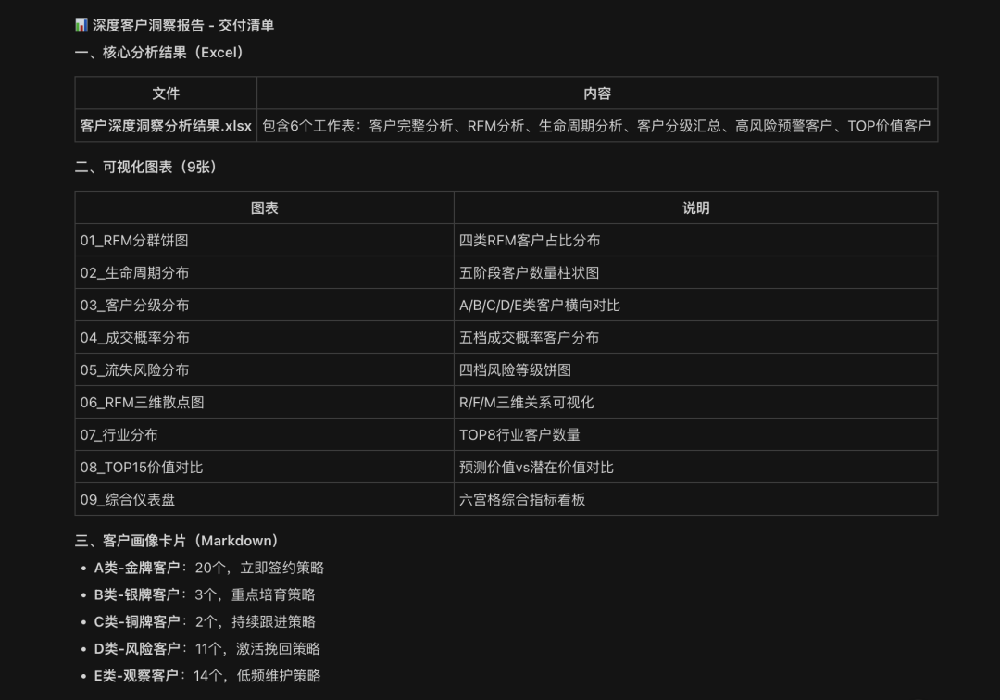
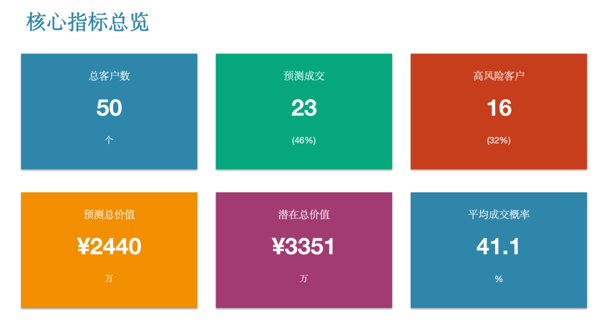
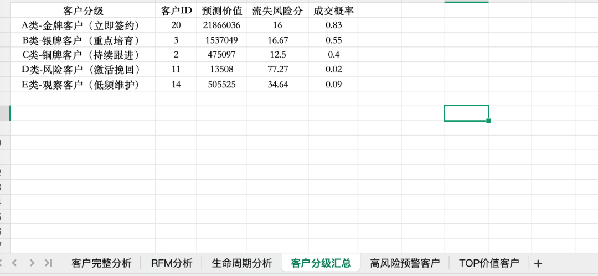

> 📎 来源: [智能进化Wayen](https://mp.weixin.qq.com/s?__biz=MzkzNDY1NzQ0Mg==&mid=2247487740&idx=1&sn=798d15243839f8379e5b9f20438c409c&chksm=c3527a07cb3b96a162179e13ba0c0bc5bb2961c95df278259929d91e5f9c44739e597628e6b8&mpshare=1&scene=1&srcid=0521jKLsGuspjHg6IcLBxsP4&sharer_shareinfo=61407b303fbb2f58cf335ff51606196d&sharer_shareinfo_first=61407b303fbb2f58cf335ff51606196d) | 时间: 2026-05-21 23:01

---

↑阅读之前记得关注+星标，每天第一时间接收更新

|  |  |
| --- | --- |
|  | 自动分群，生成客户画像，识别高价值客户 |

做销售的大家都懂，一个是客户管理、一个是销售线索跟进，这两点很重要，是从源头上解决客户问题："我们的客户里，谁最值得投入？"

我打开CRM系统，导出客户列表。又打开财务系统，导出消费记录。再打开客服系统，导出服务记录。

三个Excel表格，字段都不一样。

我想做RFM分析（最近消费、消费频率、消费金额），但数据分散在各处，整合起来太麻烦。

**然后我打开了WorkBuddy。**

输入一句话，5分钟后，客户分群表、RFM分析、高价值客户名单全部生成。

**今天分享这个方法。**



## 01 先说痛点：客户分析到底烦在哪

你可能也遇到过：

•**数据分散**：客户信息在CRM，消费记录在财务系统，行为数据在运营系统

•**分群困难**：手动分群凭感觉，不科学

•**画像模糊**：不知道高价值客户长什么样

•**行动滞后**：发现高价值客户时，已经流失了

**核心问题不是"没有客户数据"，而是"数据不会说话"。**



## 02 解决方案：让AI当你的客户分析师

WorkBuddy的做法：

**你指定客户数据文件，它自动整合、分群、生成画像。**

不需要你手动整合多表、写公式分群、画雷达图。

相比手动分析3小时的时间成本，这简直就是白送。

## 03 核心Prompt（直接复制使用）

这是我最常用的基础版本：

|  |
| --- |
| CODE |
| 请读取"[文件路径]/[客户数据文件名].xlsx"，进行客户画像分析：  【分析维度】 1. 按消费金额分群：高价值/中价值/低价值客户 2. 按行业分类统计 3. 按地域分布统计 4. 按合作时长分析忠诚度  【输出要求】 1. 生成客户分群表 2. 制作RFM分析模型（最近消费、消费频率、消费金额） 3. 生成可视化图表（柱状图、饼图、散点图） 4. 输出为PPT报告，含行动建议 |

**使用说明：**

•把 

```
[文件路径]
```

 和 

```
[客户数据文件名]
```

 换成实际路径

•确保数据包含：客户ID、消费金额、消费日期、行业、地域等字段

•可指定分群阈值（如高价值客户定义）



## 04 进阶用法：深度客户洞察

如果你需要更深入的客户分析：

|  |
| --- |
| CODE |
| 请基于"[客户数据文件]"生成深度客户洞察报告：  【分析维度】 1. RFM模型分析（最近消费、消费频率、消费金额） 2. 客户生命周期分析（新客户、成长客户、成熟客户、流失客户） 3. 客户价值预测（未来3个月消费预测） 4. 流失风险预警（识别可能流失的客户）  【输出要求】 1. 生成客户分群表（Excel） 2. 生成客户画像卡片（每类客户的典型特征） 3. 生成可视化图表（不少于8个） 4. 生成行动建议（针对不同客户群的策略） 5. 输出为PPT格式，适合销售会议汇报 |

**适用场景：**

•客户分层运营

•高价值客户识别

•流失预警

•精准营销









## 05 完整操作步骤

**Step 1：准备客户数据**

整合客户数据，确保包含：

•客户基本信息（ID、名称、行业、地域）

•消费记录（金额、日期、产品）

•合作时长

•其他行为数据（如有）

**Step 2：复制Prompt到WorkBuddy**

把上面的Prompt模板复制到对话框，填入文件路径和分析要求。

**Step 3：发送并等待生成**

通常3-5分钟完成分析（取决于数据量）。

**Step 4：人工复核分群结果**

**重要：AI分群后务必检查：**

•高价值客户名单是否合理

•分群阈值是否适合你的业务

•画像描述是否准确

•行动建议是否可执行

**Step 5：制定行动计划**

基于分析结果，制定针对不同客户群的运营策略。

强调：所有的销售字段都需要用户自行准备，如果涉及客户信息安全请遵守公司信息保密规定。

## 06 避坑指南：这3个错误千万别犯

**❌ 错误1：数据不完整**

如果缺少消费日期或金额等关键字段，RFM分析无法进行。

**✅ 正确做法**：确保数据包含所有必要字段。

**❌ 错误2：分群阈值不合理**

如果阈值设置不当，可能把高价值客户分到低价值群。

**✅ 正确做法**：根据业务特点调整分群阈值。

**❌ 错误3：只分析不行动**

分析结果如果不转化为行动，就是白做。

**✅ 正确做法**：基于分析结果制定具体的客户运营策略。

## 07 Credit省钱技巧

**基础版**：

•基础分群（高/中/低价值）

•简单画像

•基础图表

**进阶版**：（到这简单的prompt能实现，但是想要完美的地步就得需要额外的要求与工作流了）

•RFM模型

•生命周期分析

•流失预警

•深度图表和建议

**省钱秘诀：**

•提前整合好客户数据

•明确分群标准和分析维度

•基础分析用轻量模型，深度分析用强模型

## 08 你的使用收获

**第一，客户运营更精准了。**

知道谁是高价值客户后，资源投放更精准。

**第二，流失预警很有效。**

提前识别可能流失的客户，及时挽回。

**第三，销售效率提升了。**

销售团队知道该重点跟进哪些客户。主要是省事了！

## 09 总结一下

**核心逻辑：**

•你负责"提供完整的客户数据"

•AI负责"整合、分群、画像"

•你负责"制定运营策略"

**3个关键：**

1数据要完整（消费记录、客户信息）

2分群要合理（阈值符合业务特点）

3分析要落地（转化为具体行动）

## 下期预告

**方法17｜项目进度跟踪与甘特图生成**

项目经理需要跟踪多个任务的进度，手动更新甘特图费时且容易滞后？WorkBuddy读取项目数据，自动生成甘特图和进度报告。

Prompt模板+操作步骤+避坑指南，下周见。

[6款桌面AI助手我试了两个月，便宜的太不稳定，能力强的太烧钱](https://mp.weixin.qq.com/s?__biz=MzkzNDY1NzQ0Mg==&mid=2247487492&idx=1&sn=b86bd55aea989f74097fc1336d4962d4&scene=21#wechat_redirect)

[PC端AI办公智能体第一易主：WorkBuddy凭什么两个月干到榜首？](https://mp.weixin.qq.com/s?__biz=MzkzNDY1NzQ0Mg==&mid=2247486896&idx=1&sn=11cab82d73151fa1607101dd30a5ffba&scene=21#wechat_redirect)

**[我被网友催更WorkBuddy AI职场百法：花了一个月，我把大家的催促变成了这份操作手册](https://mp.weixin.qq.com/s?__biz=MzkzNDY1NzQ0Mg==&mid=2247486595&idx=1&sn=ee9e055e956b586a87a69773de66822c&scene=21#wechat_redirect)**

**[方法01｜用WorkBuddy 1分钟生成周报：我从"周五焦虑"到"周五解放"的全过程](https://mp.weixin.qq.com/s?__biz=MzkzNDY1NzQ0Mg==&mid=2247486666&idx=1&sn=a9674befb1f65279da9480d91227ba21&scene=21#wechat_redirect)**

**[WorkBuddy方法02 | 会议纪要智能整理：1小时录音5分钟出纪要](https://mp.weixin.qq.com/s?__biz=MzkzNDY1NzQ0Mg==&mid=2247486810&idx=1&sn=396bec187822a58acae1149d5731d21b&scene=21#wechat_redirect)**

**[WorkBuddy方法03 | 文档批量格式转换：一句话搞定100个文件](https://mp.weixin.qq.com/s?__biz=MzkzNDY1NzQ0Mg==&mid=2247486826&idx=1&sn=cd3b2472f22c6b44dac206e9fc3add04&scene=21#wechat_redirect)**

**[WorkBuddy方法04 | 智能合同生成：非法律专业也能起草合规合同](https://mp.weixin.qq.com/s?__biz=MzkzNDY1NzQ0Mg==&mid=2247486881&idx=1&sn=55aae295e6fb0d8711481bbab835e91d&scene=21#wechat_redirect)**

**[WorkBuddy方法05 | 多文档合并与目录生成：项目报告一键汇总](https://mp.weixin.qq.com/s?__biz=MzkzNDY1NzQ0Mg==&mid=2247486916&idx=1&sn=170aa353f5788bcdff28bafc47d212bc&scene=21#wechat_redirect)**

**[WorkBuddy方法06 | 扫描件PDF文字提取：OCR精准识别，告别手动录入](https://mp.weixin.qq.com/s?__biz=MzkzNDY1NzQ0Mg==&mid=2247486984&idx=1&sn=80e5def643d0838ea518d9150fcb36e8&scene=21#wechat_redirect)**

**[WorkBuddy方法07 | 文档标准化排版：一键统一全公司文档格式](https://mp.weixin.qq.com/s?__biz=MzkzNDY1NzQ0Mg==&mid=2247487064&idx=1&sn=7cb898e64f7bcadf9c4e919f720cb87d&scene=21#wechat_redirect)**

**[WorkBuddy方法08 | 邮件模板批量生成：HR、销售、行政的救星](https://mp.weixin.qq.com/s?__biz=MzkzNDY1NzQ0Mg==&mid=2247487075&idx=1&sn=10107659f65335ff34c9f3ff4785010b&scene=21#wechat_redirect)**

**[WorkBuddy方法09 | 制式文档自动生成：模板教一遍，AI帮你写百遍](https://mp.weixin.qq.com/s?__biz=MzkzNDY1NzQ0Mg==&mid=2247487137&idx=1&sn=6ca5e1539aa74dfea4a298e9762aad71&scene=21#wechat_redirect)**

**[WorkBuddy方法10 | 多语言文档翻译：外文文档/业务不再愁](https://mp.weixin.qq.com/s?__biz=MzkzNDY1NzQ0Mg==&mid=2247487147&idx=1&sn=df472879b9c0156883e73fbcda7ca15a&scene=21#wechat_redirect)**

**[WorkBuddy方法11 | Excel多表合并与数据汇总：月底不再加班](https://mp.weixin.qq.com/s?__biz=MzkzNDY1NzQ0Mg==&mid=2247487169&idx=1&sn=2a59eda901cac916a5a323b89d219c10&scene=21#wechat_redirect)**

**[WorkBuddy方法12 | 数据分析与可视化报告：让数据自己说话](https://mp.weixin.qq.com/s?__biz=MzkzNDY1NzQ0Mg==&mid=2247487234&idx=1&sn=ce8ed4b66e25bf7ebcf094a648a56eb3&scene=21#wechat_redirect)**

**[WorkBuddy方法13 | 数据自动统计：每月省2小时](https://mp.weixin.qq.com/s?__biz=MzkzNDY1NzQ0Mg==&mid=2247487527&idx=1&sn=59f1a93599aacc3a2bd53860a0eaf989&scene=21#wechat_redirect)**

**[WorkBuddy方法14 | 财务报表自动生成：月底结账不再熬夜](https://mp.weixin.qq.com/s?__biz=MzkzNDY1NzQ0Mg==&mid=2247487624&idx=1&sn=1e039736638b605bae968a5a930243f9&scene=21#wechat_redirect)**

**[WorkBuddy方法15 | 竞品数据抓取与对比分析：知己知彼](https://mp.weixin.qq.com/s?__biz=MzkzNDY1NzQ0Mg==&mid=2247487695&idx=1&sn=0ea492ef8a30552a6ac4066d571a0a24&scene=21#wechat_redirect)**

****我说明一下，这个系列的内容都是workbuddy的初阶用法，致力于用简单的Prompt解决实际职场中的问题，聚焦职场拓展应用场景，打开应用思路，复杂问题看高阶。****

另外，我的合集也上线了，因为是专门给智能进化AI交流群群友做的，收费不高，绝对物有所值，有缘者取之。

[AI领导力的终极修炼：成为顶级1%](https://mp.weixin.qq.com/mp/appmsgalbum?__biz=MzkzNDY1NzQ0Mg==&action=getalbum&album_id=4522591223668539392#wechat_redirect)

**📱 关注公众号，扫码加入读者群，领取《WorkBuddy 100种方法操作手册》完整版**

群里见。

W∞ 智能进化 · 智能驱动 · 无限可能

我把麻烦事研究透，你只管拿去用。我蹚坑，你受益，有用就关注，常看就星标。

AI时代的新工具和野路子，第一时间同步你。

关于作者：Wayen，世界500强企业教练+AI职场提效专家。专注研究AI提效、人才赋能、管理提升，信奉"把重复的事交给AI，把思考的事留给自己"。


