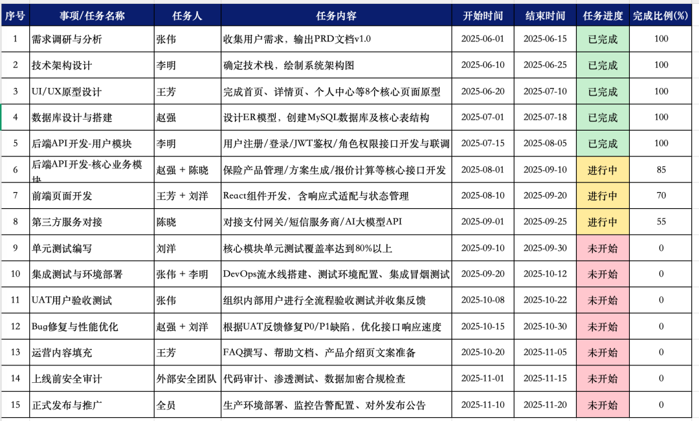
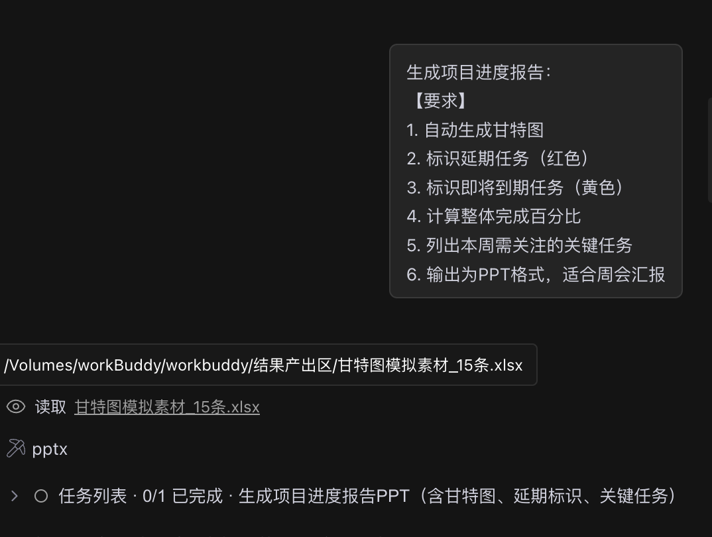
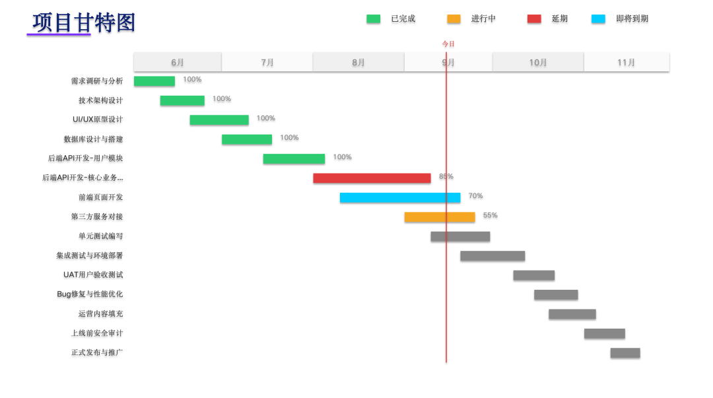

> 📎 来源: [智能进化Wayen](https://mp.weixin.qq.com/s?__biz=MzkzNDY1NzQ0Mg==&mid=2247487766&idx=1&sn=05a0cf0c62570f9eb0284770fa910afc&chksm=c36963bcb76044258c2c12618e74af99a4ec8f613aeefa6de02e253d96178d1761fe37ec548c&mpshare=1&scene=1&srcid=0526JbUoqmgKWo5YbGkIq4NI&sharer_shareinfo=cd45f29dd2570501b62caacf028af1b2&sharer_shareinfo_first=cd45f29dd2570501b62caacf028af1b2) | 时间: 2026-05-26 12:43

---

↑阅读之前记得关注+星标，每天第一时间接收更新

|  |  |
| --- | --- |
|  | 自动生成甘特图，实时跟踪项目进度 |

如果你当做团队负责人或者管理过项目，就应该能知道甘特图的重要，也能体会deadline的焦虑。

20个任务并行，5个团队协同。每天要问一遍：这个做完了吗？那个到哪了？延期了怎么办？

我打开项目管理工具，手动更新每个任务的状态。

然后打开Excel，调整甘特图的条形图位置。

然后截图，贴到PPT里，准备周会汇报。

2小时过去了，甘特图还没画完。

**然后我打开了WorkBuddy。**

输入一句话，3分钟后，自动生成的甘特图+进度报告出来了。

延期任务标红，即将到期标黄，整体完成百分比自动计算。

**今天分享这个方法。**

## 01 先说痛点：项目跟踪到底烦在哪

你可能也遇到过：

•**状态更新慢**：任务状态变了，甘特图没跟上

•**延期难发现**：哪个任务延期了，影响哪些后续任务，手动梳理困难

•**汇报费时**：每次周会前要重新整理进度报告

•**资源协调难**：多个任务并行，资源冲突难以预判

**核心问题不是"不会项目管理"，而是"跟踪工具太落后"。**

## 02 解决方案：让AI当你的项目助理

WorkBuddy的做法：

**你指定项目数据文件，它自动生成甘特图、标识风险、输出报告。**

不需要你手动画条形图、算完成百分比、找延期任务。

相比手动整理2小时的时间成本，这简直就是白送。

## 03 核心Prompt（直接复制使用）

这是我最常用的基础版本：

|  |
| --- |
| CODE |
| 请读取"[文件路径]/[项目进度表].xlsx"，生成项目进度报告：  【要求】 1. 自动生成甘特图 2. 标识延期任务（红色） 3. 标识即将到期任务（黄色） 4. 计算整体完成百分比 5. 列出本周需关注的关键任务 |

**使用说明：**

•把 

```
[文件路径]
```

 和 

```
[项目进度表]
```

 换成实际路径

•确保数据包含：任务名称、开始日期、结束日期、状态、负责人

•可指定输出格式和汇报周期







## 04 进阶用法：多项目组合管理

如果你需要同时跟踪多个项目：

|  |
| --- |
| CODE |
| 请读取"[项目文件夹]"中的所有项目进度表，生成组合项目报告：  【分析要求】 1. 各项目完成百分比对比 2. 资源冲突检测（同一人在多个项目中的任务重叠） 3. 风险项目预警（延期超过3天的项目） 4. 里程碑达成情况  【输出要求】 1. 生成各项目甘特图 2. 生成资源负荷图 3. 生成风险项目清单 |

**适用场景：**

•周会进度汇报

•项目组合管理

•资源协调

•风险预警

## 05 完整操作步骤

**Step 1：准备项目数据**

创建项目进度表，包含：

•任务名称

•开始日期

•结束日期

•实际完成日期（如有）

•状态（未开始/进行中/已完成/延期）

•负责人

•依赖任务（如有）

**Step 2：复制Prompt到WorkBuddy**

把上面的Prompt模板复制到对话框，填入文件路径。

**Step 3：发送并等待生成**

通常2-3分钟生成甘特图和报告。

**Step 4：检查结果**

重点检查：

•任务时间线是否正确

•延期任务是否准确标识

•完成百分比是否合理

•依赖关系是否正确

## 06 避坑指南：这3个错误千万别犯

**❌ 错误1：数据不及时更新**

如果项目数据不是最新的，生成的甘特图就是过时的。

**✅ 正确做法**：定期更新项目数据，或设置自动同步。

**❌ 错误2：依赖关系遗漏**

如果任务之间的依赖关系没录入，AI无法判断延期影响。

**✅ 正确做法**：在数据中明确标注任务依赖关系。

**❌ 错误3：只看不行动**

发现延期任务后，如果不及时调整资源或计划，报告就是白做。

**✅ 正确做法**：基于报告及时调整项目计划。

## 07 Credit省钱技巧

**基础版**：

•单项目甘特图

•基础进度报告

**进阶版**：

•多项目组合

•资源冲突检测

•风险预警

**省钱秘诀：**

•提前准备好完整的项目数据

•明确标注任务状态和依赖关系

•把常用项目模板保存为Skill

## 08 你的使用收获

用了这个方法两个月，我有几个感受：

**第一，周会准备时间从2小时降到10分钟。**

以前每次周会前要重新整理进度，现在直接生成报告。

**第二，延期发现更及时了。**

AI自动标红延期任务，不会遗漏。

**第三，汇报更专业了。**

自动生成的甘特图和进度报告，比手动做的更规范。

## 09 总结一下

**核心逻辑：**

•你负责"维护项目数据"

•AI负责"生成甘特图、标识风险"

•你负责"调整计划、协调资源"

**3个关键：**

1数据要及时（定期更新项目状态）

2依赖要清晰（标注任务依赖关系）

3报告要行动（基于报告调整计划）

## 下期预告

**方法18｜数据清洗与异常值检测**

原始数据中存在缺失值、异常值、格式不一致等问题，影响分析准确性？WorkBuddy自动识别数据质量问题，清洗数据并标注异常。

Prompt模板+操作步骤+避坑指南，下周见。

[6款桌面AI助手我试了两个月，便宜的太不稳定，能力强的太烧钱](https://mp.weixin.qq.com/s?__biz=MzkzNDY1NzQ0Mg==&mid=2247487492&idx=1&sn=b86bd55aea989f74097fc1336d4962d4&scene=21#wechat_redirect)

[PC端AI办公智能体第一易主：WorkBuddy凭什么两个月干到榜首？](https://mp.weixin.qq.com/s?__biz=MzkzNDY1NzQ0Mg==&mid=2247486896&idx=1&sn=11cab82d73151fa1607101dd30a5ffba&scene=21#wechat_redirect)

**[我被网友催更WorkBuddy AI职场百法：花了一个月，我把大家的催促变成了这份操作手册](https://mp.weixin.qq.com/s?__biz=MzkzNDY1NzQ0Mg==&mid=2247486595&idx=1&sn=ee9e055e956b586a87a69773de66822c&scene=21#wechat_redirect)**

**[方法01｜用WorkBuddy 1分钟生成周报：我从"周五焦虑"到"周五解放"的全过程](https://mp.weixin.qq.com/s?__biz=MzkzNDY1NzQ0Mg==&mid=2247486666&idx=1&sn=a9674befb1f65279da9480d91227ba21&scene=21#wechat_redirect)**

**[WorkBuddy方法02 | 会议纪要智能整理：1小时录音5分钟出纪要](https://mp.weixin.qq.com/s?__biz=MzkzNDY1NzQ0Mg==&mid=2247486810&idx=1&sn=396bec187822a58acae1149d5731d21b&scene=21#wechat_redirect)**

**[WorkBuddy方法03 | 文档批量格式转换：一句话搞定100个文件](https://mp.weixin.qq.com/s?__biz=MzkzNDY1NzQ0Mg==&mid=2247486826&idx=1&sn=cd3b2472f22c6b44dac206e9fc3add04&scene=21#wechat_redirect)**

**[WorkBuddy方法04 | 智能合同生成：非法律专业也能起草合规合同](https://mp.weixin.qq.com/s?__biz=MzkzNDY1NzQ0Mg==&mid=2247486881&idx=1&sn=55aae295e6fb0d8711481bbab835e91d&scene=21#wechat_redirect)**

**[WorkBuddy方法05 | 多文档合并与目录生成：项目报告一键汇总](https://mp.weixin.qq.com/s?__biz=MzkzNDY1NzQ0Mg==&mid=2247486916&idx=1&sn=170aa353f5788bcdff28bafc47d212bc&scene=21#wechat_redirect)**

**[WorkBuddy方法06 | 扫描件PDF文字提取：OCR精准识别，告别手动录入](https://mp.weixin.qq.com/s?__biz=MzkzNDY1NzQ0Mg==&mid=2247486984&idx=1&sn=80e5def643d0838ea518d9150fcb36e8&scene=21#wechat_redirect)**

**[WorkBuddy方法07 | 文档标准化排版：一键统一全公司文档格式](https://mp.weixin.qq.com/s?__biz=MzkzNDY1NzQ0Mg==&mid=2247487064&idx=1&sn=7cb898e64f7bcadf9c4e919f720cb87d&scene=21#wechat_redirect)**

**[WorkBuddy方法08 | 邮件模板批量生成：HR、销售、行政的救星](https://mp.weixin.qq.com/s?__biz=MzkzNDY1NzQ0Mg==&mid=2247487075&idx=1&sn=10107659f65335ff34c9f3ff4785010b&scene=21#wechat_redirect)**

**[WorkBuddy方法09 | 制式文档自动生成：模板教一遍，AI帮你写百遍](https://mp.weixin.qq.com/s?__biz=MzkzNDY1NzQ0Mg==&mid=2247487137&idx=1&sn=6ca5e1539aa74dfea4a298e9762aad71&scene=21#wechat_redirect)**

**[WorkBuddy方法10 | 多语言文档翻译：外文文档/业务不再愁](https://mp.weixin.qq.com/s?__biz=MzkzNDY1NzQ0Mg==&mid=2247487147&idx=1&sn=df472879b9c0156883e73fbcda7ca15a&scene=21#wechat_redirect)**

**[WorkBuddy方法11 | Excel多表合并与数据汇总：月底不再加班](https://mp.weixin.qq.com/s?__biz=MzkzNDY1NzQ0Mg==&mid=2247487169&idx=1&sn=2a59eda901cac916a5a323b89d219c10&scene=21#wechat_redirect)**

**[WorkBuddy方法12 | 数据分析与可视化报告：让数据自己说话](https://mp.weixin.qq.com/s?__biz=MzkzNDY1NzQ0Mg==&mid=2247487234&idx=1&sn=ce8ed4b66e25bf7ebcf094a648a56eb3&scene=21#wechat_redirect)**

**[WorkBuddy方法13 | 数据自动统计：每月省2小时](https://mp.weixin.qq.com/s?__biz=MzkzNDY1NzQ0Mg==&mid=2247487527&idx=1&sn=59f1a93599aacc3a2bd53860a0eaf989&scene=21#wechat_redirect)**

**[WorkBuddy方法14 | 财务报表自动生成：月底结账不再熬夜](https://mp.weixin.qq.com/s?__biz=MzkzNDY1NzQ0Mg==&mid=2247487624&idx=1&sn=1e039736638b605bae968a5a930243f9&scene=21#wechat_redirect)**

**[WorkBuddy方法15 | 竞品数据抓取与对比分析：知己知彼](https://mp.weixin.qq.com/s?__biz=MzkzNDY1NzQ0Mg==&mid=2247487695&idx=1&sn=0ea492ef8a30552a6ac4066d571a0a24&scene=21#wechat_redirect)**

**[WorkBuddy方法16 | 客户数据分群与画像分析：找到你的金矿客户](https://mp.weixin.qq.com/s?__biz=MzkzNDY1NzQ0Mg==&mid=2247487740&idx=1&sn=798d15243839f8379e5b9f20438c409c&scene=21#wechat_redirect)**

****我说明一下，这个系列的内容都是workbuddy的初阶用法，致力于用简单的Prompt解决实际职场中的问题，聚焦职场拓展应用场景，打开应用思路，复杂问题看高阶。****

另外，我的合集也上线了，因为是专门给智能进化AI交流群群友做的，收费不高，绝对物有所值，有缘者取之。

[AI领导力的终极修炼：成为顶级1%](https://mp.weixin.qq.com/mp/appmsgalbum?__biz=MzkzNDY1NzQ0Mg==&action=getalbum&album_id=4522591223668539392#wechat_redirect)

**📱 关注公众号，扫码加入读者群，领取《WorkBuddy 100种方法操作手册》完整版**

群里见。

W∞ 智能进化 · 智能驱动 · 无限可能

我把麻烦事研究透，你只管拿去用。我蹚坑，你受益，有用就关注，常看就星标。

AI时代的新工具和野路子，第一时间同步你。

关于作者：Wayen，世界500强企业教练+AI职场提效专家。专注研究AI提效、人才赋能、管理提升，信奉"把重复的事交给AI，把思考的事留给自己"。


