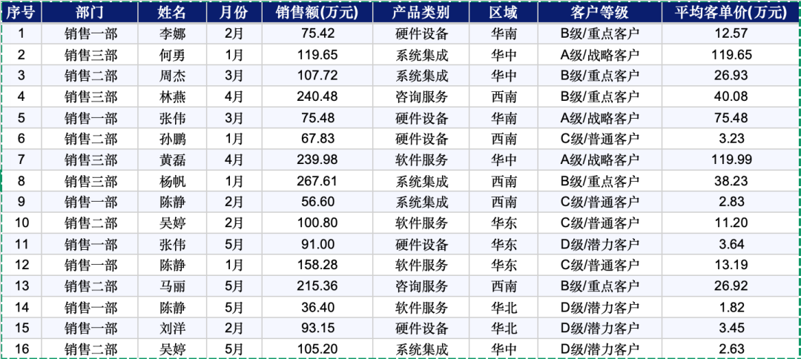
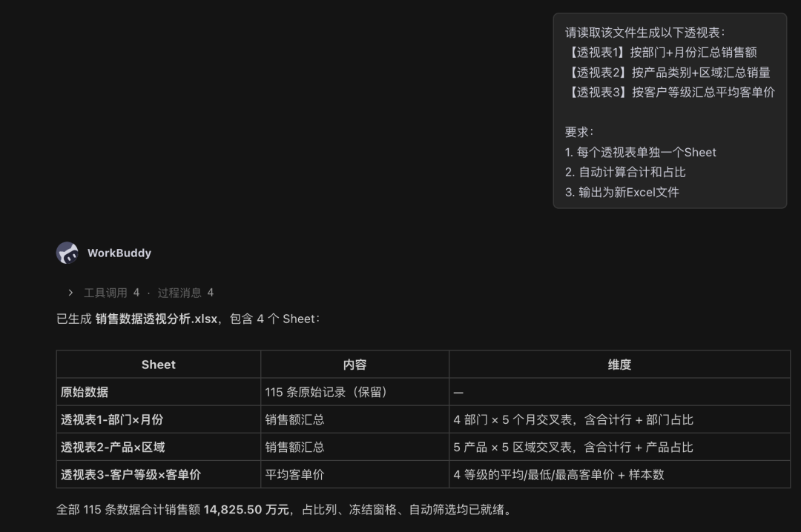
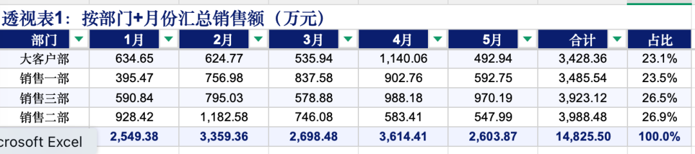
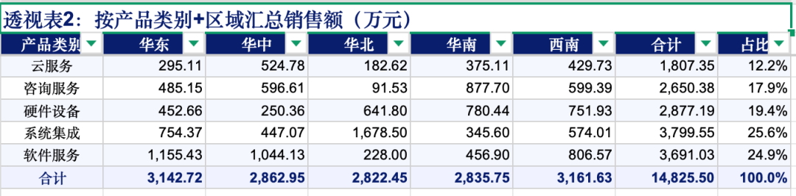
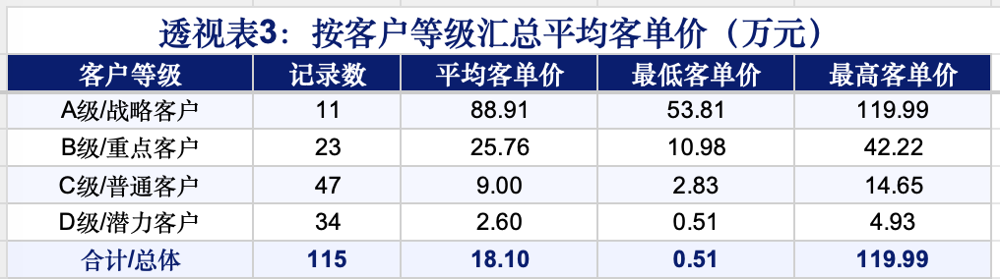

> 📎 来源: [智能进化Wayen](https://mp.weixin.qq.com/s?__biz=MzkzNDY1NzQ0Mg==&mid=2247487981&idx=1&sn=4791cabb71695b5248ac51a53c7cfe4a&chksm=c351924a91ac3ca5e5eb426d540f617076e806b709bcc0636e5eb25c069e1907425d0aff2d52&mpshare=1&scene=1&srcid=0527ySyRRl18lHt1MxMiNw5s&sharer_shareinfo=15c9b554480d15faa9f3da47b514bcb6&sharer_shareinfo_first=15c9b554480d15faa9f3da47b514bcb6) | 时间: 2026-05-27 11:48

---

↑阅读之前记得关注+星标，每天第一时间接收更新

|  |  |
| --- | --- |
|  | 一句话指令，自动生成多维度透视表 |

学习excle的时候，往往最先熟悉的相对复杂的excle技能就是数据透视，它不用复杂的公式但是还很快捷使用。

如果设定一个情景，老板让你分析销售数据。

要求：按产品、按区域、按月份、按客户等级……各个维度都要看。

当你打开Excel，开始创建透视表。

第一个透视表：按产品汇总销售额。

第二个透视表：按区域汇总销售额。

第三个透视表：按月份汇总销售额。

第四个……

每个透视表都要选数据源、拖字段、调格式。

2小时过去了，透视表还没做完。

**然后我打开了WorkBuddy。**

输入一句话，2分钟后，所有维度的透视表全部生成。

**今天分享这个方法。**

## 01 先说痛点：透视表到底烦在哪

你可能也遇到过：

•**操作繁琐**：每次创建都要选数据源、拖字段、设汇总方式

•**维度多**：一个分析要建五六个透视表

•**格式乱**：透视表默认格式丑，每次都要调

•**更新难**：数据源变了，透视表不会自动更新

**核心问题不是"不会透视表"，而是"重复创建太浪费时间"。**

## 02 解决方案：让AI当你的透视表工厂

WorkBuddy的做法：

**你指定数据文件和维度，它自动生成多个透视表。**

不需要你手动拖字段、设汇总方式、调格式。

## 03 核心Prompt（直接复制使用）

这是我最常用的基础版本：

|  |
| --- |
| CODE |
| 请读取"[文件路径]/[数据文件].xlsx"，生成以下透视表：  【透视表1】按部门+月份汇总销售额 【透视表2】按产品类别+区域汇总销量 【透视表3】按客户等级汇总平均客单价  要求： 1. 每个透视表单独一个Sheet 2. 自动计算合计和占比 3. 输出为新Excel文件 |

**使用说明：**

•把 

```
[文件路径]
```

 和 

```
[数据文件]
```

 换成实际路径

•根据分析需求指定维度组合

•可指定汇总方式（求和/平均/计数等）





看结果：








## 04 进阶用法：复杂透视表组合

如果你需要更复杂的分析：

|  |
| --- |
| CODE |
| 请基于"[数据文件]"生成完整的数据分析透视表集：  【透视表清单】 1. 销售分析：按区域+产品+月份，汇总销售额、销量、利润 2. 客户分析：按客户等级+行业，汇总客户数、平均消费、复购率 3. 产品分析：按产品类别+品牌，汇总销售额、毛利率、库存周转 4. 时间分析：按季度+月份，汇总销售额趋势、同比增长  【格式要求】 1. 每个透视表单独Sheet，命名清晰 2. 自动计算占比和同比 3. 添加条件格式（高亮TOP10） 4. 输出为Excel格式 |

**适用场景：**

•销售多维度分析

•财务科目汇总

•库存分析

•客户行为分析

## 05 完整操作步骤

**Step 1：准备数据文件**

确保Excel数据：

•有明确的表头

•数据完整（关键字段无大面积空值）

•格式统一（日期、金额等）

**Step 2：复制Prompt到WorkBuddy**

把上面的Prompt模板复制到对话框，填入文件路径和透视表要求。

**Step 3：发送并等待生成**

通常1-2分钟生成所有透视表。

**Step 4：检查结果**

重点检查：

•维度组合是否正确

•汇总方式是否合适

•数据是否准确

•格式是否清晰

**Step 5：用于分析**

基于透视表进行进一步分析或汇报。

## 06 避坑指南：这3个错误千万别犯

**❌ 错误1：维度选择过多**

一个透视表维度太多（如5个以上），会导致表格稀疏、难以阅读。

**✅ 正确做法**：每个透视表控制在2-3个维度。

**❌ 错误2：数据类型错误**

如果金额字段被当成文本，汇总结果会是计数而不是求和。

**✅ 正确做法**：确保数值字段格式正确。

**❌ 错误3：不核对汇总结果**

透视表的合计数应该与原始数据一致。

**✅ 正确做法**：抽样核对几个汇总数字。

## 07 Credit省钱技巧

**基础版**：

•2-3个简单透视表

•基础汇总

**进阶版**：

•4个以上复杂透视表

•占比、同比计算

•条件格式

**省钱秘诀：**

•提前整理好数据格式

•明确指定维度和汇总方式

•把常用透视表组合保存为Skill

## 08 你的使用收货

**第一，数据分析效率提升5倍。**

以前1小时的透视表工作，现在5分钟搞定。

**第二，分析维度更全面了。**

AI能同时生成多个维度的透视表，不会遗漏。

**第三，格式更规范了。**

自动生成的透视表格式统一，直接可用。

## 09 总结一下

**核心逻辑：**

•你负责"指定数据和分析维度"

•AI负责"生成透视表、计算汇总"

•你负责"核对结果、用于分析"

**3个关键：**

1数据要规范（格式统一、字段完整）

2维度要合理（每个透视表2-3个维度）

3结果要核对（抽样检查汇总数字）

## 系列小结

到这里，「数据分析与报表生成」类别的10种方法（方法11-20）全部介绍完毕。回顾一下：

| 编号 | 方法名称 | 核心能力 |
| --- | --- | --- |
| 11 | Excel多表合并与数据汇总 | 一句话合并多个Excel |
| 12 | 销售数据分析与可视化报告 | 自动计算指标、生成图表 |
| 13 | 考勤数据自动统计与分析 | 清洗考勤、标记异常 |
| 14 | 财务报表自动生成 | 生成三张表、计算指标 |
| 15 | 竞品数据抓取与对比分析 | 自动抓取、生成对比矩阵 |
| 16 | 客户数据分群与画像分析 | RFM分群、生成画像 |
| 17 | 项目进度跟踪与甘特图生成 | 自动生成甘特图 |
| 18 | 数据清洗与异常值检测 | 识别质量问题、清洗数据 |
| 19 | 预算执行分析 | 预算vs实际对比 |
| 20 | 数据透视表自动生成 | 一句话生成多维度透视表 |

[6款桌面AI助手我试了两个月，便宜的太不稳定，能力强的太烧钱](https://mp.weixin.qq.com/s?__biz=MzkzNDY1NzQ0Mg==&mid=2247487492&idx=1&sn=b86bd55aea989f74097fc1336d4962d4&scene=21#wechat_redirect)

[PC端AI办公智能体第一易主：WorkBuddy凭什么两个月干到榜首？](https://mp.weixin.qq.com/s?__biz=MzkzNDY1NzQ0Mg==&mid=2247486896&idx=1&sn=11cab82d73151fa1607101dd30a5ffba&scene=21#wechat_redirect)

**[我被网友催更WorkBuddy AI职场百法：花了一个月，我把大家的催促变成了这份操作手册](https://mp.weixin.qq.com/s?__biz=MzkzNDY1NzQ0Mg==&mid=2247486595&idx=1&sn=ee9e055e956b586a87a69773de66822c&scene=21#wechat_redirect)**

**[方法01｜用WorkBuddy 1分钟生成周报：我从"周五焦虑"到"周五解放"的全过程](https://mp.weixin.qq.com/s?__biz=MzkzNDY1NzQ0Mg==&mid=2247486666&idx=1&sn=a9674befb1f65279da9480d91227ba21&scene=21#wechat_redirect)**

**[WorkBuddy方法02 | 会议纪要智能整理：1小时录音5分钟出纪要](https://mp.weixin.qq.com/s?__biz=MzkzNDY1NzQ0Mg==&mid=2247486810&idx=1&sn=396bec187822a58acae1149d5731d21b&scene=21#wechat_redirect)**

**[WorkBuddy方法03 | 文档批量格式转换：一句话搞定100个文件](https://mp.weixin.qq.com/s?__biz=MzkzNDY1NzQ0Mg==&mid=2247486826&idx=1&sn=cd3b2472f22c6b44dac206e9fc3add04&scene=21#wechat_redirect)**

**[WorkBuddy方法04 | 智能合同生成：非法律专业也能起草合规合同](https://mp.weixin.qq.com/s?__biz=MzkzNDY1NzQ0Mg==&mid=2247486881&idx=1&sn=55aae295e6fb0d8711481bbab835e91d&scene=21#wechat_redirect)**

**[WorkBuddy方法05 | 多文档合并与目录生成：项目报告一键汇总](https://mp.weixin.qq.com/s?__biz=MzkzNDY1NzQ0Mg==&mid=2247486916&idx=1&sn=170aa353f5788bcdff28bafc47d212bc&scene=21#wechat_redirect)**

**[WorkBuddy方法06 | 扫描件PDF文字提取：OCR精准识别，告别手动录入](https://mp.weixin.qq.com/s?__biz=MzkzNDY1NzQ0Mg==&mid=2247486984&idx=1&sn=80e5def643d0838ea518d9150fcb36e8&scene=21#wechat_redirect)**

**[WorkBuddy方法07 | 文档标准化排版：一键统一全公司文档格式](https://mp.weixin.qq.com/s?__biz=MzkzNDY1NzQ0Mg==&mid=2247487064&idx=1&sn=7cb898e64f7bcadf9c4e919f720cb87d&scene=21#wechat_redirect)**

**[WorkBuddy方法08 | 邮件模板批量生成：HR、销售、行政的救星](https://mp.weixin.qq.com/s?__biz=MzkzNDY1NzQ0Mg==&mid=2247487075&idx=1&sn=10107659f65335ff34c9f3ff4785010b&scene=21#wechat_redirect)**

**[WorkBuddy方法09 | 制式文档自动生成：模板教一遍，AI帮你写百遍](https://mp.weixin.qq.com/s?__biz=MzkzNDY1NzQ0Mg==&mid=2247487137&idx=1&sn=6ca5e1539aa74dfea4a298e9762aad71&scene=21#wechat_redirect)**

**[WorkBuddy方法10 | 多语言文档翻译：外文文档/业务不再愁](https://mp.weixin.qq.com/s?__biz=MzkzNDY1NzQ0Mg==&mid=2247487147&idx=1&sn=df472879b9c0156883e73fbcda7ca15a&scene=21#wechat_redirect)**

**[WorkBuddy方法11 | Excel多表合并与数据汇总：月底不再加班](https://mp.weixin.qq.com/s?__biz=MzkzNDY1NzQ0Mg==&mid=2247487169&idx=1&sn=2a59eda901cac916a5a323b89d219c10&scene=21#wechat_redirect)**

**[WorkBuddy方法12 | 数据分析与可视化报告：让数据自己说话](https://mp.weixin.qq.com/s?__biz=MzkzNDY1NzQ0Mg==&mid=2247487234&idx=1&sn=ce8ed4b66e25bf7ebcf094a648a56eb3&scene=21#wechat_redirect)**

**[WorkBuddy方法13 | 数据自动统计：每月省2小时](https://mp.weixin.qq.com/s?__biz=MzkzNDY1NzQ0Mg==&mid=2247487527&idx=1&sn=59f1a93599aacc3a2bd53860a0eaf989&scene=21#wechat_redirect)**

**[WorkBuddy方法14 | 财务报表自动生成：月底结账不再熬夜](https://mp.weixin.qq.com/s?__biz=MzkzNDY1NzQ0Mg==&mid=2247487624&idx=1&sn=1e039736638b605bae968a5a930243f9&scene=21#wechat_redirect)**

**[WorkBuddy方法15 | 竞品数据抓取与对比分析：知己知彼](https://mp.weixin.qq.com/s?__biz=MzkzNDY1NzQ0Mg==&mid=2247487695&idx=1&sn=0ea492ef8a30552a6ac4066d571a0a24&scene=21#wechat_redirect)**

**[WorkBuddy方法16 | 客户数据分群与画像分析：找到你的金矿客户](https://mp.weixin.qq.com/s?__biz=MzkzNDY1NzQ0Mg==&mid=2247487740&idx=1&sn=798d15243839f8379e5b9f20438c409c&scene=21#wechat_redirect)**

**[WorkBuddy方法17 | 项目进度跟踪与甘特图：项目经理的救星](https://mp.weixin.qq.com/s?__biz=MzkzNDY1NzQ0Mg==&mid=2247487766&idx=1&sn=05a0cf0c62570f9eb0284770fa910afc&scene=21#wechat_redirect)**

**[WorkBuddy方法18 | 数据清洗与异常值检测：脏数据克星](https://mp.weixin.qq.com/s?__biz=MzkzNDY1NzQ0Mg==&mid=2247487870&idx=1&sn=eeda52590e66fa24e7442c2dc62ca0c5&scene=21#wechat_redirect)**

**[WorkBuddy方法19 | 预算执行分析：每一分钱都花在刀刃上](https://mp.weixin.qq.com/s?__biz=MzkzNDY1NzQ0Mg==&mid=2247487918&idx=1&sn=c9b928641b529fded376aa59eb82f001&scene=21#wechat_redirect)**

****我说明一下，这个系列的内容都是workbuddy的初阶用法，致力于用简单的Prompt解决实际职场中的问题，聚焦职场拓展应用场景，打开应用思路，复杂问题看高阶。****

另外，我的合集也上线了，因为是专门给智能进化AI交流群群友做的，收费不高，绝对物有所值，有缘者取之。

[AI领导力的终极修炼：成为顶级1%](https://mp.weixin.qq.com/mp/appmsgalbum?__biz=MzkzNDY1NzQ0Mg==&action=getalbum&album_id=4522591223668539392#wechat_redirect)

**📱 关注公众号，扫码加入读者群，领取《WorkBuddy 100种方法操作手册》完整版**

群里见。

W∞ 智能进化 · 智能驱动 · 无限可能

我把麻烦事研究透，你只管拿去用。我蹚坑，你受益，有用就关注，常看就星标。

AI时代的新工具和野路子，第一时间同步你。

关于作者：Wayen，世界500强企业教练+AI职场提效专家。专注研究AI提效、人才赋能、管理提升，信奉"把重复的事交给AI，把思考的事留给自己"。


