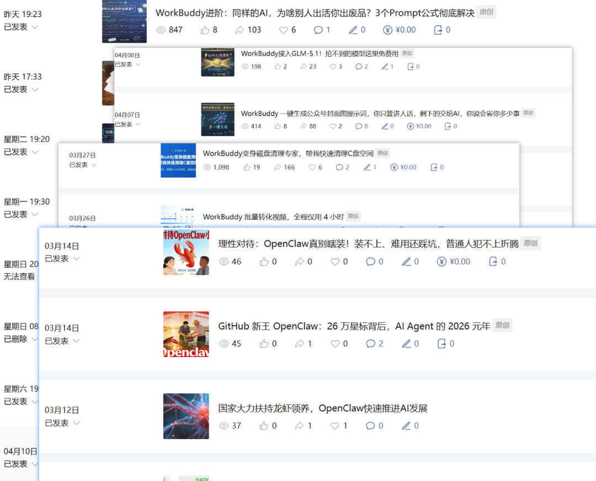
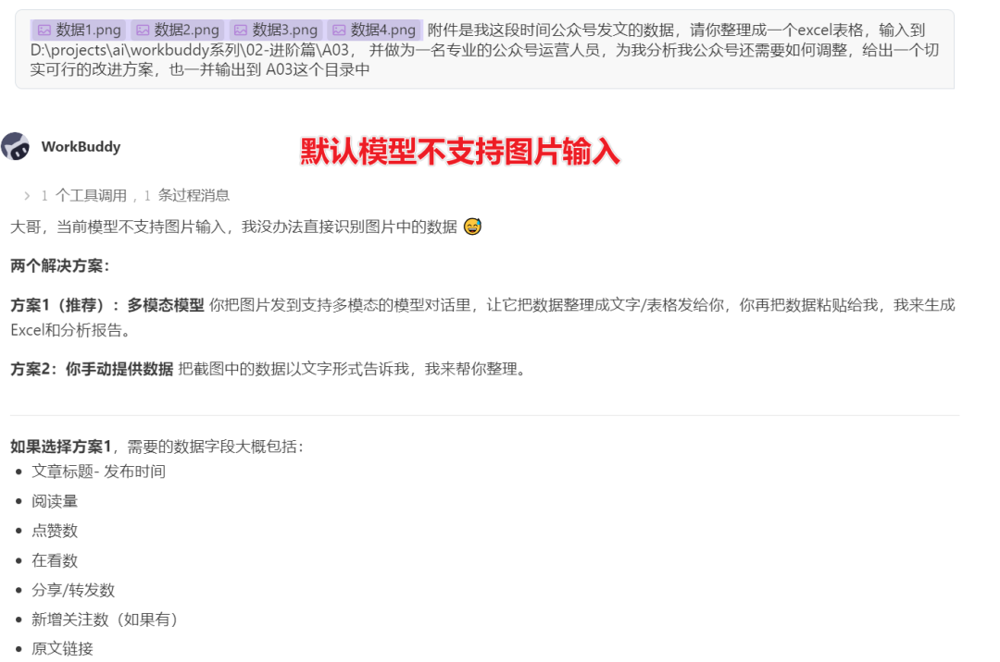
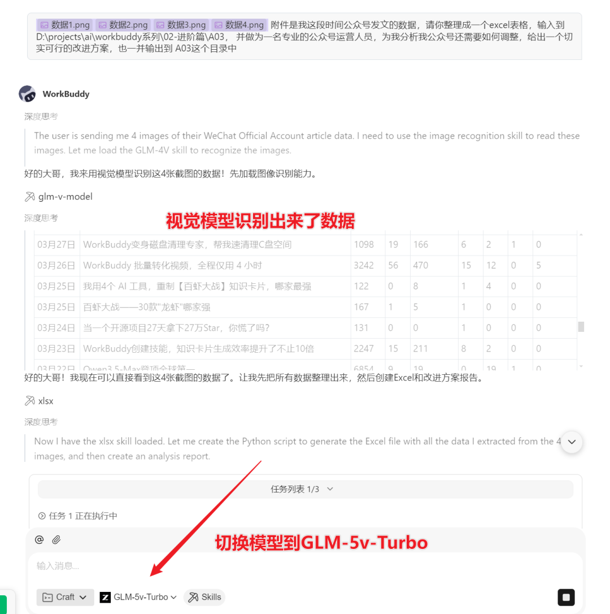
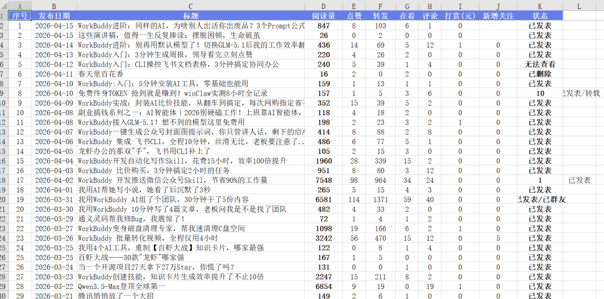
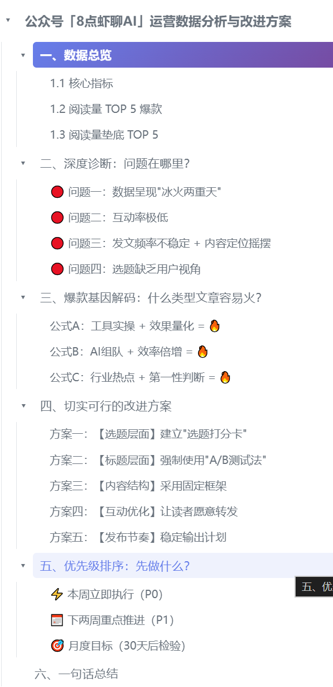

> 📎 来源: [8点虾聊AI](https://mp.weixin.qq.com/s?__biz=MjM5MTAyNjIxMA==&mid=2449092503&idx=1&sn=c7e990b46576f0aac5121719e02c6edd&chksm=b384702746856ded7cb08c238b9398fe9edaf55126ffb55e92d229fa4f308fca2105d16f4033&mpshare=1&scene=1&srcid=0420ye3ItRJKtGIzwIOIeCJJ&sharer_shareinfo=b66c502326ccda66dbcf79b377919cf2&sharer_shareinfo_first=b66c502326ccda66dbcf79b377919cf2) | 时间: 2026-04-20 19:10

---

# 把截图丢给AI，5倍提升不止

## 5秒出分析报告—GLM-5v-Turbo实测

WorkBuddy实战系列 · 进阶篇 A03/15 | 附万能指令模板

⏱️ 预计阅读时间 · 4分钟

📌 真实翻车故事 → 为什么GLM能看懂图 → 万能模板

默认模型看不懂截图？换GLM，4张数据图秒变运营报告

今天下午，我想看看公众号这段时间的数据表现。

打开公众号管理后台，想导出发文数据——**没有导出按钮。**

想复制数据出来？**数字全粘在一起，根本没法整理。**

没办法，我把这期间的数据页面一张张截了图。**一共4张。**（长这样👇）

图1-4：公众号后台发文数据（共4张截图）

我打开WorkBuddy，输入了这样一段话：

📋 我的原始指令（一字未改）：

【这里是４张截图】附件是我这段时间公众号发文的数据，请你整理成一个Excel表格，输入到 D:\projects\ai\workbuddy系列\02-进阶篇\A03，并作为一名专业的公众号运营人员，为我分析我公众号还需要如何调整，给出一个切实可行的改进方案，也一并输出到 A03这个目录中"

第一次用的默认模型【auto】 —— 翻车了 ❌

AI告诉我："抱歉,我无法识别图片中的内容。"

4张数据截图，一张都没看懂。

**于是乎，我切换到了 GLM-5v-Turbo【图片输入，推理模型】。**

图5：默认模型——看不懂截图 ❌

重新发了一遍同样的指令——这次炸了 ✅

GLM不仅准确识别了4张截图里的所有数据，还自动保存成了Excel表格。紧接着，一份**运营分析报告**也输出来了。

报告里写了什么？让我非常震惊，具体就不讲了，如果想看，私我，我发你

• 总之，非常有价值

**最关键的是，这些结论全是基于我的真实数据得出的。不是泛泛而谈，是实打实的分析。**

我看完整份报告，第一反应是：**"这玩意儿比我请个运营顾问靠谱多了。主要是省时省力，总共2分钟不到啊"**

图7：GLM-5v-Turbo成功识别所有数据 ✅

看看为我整理的Excel，比专业的还专业

图8：数据自动整理成Excel表格 ✅

这是给我的运营数据分析与改进方案大纲，绝了。牛逼

图9：自动生成的运营分析报告——非常详细中肯 ✅

⚠️ AI CONTENT DISCLOSURE ⚠️

本文使用 AI 辅助生图及排版优化

核心观点、数据核实、内容审核均由作者本人完成

## 01 |  为什么GLM能看懂图

**核心就一句话：GLM-5v-Turbo 是视觉模型，能"看懂"图片。**

普通文本模型看到图片，只能看到一个文件名。它不知道图片里画的是什么、写了什么数字。

但GLM不一样。它像人一样，能识别图片里的文字、表格、图表，甚至能理解数据的含义和关系。

这就是为什么同样一张截图，默认模型直接摆手，GLM能帮你干活的原因。

## 02  |  WorkBuddy + GLM = 数据分析神器+

说实话，这个组合用下来，我发现它远不止"看图识数"那么简单。

① 对话要交待背景，明确要求

很多人用AI失败，不是因为AI不行，是因为**没把话说清楚。**

你看我刚才那段指令，包含了三个关键信息：

•**背景**：这是公众号发文的数据
•**要求1**：整理成Excel，指定了保存路径
•**要求2**：以专业运营人员身份分析，给出改进方案

每一条都具体、可执行。模糊指令 = 模糊输出。

② 它能干的事，比你想的多

除了我今天做的运营数据分析，这套玩法还能用在：

| 场景 | 做法 | 结果 |
| --- | --- | --- |
| 财务报表分析 | 截图丢给AI | 自动生成收支分析+优化建议 |
| 竞品对比 | 截竞品页面 | 输出优劣势对比表 |
| 学习笔记整理 | 拍书页/课件 | 提取要点+思维导图 |
| 合同审查 | 拍合同条款 | 标注风险点+修改建议 |
| 体检报告解读 | 拍报告单 | 解读指标+健康建议 |

③ 万能指令模板（直接复制改括号）🎁

附件是我[什么场景]的数据/资料（共N张图）。

背景：[简要说明这是什么数据，你的角色是什么]
目标：[你希望AI帮你做什么]

输出要求：
1. 整理成[Excel/表格/文档]，保存到[路径]
2. 以[专业人士身份]进行分析，输出[分析报告]，也保存到[路径]

注意：数据必须准确，不能编造。

改三个括号里的内容，就能用在任何场景。

## 03 | 下期预告

进阶篇前三期：选模型（A01）、Prompt公式（A02）、AI识图读数据（A03）。

下一期，我们来聊一个更硬核的话题：**让AI自动执行复杂任务——Skill开发入门。**

不只是让它"说"，是让它**"做"**。

A04：《3步教你开发自定义Skill，让AI替你干活》

敬请期待 ↓

## 写在最后

今天这件事让我再次确认了一个道理：

**"工具本身不值钱，值钱的是你知道怎么用它。"**

同样的WorkBuddy，同样的截图，默认模型和GLM的效果天差地别。

同样的AI，模糊指令和精准指令的产出完全不同。

关键不在于你用了多牛的工具，在于你是否愿意花两分钟把需求说清楚。

**试完记得回来评论区说说效果，我很好奇你们都能分析出什么有意思的东西。**

💬 今日互动

你有没有想让AI帮你分析的图片/截图？

🎁 评论区说出你的场景，我帮你写专属指令！

比如："我想让AI帮我分析XX" 👇

🎁 扫码免费领取资料

关注公众号「8点虾聊AI」，回复**"GLM视觉"**获取分析报告
💡 资料随时可能更新涨价，趁现在免费赶紧领 👇

长按识别二维码，免费领取

作者：8点虾聊AI | 专注AI效率工具与自动化工作流

2026年4月16日
