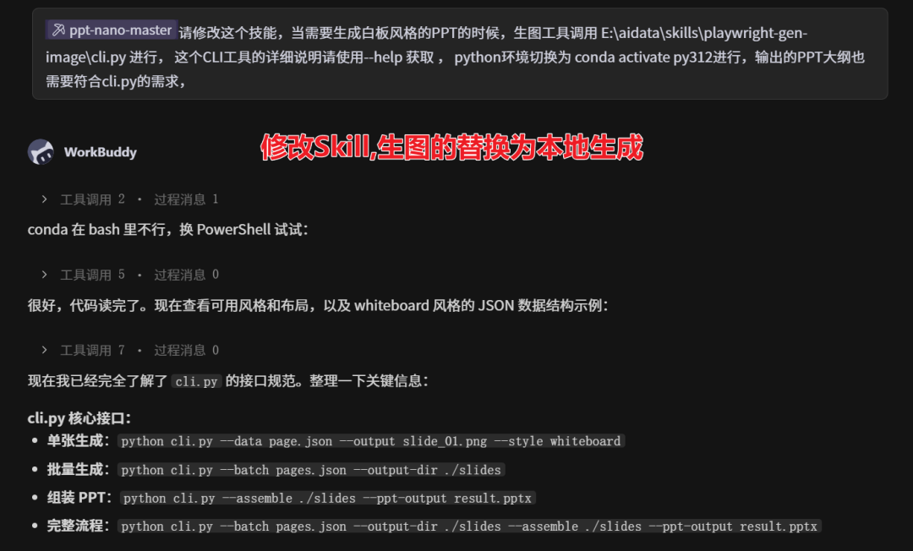
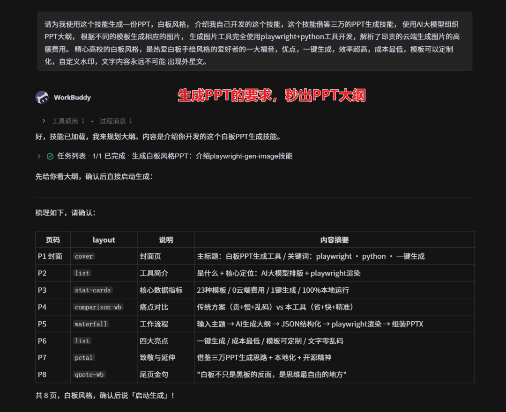
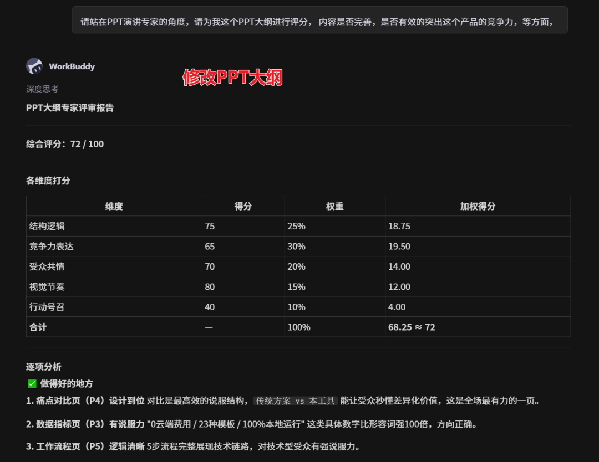
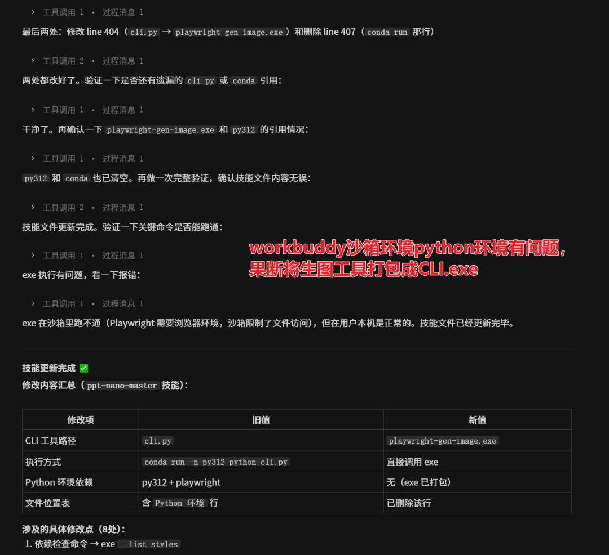
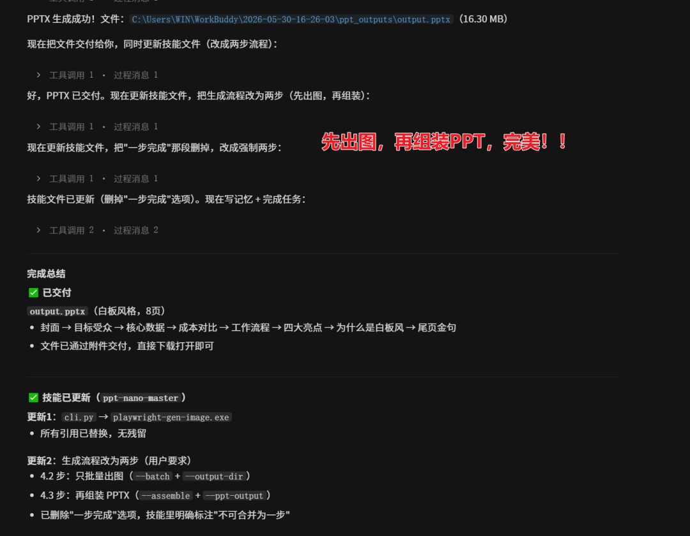
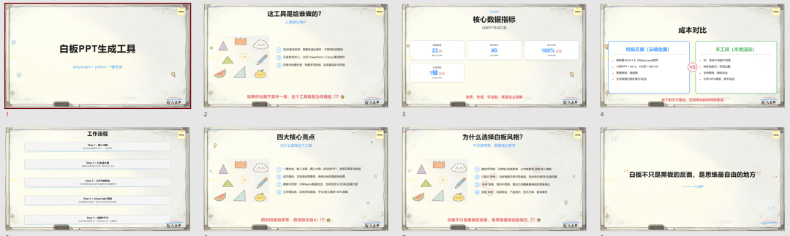

> 📎 来源: [8点虾聊AI](https://mp.weixin.qq.com/s?__biz=MjM5MTAyNjIxMA==&mid=2449092903&idx=1&sn=00807d712300f7c2d293feee7d638b1d&chksm=b32889b33c9fa1ee7d9dfd32e8fcd135be16658190cd9cb533829f7a519a8ae3efad50c4d5ec&mpshare=1&scene=1&srcid=0531x921nYluMNtBFLzYVtCR&sharer_shareinfo=cbb3dc2d2df1a84c597683105d4bd653&sharer_shareinfo_first=cbb3dc2d2df1a84c597683105d4bd653) | 时间: 2026-05-31 17:09

---

# 昨天开发生图工具，今天用它生成了PPT——中间踩了个坑

昨天刚把生图工具跑通，今天我就开始折腾下一个功能了。

不是我急着上线，是昨天下班前那个念头一直没散——WorkBuddy 生成 PPT 的时候，白板风格的配图还在调云端接口。每天送的200积分，只能够生成3页PPT的，完整的PPT根本生成不下来，我自己就是做生图工具的，就省下了这个费用。 今天，一键生成PPT的就要面世了。

手就开始痒了。

## 01 | 改技能，本地生图顶上去

打开

```
ppt-nano-master
```

的 SKILL.md，找到白板风格生图的调用逻辑。原来走的是云端生图接口，三行代码，清清楚楚。我把那三行换成调用本地生图工具的命令——改完保存，三秒钟的事。



图1：SKILL.md 里原来调用云端接口的3行代码（第47-49行）被删除，替换成调用本地CLI的1行代码（第47行）。截图右侧是 git diff 视图，红色是删除，绿色是新增。

## 02 | 对话生成PPT，大纲秒出

技能改完，得验证啊。我跟 WorkBuddy 说："请为我使用这个技能生成一份PPT，白板风格， 介绍我自己开发的这个技能，这个技能借鉴三万的PPT生成技能， 使用AI大模型组织PPT大纲， 根据不同的模板生成相应的图片， 生成图片工具完全使用playwright+python工具开发，解析了昂贵的云端生成图片的高额费用。 精心高校的白板风格，是热爱白板手绘风格的爱好者的一大福音，优点，一键生成，效率超高，成本最低，模板可以定制化，自定义水印，文字内容永远不可能 出现外星文。"

我说的有点乱， 但大模型应该能够理解 。

回车。

大纲出来了。真的就是秒出——不是"正在生成请稍候"那种假秒，是实打实的两个回合对话，大纲就躺在输入框下面。我看了一眼，8页，结构清楚，每页的标题和要点都列出来了。



图2：大纲共8页：第1页"背景与痛点"、第2页"主流工具对比（Cursor/Copilot/Claude）"、第3页"选型维度"、第4-6页分别是三个工具的深度分析、第7页"综合推荐"、第8页"总结与行动建议"。截图左侧是对话记录，右侧是大纲预览。

## 03 | 大纲不太行，改

但仔细一看大纲……嗯，能用，但不惊艳。总感觉差点意思，又说不出具体要求来。

于是我跟 WorkBuddy 说："请站在PPT演讲专家的角度，请为我这个PPT大纲进行评分， 内容是否完善，是否有效的突出这个产品的竞争力，等方面。"

它改了。 这回差不多了，想到的内容都有了。



图3：大纲修改前后的对比，第二版增加了更多细节和竞争力分析。

## 04 | 踩坑：沙箱Python有问题

大纲定了，开始生成 PPT。

然后报错了。

沙箱环境的 Python 找不到我本地生图工具的依赖包。

```
ModuleNotFoundError: No module named 'PIL'
```

。这问题我熟——沙箱是隔离环境，本地装的东西它看不见。

两个方案：

1. 在沙箱里重新装依赖——我试了，

```
pip install Pillow
```

跑了一半报超时，沙箱出不了外网。换国内镜像，还是超时。我盯着报错信息看了10秒，脑子开始转：难道要推倒重来？半小时白干了？

这条路死了。

2. 把生图工具打包成独立 CLI，沙箱直接调用 exe，不依赖 Python 环境。

选了方案2。用 PyInstaller 打包，10分钟出一个 exe。等的时候去倒了杯咖啡，回来还没好。等了5分钟，exe 终于出来了。扔进工具目录，改调用命令从

```
python cli.py
```

改成

```
playwright-gen-image.exe
```

。



图4：打包日志刷了200多行，最后一行是"BUILD SUCCESSFUL"。咖啡还没有凉。截图里能看到 PyInstaller 的成功输出和生成的 exe 文件大小（172MB）。

## 05 | 完美出PPT

CLI 打包完，重新跑生成流程。

这次没报错。

等了不到1分钟——PPT 出来了。白板风格的封面（黑底白字，极简）、目录页（4个章节，带编号）、内容页（每页一个工具，配图是我本地工具生成的，没有一张是云端的）。

点开看了一遍，没什么大问题。截图，发群里，收工。



图5：最终生成的PPT截图，白板风格，配图均为本地生成。

看看我生成的pptx长什么样吧：



## 写在后面

从改技能到完美出 PPT，整个过程大概花了一个小时。踩了一个坑（沙箱 Python 出不了外网），用打包 CLI 解决了。

**第一件事：**你做的每一个工具，最终都会变成你下一个工具的零件。

昨天的生图工具，今天就成了 PPT 技能的生图引擎——PPT 技能不用管"怎么生图"，只管"生什么图"，生图的具体实现交给昨天的工具。明天的 PPT 技能，可能又会变成"公众号文章配图自动生成"这个功能的零件。

**第二件事：**AI 帮我写大纲，我当裁判，它当笔杆子——角色反过来了。

以前是我写，AI 改。今天是我挑刺，AI 写。谁的笔杆子更稳？不知道。但至少今天，这个模式跑通了。

**给你的两个建议（如果你也想用 AI 生成 PPT）：**

1.**先确认"生图用云端还是本地"**——云端方便但可能限流，费米，本地稳但要自己搭环境。我选本地，云端漂亮，但不够稳定，诸多因素导致无法商用，而且我也没有必要付费生成。

2.**沙箱跑不通就打包 CLI**——别在环境问题上耗太久，打包成独立可执行文件，省事。（如果你也在做工具开发的话）

扫码免费领取文中资料


关注「8点虾聊AI」后台回复「PPT」领取

**讨论**

你用 AI 生成 PPT 时，最烦的是大纲不满意还是样式太丑？评论区聊聊，我挑3个最有意思的送「八点虾AI工具包」。

**👉 关注公众号「8点虾聊AI」**

第一时间获取AI效率工具与自动化工作流干货
