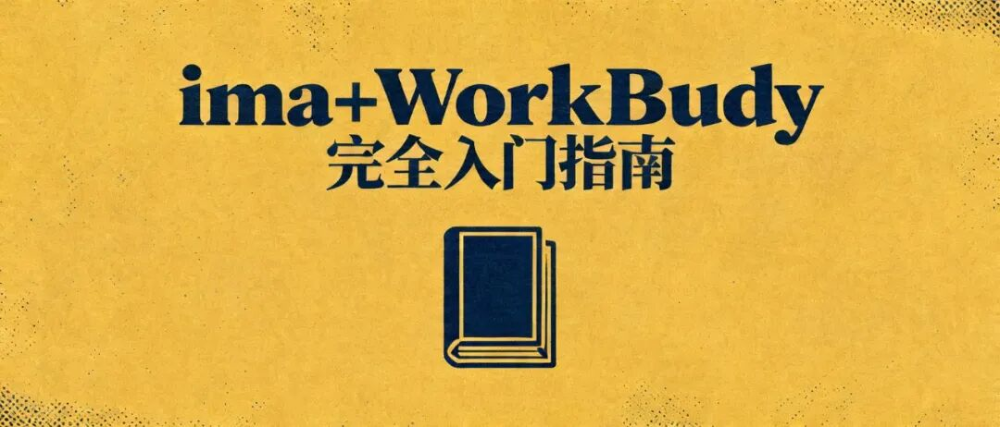

> 📎 来源: [老陈聊营销说管理](https://mp.weixin.qq.com/s?__biz=MzI3MzAzNzgwNg==&mid=2247487030&idx=1&sn=d88be2d408f84b4cfb0bbefbb46d9104&chksm=eacb05292de7899fb870a863061a30356dafc702152f15460b5a461b55304eb833944f9fd956&mpshare=1&scene=1&srcid=05223jv2fA7aP89Oci0jKg6q&sharer_shareinfo=0aad6b7b897215d27395353cbcc6dc5e&sharer_shareinfo_first=0aad6b7b897215d27395353cbcc6dc5e) | 时间: 2026-05-22 01:59

---

先说结论

ima知识库是你的“第二大脑”, 帮你存知识、管资料、随时查。

腾讯龙虾WorkBuddy是你的“AI 打工人”, 帮你执行任务、处理文件、自动干活。

两个都是腾讯出的, 也能互相打通。

ima知识库 负责“记住”, WorkBuddy 负责“动手”。

组合在一起就是:

你的知识有人管, 你的活有人干。

而且目前两个都免费。

现在都还在公测阶段, 不收费。

PS.如果你是医疗行业从业，也推荐看这几篇：

- [医疗机构想用好WorkBuddy，先别急着上强度，这10个动作更重要](https://mp.weixin.qq.com/s?__biz=MzI3MzAzNzgwNg==&mid=2247487021&idx=1&sn=c7f37732baec95a68aa4e3c021b2382c&scene=21#wechat_redirect)
- [医疗机构老板最该补的，不是人手，而是这套 AI 岗位分工](https://mp.weixin.qq.com/s?__biz=MzI3MzAzNzgwNg==&mid=2247487016&idx=1&sn=6f22444c2125f3314b18407c1afdb676&scene=21#wechat_redirect)
- [如何用ima知识库+WorkBuddy（腾讯龙虾），搭出医疗团队的AI工作系统](https://mp.weixin.qq.com/s?__biz=MzI3MzAzNzgwNg==&mid=2247486978&idx=1&sn=78650bb5b65d9e55f329ada951cce5de&scene=21#wechat_redirect)

# 第一部分: ima 是什么

## 一、一句话定位

ima 是腾讯出的 AI 智能工作台。

你可以把它理解成一个带 AI 能力的笔记 + 知识库。

它不是 ChatGPT 那种纯对话工具。

它更像是:

- 你可以把资料存进去, 比如网页、PDF、文档、图片
- 它会自动帮你整理、摘要
- 你可以随时用自然语言搜索、提问
- 它能基于你存进去的内容来回答问题

网址:ima.qq.com

也有电脑客户端和手机端。

## 二、ima 的核心功能

## 功能1: AI 对话

- 跟 ChatGPT 类似, 可以直接问问题
- 但它不只是回答通用知识, 还可以基于你的知识库回答
- 相当于一个“读过你所有资料”的 AI 助手

## 功能2: 个人知识库

这才是 ima 真正值钱的地方。

- 你可以创建自己的知识库, 把各种资料丢进去
- 网页文章、PDF 文件、Word 文档、图片、文字笔记都可以
- ima 会自动解析、索引, 后面你就能随时搜
- 支持多个知识库, 比如“行业研报”“客户资料”“培训材料”分开管理

## 功能3: 知识库广场

- 可以看到别人分享的公开知识库
- 也可以把你的知识库分享给别人
- 适合团队协作

## 功能4: 网页剪藏

- 浏览器装个插件, 看到好文章可以一键保存到 ima
- 会自动提取标题、正文和关键信息

## 三、ima 适合存什么

- 行业研报、竞品分析报告
- 培训资料、学习笔记
- 项目文档、会议纪要
- 客户资料、案例分析
- 网页文章、干货收藏
- 你自己写的工作总结、复盘

一句话:

任何你觉得“以后可能用得上”的东西, 都可以先存进去。

# 第二部分: WorkBuddy 是什么

## 一、一句话定位

WorkBuddy 是腾讯出的 AI 智能体桌面工作台，就是腾讯推出的龙虾🦞。

你可以把它理解成一个住在电脑里的 AI 同事。

跟 ima 不一样, ima 是“存东西的”, WorkBuddy 是“干活的”。

你说一句话, 它就能:

- 帮你处理 Excel 表格
- 帮你生成 PPT
- 帮你写文档
- 帮你分析数据
- 帮你批量整理文件
- 帮你做调研、写报告

关键是:

它能直接操作你电脑上的文件。

不是只给你一段文字建议, 而是真的帮你把活干了。

官网:workbuddy.qq.com 或 codebuddy.cn/work/

需要下载安装到电脑上, Mac 和 Windows 都支持。

## 二、WorkBuddy 的核心功能

## 功能1: 一句话下任务

- 不需要学复杂操作
- 直接用中文说你要做什么
- 比如: “帮我把这个 Excel 里的销售数据做个分析, 生成图表”
- 它会自己拆解任务、规划步骤、执行, 最后交付结果

## 功能2: 直接操作本地文件

- 你授权它访问某个文件夹
- 它就能读取、分析、创建、修改里面的文件
- 不是在云端操作, 是在你电脑本地操作
- 数据不会随便跑到外面去

## 功能3: 多任务并行

- 你可以同时给它好几个任务
- 它会并行处理
- 你可以一个一个看结果

## 功能4: Claw 远程控制（重点）

这个功能很实用。

你可以用微信、企业微信、QQ、飞书、钉钉远程控制 WorkBuddy。

什么意思？

就是你人在外面, 用手机发条微信, 家里的电脑就能开始干活。

干完以后, 结果再直接发回你微信。

不坐在电脑前, 也能用。

## 功能5: Skills 技能包

- WorkBuddy 可以安装各种“技能包”
- 有点像手机装 App
- 装了什么技能, 它就能做什么事
- 有官方的, 也有社区贡献的
- 目前兼容 OpenClaw 的 Skills 格式

## 功能6: 模型切换

- 内置多个 AI 模型可选
- 可以根据任务类型选不同模型

## 三、WorkBuddy 适合干什么

## 场景1: 数据处理

- 你有一堆 Excel, 数据乱七八糟
- 告诉它: “帮我清洗这些数据, 做个统计报表”
- 它直接给你处理好, 还有图表

## 场景2: 文档生成

- “帮我根据这个需求文档生成一份 PPT”
- “帮我把这些会议记录整理成会议纪要”
- “帮我写一份周报, 数据在这个 Excel 里”

## 场景3: 文件整理

- “帮我把下载文件夹里的文件按类型分类整理”
- “帮我把这些图片按日期重命名”
- “帮我把这些 PDF 的关键信息提取出来做成表格”

## 场景4: 调研分析

- “帮我调研一下 XX 行业最近的变化, 出一份报告”
- “帮我分析这份用户反馈, 总结主要问题和建议”

## 场景5: 批量操作

- “帮我把这 100 份发票的信息提取出来做成报销表”
- “帮我把这些文件全部转成 PDF 格式”

# 第三部分: ima 知识库 + WorkBuddy 怎么配合

这部分最关键。

单独用 ima 知识库:

你有一个很聪明的知识库, 但它只能查, 不能干活。

单独用 WorkBuddy:

你有一个很能干的 AI 助手, 但很多需求每次都得从头描述。

两个一起用:

- ima 知识库 负责“记住你的知识和经验”
- WorkBuddy 负责“调用这些知识帮你干活”
- 形成一个闭环: 存 → 管 → 用 → 创

## 配合方式1: WorkBuddy 调用 ima 知识库

在 WorkBuddy 里可以连接 ima 的知识库。这样一来:

- 你让 WorkBuddy 写报告, 它可以参考你 ima 里存的资料
- 你让 WorkBuddy 分析数据, 它可以调取你 ima 里的历史数据来对比
- 相当于 WorkBuddy 不只是个 AI, 而是一个“读过你所有资料的 AI”

## 配合方式2: WorkBuddy 帮 ima 整理资料

反过来也可以。

- 你把一堆原始文件丢给 WorkBuddy
- 让它帮你整理、分类、摘要
- 再自动存到 ima 的知识库里
- 你就不用自己手动整理了

## 配合方式3: 通过微信远程操控

结合 Claw 功能:

- 你在手机上给 WorkBuddy 发微信
- WorkBuddy 从 ima 知识库里调资料
- 处理完以后, 结果再发回你微信
- 全程不用碰电脑

# 第四部分: 安装和使用（手把手）

## 一、ima 安装

## 方式1: 网页版（最快）

- 打开 ima.qq.com
- 用微信扫码登录
- 直接就能用

## 方式2: 电脑客户端

- 在 ima.qq.com 点“打开电脑版”下载
- Mac 和 Windows 都有
- 登录后跟网页版数据同步

## 第一步操作建议

登录后先建一个知识库, 比如叫“工作资料”。

把你手上最常用的几份文档先丢进去试试。

然后用搜索功能问它一个问题, 看看效果。

## 二、WorkBuddy 安装

步骤如下:

1. 打开 codebuddy.cn/work/
2. 点击“下载 WorkBuddy”
3. 选你的系统（Mac 选 Apple 芯片或 Intel, Windows 选 x64）
4. 下载安装包并安装
5. 打开后登录（支持微信扫码）

## 第一步操作建议

安装好后, 先给它一个简单任务试试:

- “帮我写一份本周工作总结的框架”
- 或者把一个 Excel 拖进去说: “帮我分析这个数据”

先感受一下它到底能做什么。

## 三、Claw 远程控制配置（微信）

这是最实用的功能之一。

配置一次, 后面会很常用。

1. 打开 WorkBuddy
2. 点击“Claw 设置”
3. 选择“微信”
4. 按提示扫码绑定
5. 绑定成功后, 在微信里找到 ClawBot（或你绑定的服务号）
6. 直接发消息, 就是在下任务

绑定后你就可以:

- 在外面用手机给 WorkBuddy 下任务
- 它在电脑上执行
- 结果再发回你微信

# 第五部分: 5 个最实用的工作场景（看完就能用）

## 场景1: 每天自动收竞品 / 行业动态

你要做的:

- 在 ima 里建一个“行业动态”知识库
- 把你常看的几个网站、公众号链接存进去
- 在 WorkBuddy 里设一个定时任务:

“每天早上 8 点, 抓取这些链接的最新内容, 整理成一份摘要, 推送到我微信”

效果:

每天早上打开微信, 一份行业日报就在那里了。

不用自己一个个去刷。

## 场景2: 把散落的经验变成可检索的知识库

你要做的:

- 把电脑里散落的文档, 比如方案、复盘、报告、笔记, 全部导入 ima
- 按类型建不同的知识库, 比如“客户案例库”“行业方法库”“培训资料库”
- ima 会自动解析和索引

之后你就可以:

- 需要某个客户的历史资料, 直接搜
- 想找之前做过的某个方案, 直接问
- 新同事入职, 把知识库分享给他, 直接上手

## 场景3: 周报 / 月报自动生成

你要做的:

- 在 ima 里存一个“周报模板”, 写清楚你要的格式
- 把本周的工作文件、数据表格放在一个文件夹里
- 跟 WorkBuddy 说:

“根据这个文件夹里的内容, 按照 ima 里的周报模板, 生成本周周报”

效果:

10 分钟搞定以前 2 小时的周报。

格式还是你自己的格式。

## 场景4: 批量处理数据和文件

你要做的:

- 把要处理的文件放在一个文件夹
- 告诉 WorkBuddy:

“帮我从这个文件夹里的所有 Excel 中提取 XX 字段, 汇总到一个表里”

- 或者:

“帮我把这些图片按日期重命名并分类存好”

效果:

几百个文件, 几分钟就处理完。

不用一个个手动搞。

## 场景5: 外出时远程处理工作

你要做的:

- 配置好 Claw（微信绑定）
- 你在外面, 老板突然要一份数据
- 你在手机微信上跟 WorkBuddy 说:

“帮我把桌面那个 XX 文件里的数据做个汇总, 发给我”

- WorkBuddy 在办公室电脑上执行

- 结果直接发回你微信

效果:

不用跑回电脑前。

不用找人帮忙。

手机发一条消息就能搞定。

# 第六部分: 常见问题

## Q1: ima 和 WorkBuddy 要钱吗？

目前都免费, 还在公测阶段。

以后可能会推出付费版本, 但免费的基础功能大概率会保留。

## Q2: 数据安全吗？

ima 和 WorkBuddy 都是腾讯的产品, 走的是腾讯云的安全体系。

WorkBuddy 操作的是你本地文件, 数据不会上传到云端（除非你主动让它传）。

ima 的知识库存放在腾讯云, 但有权限管理, 你可以控制谁能看到。

## Q3: 我没有技术背景, 能装吗？

能。

ima 网页版直接用, 扫码登录就行。

WorkBuddy 的下载安装也跟普通软件一样。

不需要写代码, 也不需要折腾环境。

## Q4: 跟 ChatGPT / 文心一言有什么区别？

ChatGPT / 文心一言:

更偏纯对话, 主要给你文字建议, 不会直接替你操作文件。

ima:

对话 + 知识库, 能记住你的资料, 基于你的资料回答问题。

WorkBuddy:

能直接操作电脑文件, 真正帮你把活干了。

它们不是简单替代关系, 而是不同层次的工具。

## Q5: 手机上能用吗？

ima 有手机端, 可以随时查知识库。

WorkBuddy 手机上不能直接装, 但你可以通过 Claw 功能, 用微信远程控制电脑上的 WorkBuddy。

## Q6: WorkBuddy 跟 OpenClaw 是什么关系？

WorkBuddy 兼容 OpenClaw 的 Skills 格式。

简单说就是:OpenClaw 的技能包, WorkBuddy 也能用。

两个是打通的。

## Q7: 龙虾是什么？

龙虾是 WorkBuddy / OpenClaw 社区里的昵称。

“养龙虾”就是在用和训练 WorkBuddy。

“虾仁”就是使用 WorkBuddy 的用户。

这是社区里的叫法。

# 第七部分: 快速上手清单

第1步（5分钟）: 打开 ima.qq.com, 微信扫码登录, 建一个知识库

第2步（5分钟）: 往知识库里丢 3 到 5 份你最常用的文档

第3步（5分钟）: 试着用搜索功能问一个问题, 看看效果

第4步（10分钟）: 去 codebuddy.cn/work/ 下载安装 WorkBuddy

第5步（5分钟）: 给 WorkBuddy 下第一个任务, 感受一下

第6步（10分钟）: 配置 Claw, 绑定微信, 试试远程下任务

总共不到 40 分钟, 你就能把这两个工具先跑起来。

后面再慢慢把更多资料存进 ima, 再慢慢给 WorkBuddy 更多任务。

用着用着, 你就知道怎么把它们接进自己的日常工作流了。

# 写在最后

很多人觉得 AI 工具很酷, 但不知道怎么落到自己工作里。

ima 和 WorkBuddy 的组合, 是目前很接近“AI 真正帮你干活”的一套方案。

ima 负责记住你的知识和经验。

WorkBuddy 负责替你执行任务和处理文件。

一个存, 一个干。

别想太多。

先把两个装上, 跑起来再说。

工具不是学会了才用。

很多时候, 是你先用起来, 才会慢慢真的会用。

---

我最近组织了一个医疗圈 OpenClaw 龙虾交流群。如果你也在关注医疗行业 AI咨询、AI营销、AI员工、AI组织提效这些事，欢迎私信我，入群交流（添加微信：c501237277），有问题, 随时在群里交流，但是需要你也有养龙虾🦞。
