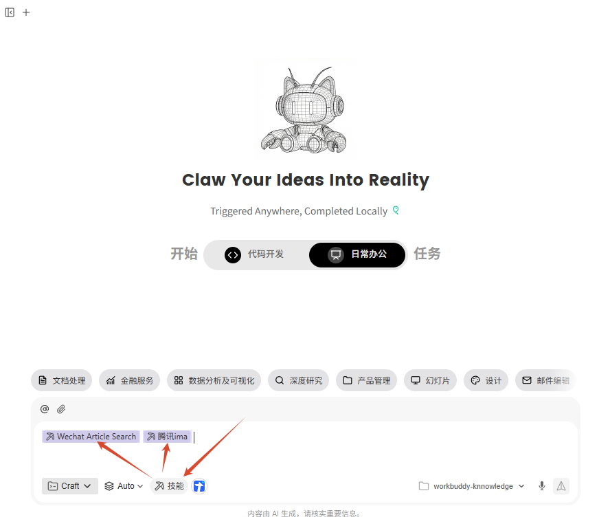
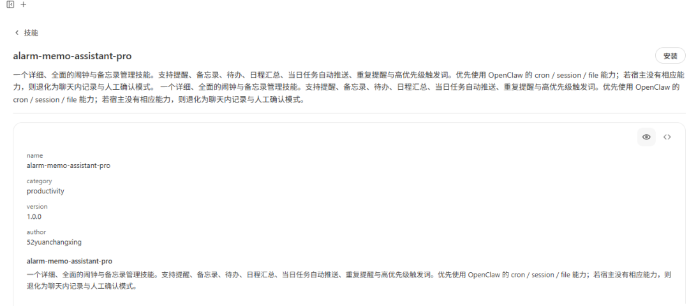
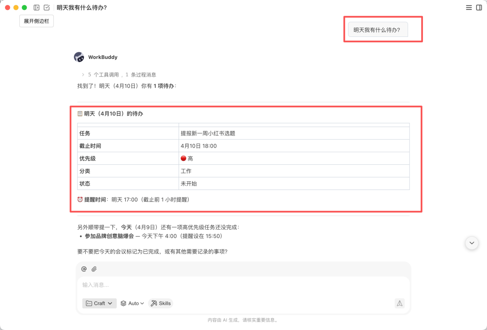
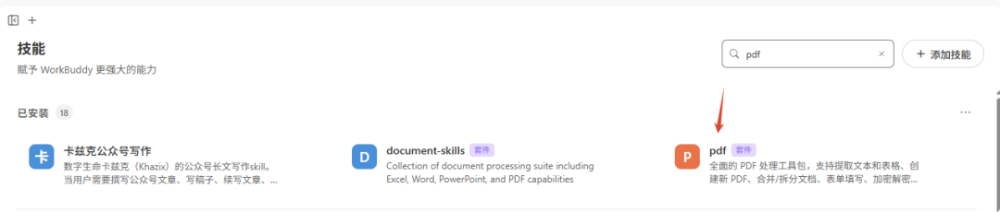
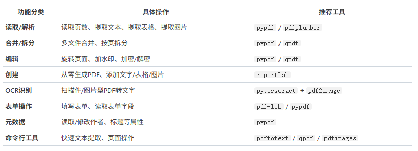
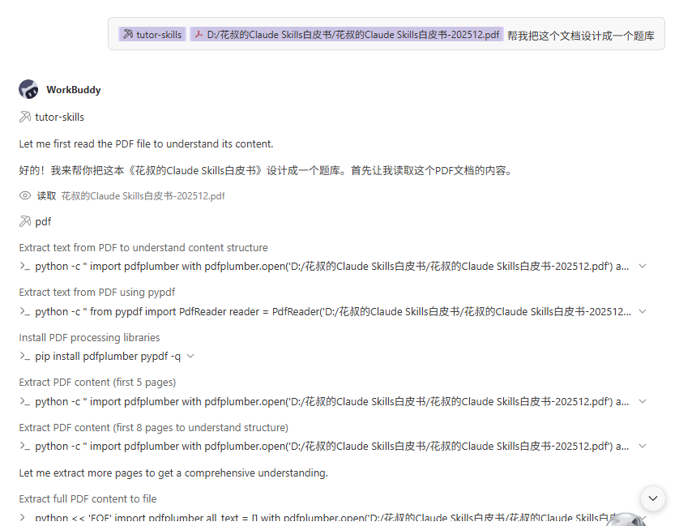

> 📎 来源: [智械日志](https://mp.weixin.qq.com/s?__biz=MzI0NzgwNDQwMg==&mid=2247485023&idx=1&sn=a1fe2c5c3ba324b66529a3b4573182d5&chksm=e812f97b9a63697177b8d09af25f00c02a4bb7bfda0e9b91f3ff4e618911ee5d290be3a638c3&mpshare=1&scene=1&srcid=0513j9nOMJWNIfhSVwlNgXLd&sharer_shareinfo=c0be3153e47bbd6d1b2bd4ad1b34011c&sharer_shareinfo_first=c0be3153e47bbd6d1b2bd4ad1b34011c) | 时间: 2026-05-13 15:39

---

想不到上周关于workbuddy和ima搭建知识库的内容大家那么喜欢[建议所有人都用workbuddy和ima来搭建个人知识库！](https://mp.weixin.qq.com/s?__biz=MzI0NzgwNDQwMg==&mid=2247484978&idx=1&sn=aea46551b0a7ffaf67eee5e06f2be354&scene=21#wechat_redirect)

 最近也是高频率的使用workbuddy和ima组合，毕竟额度够用，约等于白嫖。小龙虾，爱马仕，workbuddy各自负责一个板块。

寻思着也许大家喜欢workbuddy，这期就给大家罗列几个常用的生产力skills，大家玩得开心。

**ima和Wechat Article Search skill技能**

这两个能力可以参考之前的文章，用来构建ima知识库和搜索微信公众号文章、热点，结合定时任务，每日定期采集相关热点文章选题作为选题库。

**alarm-memo-assistant-pro**

一个详细、全面的闹钟与备忘录管理skills。支持提醒、备忘录、待办、日程汇总、当日任务自动推送、重复提醒与高优先级触发词。

你可以把所有代办扔给他，让workbuddy帮你整理好，并设置提醒和优先级。每天问一句“明天的待办事项”或者干脆懒一点，设置定时认为让workbuddy推送提醒。

**PDF技能**

这个简直是王炸级别的技能，各位彦祖亦菲应该遇到需要合并pdf，加水印，ocr识别，添加文字等等pdf需求吧！现在也不老您动手了，交给workbuddy pdf技能即可。技能中搜索pdf，pdf套件就是。

功能非常丰富。

**tutor-skills**

用过notebooklm的应该知道它有个功能是生成测验小卡，tutor-skills也可以做到这个事情。可以将PDF, MD, HTML, EPUB, 甚至是源代码转为 Obsidian 学习库markdown，自动出题、测验并跟踪掌握度。

**question-bank**

这个是学生党友好技能。是一个知识库捕获与自适应复习系统，核心功能是把对话中的知识点变成结构化笔记 + 题库 + 艾宾浩斯复习计划，强烈建议搭配ima使用。

因为有需要辅导逆子学习，所以重点讲讲这个的两个场景。

场景一：记住知识点（主要用法）

当你说出以下任一触发词时自动启动：

「记住」「记下来」「加入知识库」「这个值得记」「帮我记住」「值得记录」

它就可以做到：

分析内容，提取要记的知识点，判断分类（金融/技术/AI/产品/其他）

生成速记卡，含核心要点、详细内容、类比记忆、自测问题

写入文件 — 存到 knowledge/{分类}/ 目录

生成题目，3-5道题加入题库（选择/类比/应用/教学四个难度层级）

初始化掌握度，记录学习日期、状态为 new

安排复习计划，按艾宾浩斯曲线：1/2/4/7/15/30 天

反馈你，告知笔记位置、题目数量、明天首次测验时间

场景二：答题复习

当你回复复习测验的答案时：

逐题评分（1-5分）

更新掌握度状态（动态调度下次复习间隔）

标记薄弱点，下次重点考察

自动完成整个捕获→笔记→题库→复习计划的流程。

#workbuddy
