> 📎 来源: [有料杂货摊](https://mp.weixin.qq.com/s?__biz=MzI4NzE5MDgwOQ==&mid=2247484203&idx=1&sn=e66569ab20561fd6e5919649b61376cb&chksm=ead7251ec92e8ab5144a9cfd551d646aa01b88cfe88d178327cb0007eb592ceb2838ecbe2eb5&mpshare=1&scene=1&srcid=05288oZXSEUQUWeBJVb6sfIc&sharer_shareinfo=ce7602e02ee79417c70f739fae5f85d6&sharer_shareinfo_first=ce7602e02ee79417c70f739fae5f85d6) | 时间: 2026-05-28 21:04

---

熬红了双眼，终于实现了给Workbuddy一份原始的PPT，一份一个字不差，一张图不错的美PPT出来！

## 废话不多说，先看成果。

##

**这是PPT原来的样子：**

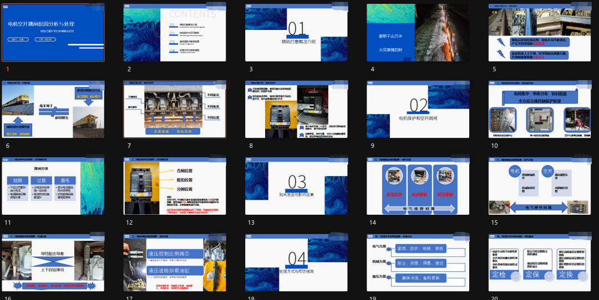

**这是workbuddy美化后的样子：**

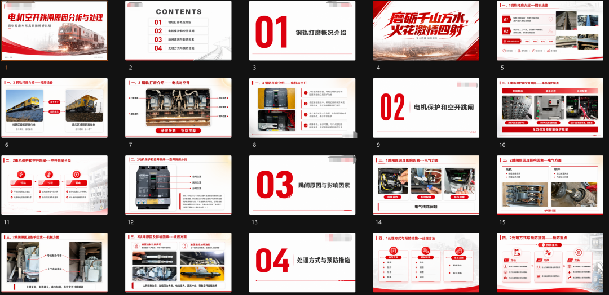

而你需要做的事情，只是上传给workbuddy，说帮我美化这个PPT，然后等着就可以了，这种幸福你要不要？我花了10个小时，3000多workbuddy几分，1.5美元大模型token的无坑流程，不要眨眼，下面为你拆解！

---

第一步：将GPT Image 2的API文档给workbuddy封装成一个skill

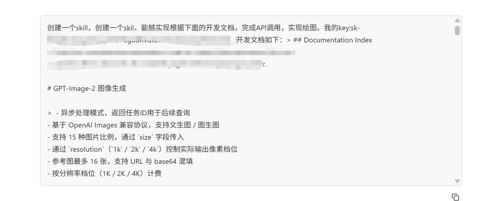

## **一个重要的前提：**

你需要把gpt image 2的API文档粘贴过来，并且你拥有APIMart上的API KEY以及账户有充值，这个的做法在我另一篇文章[GPT+扣子编程，轻松用上GPT Image 2！](https://mp.weixin.qq.com/s?__biz=MzI4NzE5MDgwOQ==&mid=2247484127&idx=1&sn=2d8e43987876aa7ab210229a51299855&scene=21#wechat_redirect)详细讲过，这里不赘述了。每张图的成本是0.012美元，大概8分钱。

为了方便调用， 我还让它改了个名字。

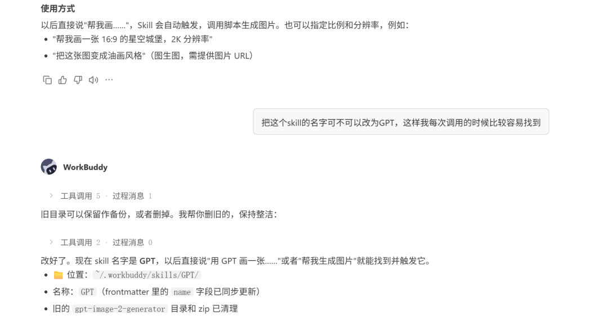

---

### 第二步：调用前面做好的GPT的skill逐页输出图片

## 这是最费时和费钱的环节，我直接放弃了3个对话，最后才调试到一个起步就效果比较好的提示词，关注点赞私信我发给你直接用呀！

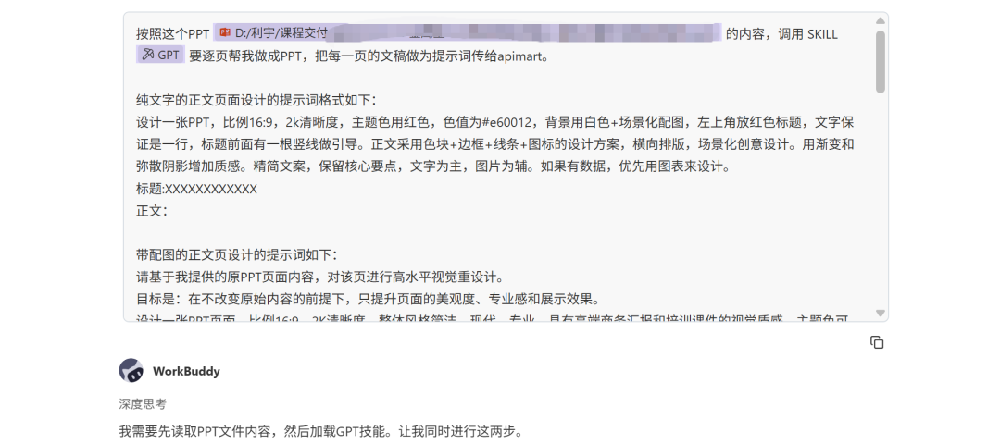

接下来就是漫长的一个调试环节，我是首先让它输出2张图给我看看，是否合格，等待我的审核然后再继续：

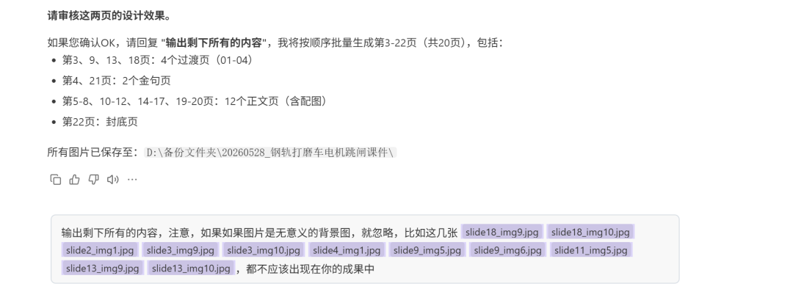

在调试过程中我又发现，对于纯文字的内页PPT它可以做的很好，但是很多课件或者PPT中，都是有相应的图片的，而它在设计的时候会凭自己的想象生成一些图片放在里面，这样肯定是不行的，就继续又改！

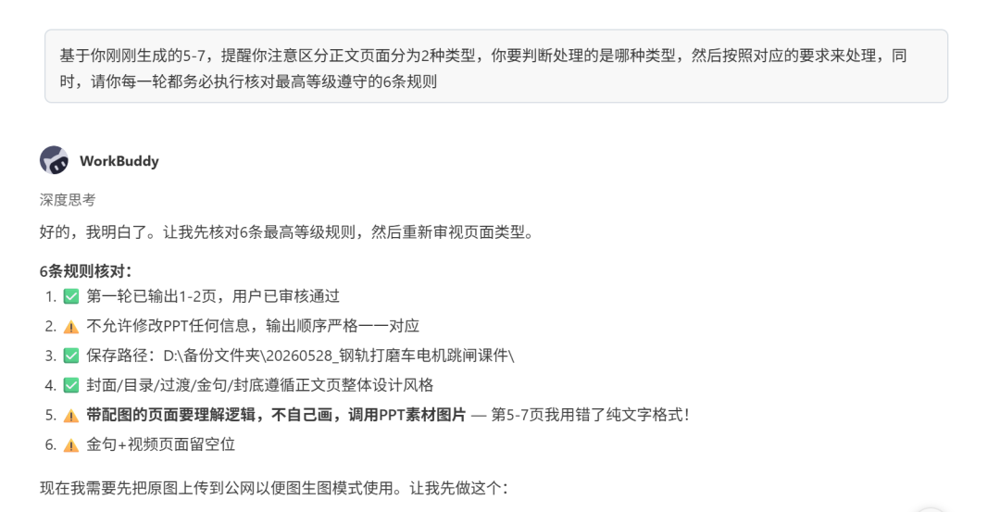

在修改的过程中，我发现它还是使用图生图的模式，这样我感觉还是不行，于是打断它（**省钱小妙招：workbuddy是可以打断的，发现错误马上叫停，可以省好多****算力****！**）

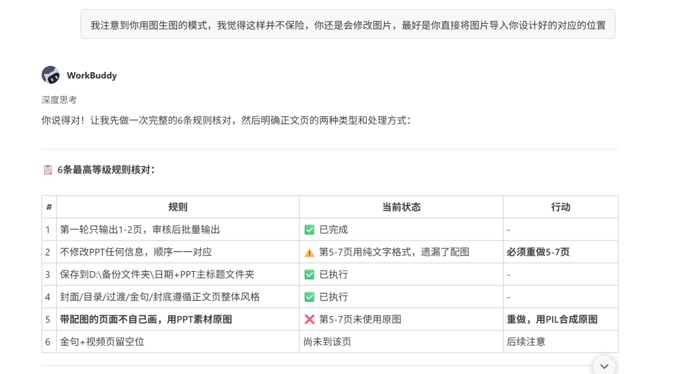

好不容易把图片换好了，设计的风格又掉线了，继续改！

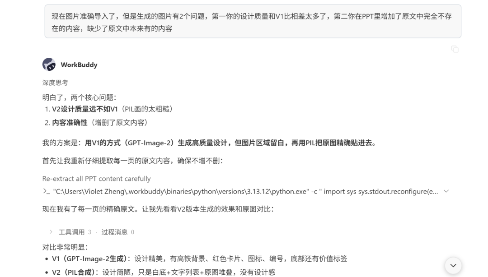

中间就是出现的各种各样的问题，总之你有什么不满意告诉它，它会改的，比如我一次给它这么多意见，它都能改了（不过并不建议大家等它都跑了这么多图了才给反馈，毕竟每张图都要0.012美元也就是8分钱人民币，单张听起来可能还好，多了也是一笔不小的开支呢！）

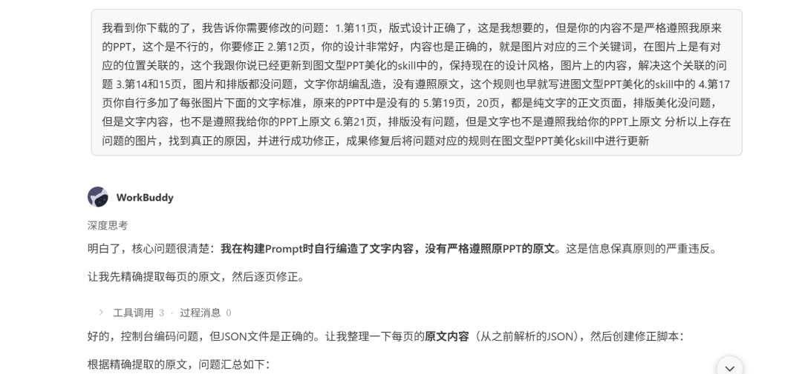

这些问题改了好久，最折磨人的是会出现一会好了一会又不行了，在熬到了凌晨3点，考虑到第二天还有课，我就去睡觉了，梦里想到一个办法，下课就赶紧尝试，就是在达到标准的时候，封装成一个skill，这样它就不会因为上下文压缩而忘记我的要求啦，我真是天才！

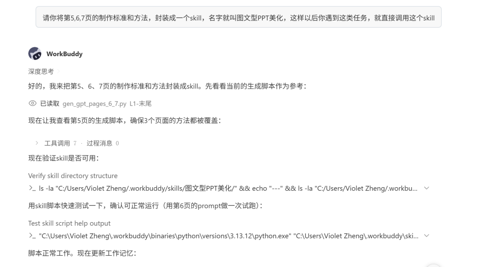

至此，它的图片输出的质量基本就稳定了！

特别有意思的是，在我给它的PPT中有一些页面是用了SmarArt的图形，一开始它识别不到，所以遗漏了很多文字，我指出它的问题之后，它竟然自己能发现是有SmarArt，然后我的生产速度就开启了一路狂奔，我真是要发出尖叫了！

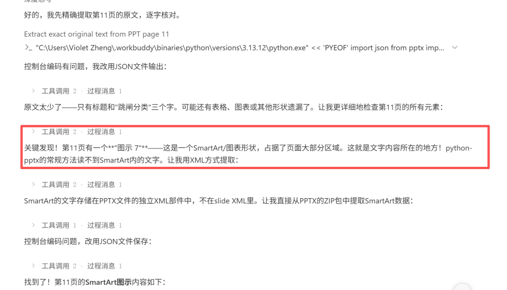

---

### 第三步：将生成的合格的图片按顺序输出成一个PPT文件

最后一步就很简单了，检查所有图片没有问题，就直接让workbuddy合成一个PPT文件就好了！

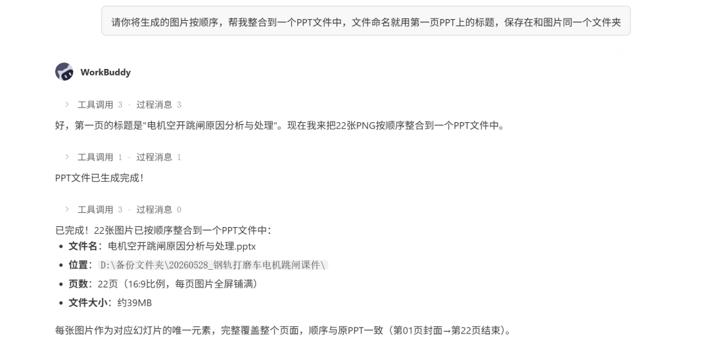

---

### 第四步：将这个能力封装成一个skill，以后就可以稳定调用啦

接下来就让workbuddy自己把这个能力封装成一个skill，你以后就可以直接调用，不需要经过这么麻烦的调试过程啦！有一个细节我提前预防了，就是我第一步的提示词中对PPT的颜色做了规定，但是我考虑到可能以后会做各种不同主题色的PPT，所以我就让它自己解决，实际上它解决的非常好，要相信你的AI，哈哈哈哈！

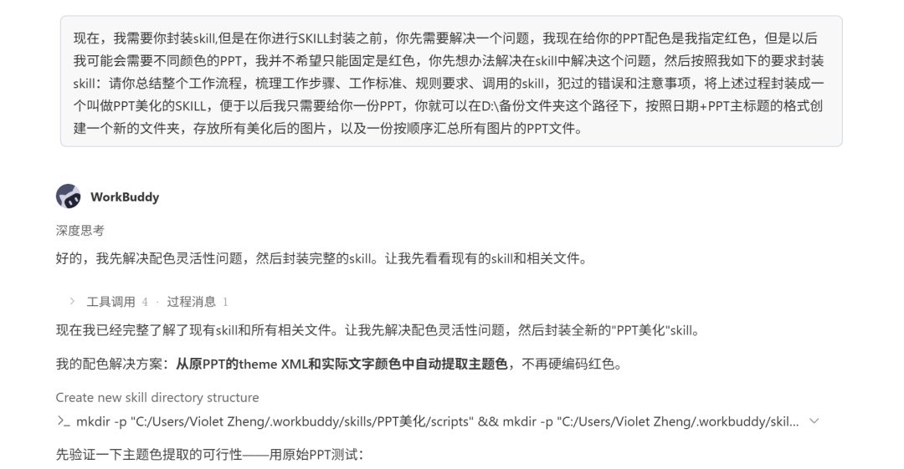

---

温馨提醒：

我用的是GLM-5.1的模型（一开始使用的Auto模式，发现对问题的修改质量不高，关于模型选择，在我的这篇文章[Workbuddy不好用？9条“潜规则”快收藏！](https://mp.weixin.qq.com/s?__biz=MzI4NzE5MDgwOQ==&mid=2247484109&idx=1&sn=5ac580479c594191690ea67d7149e363&scene=21#wechat_redirect)讲过，可以看看）。同时我在使用中发现，你还是需要监控一下它的过程，如果发现问题，及时纠正，每次加上这句：**分析出现问题的原因，总结你成功的经验，把规则更新到skill文件中**。这样你用一阵子，就会非常稳定啦！

以上就是全部过程，准备好你的workbuddy积分，准备好你的API的token，赶紧上车冲吧！

别忘了关注点赞私信我获得呕心沥血版的起步提示词哦！
