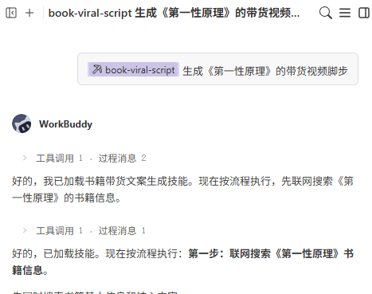
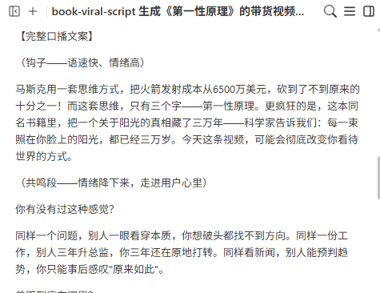
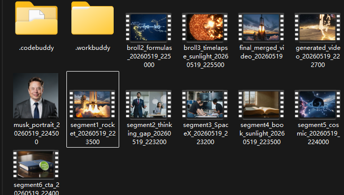
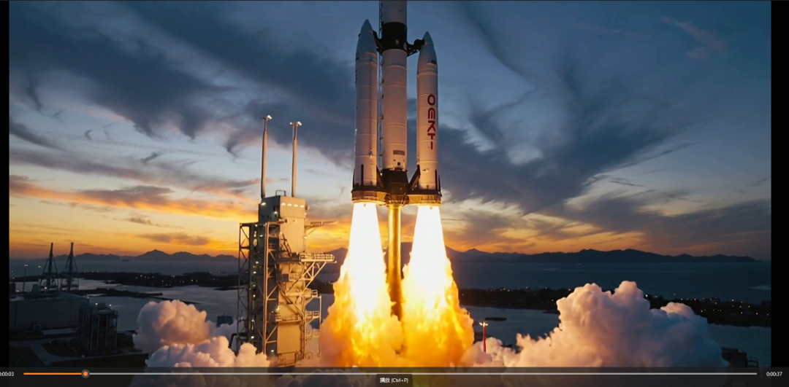
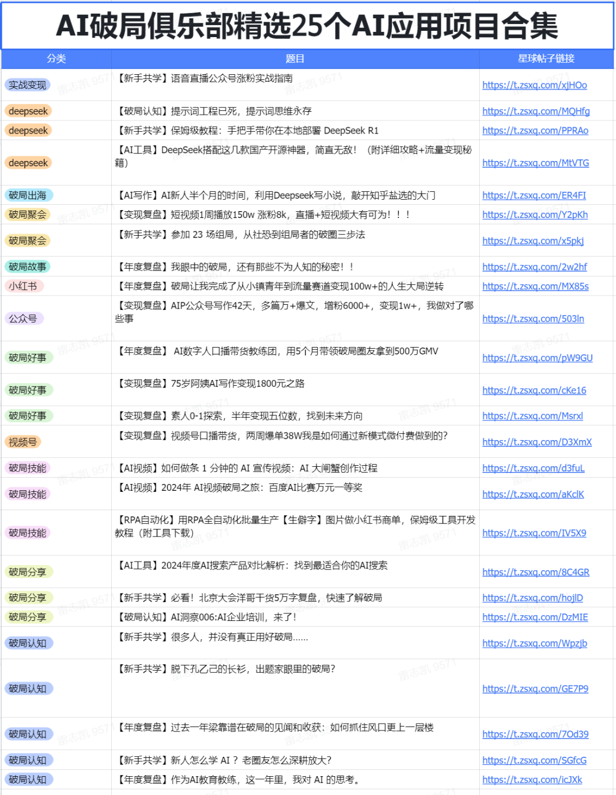

> 📎 来源: [贺哥聊AI](https://mp.weixin.qq.com/s?__biz=MzYzNjA5MDAxNg==&mid=2247486117&idx=1&sn=54bd3b535efa606d9db0accf16fb0c83&chksm=f1535d0541e43334a4bc769c6e38bde7318b25d20f48a111d4f8e17e8073597913dc67ea06eb&mpshare=1&scene=1&srcid=0525vVdEczWQOcDYDj0kGCjm&sharer_shareinfo=60c769952c39a18fd800e99c62967544&sharer_shareinfo_first=60c769952c39a18fd800e99c62967544) | 时间: 2026-05-25 22:42

---

免费！AI视频生成实战：2小时做出爆款书籍带货视频，完整SOP，0门槛上手

· · · · · · · · · ·

💡 核心亮点：输入书名 → AI生成带货文案 → AI生成视频片段 → AI配音 → 导出剪映精剪。全程0拍摄、0出镜、0门槛，30分钟搞定传统团队3天的工作量。附完整SOP+踩坑记录。

一、传统视频制作的痛点

做书籍带货的朋友，应该都懂这个痛：

•❌ 成本高：拍视频需要相机、灯光、场地

•❌ 效率低：一个5分钟视频，拍摄+剪辑至少要1-2天

•❌ 门槛高：不会剪辑、不会运镜、不会调色

•❌ 迭代慢：拍错了要重拍，改脚本要重新录制

•❌ 需要出镜：很多人不想露脸

我之前也遇到过这些问题。直到我用了WorkBuddy + book-viral-script技能，才发现：原来书籍带货视频可以这么简单！

二、完整SOP：4步生成书籍带货视频

今天分享一个真实案例：我用WorkBuddy制作《第一性原理》书籍带货视频的完整流程。

📚 案例背景：《第一性原理》这本书，讲的是马斯克如何用"第一性原理"思维颠覆航天、汽车、能源行业。我想做一个书籍带货视频，但我不想出镜，也不想花几天时间拍摄剪辑。

🎯 解决方案：用AI全程生成

AI视频生成工作流程图

📝 步骤1：用book-viral-script生成带货文案（5分钟）

这是最关键的一步。好的带货文案，决定了视频的转化率。

✅ 使用技能：book-viral-script

•输入：书名（例如"第一性原理"）

•输出：一段原创的书籍带货口播文案（约2500字）

技能说明：book-viral-script是WorkBuddy的书籍带货短视频爆款文案生成技能。只需要输入一个书名，就会自动联网搜索书籍信息，提取核心内容，按照爆款框架生成2500字口播文案。

触发词：写书籍带货文案、生成图书短视频脚本、帮我写一本XXX的书推文、这本书的短视频文案、书籍口播稿、图书推广脚本

实战操作

我对WorkBuddy说："请用book-viral-script技能，生成《第一性原理》的书籍带货短视频口播文案。"

WorkBuddy输出：一段2500字的原创口播文案，包含：

•钩子（前5秒抓住注意力）

•共鸣段（职场思维差距对比）

•故事段（马斯克SpaceX火箭工厂的故事）

•价值深化（第一性原理的核心思想）

•CTA转化（引导购买）

✅ 成果：5分钟生成2500字原创带货文案，过原创没问题。

🎬 步骤2：用多模态生成视频片段（10分钟）

有了文案，接下来用WorkBuddy的多模态生成能力，把文案转换成视频片段。

📊 视频段落规划（严格按文案结构）：

|  |  |  |  |
| --- | --- | --- | --- |
| 段落 | 内容 | 时长 | Job ID |
| 片段1（钩子） | 火箭发射震撼开场 | 5秒 | 1448322068210335744 ✅ |
| 片段2（共鸣段） | 职场思维差距对比 | 10秒 | 1448321214866653184 ✅ |
| 片段3（故事1） | SpaceX火箭工厂 | 10秒 | 1448321214770233344 ✅ |
| 片段4（书籍+阳光） | 书籍特写+阳光粒子 | 5秒 | 1448322068118061056 ✅ |
| 片段5（价值深化） | 宇宙/量子/黑洞视觉 | 8秒 | 1448322702833795072 ✅ |
| 片段6（CTA转化） | 书籍展示+购买引导 | 2秒 | 1448322703156707328 ✅ |

⚠️ 踩坑记录1：并发限制
问题描述：第1次并行提交3个任务失败（并发限制2个），错误：concurrent slot limit exceeded (2)
解决方案：改为每次最多提交2个任务，分批完成6个片段。
经验：文生视频有并发限制（2个），提交前需确认当前运行任务数。

✅ 成果：6个视频片段全部生成成功，每个片段对应文案的一个段落。

🎨 步骤3：生成B-roll素材（30分钟）

为了让视频更丰富，还需要生成B-roll素材（补充视觉素材）。

📊 B-roll素材规划：

|  |  |  |  |
| --- | --- | --- | --- |
| 素材 | 内容 | 用途 | Job ID |
| 素材1 | 马斯克头像（AI生成现实主义风格肖像） | 在"故事1"段落插入，作为人物介绍 | 1379431822... ✅ |
| 素材2 | 科学公式动画（E=mc²公式，粒子效果） | 在"第一性原理"概念解释时叠加，增强科普感 | 1448324359... ✅ |
| 素材3 | 时间流逝效果（阳光从太阳核心到地球，30000年旅程可视化） | 在"阳光三万年"段落使用，视觉化时间概念 | 1448325024... ✅ |

✅ 成果：3个B-roll素材全部生成成功，图片1张（2.5 MB），视频2个（12.1 MB + 13.8 MB）。

🎙️ 步骤4：用edgeTTS生成AI配音（5分钟）

有了视频片段，还需要配音。可以使用edgeTTS工具，让AI自动生成配音。

✅ 使用工具：edgeTTS

推荐音色：zh-CN-YunxiNeural（云希，温柔男声）

操作步骤：

1把book-viral-script生成的口播文案保存为文本文件

2使用edgeTTS命令行工具，指定音色为zh-CN-YunxiNeural

3生成MP3音频文件

命令示例：

edge-tts --text "口播文案内容" --voice zh-CN-YunxiNeural --write-media voiceover.mp3

✅ 成果：AI配音生成，音色自然，无需真人录音。

✂️ 步骤5：视频剪辑合并（10分钟）

所有视频片段和B-roll素材生成后，用ffmpeg无损合并。

✅ 技术方案：

1检查所有视频编码格式：h264, 1920x1080, 24fps（完全一致）

2使用 -c copy 参数无损合并，避免重新编码，速度提升10倍

3创建 filelist.txt 文件列表，使用 -f concat 协议合并

4处理速度：9.86x（非常快，无损合并）

5比特率：15,445 kbps

📊 合并顺序（严格按文案结构）：

•segment1\_rocket（火箭发射钩子）

•segment2\_thinking\_gap（职场思维差距）

•broll2\_formulas（科学公式动画）

•segment3\_SpaceX（SpaceX工厂）

•segment4\_book\_sunlight（书籍+阳光）

•segment5\_cosmic（宇宙可视化）

•broll3\_timelapse\_sunlight（时间流逝阳光）

•segment6\_cta（CTA转化）

⚠️ 踩坑记录2：Python路径问题
问题描述：在Windows环境中，直接使用 python3 或 python 命令可能会失败（被Microsoft Store劫持）。
解决方案：使用完整Python路径 C:/Python313/python.exe
经验：在Windows环境中，避免使用 python3 或 python 命令，直接使用系统提供的完整路径。

✅ 成果：最终合并视频成功，总时长40.33秒，文件大小75 MB。

🎬 步骤6：导出到剪映精剪（可选，15分钟）

如果对质量要求更高，可以把AI生成的视频片段和配音导出到剪映进行精细剪辑。

✅ 推荐工作流：

1用WorkBuddy生成视频片段 + edgeTTS生成配音

2 导出到剪映（Jianying）

3在剪映中添加字幕、背景音乐、转场特效

4调整节奏、调色、加滤镜

5导出最终成片

优势：AI生成基础素材，效率高 + 剪映精剪，质量高 + 结合两者优势，性价比最高

三、最终成果

经过2小时的AI生成+剪辑，最终视频完成：

四、总结

用AI做书籍带货视频，核心就是4步：

1写文案：用book-viral-script，5分钟搞定2500字原创文案

2生视频：用多模态生成，10分钟出6个视频片段

3配音：用edgeTTS，5分钟搞定专业配音

4剪辑：用ffmpeg合并，10分钟完成最终视频

💡 核心公式：book-viral-script（文案）+ 多模态生成（视频）+ edgeTTS（配音）+ ffmpeg/剪映（剪辑）= 30分钟做出爆款书籍带货视频

如果你也想拥抱AI，欢迎查看破局为你精选的【25个AI应用项目合集】，还有【3天AI实战营】，扫码免费领取，帮助你搞钱路上少走弯路。

