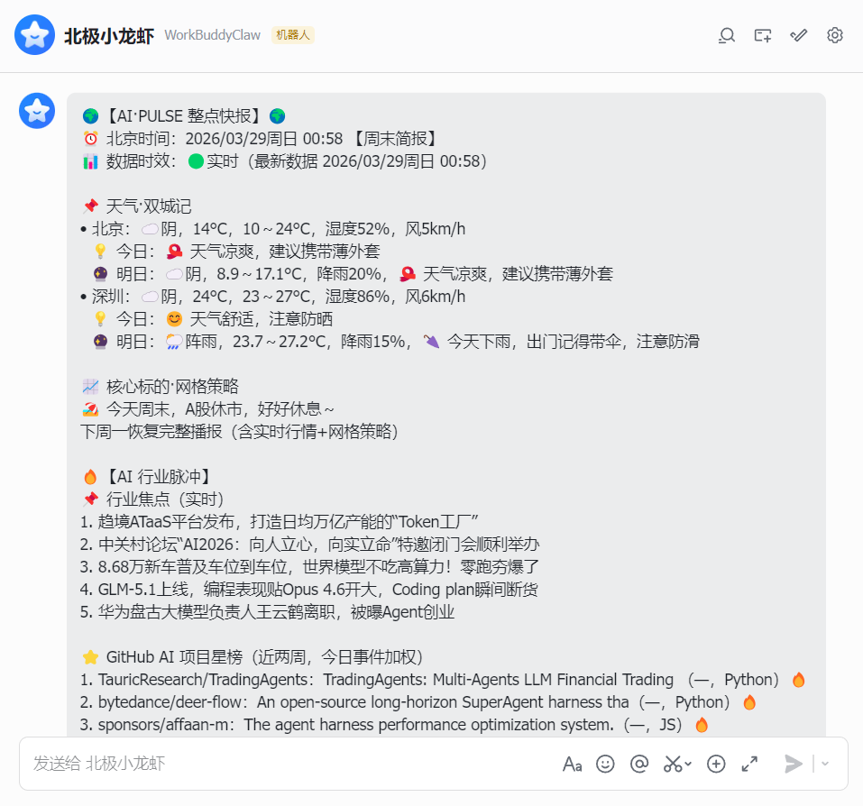
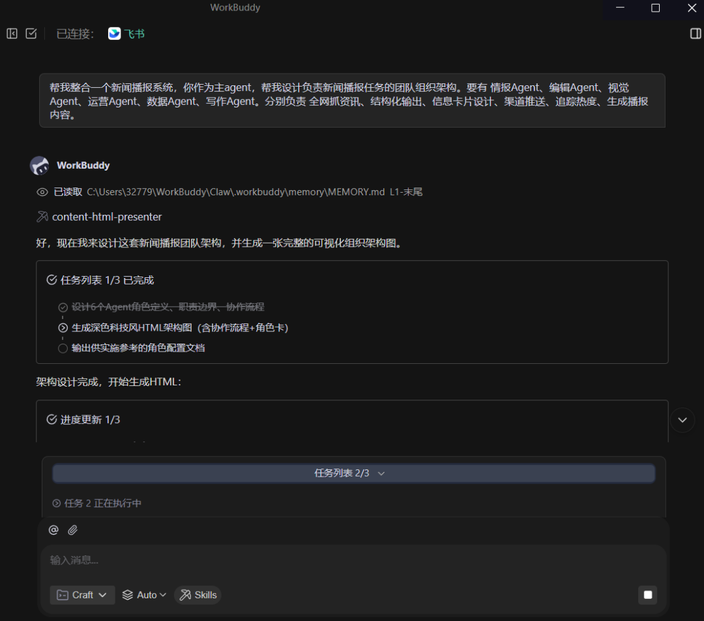
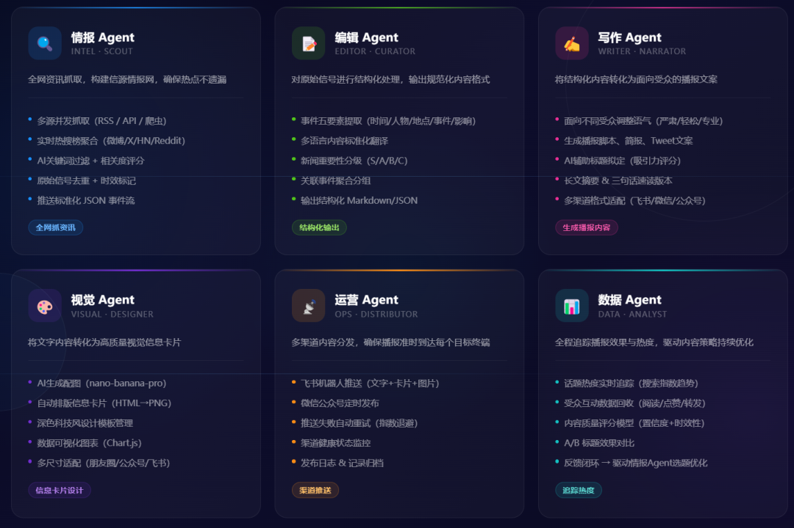
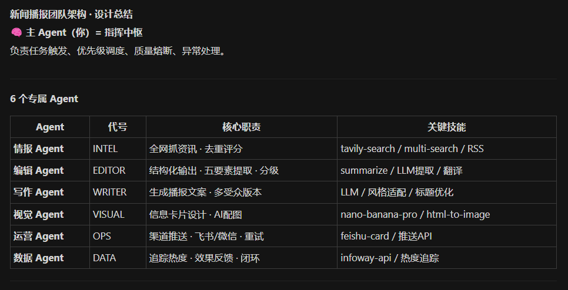

> 📎 来源: [意识出口](https://mp.weixin.qq.com/s?__biz=MzYzNjc5NjMzOQ==&mid=2247483798&idx=1&sn=53b979ebe7f5d62e9a1b8b4e775aa9f5&chksm=f102729a29f2310524ecc898cca55790b060e23b99353cf2d1983d65460fe01370ff95f40a6c&mpshare=1&scene=1&srcid=0524iiKkmgeANI4GEq8Sh7ga&sharer_shareinfo=c3928a6f7873b0c90881c1abce157668&sharer_shareinfo_first=c3928a6f7873b0c90881c1abce157668) | 时间: 2026-05-24 12:29

---

## 一个人+WorkBuddy=一个新闻编辑部

## 这不是概念，是我和龙虾的真实经历。

我用 WorkBuddy，成功搭建了一个属于我自己定制化的新闻编辑部——每天早上8点，他会准时推送一份定制新闻简报，包含AI动态、大厂新闻、GitHub趋势、以及和我公众号定位相关的热点。

**核心公式：一个人 + AI 助手 = 一支专业团队**

这不是概念炒作，而是我已经在实践的现实。

根据真实案例，有创业者用 WorkBuddy 在一天内搭建了 5 人虚拟团队，完成了从战略规划到内容产出的完整闭环。



我也尝试用 WorkBuddy 实战复现，搭建了全自动的新闻播报系统，实现了 7×24 小时的信息监测和内容生产。

## WorkBuddy 是什么？

WorkBuddy 是腾讯云 CodeBuddy 团队推出的 AI Agent 办公工具，定位为“腾讯版 OpenClaw”。他的核心特点是：

**1. 执行即交付**
传统 AI 助手只能对话建议，WorkBuddy 能自主规划、拆解任务并直接交付成果。用户只需用自然语言描述需求，系统就能在本地电脑上完成文件处理、内容生成、数据分析等复杂任务。

**2. 多 Agent 并行协作**
WorkBuddy 可以将复杂任务动态拆解为多个子任务，调度多个 AI 智能体同步工作。这不是简单的任务排队，而是真正的团队式协同——Agent 之间可以传递信息、共享上下文、动态调整优先级。

**3. 完全兼容 OpenClaw**
WorkBuddy 砍掉了 OpenClaw 的复杂部署环节，下载安装即可使用。完全兼容 OpenClaw 技能包，可以直接从 ClawHub 导入超过 3000 个技能扩展。内置 20+ 技能包与 MCP 协议，支持企业微信、QQ、飞书、钉钉远程遥控。

**4. 本地执行，数据安全**
所有操作在本地电脑完成，不上传云端。采用沙盒隔离、危险操作拦截等多层防御策略，基于腾讯 CodeBuddy 同源架构，具备企业级安全审计能力。

## 如何用 WorkBuddy 搭建新闻播报系统



直接自然语言描述自己想要的系统和架构

### 系统架构（6 人虚拟团队）



还给我用html生成了一个系统介绍页



龙虾规划子Agent的代号、技能

| 角色 | 核心职责 | 装备的技能 |
| --- | --- | --- |
| **情报Agent** | 全网抓资讯、过滤、去重、核验来源 | RSS 订阅、热搜监控、网页抓取 |
| **编辑Agent** | 精简内容、提炼要点、结构化输出 | 摘要生成、去重过滤 |
| **视觉Agent** | 做播报封面、信息图表 | 封面生成、可视化设计 |
| **运营Agent** | 定时调度、多渠道推送、数据统计 | 定时任务、消息推送 |
| **数据Agent** | 追踪热度、预测趋势 | 数据建模、趋势分析 |
| **写作Agent** | 生成初稿、补充资料 | 深度搜索、引用管理 |

### 工作流程

**凌晨 3:00**：情报龙虾开始抓取 50+ 科技媒体、论坛、社交平台
**凌晨 5:00**：编辑龙虾对 200+ 条信息去重、分类、生成摘要
**早上 7:30**：运营龙虾推送定制化新闻简报到微信
**全天候**：舆情监测、选题挖掘、知识库归档

### 个性化规则示例

```
关注领域：只抓 AI 大模型、AI Agent、自媒体运营、效率工具 来源白名单：36 氪、虎嗅、机器之心、官方平台 内容格式：每条 = 标题 + 50 字要点 + 价值说明 推送时间：早 7:30（微信）、午 12:30（文档）、晚 20:00（草稿） 推送渠道：微信 → 腾讯文档知识库 → 公众号后台
```

### 实际效果

- 每天节省 1 小时刷信息时间
- 信息精准度大幅提升，告别信息过载
- 自动归档形成专属知识库
- 7×24 小时运转，从不休假

## 搭建指南：零基础也能上手

### 准备工作

**1. 下载安装**

- WorkBuddy：访问 https://www.codebuddy.cn/work/

**2. 明确需求**（最关键）

- 我想关注哪些领域？
- 我希望什么时间收到推送？
- 我需要什么格式的内容？
- 我的信息来源有哪些？
- 我最终要用这些信息做什么？

### 搭建流程（3 步）

**第 1 步：一句话建队**

```
你作为主Agent，帮我创建一个新闻编辑部团队并设计子Agent协作。团队Agent包含： 情报（信息采集）、编辑（内容整理）、数据分析（热度追踪）、 写作助手（初稿生成）、运营（定时推送）、舆情监测（反馈收集）  关注领域：[你的领域] 推送时间：每天 [时间]
```

**第 2 步：定制规则**

```
个性化规则： 1. 只抓取 [具体领域]，过滤 [不想看的内容] 2. 信息源白名单：[列出信任的媒体] 3. 时效性：只要 [24/48] 小时内的新闻 4. 摘要长度：每条控制在 [50/100] 字 5. 推送渠道：[微信/邮件/文档]
```

**第 3 步：实战调试**

前 3 天每天检查推送内容，发现问题立即反馈：

- “这条新闻不相关，以后过滤类似内容”
- “摘要太长了，严格控制在 50 字”
- “增加 XX 领域的监测”

系统会快速学习你的偏好，越用越准。

## 适用场景与局限

### ✅ 适合的场景

- **内容创作**：热点监测、素材收集、初稿撰写、多平台分发
- **市场研究**：数据收集、行业分析、报告生成
- **电商运营**：订单处理、客服、库存管理、数据分析
- **知识管理**：信息筛选、资料整理、知识库构建
- **项目管理**：任务拆解、进度追踪、文档生成

### ❌ 不适合的场景

- 需要线下物理执行的具体工作
- 涉及敏感信息的决策
- 需要人际关系的商务谈判
- 高度创造性的艺术原创
- 需要一手采访的深度报道

## 成功的关键

**1. 你是决策者，AI 是执行者**
不要指望 AI 替你做所有判断，明确告诉他“要什么”“不要什么”。

**2. 持续反馈，系统才会进化**
发现不准确的推送立即告诉他，想到新需求随时提出。

**3. 专注核心，不要贪多**
先把 1-2 个核心功能做好，稳定运行后再逐步扩展。

**4. 给系统时间学习**
前 3 天可能不够准确，1 周后会明显改善，1 个月后系统会非常懂你。

## 安全保障

WorkBuddy 采用多层安全机制：

- **沙盒隔离**：所有操作在授权文件夹内进行
- **危险操作拦截**：删除系统文件、修改注册表等需要明确授权
- **操作透明化**：每次执行前展示访问范围和步骤
- **本地优先**：数据处理在本地完成，不上传云端
- **企业级审计**：基于腾讯 CodeBuddy 架构，具备完善的安全审计能力

## 未来展望

WorkBuddy 和 OpenClaw 的快速发展验证了一个趋势：**AI Agent 的价值不在于单点能力的强大，而在于协作机制的完善。**

当多个专业化的 Agent 能够像人类团队一样协同工作时，个体的生产力边界被彻底重写。未来的“一人公司”，不再是孤军奋战的个体户，而是拥有 AI Agent 团队的微型组织。

这场革命才刚刚开始。AI 不会取代人，但会用 AI 的人会取代不会用的人。
