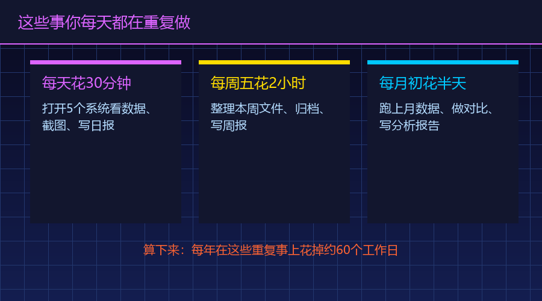
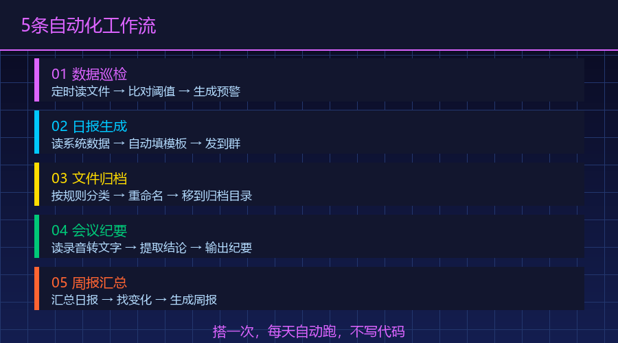
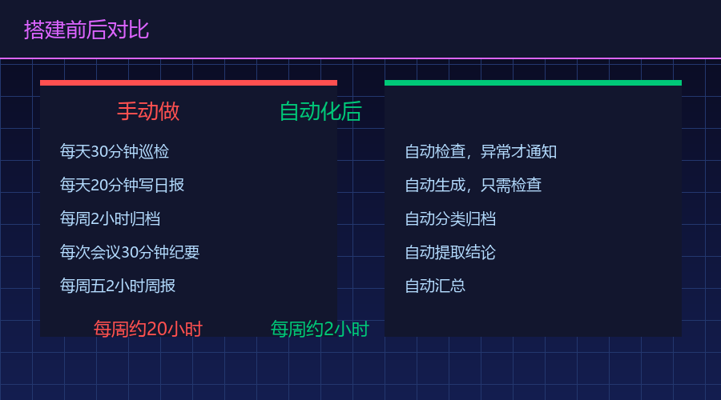

> 📎 来源: [赤马弘扬](https://mp.weixin.qq.com/s?__biz=MzkxMTc2MTcyNQ==&mid=2247486113&idx=1&sn=7c48326694385dfb2dfac8f4c212d54b&chksm=c0865086d1fc812a133153616e425af8e3498cccabd657e8403b2781797a2b18f01c948b5309&mpshare=1&scene=1&srcid=0415HmD5zxFGNoMlDtca5O0F&sharer_shareinfo=857c75978766fbfbefc3571f7c5e12dc&sharer_shareinfo_first=857c75978766fbfbefc3571f7c5e12dc) | 时间: 2026-04-15 22:20

---

重复的事全交给WorkBuddy了

> 每天到公司第一件事：打开OA系统看审批流程 → 打开邮箱处理未读邮件 → 打开项目群看有没有新消息 → 打开数据报表确认昨天数据 → 打开日程看今天安排。五个系统，五个窗口，每天早上花15-20分钟"签到"。我以前觉得这就是工作的一部分。直到有一天我发现，这五件事里有四件可以自动化。

# 一、你每天有多少事是"机械重复"的？

那天我认真记录了一下自己一天的工作流程，列了一张清单。

从早上9点到晚上6点，我做了47件事。其中：

有明确判断和创造性的：12件——写方案、跟客户开会、讨论产品方向、解决技术问题。

纯机械操作，几乎不需要动脑的：35件。

这35件事里，我自己分类了一下：

| 类型 | 举例 | 每天耗时 |
| --- | --- | --- |
| 信息收集 | 打开多个系统看数据、翻聊天记录找资料 | 30分钟 |
| 格式整理 | 把数据从A格式转成B格式、统一排版 | 40分钟 |
| 定期汇报 | 写日报、整理周报素材、更新项目进度 | 25分钟 |
| 文件管理 | 下载附件、重命名、分类存档 | 15分钟 |
| 通知处理 | 转发消息、提醒同事、回复固定格式的咨询 | 20分钟 |

每天大概2小时10分钟，花在"不需要动脑的重复操作"上。

一个月按22个工作日算，就是47个小时。

47个小时，将近6个工作日。一个月。

这6天里我没创造任何新价值，只是在重复同样的事。

我后来又问了我身边几个朋友——做运营的、做HR的、做销售的——让他们也列一下自己的"重复操作清单"。结果大同小异：每个人每天至少有1.5到3个小时花在机械重复上。

有个做运营的朋友说了一句特别精准的话："我感觉自己像个机器人，每天到公司按相同的顺序做相同的事。有时候怀疑自己是不是被设定了程序。"

# 二、哪些事可以自动化？

我拿着这张清单仔细看了一遍，发现一个扎心的事实：这35件事里，有至少20件可以自动化。

判断标准很简单——如果一件事满足以下三个条件，它就能自动化：

第一，这件事有固定的触发条件。比如"每天早上9点"、"收到邮件时"、"项目状态变更时"。有明确的"什么时候做"。

第二，执行步骤基本固定。比如"打开报表→截图→发到群里"、"收到审批→转给对应负责人→回复已收到"。每次做的动作差不多。

第三，不需要复杂的人类判断。如果一件事需要"根据具体情况灵活处理"，那自动化不了。但如果它更多是"按固定流程执行"，那就能做。

按这个标准筛下来，我每天至少有20件事满足条件。

我挑了其中最耗时的5类，准备一条一条搭自动化。说实话当时心里也没底——不知道WorkBuddy能不能真的把这些事自动化，还是只是"看起来很美"。

# 三、我用WorkBuddy搭了5条自动化工作流

我把这20件事归类成了5条工作流，全部用WorkBuddy搭了起来。

## 工作流1：每日数据巡检

以前：每天早上手动打开三个系统的后台，分别看业务数据、广告数据、用户数据，截图发到工作群。

现在：每天早上8:50，WorkBuddy自动读取数据文件，生成一份三指标的简报，把关键数据整理成两三句话发给我。我到公司的时候，数据已经看完了。

搭这条工作流我花了多少时间？跟WorkBuddy说了一段话，它帮我设好了定时任务。10分钟。

## 工作流2：日报自动生成

以前：每天下班前花15-20分钟写日报——回想今天做了什么、进展如何、明天计划什么。说真的，大部分时候就是在回忆和打字。

现在：我在WorkBuddy里维护了一个"工作日志"。每天做完一件事就随手记一句："完成了客户A的方案第二版"。到了下班时间，WorkBuddy自动把今天的日志整理成日报格式，发给我确认。我只用扫一眼，改两个字，提交。

以前最怕周五下午——别人都准备下班了，我还在那翻聊天记录凑周报。现在周五下午可以准点走了，周报素材早就准备好了，只需要花5分钟补充几句定性描述就行。

每天省了15分钟。

## 工作流3：文件自动归档

以前：每天收到各种文件——客户发来的需求文档、同事传的设计稿、系统导出的报表。这些文件全堆在下载文件夹里，等到要用的时候找不到。

现在：我让WorkBuddy监控下载文件夹，每半小时扫描一次。新文件按类型和日期自动分类——文档类归到"工作文档"、图片类归到"设计素材"、报表类归到"数据文件"。文件名也自动加上日期前缀。

我再也不用"搜索"文件了。

## 工作流4：会议纪要整理

以前：开完会，会后找个人整理纪要——把录音听一遍或者翻聊天记录，总结讨论了什么、决定了什么、谁负责什么。这个过程至少30分钟。

现在：会议开完，我把会议记录或者聊天记录复制给WorkBuddy，它自动整理成结构化纪要：参会人员、讨论要点、决议事项、负责人和截止日期。5分钟搞定，而且不会遗漏任何一个人说的内容。

## 工作流5：周报素材自动收集

以前：每周五下午开始回忆这周做了什么，翻聊天记录、翻邮件、翻项目管理系统，拼凑出一份周报。这个过程至少45分钟，而且经常漏掉一些小事。

现在：WorkBuddy从我的工作日志、聊天记录和项目文件里自动提取本周关键事项，按项目分类整理好。周五下午我只需要补充一些定性描述——比如"这个项目本周进展顺利，下周计划进入测试阶段"——定量部分全是自动汇总的。

每周五省了至少30分钟。

她说以前最怕周五下午——别人都准备下班了，她还在那翻聊天记录凑周报。现在周五下午她可以准点走了，周报素材早就准备好了，只需要花5分钟补充几句定性描述就行。

# 四、搭工作流这件事本身花不了多少时间

你可能觉得，搭5条工作流是不是很复杂？

说实话，搭每条工作流的过程就是——跟WorkBuddy说清楚你要什么。

比如搭"每日数据巡检"那条，我原话是这么说的：

每天早上8点50分，帮我做以下事情： 1. 打开 D:\data\business.xlsx，读取昨天的业务数据 2. 打开 D:\data\ads.xlsx，读取昨天的广告数据 3. 把两个文件的关键指标整理成一段话发给我 4. 如果某个指标比前一天变化超过20%，标注出来提醒我

它就自己设好了定时任务。从那以后每天早上8:50准时执行，不需要我管。

5条工作流，每条平均10分钟搭好。总共不到1小时。

搭完之后我有个意外的感受——跟WorkBuddy说需求，比跟同事说需求容易多了。同事会问你"这个需求优先级是什么""你这个逻辑有没有考虑异常情况"，但WorkBuddy不会，你说什么它就做什么。而且做完了你随时可以改，不需要走什么变更流程。

但每天帮我省下来的时间是：30+15+10+25+30 =110分钟。

也就是说，我花了不到1小时搭的东西，每天帮我省将近2小时。一个工作日就回本，之后全是赚的。

# 五、自动化之后，我发现了更有意思的事

这5条工作流跑了一个月之后，我发现了一个意外的好处：我对自己的工作有了更清晰的认知。

以前我对每天的工作只有一个模糊的感觉——"今天挺忙的"或者"今天好像没干什么"。

但现在，因为工作日志自动记录了每一件事，每周五看周报素材的时候，我能清楚地看到自己这一周的时间都花在了哪里。

结果让我有点吃惊：

花在"沟通协调"上的时间占了35%

花在"实际产出"上的时间只有25%

剩下40%是会议、审批、回复消息这类"维持运转"的事

这个认知直接改变了我的工作方式。我开始有意识地减少不必要的会议，把沟通集中到固定时段，给"实际产出"留出更多连续的时间。

如果没有自动化帮我省出那些重复劳动的时间，我根本没有余力去思考"我的时间花在了哪里"这种问题。因为每天光是做完那些事就已经精疲力竭了。

# 六、两个重要的提醒

搭了这5条工作流之后，有两件事我特别想提醒一下。

第一，不要把需要人类判断的事也自动化了。

我一开始想把"回复客户需求"也自动化——让WorkBuddy根据客户发来的需求自动生成回复。试了一周就放弃了。因为客户的很多需求是需要理解上下文的，有时候一句话有歧义，AI的理解和我想要表达的意思不一样。

有些事就是得人来做的。自动化应该是帮你处理"确定性的重复劳动"，而不是替代你的思考。

第二，定期检查你的自动化是否还在正常工作。

有一次数据文件的路径变了，WorkBuddy的巡检跑了一周都没发现问题，因为它一直在读旧路径的旧数据。我后来加了一条规则——如果连续三天数据没有变化，就提醒我检查。

自动化不等于"设好就不管了"。偶尔检查一下，确保它还在按你的预期运转。

# 七、从"做事"到"设计做事的方式"

搭完这5条工作流之后，我最大的感受是——我的工作方式变了。

以前我是"做事的人"：领导说什么，我做什么；客户要什么，我给什么。每天忙忙碌碌，但说不清自己到底创造了什么价值。

现在我是"设计做事方式的人"：我会先想这件事有没有更高效的做法、能不能自动化、能不能让别人做。然后在动手之前，先把流程设计好。

这个过程本身可能只省了每天两个小时。但它改变了我对工作的理解——工作不是不停地做事情，而是想办法用更少的时间做更多有价值的事情。

那个每天15分钟的"签到"流程，我后来也自动化了。WorkBuddy每天早上帮我把五个系统的关键信息整理成一份摘要，我到公司只看这一份就够了。

省出来的15分钟，我用来喝杯咖啡，想想今天最重要的事是什么。

这才是一天真正开始的方式。

上周我统计了一下，这5条工作流帮我每天省下来的时间已经稳定在2小时左右。一个月就是44个小时——等于省出了5.5个工作日。

我没有用这5.5天来多做工作。我用它来思考、来学习、来做那些以前"没时间做但一直想做"的事。比如写技术文档、比如帮新人做培训、比如研究新的工具和方法。

这些东西不会立刻产生业绩，但会让我变得更有价值。

你每天有哪些事是"不干不行但又不想干"的？列出来，说不定都能自动化。评论区聊聊。

 #workbuddy #AI内容创作 #真正的价值 #AI工具 #公众号 #自动化 #副业 #日复一日的工作
