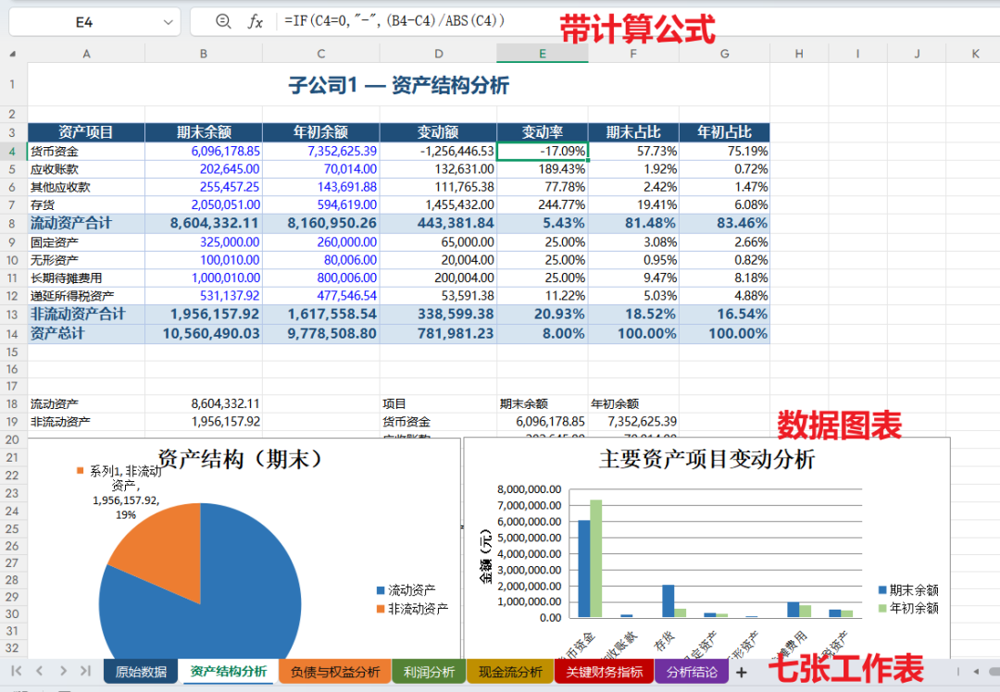
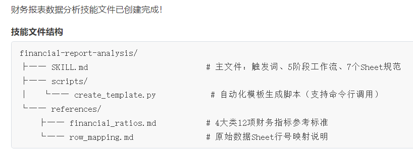
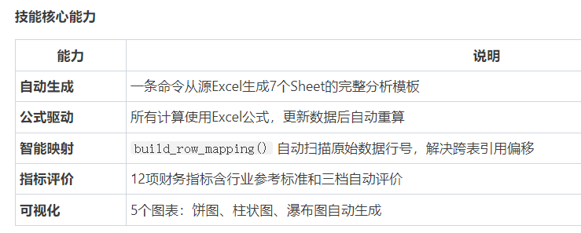
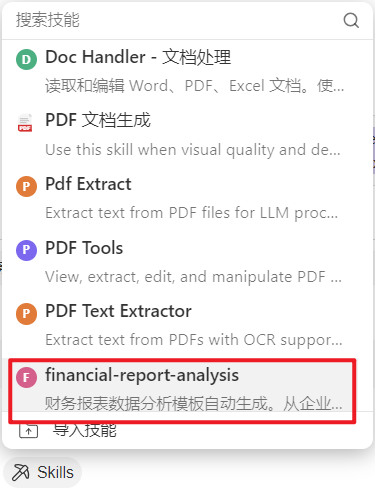
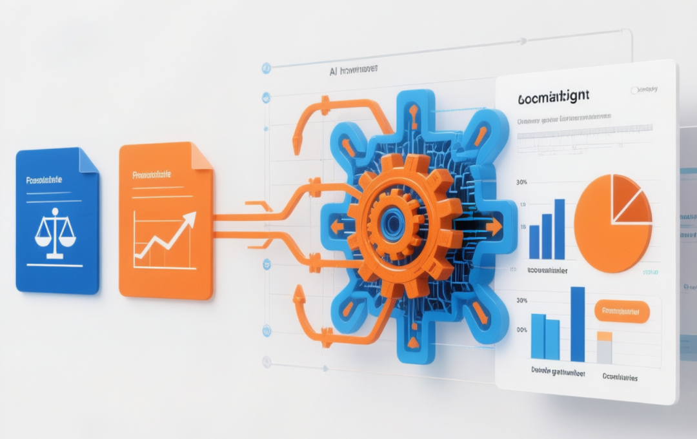
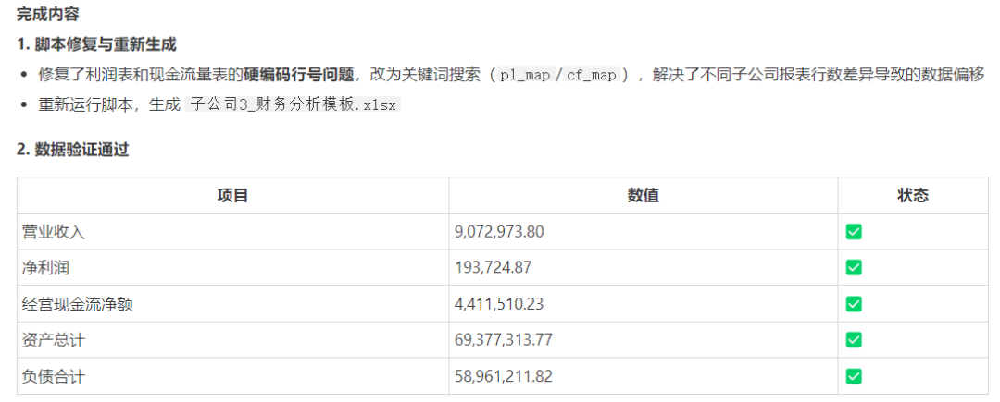
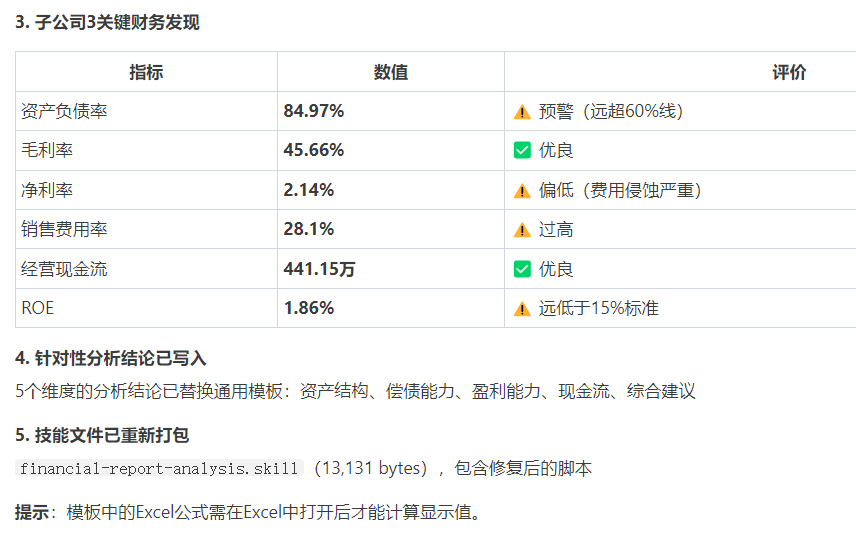
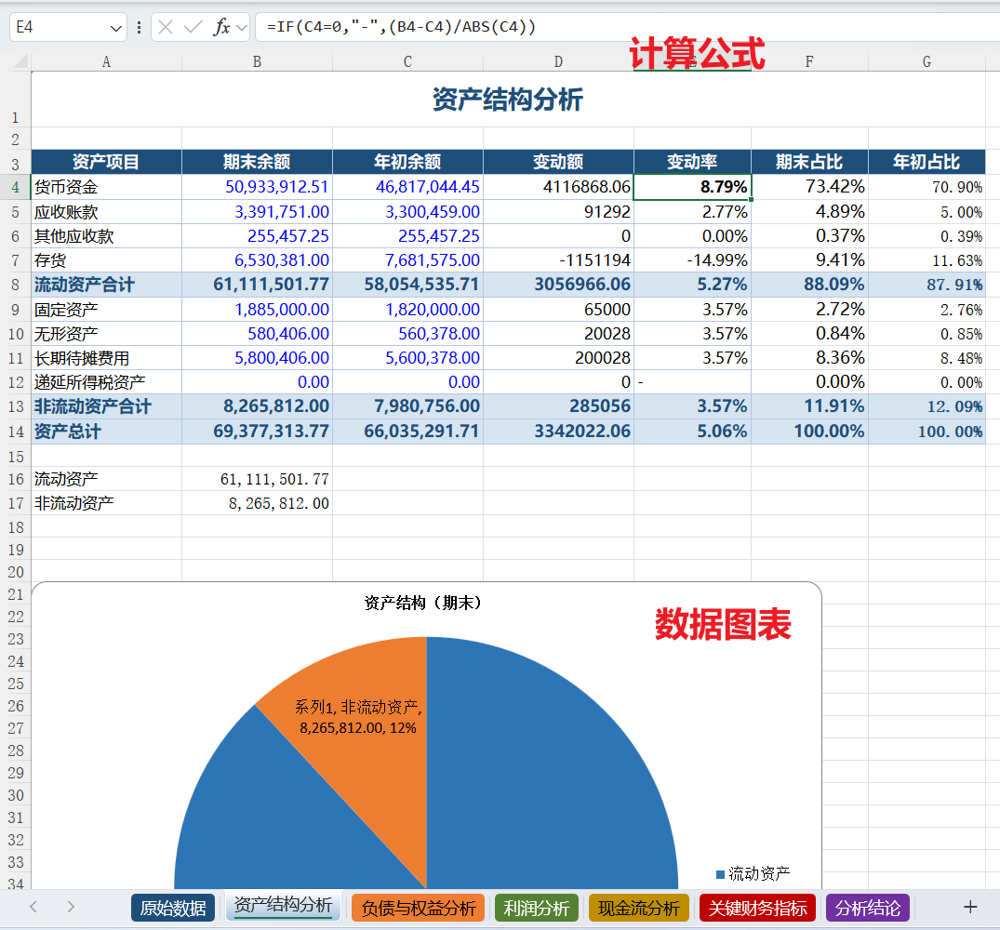
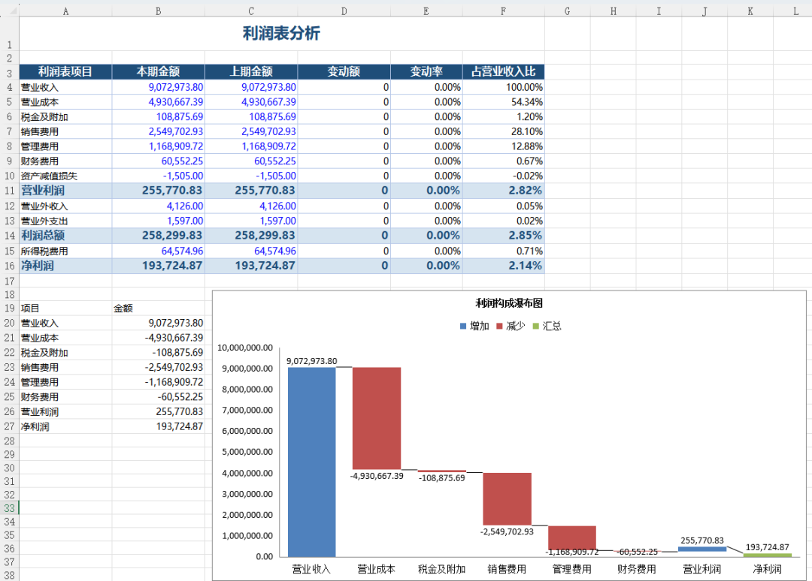
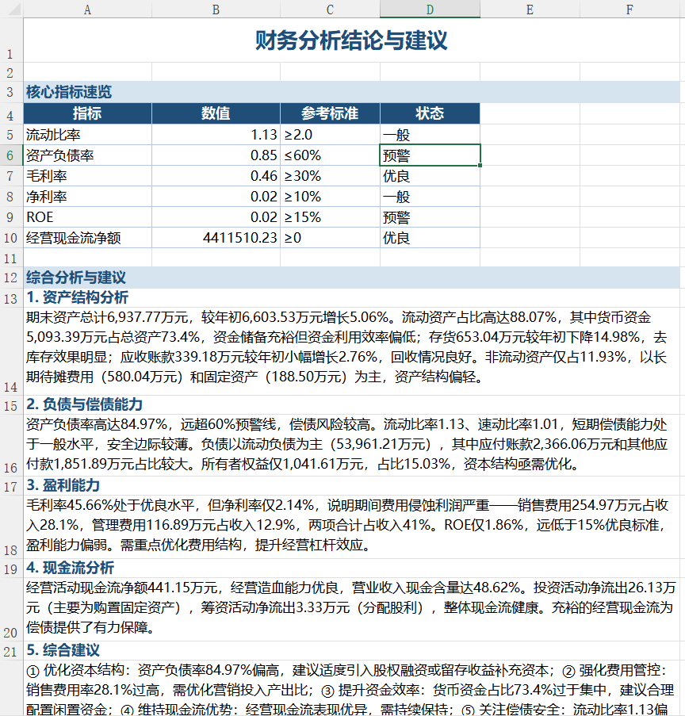

> 📎 来源: [AI+BI智能办公](https://mp.weixin.qq.com/s?__biz=MzA3NzM5Njk3Nw==&mid=2650247607&idx=1&sn=9afb0c74e44cfaad5d474a8ec191edf4&chksm=8667f31f4a074224c7c0f1b501d09b525c0ed966f48e9c76fd14b5b62baa523fd45b41fc554a&mpshare=1&scene=1&srcid=0513bFV9T9IBDZLxu67lZ2l9&sharer_shareinfo=136416f1e7204ec1ae329e938f44a04d&sharer_shareinfo_first=136416f1e7204ec1ae329e938f44a04d) | 时间: 2026-05-13 15:33

---


正文共： 2194字 20图

预计阅读时间： 6分钟

 

> 三张报表、7个分析Sheet、12项核心指标、5段管理建议
> 过去需要2小时，现在只要2分钟。

## 01. 为什么AI做财务报表分析 格式和布局不统一？

在多数企业中，人工做财务分析的真实流程往往是这样的：

```
收报表 → 贴数据 → 改公式 → 对行号 → 查错误 → 重做图表 → 重写结论
```

问题不在于分析本身有多复杂，而在于：

- 报表格式不统一
- Excel模板强依赖固定行号
- 每一次分析都“从头再来”
- 经验只能存在于个人电脑中

当子公司从 **3家变成10家、20家**，财务分析会不可避免地变成一项**体力活**，而且错误风险迅速放大。

有的伙伴会说，现在都是AI时代了，用AI大模型或者OpenClaw做财报分析。比如，现在用WorkBuddy，针对子公司1的财务报表进行分析。




但是，下次用同样的提示词，对其他子公司的报表进行分析，就不一定是这个效果和布局了。

> 那有没有一种可能：
> 把财务分析，像工厂生产一样“**标准化、自动化、可复用**”？

答案就是：**技能 Skill 化。**

## 02. 财务报表分析 技能Skill制作

我们这次构建的，是一个 **WorkBuddy 财务报表分析 Skill**，目标只有一个：

> **输入子公司 Excel 报表，输出一份完整、指定格式、可审计的Excel版本财务分析报告。**

### 

### Skill 的标准产出

自动生成一份包含 **7 个 Sheet** 的专业分析工作簿：

1. 1. 原始数据（三表完整复制）
2. 2. 资产结构分析（结构 + 变动 + 图表）
3. 3. 负债与权益分析
4. 4. 利润结构分析（瀑布图）
5. 5. 现金流分析
6. 6. 关键财务指标仪表盘（12项）
7. 7. 分析结论与管理建议

✅ 数据和指标由 Excel 公式驱动  （原始数据除外）
✅ 数据更新后自动重算
✅ 所有引用可追溯





WorkBuddy的Skills中已经安装了该技能





## 03. 调用技能 三步完成财报分析

### 第一步：对话式触发

在 WorkBuddy 中，只需一句话：

用该技能对子公司3的报表文件进行分析


AI自动识别技能、读取源文件、执行分析脚本。

### 第二步：自动生成分析工作簿

脚本在后台完成以下工作：

```
读取源文件 → 解析三张报表 → 创建7个Sheet → 写入公式和图表 → 生成分析结论 → 保存输出
```



技能压缩包中的row\_mapping.md文件，是解决"不同子公司报表行号不同"的核心方案。脚本会自动扫描原始数据Sheet，逐行匹配关键科目名称，建立动态行号映射：

这样一来，无论资产负债表是35行还是40行，公式引用都能自动对准正确的数据行。

**利润表关键词搜索**

利润表的问题更棘手——子公司1只有17行，子公司3有21行。解决方案是关键词搜索：

```
pl_keywords = {    '营业收入': ['营业收入'], '营业成本': ['营业成本'],    '销售费用': ['销售费用'], '净利润': ['净利润'],    # ...}for i in range(len(pl_raw)):    val = str(pl_raw.iloc[i, 0] or '').strip()    for key, kws in pl_keywords.items():        if key not in pl_map:            for kw in kws:                if kw in val:                    pl_map[key] = i                    break
```

### 第三步：验证与完善

生成后，AI自动验证关键数据：

| 验证项 | 方法 |
| --- | --- |
| 利润表数据 | 营业收入、净利润与源文件比对 |
| 现金流数据 | 三大活动净额与源文件比对 |
| 交叉引用 | 关键财务指标公式引用行号与原始数据Sheet一致 |
| 分析结论 | 根据实际数据撰写针对性分析 |









## 04. 指标预警状态 有“专业标准”

为了避免 AI 变成“会算但不专业”，Skill 内置了一整套 **财务指标参考规范**，保存在financial\_ratios.md文件中，包括：

### 12 项核心指标，4 大维度

- 偿债能力（流动比率、资产负债率等）
- 盈利能力（毛利率、净利率、ROE）
- 营运能力（应收账款周转率等）
- 现金流能力（经营现金比率等）

每一项指标，Skill 都同时提供：

- ✅ 计算公式
- ✅ 行业参考区间
- ✅ 自动评价逻辑（优良 / 一般 / 预警）

例如：

> 资产负债率 > 80% → 自动标记为「预警」

这让分析结果具备**专业一致性**，而不是个人经验差异。

这个 Skill 把财务分析流程拆解为：

```
读取数据 → 识别结构 → 计算指标 → 校验结果 → 生成结论
```

并且：

- 每一步都可重复
- 每一次调用都遵循同一标准
- 每一次分析都在复用同一逻辑

> 财务分析，不再是一次性劳动
> 而是一次 Skill 调用。

这个 Skill 的设计原则是：

> **AI 自动化，但不黑盒。**

具体体现在：

- 所有指标 = 明确 Excel 公式
- 原始数据完整保留
- 行号映射可追溯
- 结论基于可见指标规则生成

👉 审计、复核、管理层查证，全部可展开。

## 05. 从“个人”到“组织” 固化分析流程和标准

当财务分析依赖个人经验时：

- 每次都重复相同的工作，成为熟练工种
- 人走，能力就丢

当分析逻辑被 Skill 化后：

- 经验成为固化流程和组织资产
- 分析成为可复制能力

这，才是 AI 在财务领域真正的价值。

**WorkBuddy 财务报表分析 Skill**
正在把“分析”这件事，从体力活，升级为真正的生产力工具。

 

[](https://mp.weixin.qq.com/s?__biz=MzA3NzM5Njk3Nw==&mid=2650247520&idx=1&sn=5388d8579efe6a12cdea65cffaa84fdb&scene=21#wechat_redirect)

[AI 办公新标配：为什么越来越多高手用 Mermaid 画流程图和架构图？](https://mp.weixin.qq.com/s?__biz=MzA3NzM5Njk3Nw==&mid=2650247520&idx=1&sn=5388d8579efe6a12cdea65cffaa84fdb&scene=21#wechat_redirect)


[](https://mp.weixin.qq.com/s?__biz=MzA3NzM5Njk3Nw==&mid=2650247487&idx=2&sn=f77678d5259b87017965583e99896f35&scene=21#wechat_redirect)

[DeepSeek智能财务分析实战，助你AI转型，轻松搞定对账、报表与自动化](https://mp.weixin.qq.com/s?__biz=MzA3NzM5Njk3Nw==&mid=2650247487&idx=2&sn=f77678d5259b87017965583e99896f35&scene=21#wechat_redirect)


[](https://mp.weixin.qq.com/s?__biz=MzA3NzM5Njk3Nw==&mid=2650247278&idx=1&sn=c6010e506731ca41d21f8085b2cf962a&scene=21#wechat_redirect)

[为什么你的数据分析说不服老板？——用 QClaw 重建分析逻辑](https://mp.weixin.qq.com/s?__biz=MzA3NzM5Njk3Nw==&mid=2650247278&idx=1&sn=c6010e506731ca41d21f8085b2cf962a&scene=21#wechat_redirect)


[](https://mp.weixin.qq.com/s?__biz=MzA3NzM5Njk3Nw==&mid=2650247156&idx=1&sn=ef21eb93093e6d945d7899b1b231e68f&scene=21#wechat_redirect)

[腾讯IMA知识库终极指南：从零搭建你的“第二大脑”](https://mp.weixin.qq.com/s?__biz=MzA3NzM5Njk3Nw==&mid=2650247156&idx=1&sn=ef21eb93093e6d945d7899b1b231e68f&scene=21#wechat_redirect)


王忠超


AI+BI智能办公与数据决策 实战讲师

北京科技大学MBA **校外导师**

微软(中国)员工技能提升项目 **特聘讲师**

帆软FineBI 数据应用研究院 **专家**

Cherry Studio **认证讲师**

北大纵横管理咨询公司  **合伙人**

微信公众号“AI+BI智能办公”**创始人**

24年企业实战培训经验

19年企业管理咨询经验


