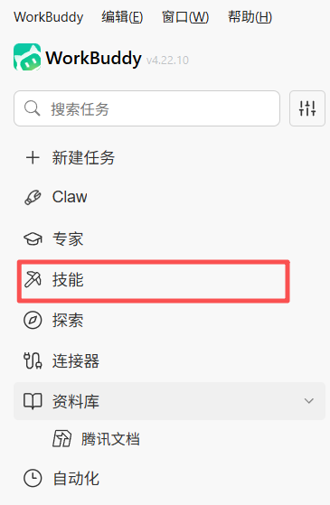
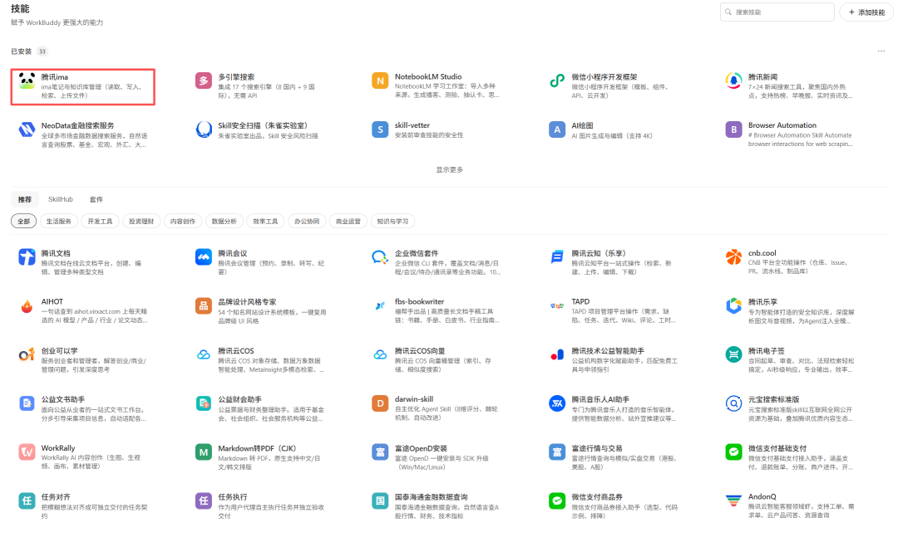
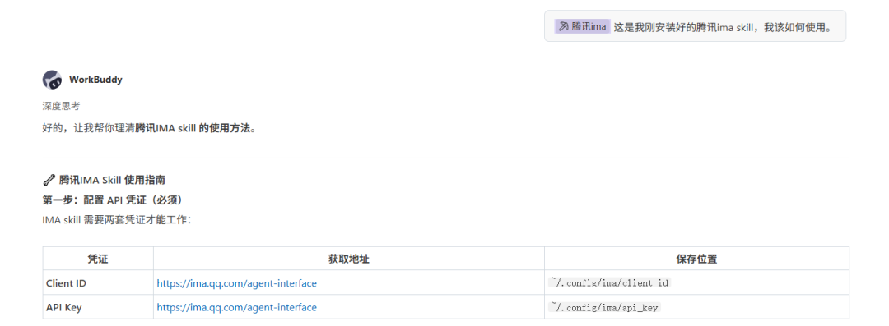
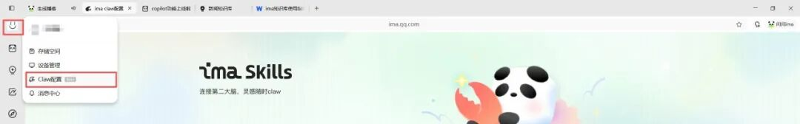
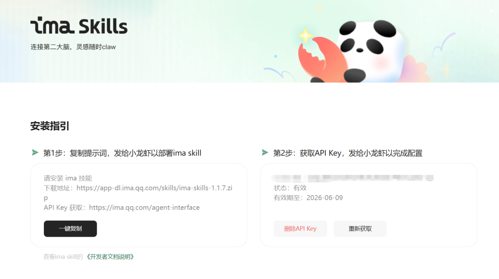
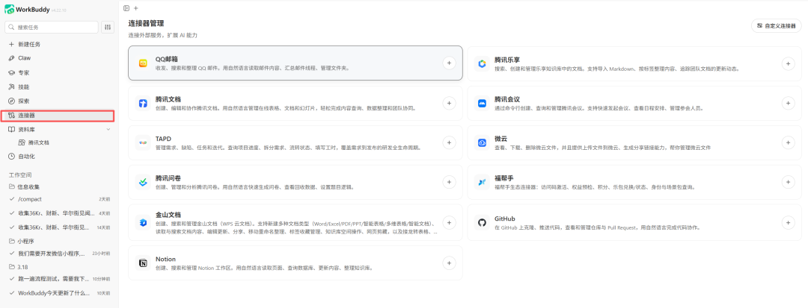
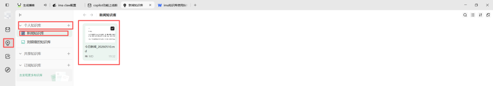
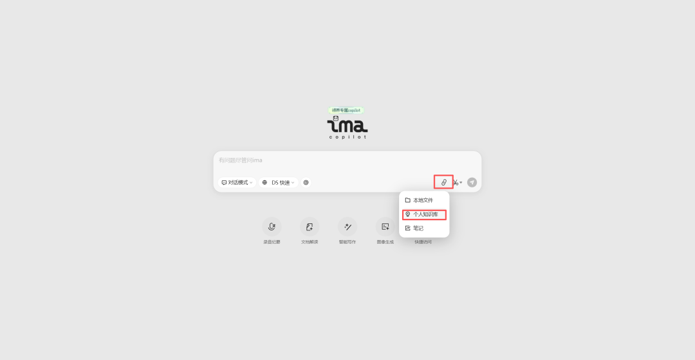
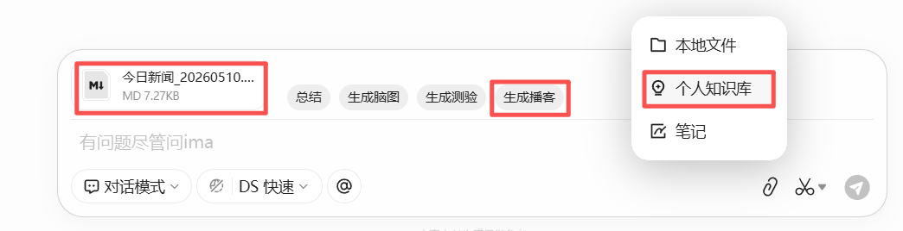
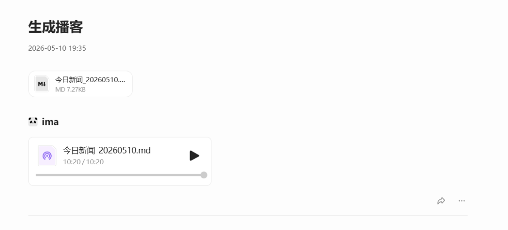

> 📎 来源: [珞珞如石乎](https://mp.weixin.qq.com/s?__biz=MzYzNTMxNjIxNQ==&mid=2247484031&idx=1&sn=9d1a85e7530d69b6a1c5feb831acb72e&chksm=f11bb9434291786b1717d2cfde478ea7c2a1ae73ad25648cc274aa8ff506d1433ef57187b6e7&mpshare=1&scene=1&srcid=0513InkgjiwoUdka0WJvlNFk&sharer_shareinfo=9d149cb23bcb13fdb6ab7915e0ce44b1&sharer_shareinfo_first=9d149cb23bcb13fdb6ab7915e0ce44b1) | 时间: 2026-05-13 15:40

---

今天我想给大家分享的是用WorkBuddy进行内容和知识获取后，然后，让它直接帮我们上传到知识库，再用IMA知识库生成播客来听。

---

我为什么要这么做？

1、我需要或者说是想要每天整理我所获取的知识、笔记，以及一些我想要额外获取的知识。

2、而这些知识，在我一天工作之后，其实我想要让眼睛休息一会儿，因为我的工作需要大量的使用眼睛，相信很多工作的朋友也是，每日用眼严重。

3、然后，我每天其实是不怎么戴耳机的，上班过程中。所以，在进行内容复习和内容复盘的时候，我想要直接用耳朵的听来进行。

4、同时，播客又是一个能够比较有趣拆解和复盘我们知识的音频，能够让我们在放松的时候也能进行知识的巩固。

---

下面是具体的教程：

首先，我们先在WorkBuddy中的技能中，找到腾讯IMA Skill并添加。

然后，我们调用IMA Skill，需要先询问AI，链接IMA知识库需要我们提供什么？AI会要求我们提供Client ID和API Key，这时我们根据AI给的链接登录获取我们的Client ID和API Key。

以上是一种方法，还有第二种方法。

下载腾讯IMA知识库本地客户端，登录后点击我们的头像，再点击Claw配置。接着，根据IMA的提示进行配置Skill，以及IMA的Client ID和API Key。

注意：Client ID和API Key有效期为一个月，需要我们每个月进行配置。当然，后期WorkBuddy可能会直接在连接器中配置IMA，也许到时候就不需要我们进行API Key的更新了，毕竟是腾讯自家的产品。

---

这下，我们已经完成了第一步，IMA Skill的安装和配置。

接下来，我们需要在IMA中创建个人知识库。并让WorkBuddy获取你想要的内容，并上传。这里我使用的是，我之前创建的daily-news-collector Skill获取的新闻内容，让WorkBuddy帮我上传至我的新闻知识库。

大家可以自己创建自己想要的内容获取Skill，完成定制化内容获取。

---

最后，我们进入腾讯IMA客户端首页，点击文件，个人知识库，选择我们想要转化为播客的内容进行添加。

然后点击生成播客，稍等一会儿，我们就能开始听播客啦！

---

最后的最后，个人心得：

我们在完成这一套流程后，能够获得一个由你定制的个人知识库。同时，可以放松我们的眼睛，用心去倾听和感受今天的所学知识。

并且，我们在WorkBuddy中，可以根据自己的需要，进行微信读书划线和笔记的获取，或者是通过各种MCP Server和Skill完成自己需要的内容。

让我们一起成为更好的自己！

感谢大家的观看，有什么问题可以在评论区中进行交流，我也是小白，但是我们可以一起学习和成长。

#WorkBuddy##腾讯IMA知识库##AI学习和实战记录#
