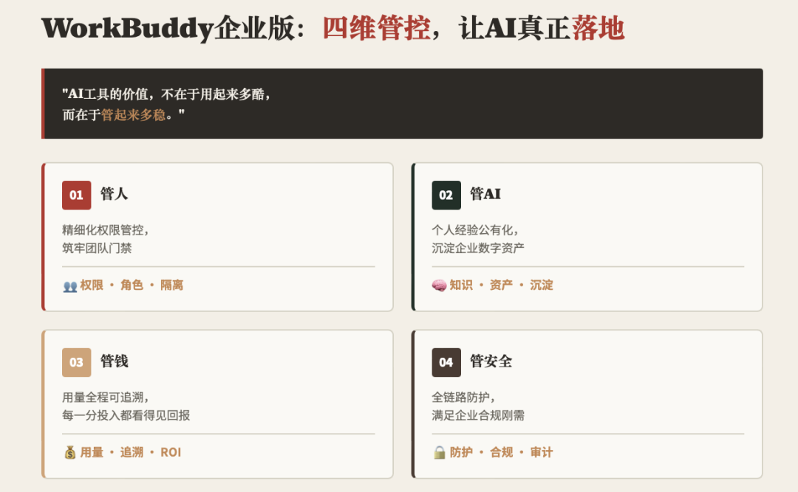
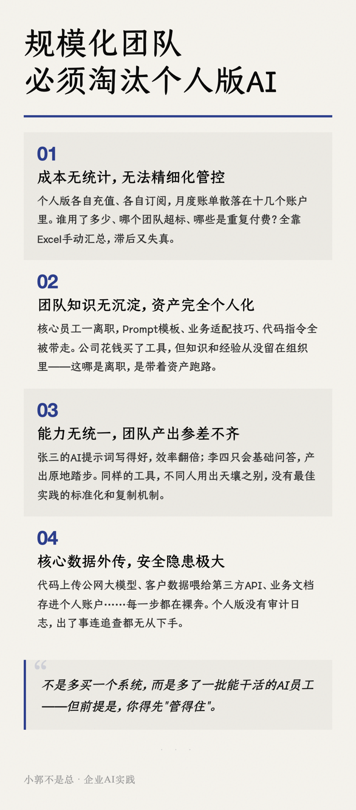
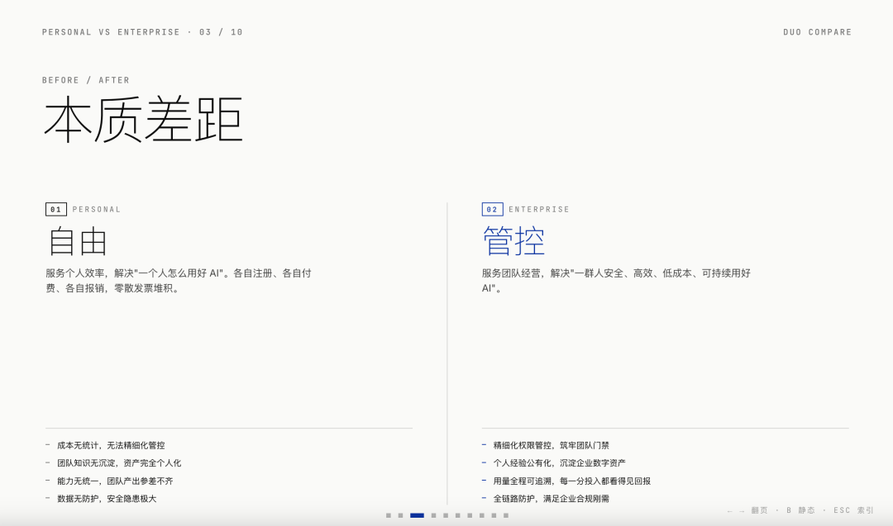

> 📎 来源: [小郭不是总](https://mp.weixin.qq.com/s?__biz=MzU5OTQ3NDgzMA==&mid=2247485066&idx=1&sn=7fb544c55ee9d8463ceb7eb969e0e404&chksm=ffd95a20e2e31bc0384b1773edecffe01711a238a56b8ccd765dfca7376d81fe9637e8ada190&mpshare=1&scene=1&srcid=05265fOYNGOCseTnJA9fCtq2&sharer_shareinfo=b9a3d4a8ea016e3c718ee4265c444fd8&sharer_shareinfo_first=b9a3d4a8ea016e3c718ee4265c444fd8) | 时间: 2026-05-26 20:41

---

在之前的文章给大家分享了数字生命卡兹克、花叔、李继刚三位AI大佬的Skill合集，他们的Skills主要的场景是在内容和研究分析。

这次要跟大家继续分享三位博主开源的Skill，安装上它们，你就可以在WorkBuddy等Agent上一键做出具有格调的配图和PPT。

一、半大熊猫 ：any2html （复古风HTML信息卡片）

any2html 是一个专为 AI Agent设计的高级前端排版技能。它能将用户提供的长文本、生硬的数据表格、或是复杂的文章链接，经过深度信息提炼后，转化为**极具复古美感、视觉舒适、纯静态**的高质量 HTML 信息卡片。

无论是用来做小红书轮播图、推特长图、还是公众号文章配图，

```
any2html
```

 都能帮你自动化完成从「干货提炼」到「设计排版」的完整闭环。



有三个版本可以在生成时选择：

1、竖版（小红书多图版）

特点：单页容量有限，遇到长文会自动生成多个卡片模块（多页排版），并带有精美的页脚编号（如 01 / 03）。

适用场景：极度适合作为小红书图文笔记的滑动卡片，手机端连续阅读体验最佳。

2. 横版（一图流全览版）

特点：没有高度上限，所有的内容、图表、数据都会在一张图里流畅铺展到底。

适用场景：适合将长文转为一张超长的逻辑信息图。

3. 插图版（文章极简配图版）

特点：极致克制。去除了所有冗余的关键词标签、TLDR 阅读时长和页码。主内容区仅保留提炼出的标题与核心金句。

适用场景：专门用于公众号、博客、Notion 文章的首图 / 封面图 / 题图提升文章整体的高级感。

🔗 https://github.com/blockpanda/any2html

安装命令：

```
npx skills add blockpanda/any2html --skill any2html
```

二、向阳乔木 ： info-card-designer （文字一键变杂志风卡片）

给WorkBuddy一个 URL、粘贴一段文字，或描述一个主题，这个 skill 会自动设计成杂志质感 HTML 信息卡，并**自动截图输出 PNG**，可直接发到 X、小红书、微信。

核心特点：

- 经典风格、杂志风格、艺术风格三种可选
- 大标题、强视觉张力
- Hook 模式（默认开启）：每条描述改写为 10-20 字钩子句，有冲击感
- 支持 480 / 600 / 900px 宽度，说「生成 480 宽的卡片」即可切换
- 超长卡片（>1200px）自动分割成多张图
- 使用仓耳今楷（TsangerJinKai）本地字体，截图渲染 100% 一致



🔗 https://github.com/joeseesun/qiaomu-info-card-designer

安装命令：

```
npx skills add joeseesun/qiaomu-info-card-designer
```

三、归藏 ：guizang-ppt-skill （电子杂志风网页PPT）

一个适配 Claude Code / Codex 等 Agent 环境的网页 PPT 技能,用于生成**单文件 HTML 横向翻页 PPT**、PPT 配图和多平台封面。

内置两套视觉系统:

电子杂志 × 电子墨水：适合叙事、观点、分享、个人风格表达。

瑞士国际主义：网格至上、单一高饱和锚点色、直角、发丝线、极致字号对比,适合事实、产品、分析、方法论表达。



核心特点：

**横向左右翻页：**键盘 ← → / 滚轮 / 触屏滑动 / 底部圆点 / ESC 索引

**Codex 可选配图流程**:可用 GPT-Image 2.0 / GPT-M 2.0 生成纪实照片、信息图、流程图、系统关系图、UI 情景图,并按模板比例插入

**多平台封面**:可用同一套视觉规则生成公众号 21:9、公众号分享卡 1:1、小红书 3:4、视频号横版等封面

🔗 https://github.com/op7418/guizang-ppt-skill

安装命令：

```
npx skills add op7418/guizang-ppt-skill --skill guizang-ppt-skill
```

大家要是有什么比较不错的配图设计、ppt制作的skill，可以在评论区分享哦！

谢谢你看我的文章，要是觉得对你有帮助，随手点个赞、在看、转发三连哈 ❤️ 这是对我最大的鼓励与肯定！我会持续分享适合普通人的AI「知识」、「思考」、「实践」，希望得到你的➕关注～
