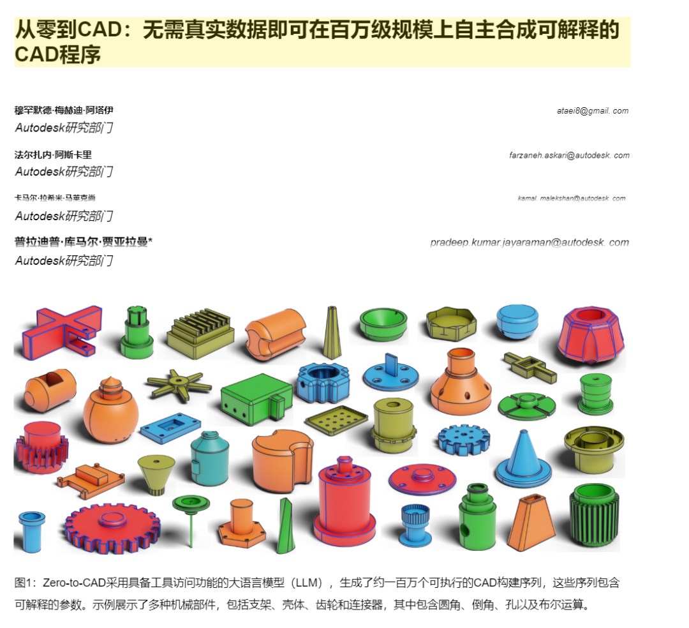
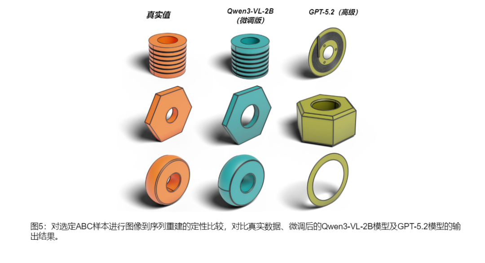

> 📎 来源: [玄界视角](https://mp.weixin.qq.com/s?__biz=MzU2MjY1ODE1NQ==&mid=2247485091&idx=1&sn=a418ad2e76738cbbd5437885b13e5394&chksm=fdde5d3e1f8d7a7de20b414b516dd7fb9ae8dafdc2cf367c07913677762b77a204fb7e63d6f6&mpshare=1&scene=1&srcid=0521Vvv9V25z2VH3l7xpZ8V2&sharer_shareinfo=1d2db2663e4fc23df7f96bbadfa4d889&sharer_shareinfo_first=1d2db2663e4fc23df7f96bbadfa4d889) | 时间: 2026-05-21 15:10

---

**引言**

最近Autodesk研究部门发布了一篇名为Zero-to-CAD（从零到cad）的文章。 **他解决的问题主要是在没有真实数据（无图片无数据参考）的前提下，AI自动写代码，自动画机械零件。**

**AI自主生成零部件**

土木建筑：支持支架、法兰连接件等的从0到1的自主生成。并且生成的零件是可编辑修改的cad程序。也就是说，如果要画一个线管弯头，**AI会通过拉伸、切除、旋转、布尔剪切等进行操作。**生成出来的构件可以编辑，更改孔位等。

**和以前的AI生成有什么区别**

以前的AI-cad工具可以说是基于抄和拼来实现建模/编程序，但Zero-to-CAD是真正的学会了设计和写代码。

**以前**

1、照着已经有的图纸进行学习。人类没有设计过的图纸，AI画不出来。

2、只会画形状不会懂逻辑，它不知道什么是支吊架、这里为什么要打孔，那边为什么要用圆角。

3、只能做草图，做简单的拉伸、倒角剪切等

4、生成的图片/模型往往无法更改

5、无法自主纠错、画错了没办法AI自己检查。

**现在**

1、不需要参考其他图纸不需要数据集

2、就像一个真实的设计师一样，先画体块，拉伸、打孔、倒角等

3、知道什么是支架、孔位要怎么合理、倒角如何设置能稳定等

4、支持cad所有的高级操作，包括扫描、阵列、放样等

5、自主纠错，AI自主看报错文档，修改调整/重新画。

**结语**

未来cad软件可能会大大改变现在的工作方式，以后工程师不再是绘图员而是指挥AI干活的人。**设计师的工作变成提出需求、AI出方案、画图、修改、出图、设计师验收。**重复劳动将会大大减少。在知识星球有BIM相关学习资料，有兴趣可以私信。

本文参考文献：Zero-to-CAD: Agentic Synthesis of Interpretable CAD Programs at Million-Scale Without Real Data

论文网址：https://arxiv.org/pdf/2604.24479
