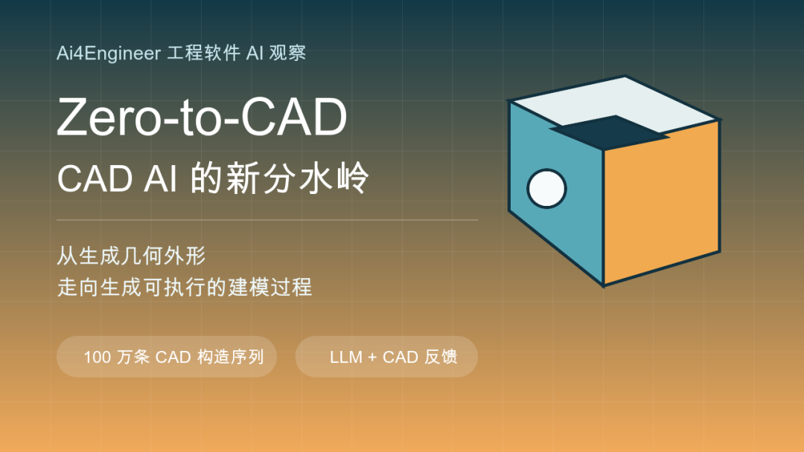
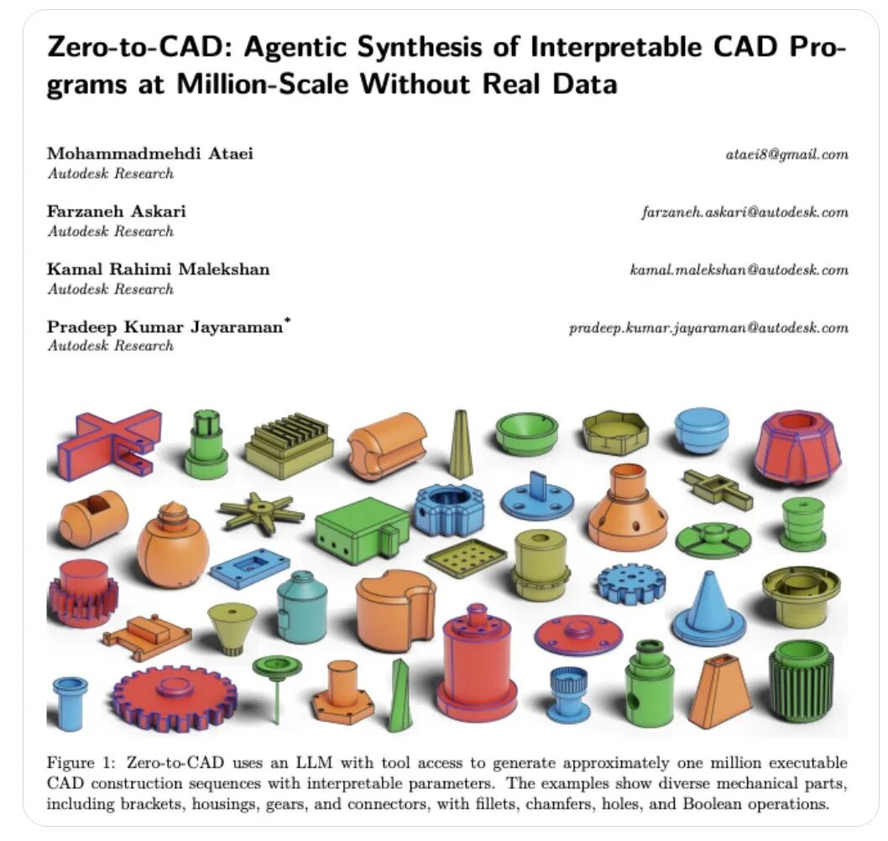
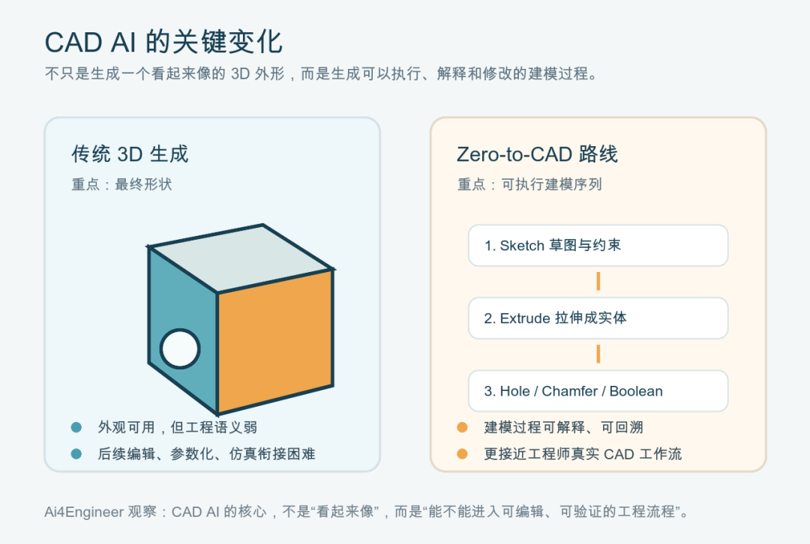

> 📎 来源: [Ai4Engineer](https://mp.weixin.qq.com/s?__biz=MzkzMTEzNDkwNw==&mid=2247483690&idx=1&sn=27b557ab6a2d8094ed75e77836c10f9b&chksm=c3bde6470460a7d26bc0dad623e4ec48b477d85ca42cf4ddfc58025e37dd10bb2ddf03826d3c&mpshare=1&scene=1&srcid=0517yI6Yt5uB464UIbzEt9Qg&sharer_shareinfo=bc955dbf6fef871810ba434941fab0a9&sharer_shareinfo_first=bc955dbf6fef871810ba434941fab0a9) | 时间: 2026-05-17 16:29

---

这两年，AI 生成 3D 模型并不新鲜。

真正值得工程软件从业者关注的是：AI 生成出来的东西，能不能进入工程师熟悉的 CAD 工作流？

一个模型如果只是三角网格、点云或漂亮的 3D 外观，它可以用于展示、概念设计、游戏资产或视觉内容。但对机械设计、制造研发和仿真前处理来说，这还远远不够。工程师真正需要的是可编辑的特征、参数、草图、拉伸、倒角、孔、布尔操作，以及可以回溯和修改的建模历史。

这就是 Autodesk Research 最近放出的Zero-to-CAD 1M值得关注的原因。

它不是一个普通的 3D 形状数据集，而是一个包含约 100 万条可执行 CAD 构造序列的大规模数据集。这些 CAD 程序由 LLM 在反馈驱动的 CAD 环境中生成，目标不是只给出最终形状，而是生成能够被 CAD 系统执行、解释和修改的建模过程。

换句话说，Zero-to-CAD 关注的不是“AI 能不能画出一个零件”，而是“AI 能不能像工程师一样，把零件建出来”。

# 从形状生成，走向建模过程生成

过去很多 3D 生成研究更接近视觉生成：输入文本、图片或条件信息，输出一个 3D 形状。这个方向当然有价值，但它和工程 CAD 之间隔着一层很厚的工程语义。

CAD 不是单纯的几何外壳。

在真实工程流程里，一个零件往往由一系列可解释操作构成：先画草图，再拉伸；再开孔、倒角、阵列、切除、合并。工程师关心的不只是最后的外观，还包括这个模型能不能改尺寸、能不能复用特征、能不能进装配、能不能进仿真、能不能和制造约束对齐。

Zero-to-CAD 的方向，正好切中了这个问题。

它尝试让 LLM 在 CAD 环境里生成可执行程序，并通过反馈来筛选和修正结果。论文标题里用了一个关键词：Interpretable CAD Programs，也就是可解释的 CAD 程序。这比“生成一个 3D 网格”更接近工程软件的核心。

对于 CAD AI 来说，这可能是一个分水岭。

因为工程软件里的 AI，最终不能只停留在“看起来像”。它必须进入参数化、可编辑、可验证的系统。

# 为什么是“没有真实数据”的百万级数据集

Zero-to-CAD 还有一个很有意思的点：它强调Without Real Data。

这背后其实是 CAD AI 发展中的一个现实问题：高质量 CAD 数据很难大规模获得。

真实企业 CAD 数据通常受知识产权、客户项目、供应链保密和产品安全约束，很难像自然图像、网页文本那样直接拿来训练。即便能拿到模型文件，里面的建模历史、参数关系、设计意图也未必完整、干净、可学习。

所以，如果 CAD AI 要向更高质量发展，只依赖真实企业数据会非常受限。

Zero-to-CAD 的思路是：让 LLM 在一个可以执行和反馈的 CAD 环境中，大规模合成 CAD 构造序列。这样得到的数据不是从企业数据库里爬出来的，而是通过生成、执行、验证形成的。

这条路线的意义在于，它绕开了部分真实工业数据稀缺的问题，同时保留了 CAD 建模过程的结构化特征。

当然，这不意味着合成数据可以直接替代真实工程数据。合成零件可能覆盖很多几何形态和操作组合，但真实工程设计里的约束、载荷、材料、加工方法、装配关系和行业规范，仍然不是简单靠形状合成就能补齐的。

但作为 CAD AI 的基础训练数据，百万级可执行建模序列的价值很大。

它至少让模型有机会学习一件过去很难学的事：一个 CAD 形状是怎样一步步构造出来的。

# 这对工程软件意味着什么

如果把 Zero-to-CAD 放到工程软件演进里看，它指向了几个值得持续跟踪的方向。

第一，CAD AI 会从“生成几何”转向“生成操作”。

未来的 AI 建模助手，不应该只是生成一个封闭模型，而是能够给出草图、特征和参数化步骤。这样工程师才能继续编辑，而不是得到一个难以修改的结果。

第二，AI 可能会成为 CAD 建模历史的生成器。

今天很多工程师使用 CAD 时，真正耗时的不是想象零件形状，而是把设计意图转成稳定的建模步骤。如果 AI 能生成可执行的初始建模序列，工程师就可以从“从零建模”转向“审查、修改和约束建模过程”。

第三，CAD 系统会越来越需要反馈环境。

Zero-to-CAD 的重要性不只在数据集，也在方法论：LLM 不是孤立地产生答案，而是在 CAD 环境里生成、执行、观察反馈，再改进结果。这和工程软件天然契合。因为工程软件本来就是一个强约束环境，几何能不能闭合、操作能不能执行、模型能不能有效，系统都可以给出反馈。

第四，工程软件 AI 的评价标准会变得更严格。

对 CAD 来说，好看不够。模型是否可执行、是否可编辑、是否参数清晰、是否符合建模逻辑，都会变成评价 AI 的关键指标。这和消费级 3D 生成完全不同。

# 仍然要保持清醒

Zero-to-CAD 很值得关注，但也不能把它理解成“CAD 自动化已经解决了”。

从可执行 CAD 程序，到真实工业设计，中间还有很长距离。

真实工程模型不仅有几何，还有功能、强度、装配、制造、成本和标准件体系。一个零件为什么要这样开孔，为什么这里要倒角，为什么这个厚度不能再薄，为什么这个面要作为装配基准，这些都来自工程语境，而不是单纯来自几何操作序列。

所以，Zero-to-CAD 更像是 CAD AI 的一个基础台阶：它让 AI 开始学习 CAD 的“语言”和“动作”，但距离真正理解工程设计意图还差很多。

这也是我们判断 CAD AI 时应该坚持的标准：

不要只看模型长得像不像。

要看它能不能被执行，能不能被修改，能不能解释建模过程，能不能进入后续仿真、制造和装配流程。

# Ai4Engineer 观察

Zero-to-CAD 释放了一个清晰信号：工程软件里的 AI，正在从内容生成走向过程生成。

对 CAD 来说，这个变化尤其关键。

因为 CAD 的核心从来不只是几何，而是工程师用一套可控、可编辑、可验证的操作，把设计意图固化为模型。AI 如果要真正改变工程研发，就必须进入这套操作体系，而不是停在外观层面。

Zero-to-CAD 1M 的价值，不在于它马上能替代工程师建模，而在于它把 CAD AI 的训练对象往前推了一步：

从“生成一个形状”，推向“生成一段能运行的建模过程”。

这件事值得长期跟踪。

---

信息来源

论文: https://arxiv.org/abs/2604.24479

数据集: https://huggingface.co/datasets/ADSKAILab/Zero-To-CAD-1m
