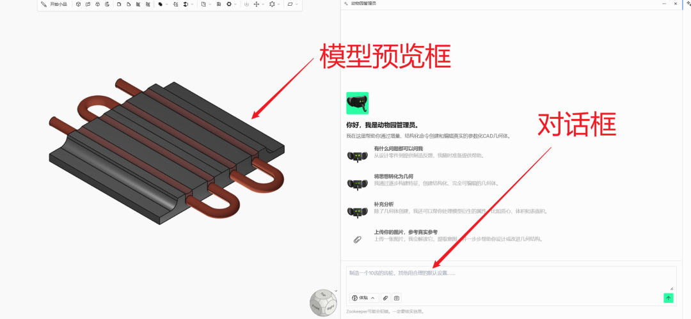
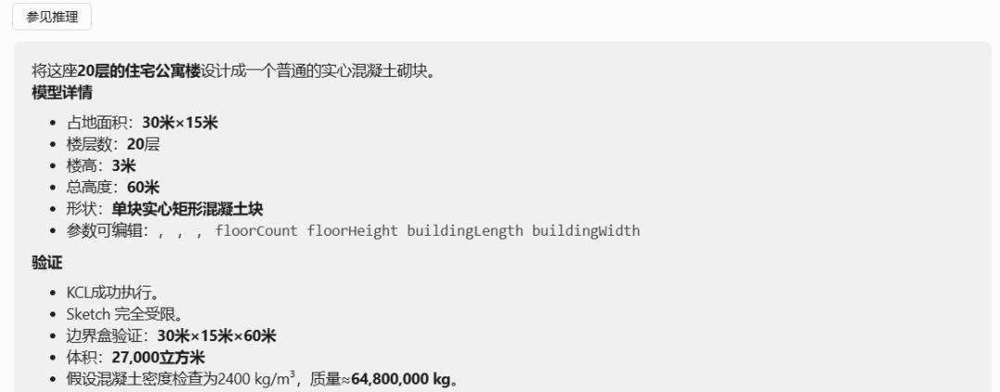
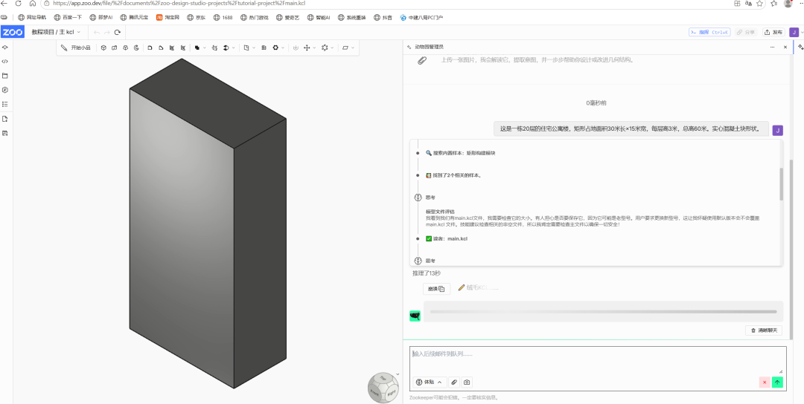
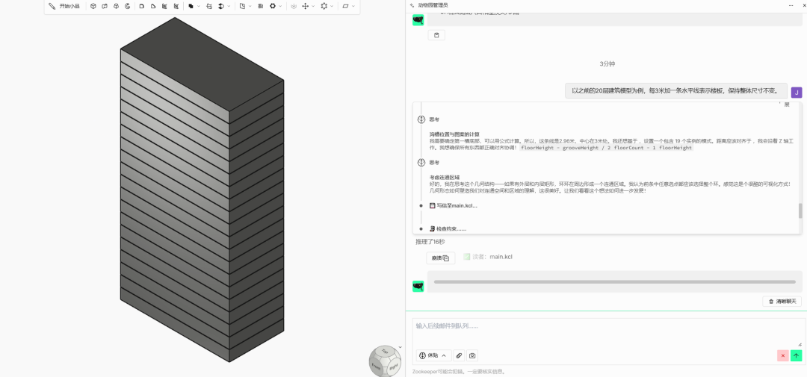
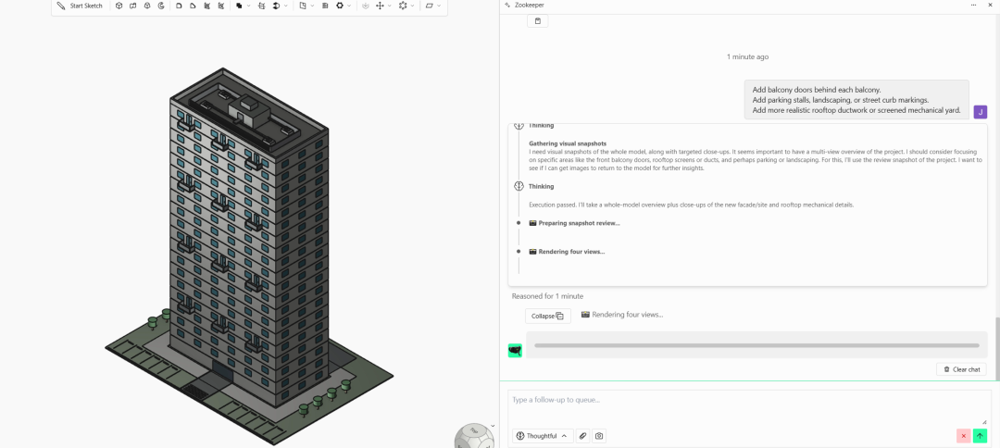
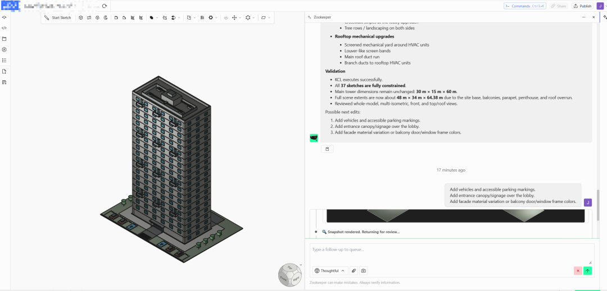
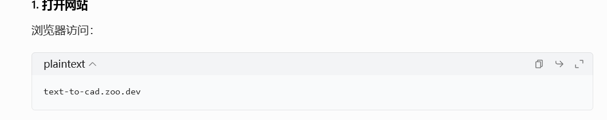

> 📎 来源: [玄界视角](https://mp.weixin.qq.com/s?__biz=MzU2MjY1ODE1NQ==&mid=2247485034&idx=1&sn=996e27f8a6a02c0ec29f289db0fbf138&chksm=fd7e2754179556c57817f342011862df589f8989475ca2b2e768037f3cc5740e01272b8f7cb9&mpshare=1&scene=1&srcid=0517bq9N9GA2RB9OPOonHkBU&sharer_shareinfo=a0f5d2ecc365bbaa98a339599b00231d&sharer_shareinfo_first=a0f5d2ecc365bbaa98a339599b00231d) | 时间: 2026-05-17 23:25

---

**引言**

text-to-cad，是一款开源的CAD模型生成框架。直接和它对话就可以画出模型。下面是我的亲测。

**怎么使用**

**意图告诉他：**这是一栋20层的住宅公寓楼，矩形占地面积30米长×15米宽，每层高3米，总高60米。实心混凝土块形状。

生成的体块如下所示：

**深化设计：**告诉他以之前的20层建筑模型为例，每3米加一条水平线表示楼板，保持整体尺寸不变。

生成的模型如下所示：

它帮我划分了楼层高度

**加窗户、入口屋顶等：**在每层楼之间加装窗户网格。增加一楼大堂入口。加装屋顶女儿墙或机械顶层公寓。

每个阳台后方都加装阳台门。添加停车位、景观或街道路缘标记。增加更逼真的屋顶风管或带纱窗的机械场地。

注意这里要简单的一个一个增加，太复杂容易失败。生成的模型如下所示：

**加车辆道路等：**增加车辆和无障碍停车标记。在大堂上方加装入口遮阳篷/标识。添加立面材料变化或阳台门窗框颜色。

界面是英文的，并且输入的提示词也要是英文的。

**怎么试用**

**线上试用：**首先对网络有要求，并且需要一个谷歌账号，这里感兴趣可以私信我，有些小伙伴应该懂得。

**本地部署：**本地部署有一点门槛，大家可以查询一下AI。一般需要Python环境，还要调用API等。很麻烦。

**应用场景**

方案阶段，做多搞方案比选，导出cad做深化。
