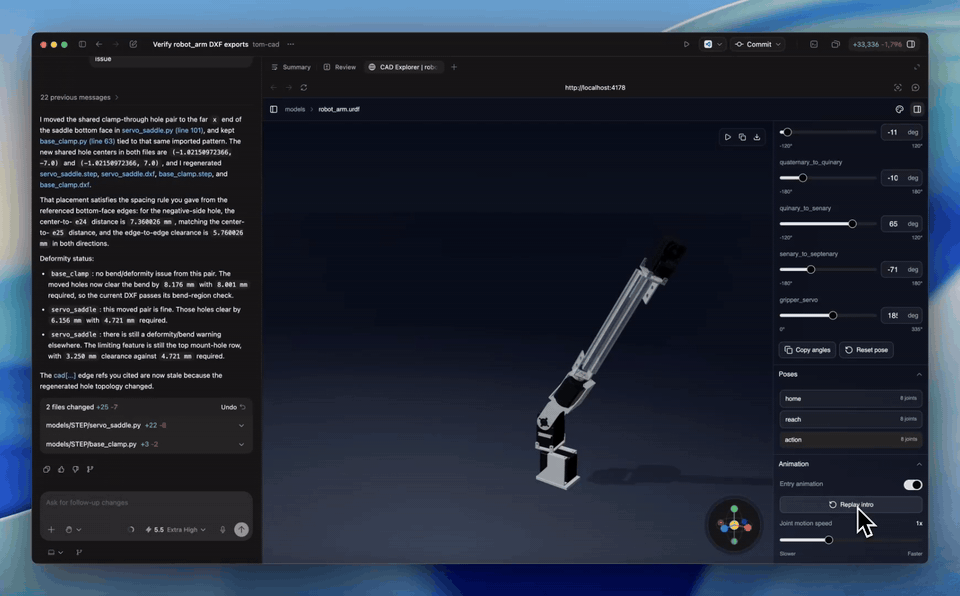
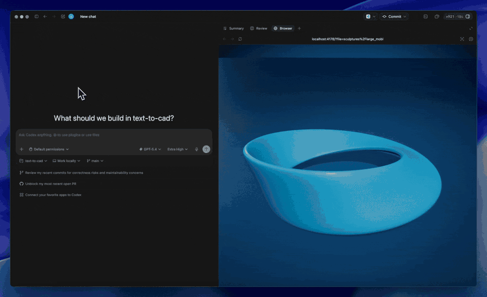

> 📎 来源: [码栈派](https://mp.weixin.qq.com/s?__biz=Mzk5MDg4MjE1OQ==&mid=2247485282&idx=1&sn=852b4683ace1b8d78246987219236d91&chksm=c4a1bc07768adf7b831f906096d70ab8e91ae946cf37e246a3d0234af7b1e44901c4e3fe6444&mpshare=1&scene=1&srcid=0517v3uaiPN8FrbWZ8jqP1ah&sharer_shareinfo=94a25c93a445b66ac58fe390f55e8df3&sharer_shareinfo_first=94a25c93a445b66ac58fe390f55e8df3) | 时间: 2026-05-17 16:27

---

**text-to-cad** 是一个**免费、开源**的 CAD 模型生成框架，让 Codex、Claude Code 等 AI 编程 Agent 直接把自然语言描述转成可编辑的 CAD 源文件，并导出 STEP、STL、3MF、DXF、GLB、URDF 等工业标准格式。

传统 CAD 建模需要熟悉 SolidWorks、Fusion 360 等软件，学习曲线陡峭，改一个参数要手动操作好几步。text-to-cad 把这个流程变成对话：**描述你要的零件，Agent 写代码，框架生成模型，浏览器里直接预览**。源文件纳入版本控制，改动有迹可查。





## 核心特性

### 支持的导出格式

- **STEP**：工业标准，可导入任何 CAD 软件
- **STL / 3MF**：3D 打印直接用
- **DXF**：激光切割、CNC 加工
- **GLB**：Web 3D 展示、游戏引擎
- **URDF**：机器人描述文件，含关节、连杆、运动限制
- **拓扑数据 + 渲染预览图**：快速迭代时用于检查

### 三套内置 Skill

| Skill | 功能 |
| --- | --- |
| **CAD Skill** | STEP/STL/3MF/DXF/GLB 生成、渲染预览、  ``` @cad[...] ```   几何引用 |
| **URDF Skill** | 机器人 URDF XML、连杆/关节/限制生成、网格引用、验证 |
| **Robot Motion Skill** | ROS 2/MoveIt 配置、逆运动学、路径规划、运动服务器测试 |

Skill 文件存放在 

```
.agents/skills
```

（Codex）和 

```
.claude/skills
```

（Claude Code），两个 Agent 都能直接调用。

### ``` @cad[...] ```  几何引用

生成模型后可以复制稳定的 

```
@cad[...]
```

 引用句柄，Agent 后续编辑时能精确定位到具体几何体，而不是重新生成整个模型。**改局部，不动全局。**

### 本地运行，无需后端

CAD Explorer 是内置的本地浏览器预览工具，

```
npm run dev
```

 启动，打开 

```
http://localhost:4178
```

 即可检查生成的模型。**没有云服务，没有 API 费用，数据不出本地。**

## 工作流程

1. 1. **描述**：告诉 Agent 你要的零件、装配体、夹具、机器人或机构
2. 2. **编辑**：Agent 更新本地 CAD 源文件（Python 脚本）
3. 3. **生成**：指定目标格式，框架生成 STEP/STL/3MF/DXF/GLB/URDF
4. 4. **检查**：打开 CAD Explorer 在浏览器里预览模型
5. 5. **引用**：复制 

   ```
   @cad[...]
   ```

    句柄，用于后续精确编辑
6. 6. **提交**：源文件和生成产物一起 commit，版本可追溯

## 安装方法

```
# 克隆仓库git clone https://github.com/earthtojake/text-to-cad.gitcd text-to-cad# 安装 Python CAD 依赖（需要 Python 3.11）python3.11 -m venv .venv./.venv/bin/python -m pip install --upgrade pip./.venv/bin/pip install -r .agents/skills/cad/requirements.txt# 安装 CAD Explorernpm --prefix .agents/skills/cad/explorer install# 启动本地预览npm --prefix .agents/skills/cad/explorer run dev
```

打开 

```
http://localhost:4178
```

 即可使用 CAD Explorer。

## Benchmark 示例

框架内置 10 个基准测试，覆盖从简单到复杂的典型零件：

| # | 零件 | 描述摘要 |
| --- | --- | --- |
| 1 | 校准块 | 100×60×20mm 矩形块，四个通孔，顶部倒角 |
| 2 | 法兰盘 | 80mm 圆形法兰，六孔螺栓圆，中心通孔 |
| 3 | L 型支架 | 底板 + 竖板，三角形加强筋，双方向孔 |
| 4 | 阶梯轴 | 三段阶梯轴，端部倒角，键槽 |
| 5 | 电子外壳 | 空心开顶外壳，内部支柱，圆角 |
| 6 | 航空叉形支架 | 对称叉架，减重孔，加强筋 |
| 7 | 发动机气缸 | 散热翅片，火花塞斜孔，底部法兰 |
| 8 | 离心叶轮 | 12 片后弯叶片，轮毂，通孔 |
| 9 | 螺旋楼梯 | 中心柱，20 级踏步，螺旋扶手，立柱 |
| 10 | 行星齿轮组 | 太阳轮 + 行星轮 + 齿圈 + 行星架，完整装配 |

## 应用场景

### 场景 1：快速原型设计

**传统痛点**：脑子里有个零件的大概形状，但要在 CAD 软件里建出来需要几十步操作

**解决方案**：用自然语言描述尺寸和特征，Agent 生成源文件，几分钟内得到可打印的 STL

### 场景 2：机器人开发

**传统痛点**：URDF 文件手写繁琐，关节参数、连杆定义容易出错，和 CAD 模型对不上

**解决方案**：URDF Skill 直接从 CAD 模型生成机器人描述文件，含关节限制和网格引用，可直接接入 ROS 2/MoveIt

### 场景 3：工程文档版本管理

**传统痛点**：CAD 文件是二进制，Git 无法 diff，改了什么只能靠文件名区分

**解决方案**：源文件是 Python 脚本，纯文本，Git 完整追踪每次改动，生成产物和源文件一起 commit

### 场景 4：AI Agent 驱动的设计迭代

**传统痛点**：让 AI 改 CAD 模型，每次都要重新描述整个零件，无法精确定位局部特征

**解决方案**：

```
@cad[...]
```

 引用锁定具体几何体，Agent 只改你指定的部分，其余保持不变

## 常见问题

### Q：需要懂 CAD 软件吗？

不需要。你只需要用自然语言描述零件，Agent 负责生成 CadQuery Python 脚本，框架负责渲染和导出。

### Q：支持哪些 AI Agent？

目前内置支持 **Codex**（

```
.agents/skills
```

）和 **Claude Code**（

```
.claude/skills
```

），两套 Skill 路径都已配置好。

### Q：生成的模型能直接用于生产吗？

可以导出工业标准 STEP 文件，导入 SolidWorks、Fusion 360、FreeCAD 等软件做进一步精修。STL/3MF 可直接送 3D 打印，DXF 可直接送激光切割或 CNC。

### Q：本地运行需要什么环境？

Python 3.11 + Node.js，无需任何云服务或 API Key（AI Agent 的 Key 由你自己配置）。

## 资源链接

- **GitHub 仓库**：

  ```
  https://github.com/earthtojake/text-to-cad
  ```
