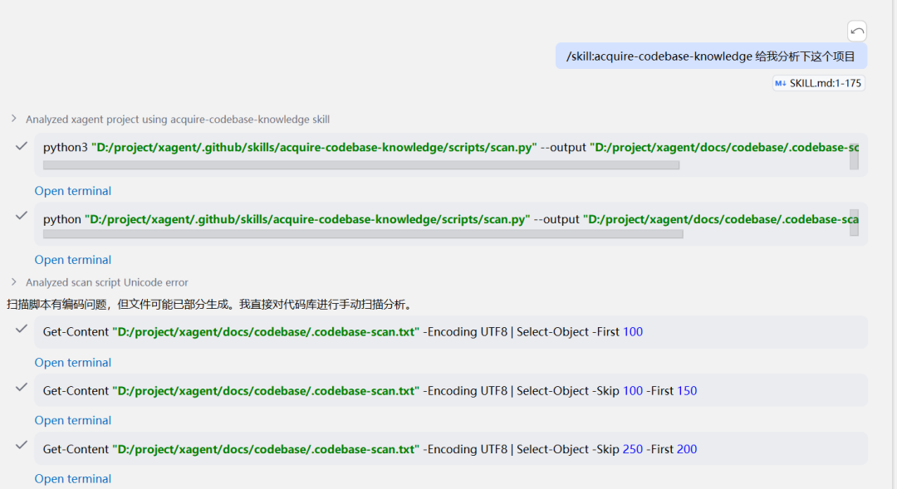
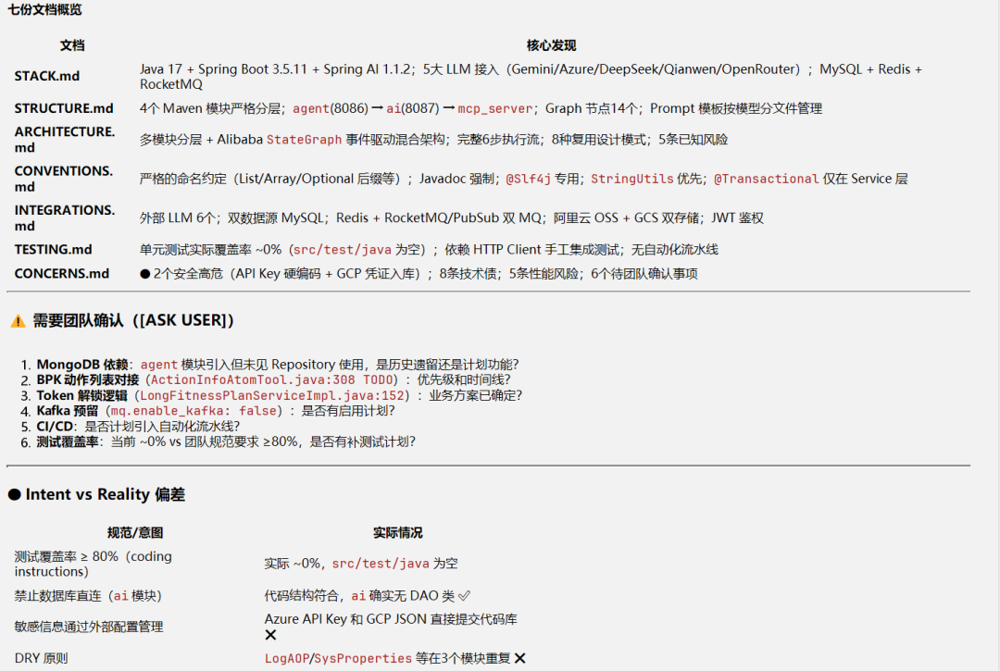
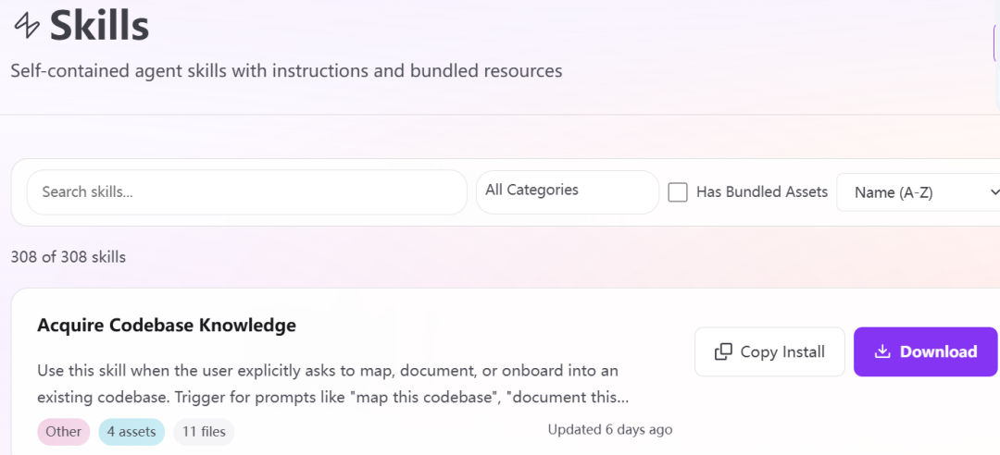

> 📎 来源: [计算机知识的传播者](https://mp.weixin.qq.com/s?__biz=MzIxNDk1MDQxNA==&mid=2247483911&idx=1&sn=b457ed926b82477b38f244863c88dd9d&chksm=966c51035970d67e6724931f393cb1f8e85d00bd465e23a9777be27d60928ea0fc81f2a36501&mpshare=1&scene=1&srcid=0421RPVl1pGjD6i0xCy2GGiY&sharer_shareinfo=dd337822e1296cdf3474965253fe6194&sharer_shareinfo_first=dd337822e1296cdf3474965253fe6194) | 时间: 2026-04-21 09:19

---

```
acquire-codebase-knowledge
```

 是一个高度结构化的 **代码库自动化扫描与文档化技能**。它的核心目标是消除开发者进入新项目时的"冷启动"障碍，通过严谨的自动化流程生成一份真实、可信的项目地图。

## 核心逻辑：基于证据的发现

该技能遵循一个铁律：**只记录可验证的事实，严禁臆测。** 它要求所有结论必须追溯到具体的配置文件、源代码或终端输出。

效果展示





## 1. 交付物矩阵 (Output Contract)

它强制要求在 

```
docs/codebase/
```

 目录下生成 **7 份标准文档**，构成了一个完整的项目百科全书：

| 文档名称 | 关注点 | 核心内容 |
| --- | --- | --- |
| **STACK.md** | 技术栈 | 语言、运行时、核心框架、生产依赖。 |
| **STRUCTURE.md** | 项目结构 | 目录布局、代码入口点、核心文件定位。 |
| **ARCHITECTURE.md** | 架构设计 | 代码分层、数据流向、设计模式。 |
| **CONVENTIONS.md** | 编码规范 | 命名、错误处理、代码风格、导入规则。 |
| **INTEGRATIONS.md** | 外部集成 | 数据库、外部 API、鉴权机制、监控。 |
| **TESTING.md** | 测试策略 | 测试框架、Mock 策略、覆盖范围。 |
| **CONCERNS.md** | 潜在问题 | 技术债、安全风险、性能瓶颈、高频修改文件。 |

---

## 2. 标准化工作流 (4 个阶段)

- **阶段 1: 扫描与意图分析**：运行 

  ```
  scan.py
  ```

   获取原始数据，并阅读 README/PRD。对比"开发者想做什么"与"代码实际上写了什么"。
- **阶段 2: 深度调查**：根据扫描结果，对照内置的 

  ```
  inquiry-checkpoints.md
  ```

   逐项核对项目细节。
- **阶段 3: 填充模板**：按顺序填写 7 份文档。无法确定的标记为 

  ```
  [TODO]
  ```

  ，需要用户决策的标记为 

  ```
  [ASK USER]
  ```

  。
- **阶段 4: 验证与修复**：强制性的自我核查循环，确保每一项声明都有证据支撑（具体文件路径）。

---

## 3. 该技能的"聪明之处" (细节处理)

- **反模式识别**：它会自动避开生成的代码（如 

  ```
  dist/
  ```

  , 

  ```
  build/
  ```

  ），防止误判规范。
- **环境变量透视**：通过 

  ```
  .env.example
  ```

   探测隐藏的集成服务。
- **单体仓库支持**：能识别 

  ```
  workspaces
  ```

   结构，不会被复杂的根目录误导。
- **脆弱点检测**：通过 Git 历史识别"高频变动文件"，将其定义为潜在的复杂性或脆弱区域。

## 总结

**一句话定义：** 这是一个通过 **"Python 脚本扫描 + 标准化模板填充 + 严格证据校验"**，为开发者提供 **"项目全景图"** 的自动化技能。

它不仅告诉你"代码在哪"，还告诉你"代码是怎么组织的"、"有哪些坑"以及"如何正确地贡献代码"。

## Skill下载方式

- 1. 翻墙：https://awesome-copilot.github.com/skills/



- 2.关注公众号, 回复：codebase


创作不易，记得点赞加关注
