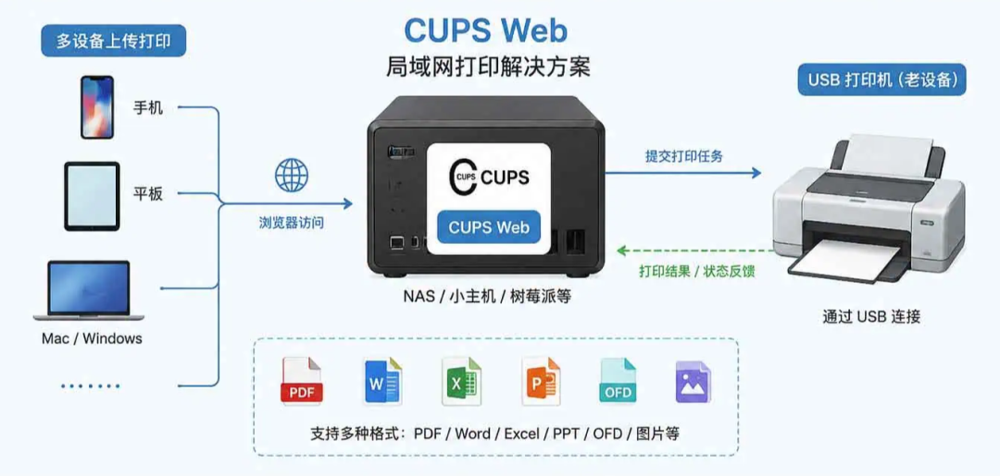

> 📎 来源: [蚂蚁发现](https://mp.weixin.qq.com/s?__biz=MzIxMjM2NTgzMQ==&mid=2247486176&idx=1&sn=4c304dd20ad6a51f640372252780ff4b&chksm=965e3b66d16ac98e51ed7be52d9bbdfc8fbe6cab56225d7c24ee2cbc18781df9411aa319d32e&mpshare=1&scene=1&srcid=05291Nzvo9Mhx2rQMcaFCdbH&sharer_shareinfo=2ec3061da822a969529201287aa8a36c&sharer_shareinfo_first=2ec3061da822a969529201287aa8a36c) | 时间: 2026-05-29 12:43

---

很多人都有过这样的经历：人在公司，文件在手机里；或者家里的打印机开着，但你还得远程连电脑、传文件、再点打印。更麻烦的是：微信收到的 .docx；学校发来的 .ofd；手机拍的图片；iPhone 的 HEIC 照片；很多打印机根本没法直接处理。

最近我发现了一个很实用的开源项目来自 GitHub 的 cups-web 项目它本质上是：一个基于 CUPS 的“网页版打印后台”。你只需要打开浏览器，就能像网盘一样上传文件，然后直接远程打印。而且支持 Docker 一键部署，对 NAS、Linux 小主机、软路由玩家。这项目到底能干什么？它把传统“打印机驱动 + 本地电脑打印”的流程，变成了：

```
手机 / 平板 / 浏览器
```



它最大的优势：驱动支持特别狠作者已经在 Docker 镜像里内置了大量打印机驱动。 包括：

- HP
- Epson
- Canon
- Brother
- 柯尼卡美能达

很多老打印机都能直接识别。而且支持：amd64；arm64；树莓派 ARMNAS、小主机、软路由基本都能跑。

---

Docker 一键部署（小白也能装）

官方推荐 Docker 部署。

第一步：创建 docker-compose.yml

```
services:
```

第二步：启动

在同目录新建 

```
.env
```

 文件填入 

```
CUPSADMIN=admin
```

 和对应的密码，然后执行 

```
docker-compose up -d
```

 即可

```
docker compose up -d
```

## 第三步：打开后台 浏览器访问：

```
http://你的IP:1180
```

默认账号：

```
admin
```

支持 HTTPS，可以直接挂 Nginx 反代。公网部署也没问题。

**避坑指南：**

1. **CUPS 后台要开启共享：**添加打印机后，记得把状态设为 **Shared（共享）**，否则 Web 端可能发现不了打印机。

2. **默认账号要马上改：**Web 端默认账号是 `admin/admin`，首次登录后建议立刻修改。

3. **OFD 转换看部署方式：**Docker 镜像内通常包含相关环境；如果用二进制部署，OFD 转换可能需要单独配置 Java 17。

4. **上传文件会占磁盘：**原始文件、转换后的 PDF 和打印记录会留在服务端，建议定期清理。

## 项目地址

##

- GitHub：

https://github.com/hanxi/cups-web

官方CUPS:

https://www.cups.org


