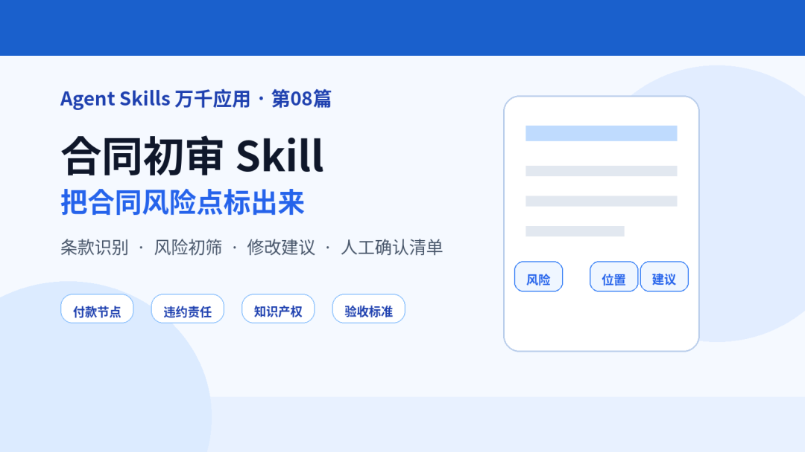
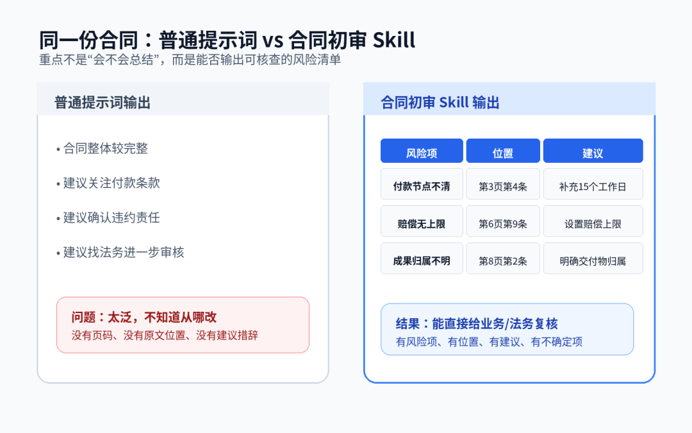
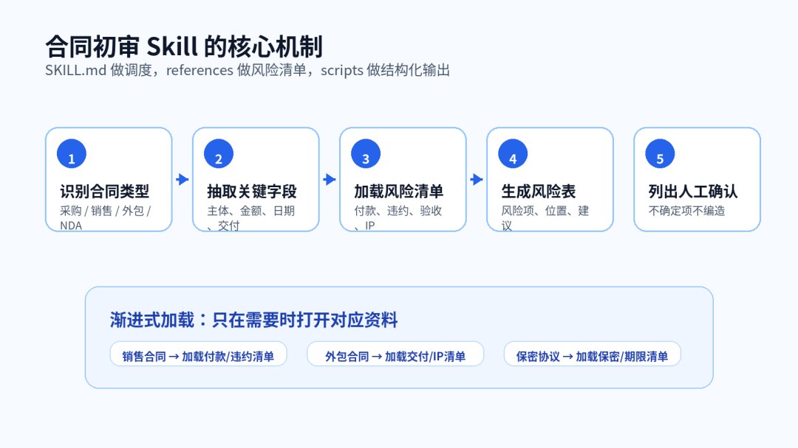
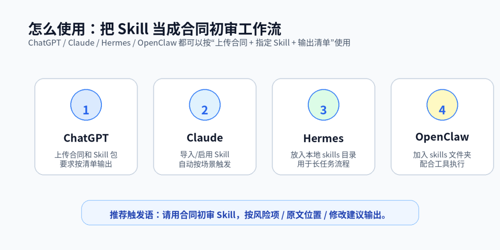

> 📎 来源: [厚国兄](https://mp.weixin.qq.com/s?__biz=Mzk1NzM1MTI1Ng==&mid=2247490383&idx=1&sn=a6fcc524436d4c052f360ef68e380dd6&chksm=c2dc0ae036ada8efbb41eba63f0477509c6d19240ba10e2f60254db923ae0a24a855bc5373cd&mpshare=1&scene=1&srcid=0526lEvz10lrrbvhfaooXbYL&sharer_shareinfo=6e69aac0a675f8f132ff46a582366763&sharer_shareinfo_first=6e69aac0a675f8f132ff46a582366763) | 时间: 2026-05-26 19:53

---

Agent Skills 万千应用 · 第08篇

合同初审 Skill：把合同风险点标出来

▌ 01｜场景痛点开场：合同不是看不懂，是怕漏看

客户发来一份销售合同，明天就要盖章；供应商发来一份采购协议，说“只是走流程”；外包团队发来一份软件开发合同，看起来条款很多，但真正关键的付款、验收、违约、知识产权，藏在一堆文字里。

业务同事通常会问一句：“你帮我先看看，这个合同有没有坑？”

普通 AI 总结合同，往往只会说“建议关注付款条款、违约责任、知识产权”。听起来对，但不够用。真正有价值的结果，应该是：风险在哪里、原文是哪一条、为什么有风险、建议怎么改、需要谁确认。

▌ 02｜Skill 实操效果：两个真实办公案例

案例一：销售合同初筛

输入：一份客户采购合同，合同金额 28 万，客户要求“验收合格后付款”。普通提示词只会泛泛提醒，Skill 会输出可复核表格。

|  |  |  |  |
| --- | --- | --- | --- |
| 风险项 | 原文位置 | 风险说明 | 修改建议 |
| 付款期限不明确 | 第3页第4条 | 只写“验收合格后付款”，没有付款天数 | 改为“验收通过后15个工作日内付款” |
| 违约责任偏重 | 第6页第9条 | 乙方赔偿范围未设上限 | 增加“不超过合同总金额” |
| 验收标准不清 | 第5页第2条 | 未说明验收材料和验收周期 | 增加验收清单和默认通过机制 |

 

案例二：软件外包合同初筛

输入：一份 App 小程序开发合同，对方承诺 45 天交付。Skill 会重点检查交付物、需求变更、知识产权。

|  |  |  |  |
| --- | --- | --- | --- |
| 风险项 | 原文位置 | 风险说明 | 修改建议 |
| 交付物不完整 | 第2页第3条 | 只写“完成系统开发”，未写源码和文档 | 补充源码、部署文档、接口文档清单 |
| 需求变更无规则 | 第4页第6条 | 未说明新增需求是否另行计费 | 增加变更确认流程 |
| 知识产权归属不明 | 第7页第10条 | 未明确源码和设计稿归属 | 明确付款后归甲方所有 |

 

▌ 03｜Skill 简介：它是什么，包含哪些文件

合同初审 Skill，是一个面向中文商务合同的 Agent 能力包。它不是替代律师，而是帮业务、销售、采购、项目经理做第一轮风险筛查。

典型文件包括：SKILL.md、references/risk\_checklist.md、references/output\_template.md、scripts/risk\_table\_template.py、assets/contract\_review\_prompt\_template.md。

它解决的是：合同太长容易漏看；AI 总结太泛；修改建议没有原文位置；每次审合同都要重复提醒 AI。

目前没有统一官方中文合同初审 Skill，所以本篇已生成中文增强版：contract-review-skill-zh-v1.zip。

▌ 04｜核心机制：SKILL.md 怎么设计

关键设计一：先判断合同类型。销售合同、采购合同、软件外包、NDA，重点风险不一样。

关键设计二：渐进式加载风险清单。销售合同加载付款、验收、违约；外包合同加载交付物、需求变更、知识产权。

关键设计三：固定输出风险表。输出必须包含风险等级、风险项、原文位置、风险说明、修改建议和人工确认人。

尤其要强调：不确定内容必须标记，不能编造条款。

▌ 05｜使用方式：四种 Agent 都能用

整体使用很简单：上传合同，指定使用合同初审 Skill，要求按风险表输出。

ChatGPT：把 Skill 包和合同一起上传，要求“请用合同初审 Skill 输出风险清单和修改建议”。

Claude：可将这类 Skill 放入可用 Skill 中，让它在合同审查场景自动触发。

Hermes / OpenClaw：适合放到本地 skills 目录，作为销售合同初筛、供应商合同复核、外包协议初审的长期工作流。

▌ 06｜避坑指南：这些地方一定要写清楚

⚠️ 不要让它装成律师：合同初审 Skill 只能做风险提示和清单整理，不能替代律师意见。

⚠️ 必须带原文位置：没有页码、条款号、原文位置的风险结论，很难复核。

⚠️ 不确定就标记：如果合同是扫描件、页码混乱、表格模糊，必须标记“不确定”。

⚠️ 修改建议要能落地：不要只写“建议完善付款条款”，要写成具体可修改的话。

⚠️ 不要覆盖原合同：任何修改版都应该另存为新文件，并保留原始合同。

▌ 07｜下期预告

下一篇我们讲：标书 / 方案书 Skill：帮小团队快速写出一份像样的投标材料。

很多小团队不是没有能力做项目，而是不会写方案、不会整理资质、不会把技术优势表达成客户能看懂的材料。下一篇，我们就拆这个。

▌ 配套资源

本篇配套 Skill 包：

contract-review-skill-zh-v1.zip。

链接：https://pan.quark.cn/s/c0fb8d0aa0af

完整交付包包含 Word、Markdown、assets 图片资源和 Skill 包。
