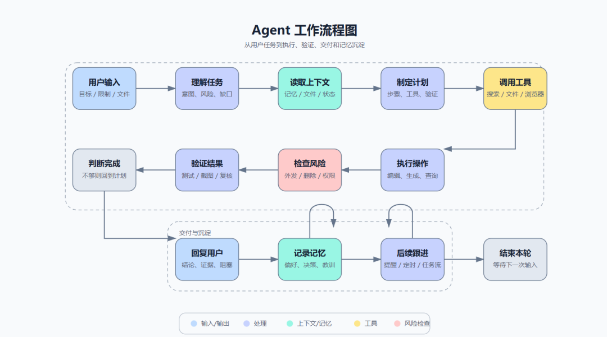

> 📎 来源: [凯哥在滇藏](https://mp.weixin.qq.com/s?__biz=MzA5NDU4MTk5OA==&mid=2457485473&idx=1&sn=eb44f870faa4dc2ff2c058db44f0e660&chksm=86067e257f18d8fe35b23d923a8a5b78204c96fa94d4769809e962e2928f1a2d4a5f06a66a21&mpshare=1&scene=1&srcid=0524k3zcCITPP91YROAnkrCT&sharer_shareinfo=7d44806726b5bfaa0bdd29f3ef5ea91a&sharer_shareinfo_first=7d44806726b5bfaa0bdd29f3ef5ea91a) | 时间: 2026-05-24 02:42

---

**点击蓝字**

**关注我们**

很多人用 AI 写方案，文字越来越快。

但一到画流程图、架构图、白板图，又回到了手工时代。

写文档的时候，AI 可以帮你列大纲、写说明、润色内容。

但是当你想画一张“用户下单流程图”“产品功能架构图”“Agent 工作流程图”时，很多人还是要打开画图软件，一个框一个框拖，一个箭头一个箭头连。

所以我最近重点学了一个 Skill：diagram-maker。

它解决的问题很直接：

让 Agent 帮你生成流程图、架构图、概念图、白板图。

1、diagram-maker 是什么？

diagram-maker 是一个专门用来做图的 Agent Skill。

它不是普通的“AI 帮我解释一下流程”。

它的目标是：直接生成可交付的图表文件。

比如你可以让它输出：

1. HTML/SVG 图
2. 架构图
3. 流程图
4. 白板图
5. Excalidraw 可编辑文件

也就是说，它不是简单告诉你：

用户输入 → 系统处理 → 返回结果

而是会根据你的需求，把节点、关系、分组、布局都组织好，然后生成一份图表文件。

这比普通 AI 只输出 Mermaid 或文字流程，更适合用在文章配图、方案说明、项目汇报里。

2、我用它画了一张 Agent 工作流程图

我刚才测试了一个很简单的需求：

帮我画个流程图，内容是 Agent 工作流程图。

最后生成出来的图里包含了这些环节：

1. 用户输入
2. 理解任务
3. 读取上下文
4. 制定计划
5. 调用工具
6. 执行操作
7. 检查风险
8. 验证结果
9. 回复用户
10. 记录记忆
11. 后续跟进
12. 结束本轮

这张图不是简单的一条线，而是把 Agent 的完整工作过程画成了一个闭环。

其中比较有用的是，它把“检查风险”“验证结果”“记录记忆”这些容易被忽略的环节也画出来了。

这就很适合拿来做：

1. 公众号配图
2. 产品说明图
3. 内部培训图
4. AI Agent 工作机制介绍
5. PPT 里的流程页

最关键的是，你不需要会设计软件。

你只需要把需求说清楚。

3、怎么向 Agent 提需求？

不要只说：

帮我画个流程图。

这样太宽泛。

更好的说法是：

请帮我画一个【图类型】，主题是【主题】，包含【节点/角色】，体现【关键关系】，风格要求【清晰/专业/适合汇报】，输出为【HTML/SVG/Excalidraw】。

这个模板可以直接复制：

请帮我画一个【业务流程图】，主题是【用户下单到售后】，包含【用户、系统、客服】三个角色，体现【下单、支付、发货、收货、售后】之间的关系，风格要求【清晰、专业、适合汇报】，输出为【HTML/SVG 文件】。

再举一个实际例子：

帮我画一个 Agent 工作流程图，包含用户输入、理解任务、读取上下文、制定计划、调用工具、执行操作、风险检查、验证结果、回复用户、记录记忆、后续跟进，要求结构清晰，适合放进公众号文章，输出 HTML/SVG 文件。

这样提需求，Agent 更容易画出能用的图。

4、使用时注意什么？

我建议记住 4 点：

- 先说图的类型

是流程图、架构图、概念图，还是白板图。

- 说清楚节点

也就是图里必须出现哪些元素。

- 说清楚关系

哪些节点先后发生，哪些节点属于同一组，哪些地方有循环。

- 说清楚用途

是放公众号、做汇报、写方案，还是给团队沟通。

用途很重要。

因为同样是流程图，放公众号和给工程团队看的图，复杂度不一样。

5、它不能替代什么？

diagram-maker 很实用，但也不是万能的。

它适合快速生成清晰图表，尤其适合从 0 到 1 出图。

但如果你要做非常精细的视觉设计，比如品牌海报、复杂 UI、强视觉冲击的大图，那它不是最合适的工具。

它更像是：

1. 帮你快速出图
2. 帮你梳理逻辑
3. 帮你生成可交付初稿
4. 帮你减少手工排版时间

