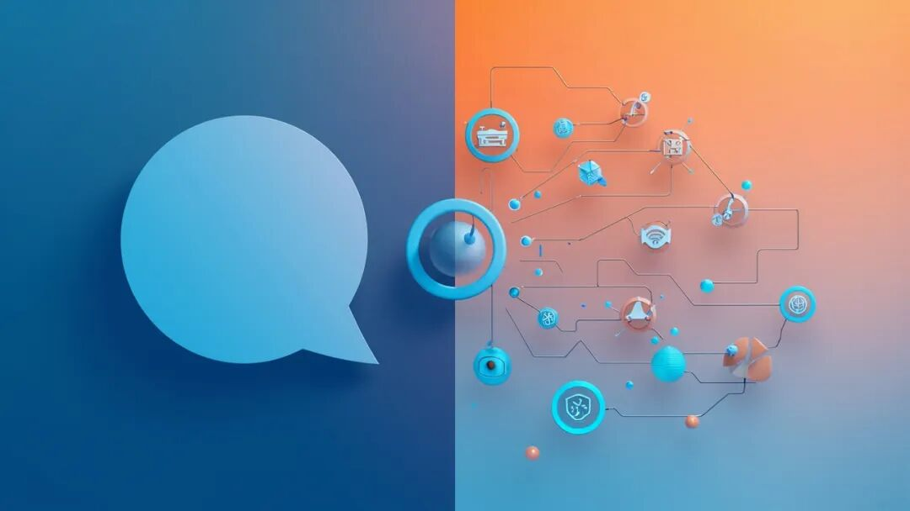

> 📎 来源: [笃行者AI](https://mp.weixin.qq.com/s?__biz=MzY4MjEzNzIwMw==&mid=2247484570&idx=1&sn=1cbda0cff725223d917ceb4881297aea&chksm=f221d817d98a587e8f993c725a1db2f80ee99fe343799e7c2601fabab30f56c0cacd77a67bad&mpshare=1&scene=1&srcid=0524sXaaT1XHltgS1cZIWcyJ&sharer_shareinfo=45c61ed7e9d6392848f37f84aa986b32&sharer_shareinfo_first=45c61ed7e9d6392848f37f84aa986b32) | 时间: 2026-05-24 12:31

---

# 智能体、MCP、Skill到底是啥？5句话大白话讲透

> 知乎上有个问题："MCP、Skill、Agent这些词天天见，到底是干什么的？"

> 我写了个回答，结果被高赞收藏了。

今天这篇文章纯干货，把相关概念讲清楚，保证你读完就能复述给别人听。

下面开始：

### 什么是智能体？

你平时用的ChatGPT、DeepSeek等，那是大模型，Claude code，Qwen code，Workbuddy，才是智能体（AI Agent）。

> 大模型是你问它答，智能体是你交代任务，它交付成果。

大模型：明天天气怎么样？它回答：明天晴，26度。。。

智能体：每天早上看下天气，，如果下雨，给我打电话提醒带伞。于是它每天早上就会查天气预报，判断要不要给你打电话。

这就是智能体和大模型最大的区别：大模型只会聊天，智能体会做事。

大模型相当于大脑，智能体相当于员工。

前阵子那么流行的龙虾，为啥叫龙虾呀，我在[《跟着我：安全、免费用龙虾》](https://mp.weixin.qq.com/s?__biz=MzY4MjEzNzIwMw==&mid=2247483711&idx=1&sn=820e68b3d48f7b775dafb7cc80650c8e&scene=21#wechat_redirect)里详细讲过，就是因为它长出了手，可以干活了。

### 五个相关概念

公司来了一个新员工（智能体），老板说：你来带带它（把它当成一个实习生）吧。下面每个概念用一句话和一个例子讲清楚：

**Agent（智能体）= 实习生本人**

一句话：一个能听懂任务、自己规划步骤、动手完成的AI。

例子：你跟智能体说"帮我写一篇公众号文章并发出去"，它会自己搜索资料→写大纲→写正文→排版→发布。你不用每一步都盯着。

**MCP = 给实习生开通公司系统账号**

一句话：连接外部工具数据源的万能接头。

以前AI只能聊天，因为它没有"手"，碰不到外面的世界。MCP就是给它装上手——接上数据库就能查数据，接上邮箱就能发邮件，接上日历就能排日程。

例子：我给Claude Code接了一个飞书MCP，它就能直接在飞书表格里查选题库、写数据，不用我手动复制粘贴。

**Skill = 给实习生一本标准操作手册**

一句话：封装每次都要用的重复动作。

例子：比如，你每次写公众号都要"搜选题→→写大纲→写正文→审核→配图→排版→发布"六个步骤。你创建一个写公众号的Skill，就是把这六步打包。你说"写篇关于XX的文章"，它就自动按这套流程走。

**Rules = 给实习生定规矩**

一句话：告诉它什么能做，什么不能做。

例子：所有数据要有出处，所有观点要有依据。

**Memory = 实习生的笔记本**

一句话：记住有用信息。

例子：我电脑是ARM64架构。

关于MCP、Skill、Rules、Memories的区别，我在[《装了100个Skill，AI还是不听话？》](https://mp.weixin.qq.com/s?__biz=MzY4MjEzNzIwMw==&mid=2247484249&idx=1&sn=cf32db5ed4993a958105d22ac5d8d0f2&scene=21#wechat_redirect)里用一张对比表里还有解释，可以参照阅读。

### 一个故事：让智能体帮你订饭店

比如你搭好了一个智能体，你跟它说："帮我安排一顿周末家庭聚餐。"它是这样工作的：

**Memory先上场**——它记得你家地址、记得你对猫过敏（不能去有猫的咖啡馆）、记得你喜欢粤菜。

**Rules框住边界**——"人均不能超过100块""提前2小时确认""餐厅评分不能低于4.5"。

**MCP接通工具**——它连高德查附近餐厅、连大众点评查评分和人均、连日历看你周末哪天有空。

**Skill启动流程**——查餐厅→筛选项→比价格→发建议→确认→设提醒。

最后，给你发个微信："周日晚6点，XXX餐厅，已预订4人位，人均168，已添加日历提醒。"

> 整个过程，你只说了一句话。这就是智能体+MCP+Skill+Rules+Memory合在一起的效果。我在[《AI没那么夸张？》](https://mp.weixin.qq.com/s?__biz=MzY4MjEzNzIwMw==&mid=2247483750&idx=1&sn=0c60e1185f3462c2afcb976b5d9ea585&scene=21#wechat_redirect)里聊过：智能体不是"更强的AI"，而是"能干活的AI"，这是两个物种。

### 未来的时代，是"人人有数字员工"的时代

智能体不会取代所有人，但会用智能体的人会取代不会用的。

MCP让AI有工具，Skill让AI有章法，Rules让AI有底线，Memory让AI有记性——这四个东西加起来，就是一个**能干活、会学习、守规矩、长记性**的数字员工。

未来不是"AI有多强"，而是**你手里的AI能帮你干多少活**。

---

**欢迎关注我的公众号，送你AI干货，还有社群陪伴，一对一解决你的问题。**
