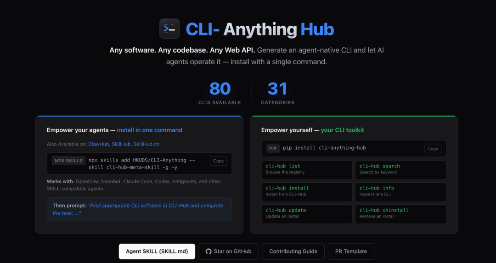
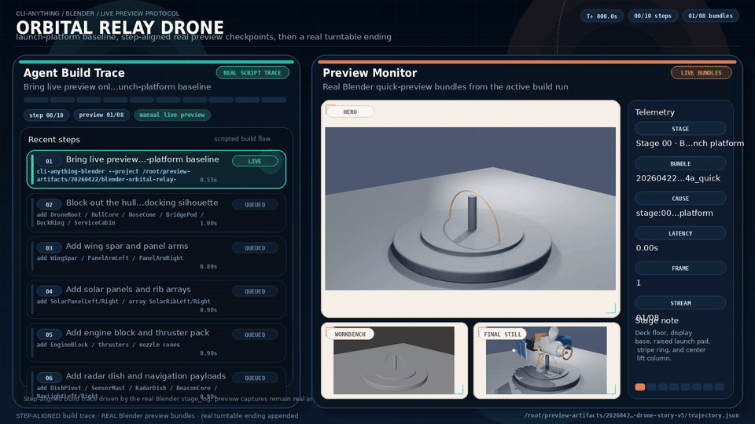
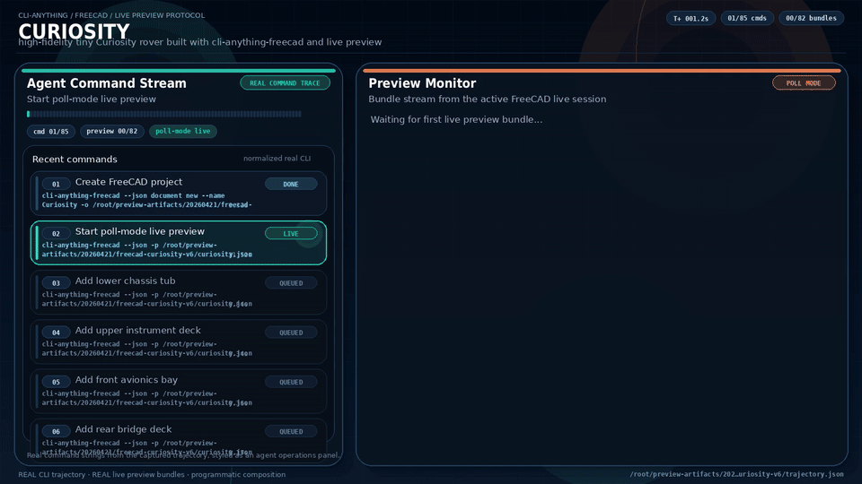
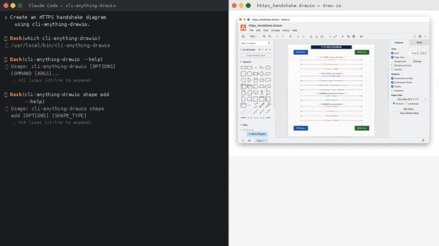
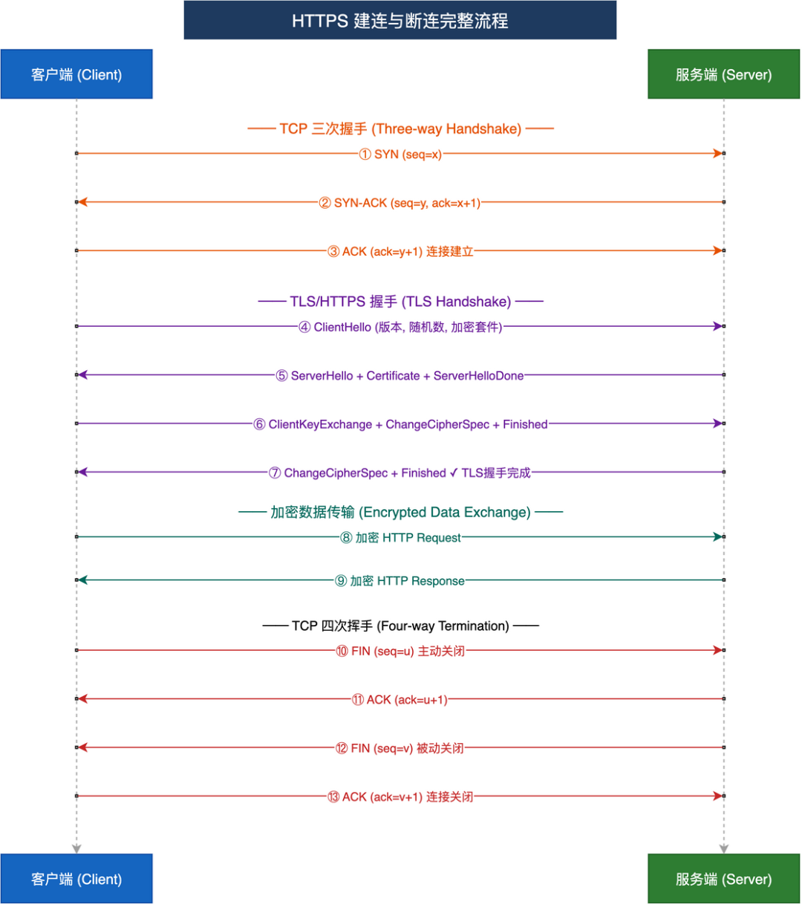

> 📎 来源: [极客之家](https://mp.weixin.qq.com/s?__biz=MzU2MTI4MjI0MQ==&mid=2247543478&idx=1&sn=34f1b1110ee7e25754ebddc0c6f0fbc5&chksm=fdd729fb520925453561320a88c91d45c3dc4cd9cf9356c828ae8641f3573976088957db3a52&mpshare=1&scene=1&srcid=0522uobeLvaq4E8Y5ykFI9eh&sharer_shareinfo=3b48ae915969f2bf575eddb99c976365&sharer_shareinfo_first=3b48ae915969f2bf575eddb99c976365) | 时间: 2026-05-22 22:23

---

我最近在用 Claude Code 做一个自动化处理的项目，中间需要调 Blender 渲染一批 3D 图。写到这里的时候我卡住了——Claude Code 根本没法直接操作 Blender，Blender 有自己的 Python API，有图形界面，但你让 Agent 通过这套东西干活，基本就是在对着空气说话。

这其实不是 Blender 的问题，几乎所有有点分量的专业软件都是这样。这些软件是给人用的，交互逻辑是鼠标+键盘+眼睛，Agent 进来了就傻眼。当时我能想到的解法要么是写一大堆胶水代码，要么就是用那种基于截图的 GUI 自动化，但那玩意一换个系统主题就跌了，脆得很。

后来我翻到了 CLI-Anything 这个项目，是香港大学数据科学实验室（HKUDS）做的，GitHub 地址在这：

> https://github.com/HKUDS/CLI-Anything

---

# 它在解决什么问题

现在的 AI Agent——不管是 Claude Code 还是 Codex，本质上是文本进文本出的东西。它能写代码、调 API、查文档，但遇到 Blender、GIMP、LibreOffice 这种带 GUI 的专业软件，就只能绕道走。要么手写一个薄薄的 wrapper，要么靠截图点击这种 RPA 玩法，但这两条路都有硬伤：wrapper 写得越深工作量越大，RPA 跑起来看心情。

CLI-Anything 的思路是：**给任意一款软件自动生成一套结构化的 CLI 接口**，让 Agent 直接用命令行调软件，输入命令，拿回 JSON 结果。没有截图，没有点击，没有 fragile 的 GUI 操控，就是纯粹的命令行交互。

其实很好理解：CLI 本来就是人和程序之间的接口，格式清晰，可组合，天然适合 LLM 读写。

---

# 工作原理

核心就是一条命令：

```
/cli-anything ./gimp
```

把软件路径（或 GitHub 仓库地址）丢进去，它会跑一条 7 阶段的全自动流水线：

1. 1. **🔍 Analyze** — 扫描源码，把 GUI 操作映射到底层 API
2. 2. **📐 Design** — 设计命令分组、状态模型、输出格式
3. 3. **🔨 Implement** — 用 Click 框架实现 CLI，带 REPL 模式、JSON 输出、undo/redo
4. 4. **📋 Plan Tests** — 生成 TEST.md，规划单元测试和端到端测试
5. 5. **🧪 Write Tests** — 跑测试，覆盖真实软件调用
6. 6. **📝 Document** — 更新测试结果文档
7. 7. **📦 Publish** — 生成 setup.py，装进 PATH

跑完之后你就有了一个可以直接 pip install 的 CLI 包，名字统一叫 

```
cli-anything-<软件名
```

，比如 

```
cli-anything-gimp
```

、

```
cli-anything-blender
```

。所有生成的包都在 

```
cli_anything.*
```

 命名空间下，不会互相打架。

生成的 CLI 还自带 REPL 模式，可以保持会话状态，支持 undo/redo，这对 Agent 的长流程任务很友好——不用每次调用都重新初始化软件上下文。

---

# SKILL.md 的作用

每个生成的 CLI 都会附带一个 

```
SKILL.md
```

 文件，放在 

```
skills/cli-anything-<软件名>/SKILL.md
```

。

这个文件的格式是专门给 Agent 读的——YAML 头部写名称和描述，正文列所有命令组和子命令，加上用法示例和 JSON 输出说明。Agent 读完这个文件就知道这个工具能干什么、怎么调、输出是什么格式。

结合 CLI-Hub 的元技能，Agent 甚至可以自己去注册表里找合适的 CLI、装好、读 SKILL.md、然后开始干活——全程不需要人介入。

```
# 让 Agent 自主完成任务"Find appropriate CLI software in CLI-Hub and complete the task: "
```

---

# CLI-Hub

单靠一个项目自己维护所有软件的 CLI 肯定撑不住，所以他们做了一个 CLI-Hub，相当于一个社区驱动的 CLI 注册表。

```
pip install cli-anything-hubcli-hub install
```

目前 Hub 上的 CLI 覆盖范围已经挺广了。



创意类的有 Blender、GIMP、Krita、Inkscape、Shotcut、Kdenlive、Audacity、OBS Studio；科学计算方向有 FreeCAD、QGIS、RenderDoc、UniMol Tools；开发工具有 Obsidian、Zotero、n8n、WireMock、Exa；游戏有 Godot Engine 和 Slay the Spire II；办公协作有 LibreOffice、Zoom、Jitsi Meet；AI/ML 那边有 Stable Diffusion WebUI、ComfyUI、Ollama。

注册表是实时更新的，社区提交 PR 合并后立刻生效。截至我写这篇文章的时候，几乎每天都有新的 CLI 并入，Rekordbox、Calibre、MiniMax 这些都是最近一两天刚合并的。

另外，Hub 还有一个"元技能"（meta-skill）——Agent 可以直接读 Hub 的目录，自主选择安装哪个 CLI，不需要人工指定。

---

# 真实 Demo

光说能用不够服气，项目里有几个真实的 Demo 值得看一眼。

### Blender：3D 无人机

Agent 用 

```
cli-anything-blender
```

 一步一步搭了一个轨道中继无人机的 3D 模型，每一步都能看到实时预览，命令和对应的视觉状态全部记录进了 

```
trajectory.json
```

，可以回放。



Blender 轨道中继无人机 3D 模型构建 Demo，Agent 通过 CLI-Anything 驱动 Blender 完成建模全过程

### FreeCAD：好奇号月球车

用 

```
cli-anything-freecad
```

 搭了一个好奇号风格的月球车模型，同样带实时预览和轨迹记录。FreeCAD 是个比较硬核的 CAD 工具，能跑通这个流程说明 CLI 覆盖的功能深度不低。



FreeCAD 好奇号月球车构建 Demo，通过 CLI-Anything 驱动 FreeCAD 完成 CAD 模型的逐步装配

### Draw.io：HTTPS 握手流程图

Agent 从零开始画了一张完整的 HTTPS 连接生命周期图——TCP 三次握手、TLS 协商、加密数据交换、四次挥手——全部通过 CLI 命令完成，最终产出 

```
.drawio
```

 和 

```
.png
```

 两个文件。



Draw.io CLI Demo，Agent 通过命令行绘制完整 HTTPS 握手时序图，含 TCP 建连、TLS 协商和断连流程

最终生成的图长这样：



CLI-Anything 生成的 HTTPS 握手时序图最终成品，完整展示 TCP+TLS 全链路通信过程

---

# 平台支持

目前已经支持的 AI 编程工具：

| 平台 | 接入方式 | 状态 |
| --- | --- | --- |
| Claude Code | ``` /plugin marketplace add HKUDS/CLI-Anything ``` | 官方支持 |
| Pi Coding Agent | bash 脚本安装扩展 | 官方支持 |
| OpenCode | 复制命令文件到配置目录 | 官方支持 |
| OpenClaw | 复制 SKILL.md 到技能目录 | 社区支持 |
| Codex | bash 安装脚本 | 社区支持（实验性） |
| GitHub Copilot CLI | ``` copilot plugin install ``` | 社区支持 |
| Qodercli | 注册脚本 | 社区支持 |

Claude Code 的接入最简单，三步搞定：

```
# 第一步：添加插件市场/plugin marketplace add HKUDS/CLI-Anything# 第二步：安装插件/plugin install cli-anything# 第三步：生成 CLI/cli-anything ./目标软件路径
```

Cursor 和 Windsurf 的支持据说也在路上，不过目前还没合并。

---

# 写在最后

能让 Claude Code、Codex 这类工具直接驱动 Blender、FreeCAD、GIMP 这种专业软件，思路上确实打在了痛点上。这几个 Demo 也不是玩具级别的——月球车、3D 无人机、完整流程图，东西是真的产出来了。

当然有几点还值得观察：生成 CLI 的质量依赖于源码分析的深度，如果软件的 Python API 封装得乱七八糟，生成出来的 CLI 覆盖率可能没那么理想。另外，社区贡献的 CLI 质量良莠不齐，Hub 现在靠 CI 做基础验证，但能不能挡住差的东西，得看以后的维护力度。

不过有一点我比较认可：项目每天都在合并 PR，这个更新频率在开源项目里不多见。社区也在持续贡献，最近合并的 Rekordbox、Calibre、MiniMax 这些，都是真实使用场景里会用到的工具。

对正在用 Claude Code 或者 Codex 做自动化的同学，这个项目值得试一下。特别是你的工作流里有某款有界面但没开放 API 的工具——扔进去跑一圈，没准直接就通了。

> **项目地址**：https://github.com/HKUDS/CLI-Anything

> **CLI-Hub**：https://clianything.cc/

> **安装 Hub**：

> ```
> pip install cli-anything-hub
> ```

 

*****点击下方卡片，关注极客之家*****

这个公众号曾分享过许多有趣的开源项目。如果你不想逐篇翻阅历史文章，也可以直接关注微信公众号“极客之家”，通过后台留言与我们互动交流


