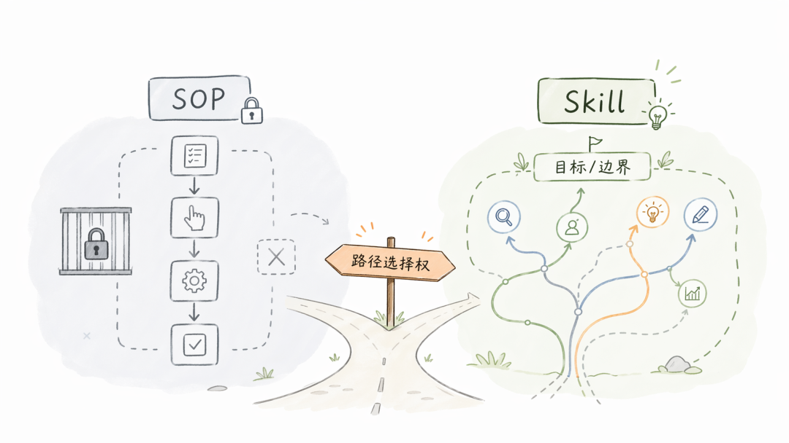
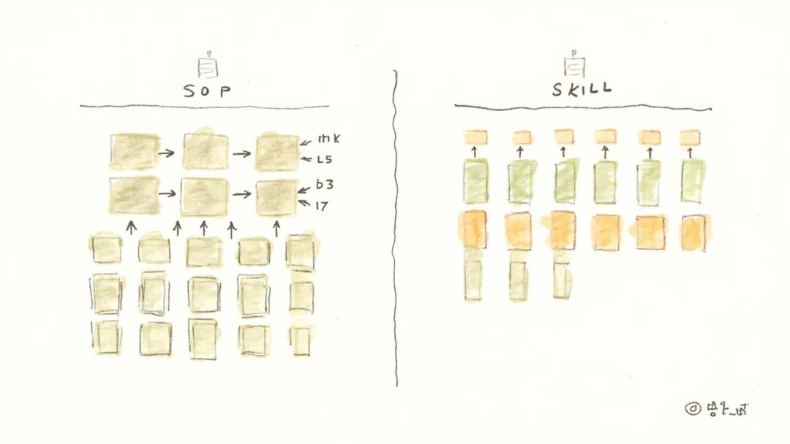
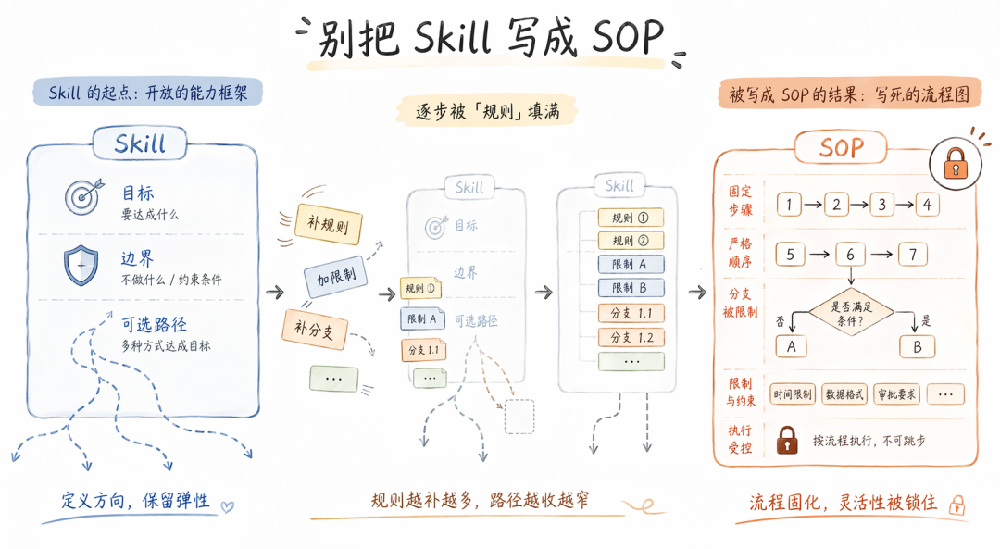

> 📎 来源: [彬彬You礼](https://mp.weixin.qq.com/s?__biz=MzIxMzQ1Nzc2NA==&mid=2247483961&idx=1&sn=cf6ddd7287e676f1bf87f6da9f26f3a8&chksm=96da63d2b129be2eff25b1a97590d9f5ee24b3c98a6ce06c66c1ecf2d36b27c10c2f5c8e8af2&mpshare=1&scene=1&srcid=0522pbbIhMwpFQEhDIMGQM0C&sharer_shareinfo=4ef5dd24e024c7b0d84d486ec21f3bcd&sharer_shareinfo_first=4ef5dd24e024c7b0d84d486ec21f3bcd) | 时间: 2026-05-22 01:58

---

读到一篇关于 AI agent 开发的博客，作者在复盘一个困扰自己一年多的 skill 设计问题。这个问题拖了很久，期间试过不少方案，一直没真正解决。后来技术条件变了，原来卡住的地方终于能做了，问题也随之解开。

但真正让我停下来的，不是问题本身，而是他在复盘里写的那几句：如果每遇到一个局部问题，就不断往 skill 里补规则、补分支、加限制，短期看像在修补，长期会把能力写死。最后 skill 会越来越重，越来越像流程图，而不是能力。真正重要的是目标清楚、边界清楚，而不是 SOP 越写越厚。

我看到这里，突然想到一个问题：Skill 和 SOP 有啥区别？

#### #Skill 和 SOP 到底差在哪里

要讲清楚这件事，先得把 Skill 和 SOP 分开。

SOP 是做一件事时，每一步该做什么的标准流程。它讲究顺序、规范和复现。很多时候，不按这个流程做，事情就很难做完，或者结果就容易失控。SOP 的核心，是把路径写清楚。

Skill 也有目标，也有必要的边界。但它和 SOP 最关键的区别在于路径选择权：Skill 守住目标和边界之后，把怎么走这条路的决定权留给执行者，让执行者根据具体情况自己判断。

SOP 规定每一步怎么做，Skill 只守目标和边界，路径由执行者在具体场景中自己选择。路径选择权，是区分两者最核心的一条线。

#### #一个 Skill 是怎么退化成 SOP 的

举个例子。假设你写了一个"深度调研"的 Skill，一开始只定义了目标（输出一份有结论的调研报告）和几条边界（至少覆盖三个信息源、交叉验证关键数据）。执行者拿到这些，可以自己决定先查论文还是先做访谈，可以根据领域特点调整信息源的权重。

然后第一次执行出了问题：有人跳过了交叉验证，结论站不住。于是你加了一条规则："必须在第三步做交叉验证"。第二次又出了问题：信息源选得太窄。你又补一个分支："如果是技术类话题，必须包含学术论文"。第三次，报告结构不统一，你再加一条："输出必须按 背景-发现-结论 三段式组织"。

每一次修补看起来都合理。但三轮下来，这个 Skill 已经规定了执行顺序、信息源选择策略和输出结构。执行者剩下的自由度，只是在预设框架里填内容。它从一个能力描述，变成了一张流程图。

#### #为什么会走到这一步

把 Skill 写成 SOP 的原因不止一个。

最常见的，是急于拿到结果。一旦只想着尽快完成任务，人就不会太在意为什么要这么做，也不会继续想还有没有更好的方式。最省事的办法，就是把步骤写满、限制加满、顺序钉死。短期很有效，长期把判断空间压没了。

另一个常见原因，是对执行者能力边界的不信任。尤其在 AI agent 场景下，很多人写 Skill 时心里想的是"它大概率会跑偏，所以我得把每一步都锁住"。这种不信任直接导致路径选择权被收回，Skill 退化成一份面向不可靠执行者的操作手册。

还有一种情况来自团队协作。当多个人或多个 agent 要用同一个 Skill 时，对一致性的追求会自然地推动细化。每个人都希望输出是可预期的，于是不断加约束，直到 Skill 变成一份所有人都必须严格遵循的标准流程。

这三个力量常常同时作用，而且互相强化。

#### #怎么判断你写的还是不是 Skill

如果要做一个自检，可以问自己一个问题：你正在写的这个 Skill，执行者拿到之后，还有没有空间根据具体情况选择自己的路径？

具体可以看几个信号。是不是总在补步骤、补限制、补分支。是不是要求严格按顺序执行。是不是一类相似任务出来的内容总是高度一致。是不是已经出现明显的错误信号了，系统还是沿着原来的方向继续执行，最后把错误一路放大。

如果这些信号越来越明显，那它大概率已经不再是 Skill，而只是换了个名字的 SOP。

发现退化之后怎么修？核心动作是把路径层和目标层重新分开。回到最初的问题：这个 Skill 要达成的目标是什么，必须守住的边界是什么。然后把所有"怎么做"的规定审一遍，问自己哪些是必要的边界约束，哪些只是某次出了问题之后的临时补丁。前者留下，后者去掉。

#### #最后

以后再写 Skill，最值得反复提醒自己的，不是怎么把流程补得更满，而是先问一句：我守住的是目标和边界，还是只是把路径写死了。
