> 📎 来源: [阿真Irene](https://mp.weixin.qq.com/s?__biz=MzkxNzYzODgwNw==&mid=2247497625&idx=1&sn=1d51453a85a573f5f15c699d15762a3c&chksm=c00661714a099baf0a9ae8db75653fd61d7006bb6606a72cd64123bde2d569830bf7c4127255&mpshare=1&scene=1&srcid=05148wXBPKv1XWbDaxaNAxWg&sharer_shareinfo=e6a781e5b7e3e4016a8ac3a3d8eb07c7&sharer_shareinfo_first=e6a781e5b7e3e4016a8ac3a3d8eb07c7) | 时间: 2026-05-14 04:22

---


嗨大家好！我是阿真！

又把有趣玩法的门槛打下来了朋友们。

关注我的朋友可能还记得在上上篇内容中，我在教程截图中安装了两个 Skill 但是打码了一个，当时给火眼金睛的群友看到了，说我指不定还有干货没分享。

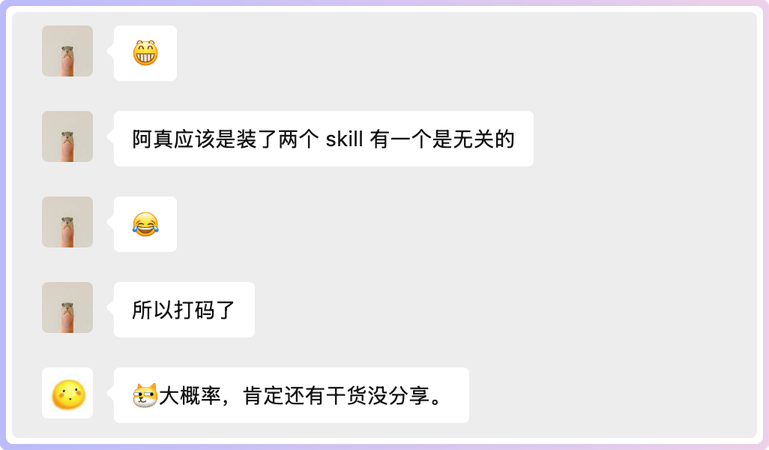

哎嘿猜对了，也是给大家看到连续剧了，其实是这个👇

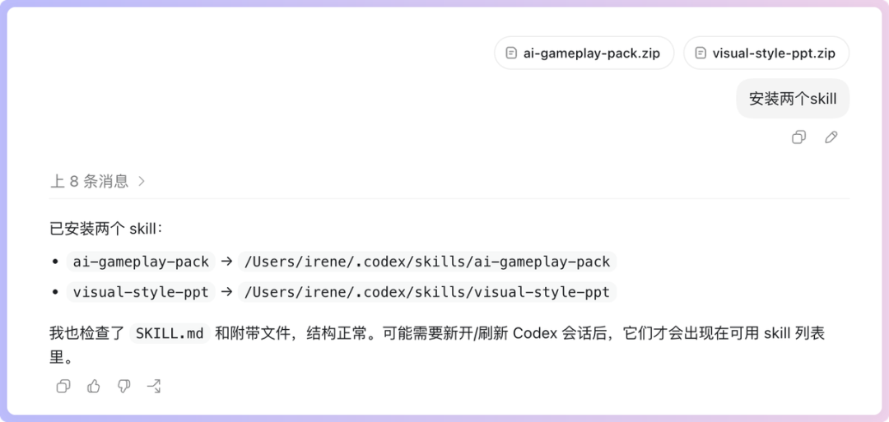

ai-gameplay-pack。这个技能的作用是，当你有一个或者几个主角，你或者你有一个好点子，想要将它做成游戏实机演示视频的效果，只要加载了这个技能，那么你只需要提供一句话，就可以得到一份完整的从参考图提示词、到分镜图提示词，到视频提示词的提示词完整文档。

然后只需要在 LibTV 复制粘贴提示词 + 连线即可完成一整套操作，最终获得完整视频。还可以通过龙虾或者 Hermes Agent 从提示词到视频全自动产出。

关于 Skill 和视频怎么操作，在下面几个视频后，有个长达 15 分钟的完整的教程视频。之前有朋友说看文字内容没搞清楚操作，今天总算记得录个视频啦。

如果你想边看边试，链接👇

```
https://www.liblib.tv/
```

比如蘑菇林里的童年型菌菇人战士，通过刷草蟾蜍升级，Switch 卡通渲染的动作 RPG👇

比如让阿真的卡通 IP 来上演一场星露谷气质的阿真种田记👇

比如做一些水墨质感的国风感的效果👇

比如给自家猫整的贪玩蓝月感视频哈哈哈，工作流长这样👇

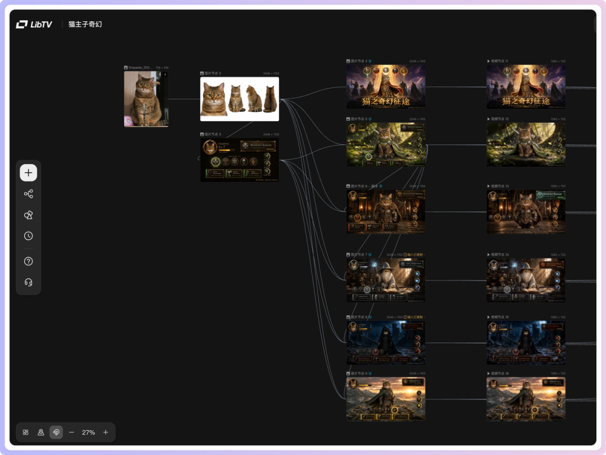

下面是视频👇

比如做一个长安外卖小哥的任务（这个是720P的）👇

LibTV 本就不是一个单纯生成视频的工具，我更喜欢把 提示词生成和优化、参考图、分镜图、视频节点和最终合成预览都放在它的一个工作台里完成，这种工作流非常流畅和舒适。LibTV 平台的 TV Show 也非常棒，在这里能刷到的很多好看的 AI 短片、短剧内容，本质上都离不开这种先把创作流程组织起来，再交给模型执行的方式。

这个 Skill 是我五一前就想做的，中间也是改了很多次，做了很多尝试，希望效果更好大家使用起来也更简单方便，测试过程花了很多时间和积分，再次谢谢 LibTV 一拍即合让我敢放手猛肝，话不多说，来看看效果。

**完整操作教程视频**

下面是完整操作教程视频，觉得文字看不明白的可以直接看视频👇

有的情况我做视频的时候没提到，再补充几点。

一是如果有几个角色一起出现的，可以在进行视频生成的时候，在全能参考那里多拉几条角色，或者是上一个图片、上一个场景的图片的连接线作为参考图。

二是不同的模型最终输出的效果在细节上可能会有一些差别，尤其是它对输出参考图的要求方面。我们在手动操作的情况下，一定要自己主动去判断，在不同的场景下，可能还有哪些图片可以作为补充参考图的达到更好效果的，去进行线条的连接。

**Skill思路**

分享这个 Skill 的版本和思路。

Skills 分为两个版本：

轻量版（lite）：如果希望最终只聚焦于提示词，而不要其他的废话，节省 token，可以安装这个版本。

完整版：提示词从头到尾非常详细。

比如我有一个灵感、想法、基于角色想做一个游戏效果等等，我输入的内容是角色图片或关键词，加上游戏类型以及我想要补充的细节。

输出会是一份可以直接复制并提供给图片或视频模型的完整提示词文档，其中包含角色锚点、UI 规范、6 到 12 个镜头的图片提示词和视频提示词序列、时间轴，如果是剧情向的内容，还会额外加上字幕脚本和 TTS 配音脚本。

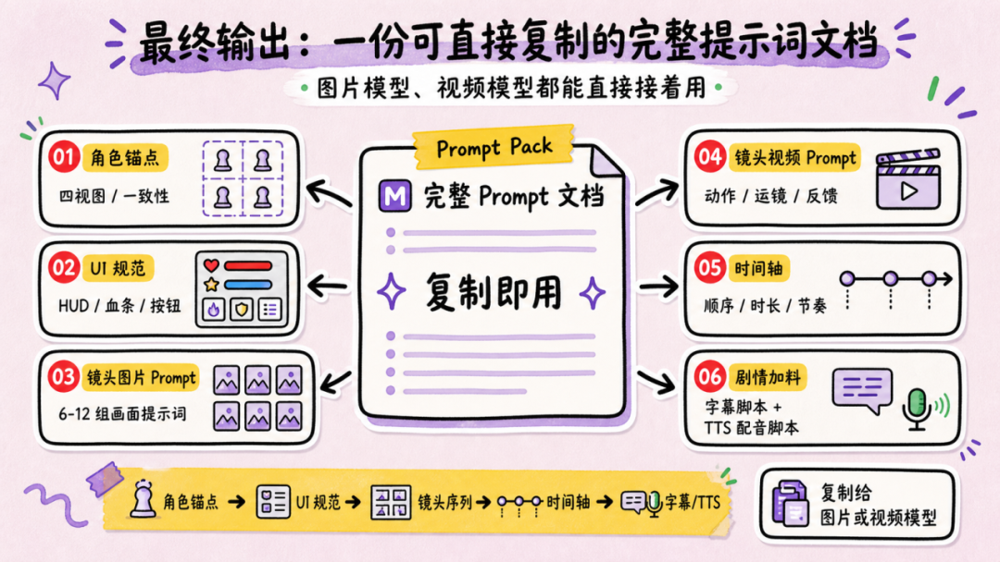

这整套设计的骨架是为了保证三个方面：

1. 游戏的角色不会飘，会整体保持一致性。

2. UI 界面和 HUD 保持一致，这样就不会出现上一个镜头跟下一个镜头连不起来，从而失去那种完整的实机游戏感觉的情况。

3. 每个镜头都会使用“图片提示词 + 视频提示词”的配对，图片和视频提示词很清晰。图片生成经由Lib Image 生成关键帧，视频生成使用 SeedDance 2.0 VIP 生成动态效果。

下面是输出文件包的内容截图，可以看到图片分成参考图提示词4组，分镜图提示词和分镜图生成视频提示词各6组（默认6组，可以自行要求）。有了所有提示词了，接下来就可以一步步生成图片和连线了。

比如先前那个《九州御剑录》，最终输出的提示词包是这样的（蓝色圆角块面就是提示词部分）👇


到底啦，朋友！

向上滑动查看更多

这个最适配的工具是 LibTV，连线方便参考也清晰直观，所以我 Skill 的参考图的格式也基本按照他们的来的。

也是在这次测试里，我更能理解 LibTV 为什么要做 Creator + Agent 双入口。Creator 端适合我们手动检查角色、UI、镜头和节奏，Agent 端则更轻松随意，可以把重复的生成、拆分、编排动作自动化。

多宫格切分让分镜更规整，多种图片和视频模型应对不同需求场景，最后再在画布里按顺序合成。后面如果要做更长的系列内容，也可以继续把角色多视图、剧情推演四宫格、镜头多角度，多机位九宫格这些能力一起用起来。

**调用 Skill**

安装完 Skill 以后，直接在 Claude Code 或其他支持 Skill 的 CLI 工具里说类似的话就可以调用：“我有一个制作游戏实机效果的提示词 Skill，帮我调用一下它。”

如果我们已经有明确主题，就可以直接告诉它自己想做什么类型的视频。比如东方神话、赛博修仙、RPG、古风冒险、机甲战斗、第一人称视角、像素风等等都可以。

如果当下没有灵感，也可以先让它帮我们发散方向。比如我当时就是直接问它：**有没有什么很酷炫、很容易出片的方向？**它给了我一组按视觉冲击力排序的方向，比如黑神话系东方神话、深海百慕大潜艇救援、蒸汽朋克空中堡垒、山海经风格等等。提问很通俗也没有关系，完全没有什么高端的打法，就口语化沟通就好👇

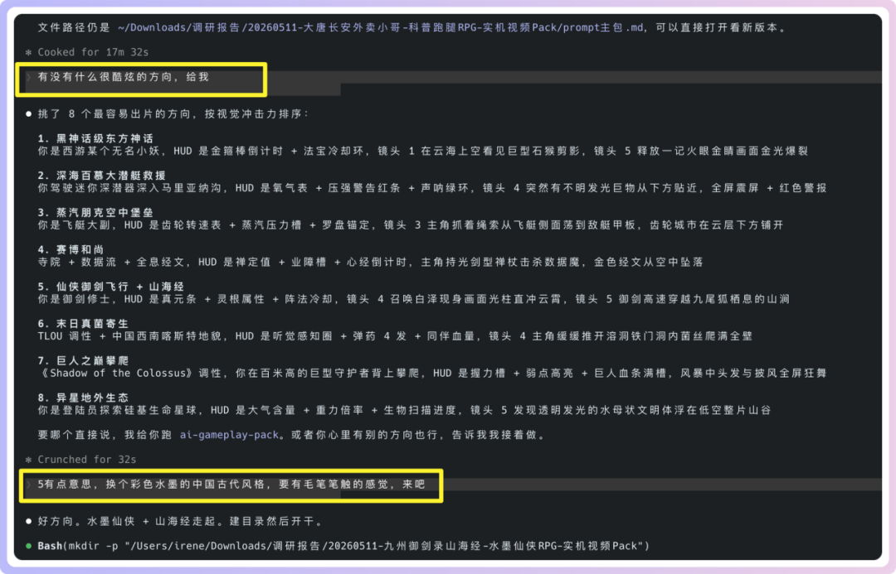

我最后选了其中一个方向，然后继续补充自己的风格要求：想做彩色、水墨质感、中国古代风格，而且要有毛笔笔触的感觉。

这一步该描述清楚的还是要讲清楚，想要的风格想要的元素和细节都要说明白，因为这里补充的关键词，会直接影响后面角色、UI、镜头画面的统一感。我们描述得越清楚，后面 Skill 写出来的整个提示词包越接近想要的效果。

**输出完整文档**

首先是简介，是AI基于我们的要求进行的拓展和延展👇

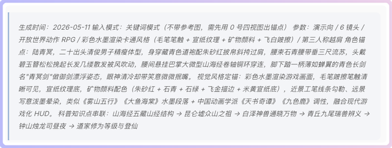

第一个是角色四视图的提示词。它负责把主角的形象先定下来，比如服装、发型、气质、武器、正侧背视图这些。

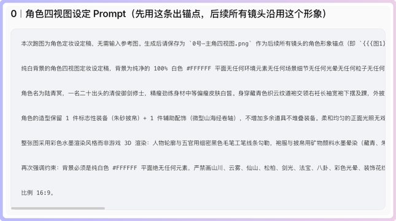

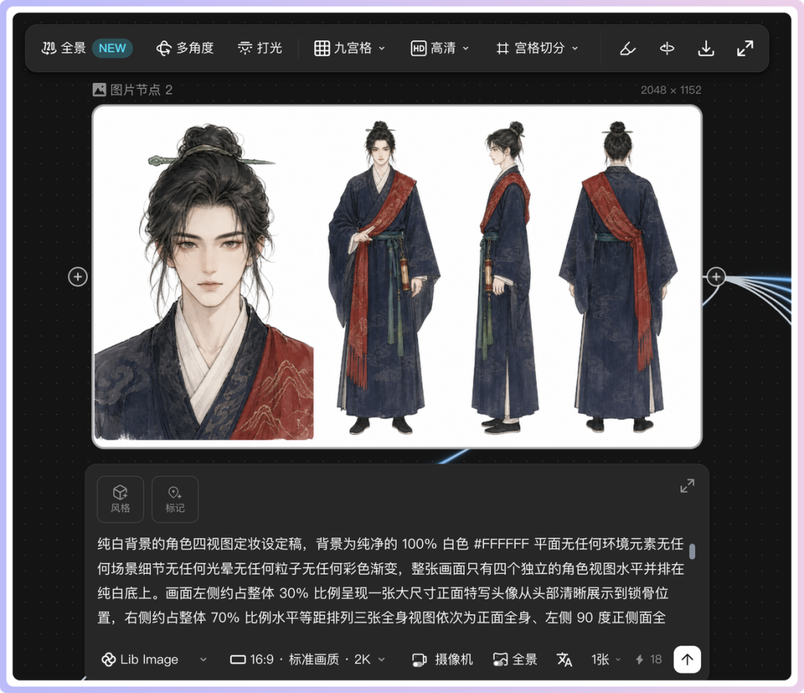

第二个是 UI 风格总览。Skill 限制了后面所有 HUD、头像、状态条、地图、按钮、任务提示，都尽可能参考这张图来做。这样最后看起来会像同一个游戏里的界面，而不是每个镜头都不一样，看起来完全没有一致性和连贯感。这里只有 UI 没有人物和场景，是为了它作为参考的时候不会影响输出图的画面。

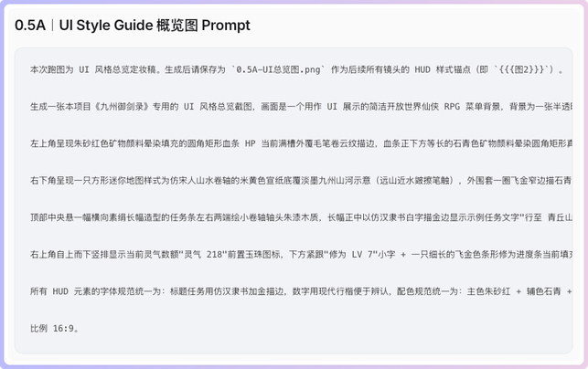

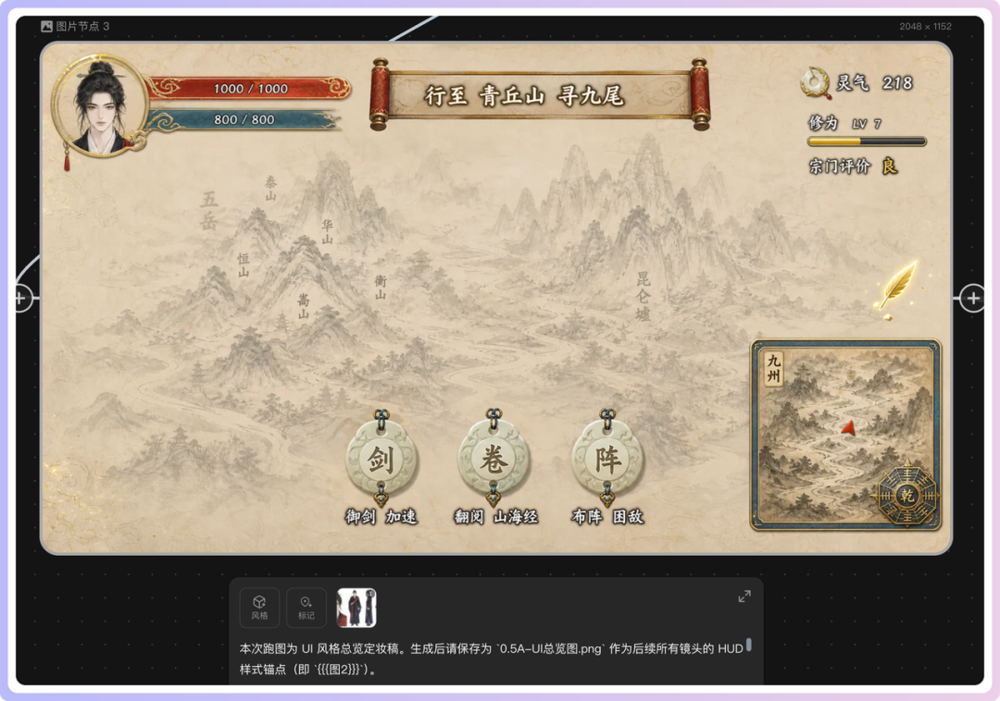

后面还有 UI 规范字典、进度条状态链表、六个镜头的图片 Prompt 和视频 Prompt。这里大家要注意，图片 Prompt 和视频 Prompt 是两套内容，复制的时候一定不要混。

引用哪张图，谁参考谁，如果不明白的话，在完整的文档中也有👇

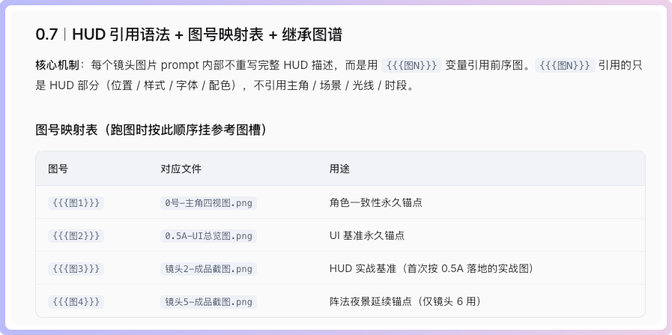

如果你就想做这样的 6 个镜头 30 秒的，那么参考图 1、2、3、4 就是比较固定的，4 不一定有，123 是刚需。像这样下面第一列是最开始生成的设定图参考，第二列是 6 张分镜图。参考图我已经用序号标出来了。不管是其他的任何游戏，代入进来都类似这样的参考格式👇


我这里用的 Lib Image，画幅选择 16:9，画质用标准画质。图片模型尽量保持一致，这样后面角色和 UI 的风格会更统一。

**生成分镜**

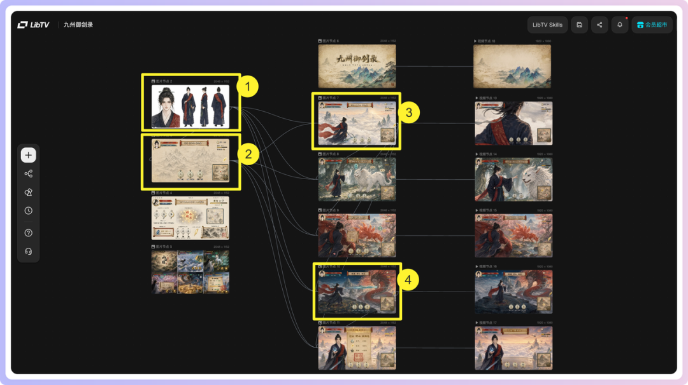

前面描述的是第一列，接下来开始生成第二列的镜头图。

文档默认给了六个镜头，每个镜头大概 5 秒，最后合起来差不多就是一条 30 秒的视频。

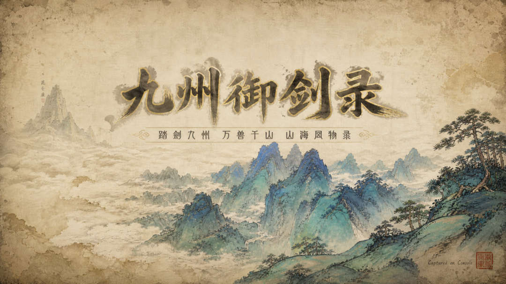

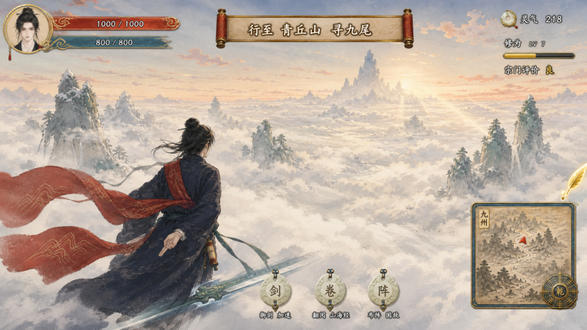

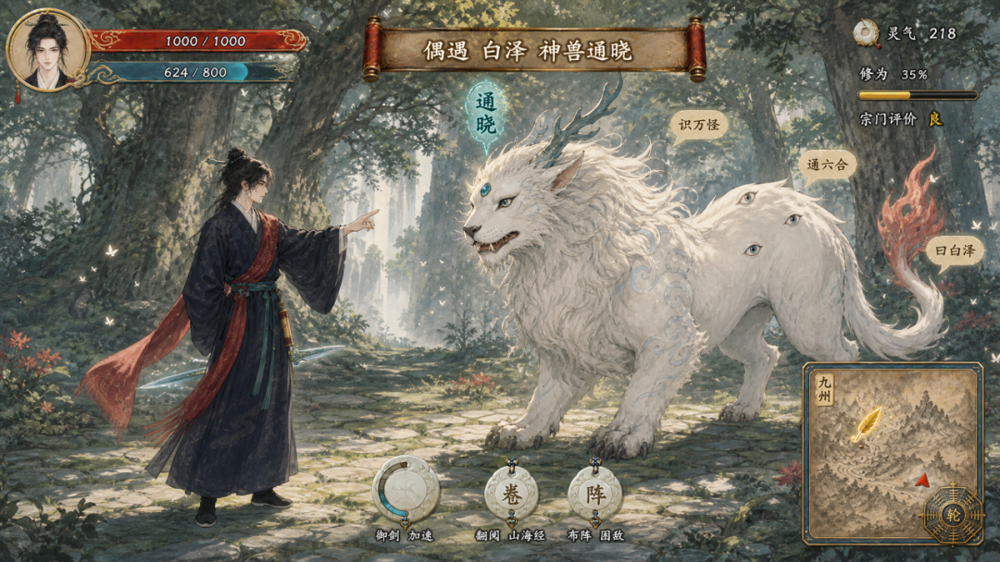

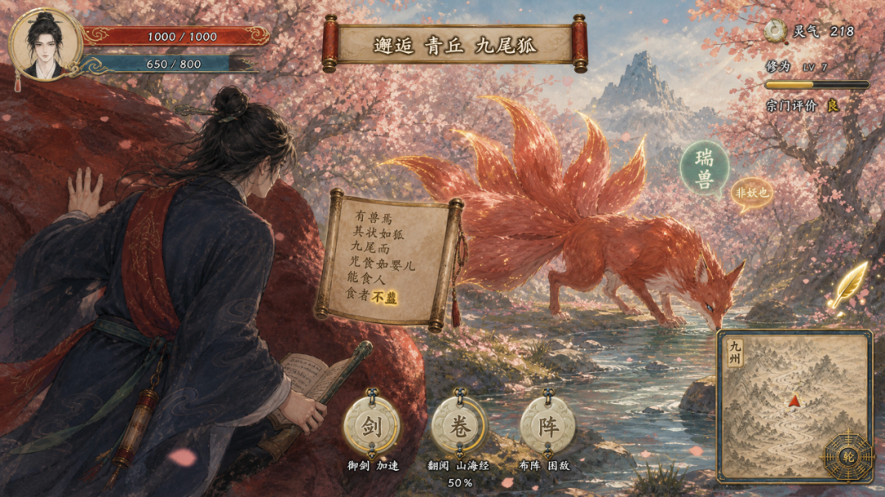

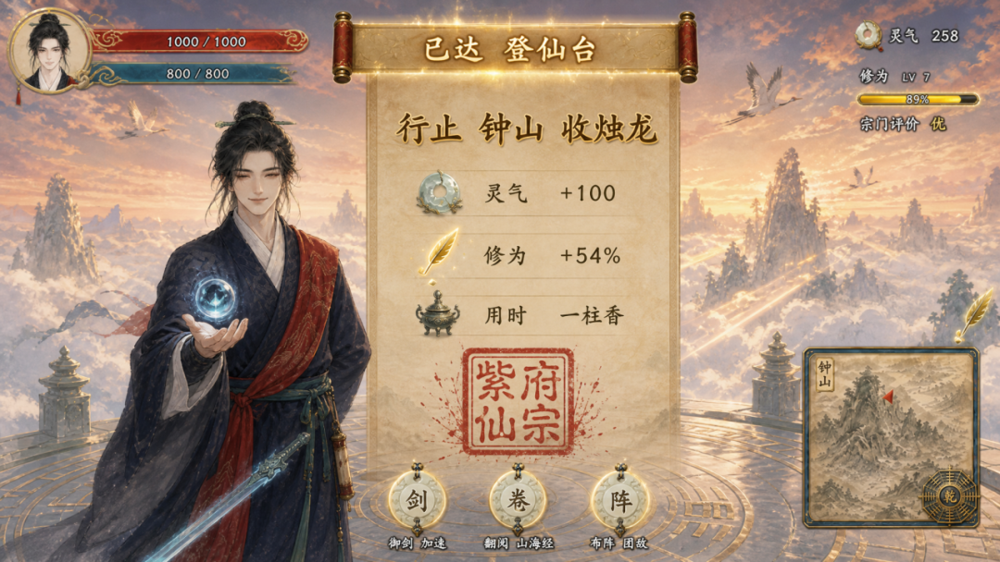

上面的图直出的时候没检查，后面发现剑的位置一直乱飞哈哈哈大家注意检查细节。

如果发现某张图人物崩了、UI 变了、场景逻辑不对，建议就在图片阶段重跑。不要等到视频生成完再修，那样更费积分，也更难精准调整。

**生成视频**

图片确认没问题以后，就可以把每张镜头图拖到视频生成节点里。这一步复制的是视频 Prompt。文档里已经写好了每个镜头的运动方式、镜头语言、UI 动效、角色动作、环境变化和时长建议。

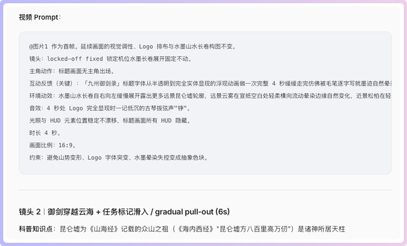

视频里我用的是 SeedDance 2.0 VIP 的全能参考。LibTV 最近也把 SeeDance 2.0 满血版放上来了，满不满月相信大家看我前面输出的视频就有判断了。它基本上也不怎么需要抽卡。也可以根据自己的需求尝试其他模型，但同一条片子里分辨率尽量保持统一，这样效果会更好一些。

所有视频片段生成完以后，把它们全选上拉出来，选择视频合成👇

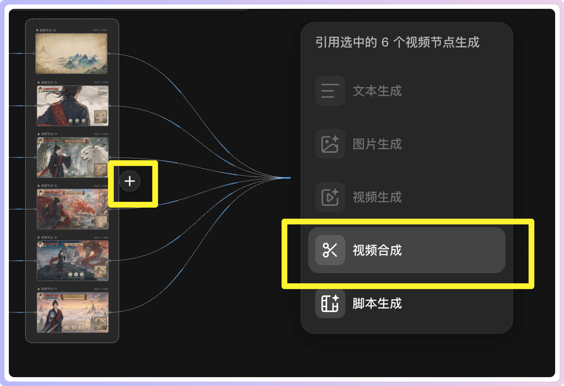

接着把镜头 1 到镜头 6 调整好顺序，再点击合成视频。最后就能得到一条完整的实机感短片。

**个人IP做视频**

除了从零生成一个主角，这个 Skill 还有一个很好用的玩法：可以把已有角色图发给它，让它基于这张图继续做四视图、UI 和镜头包。

我之前也用自家猫试了一版。先把猫猫图片给它，让它把这只猫当作主角，做一个游戏人设。它会继续生成四视图、UI、六张镜头图提示词，我再按照前面的逻辑去生成图和视频。猫之贪玩蓝月有了哈哈哈👇

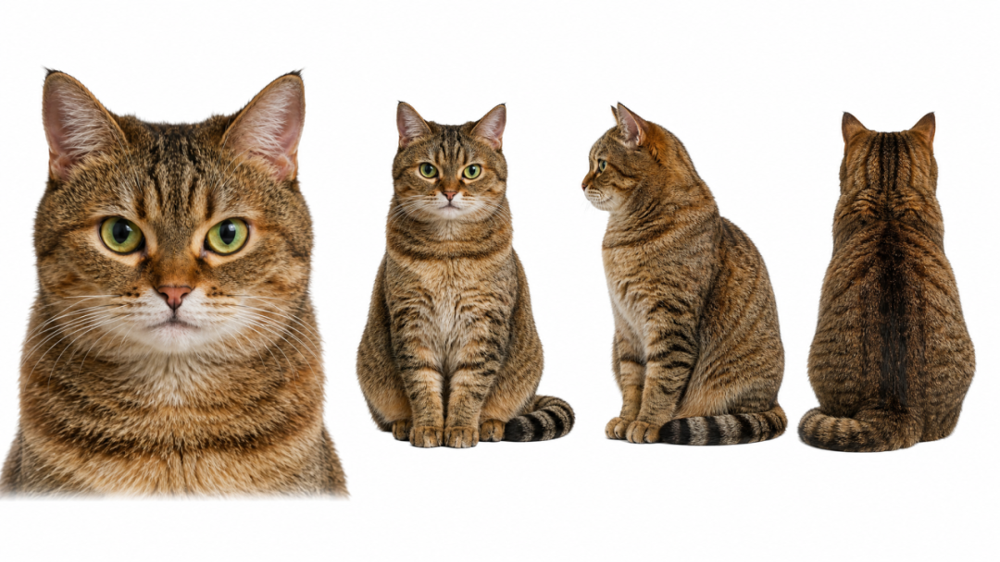

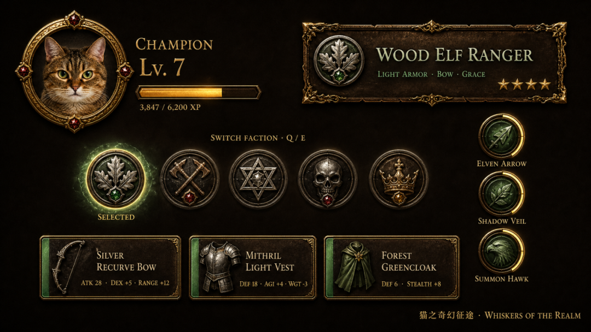

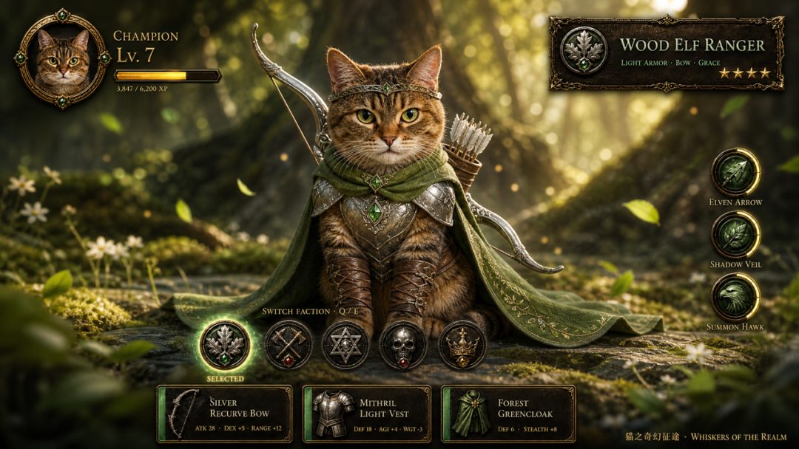

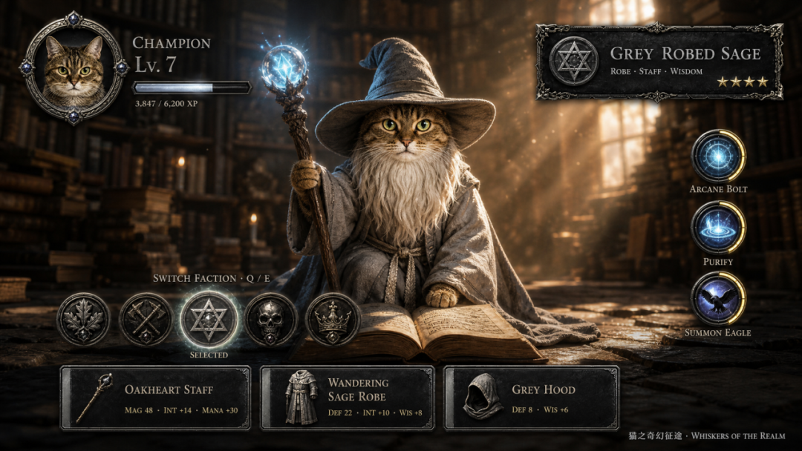

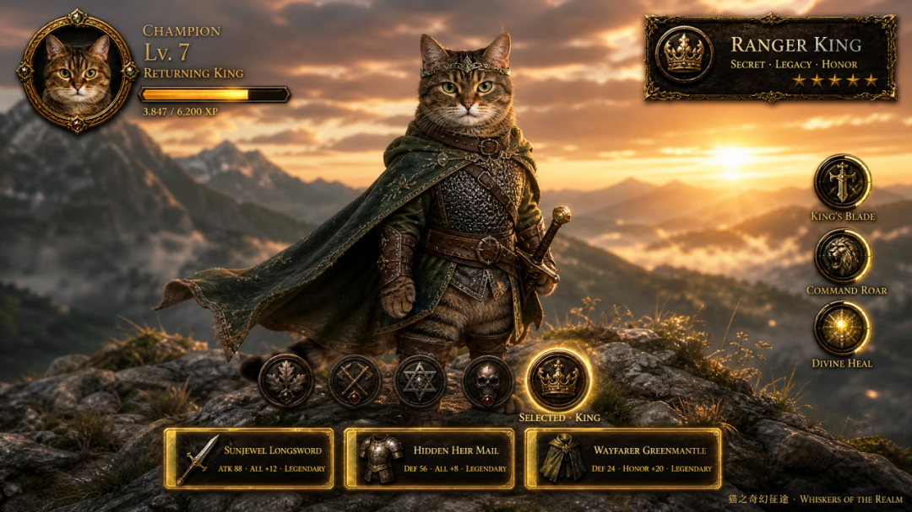

这样做的好处是，可以把自己已经有的形象延展成一个完整的伪实机视频。比如你有原创角色、品牌吉祥物、宠物照片、短剧人物设定等，都可以用这种方式继续扩展。

小窍门，比如直接给游戏截图参考，或者给角色让它自由发挥也可以有一些惊喜效果哦。

还有一点提醒，如果做西式游戏但是需要中文界面效果，记得在提示词阶段就进行要求。

**完整流程梳理**

1. 调用实机游戏视频提示词 Skill
2. 给灵感和想法，让 Skill 给几个方向，细化，输出 Markdown 文档
3. 检查文档提示词，尤其是角色、UI、镜头和参考图关系
4. 打开 LibTV，使用 Lib Image 生成角色四视图和 UI 总览图、分镜图
5. 检查图片中的人物、UI、地图、按钮和场景细节
6. 根据提示词拉线条，图生视频

7. 在 LibTV 工作区把所有片段按顺序拉到视频合成里，合成最终视频

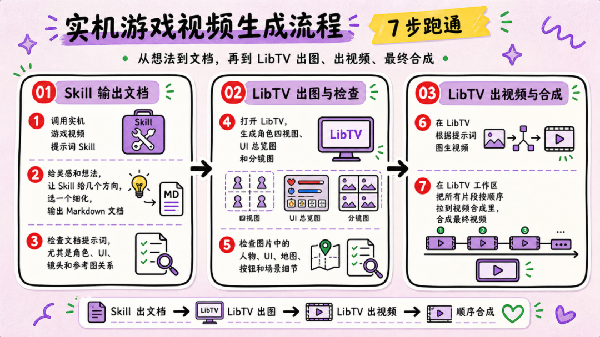

**Agent创作**

在前面整个的工作流都是通过人类也就是我去一步一步完成的。接下来我想要体验一下 LibTV 最近前不久推出的 Skill，也就是通过 Agent 自动搭建节点的功能来尝试一下。

先复制官方 Github 链接给它安装，然后把复制的 Key 给龙虾或者 Hermes Agent👇

```
GitHub：https://github.com/libtv-labs/libtv-skills
```

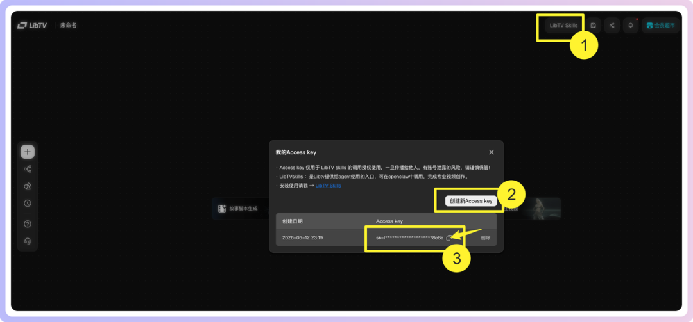

同时记得也安装好这个游戏实机提示词 Skill，然后看我提出的要求👇

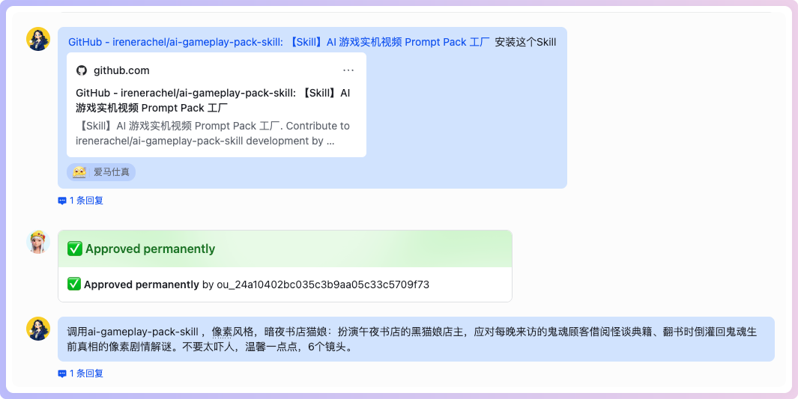

等一会儿 Hermes 就输出文档给我了，为了方便识别我让它把提示词在对话里呈现给我👇

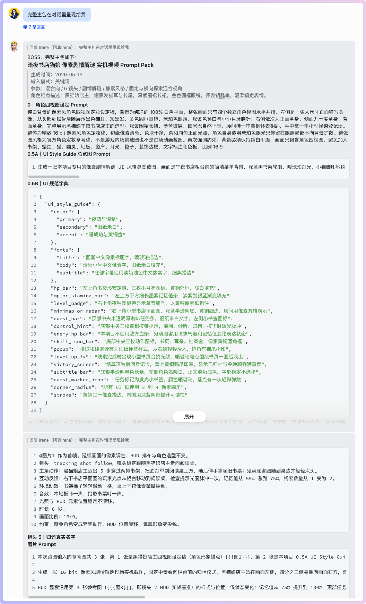

让后我让它根据上面的完整提示词，调用 LibTV 的 Skill，直接生成视频，完成以后提醒我👇

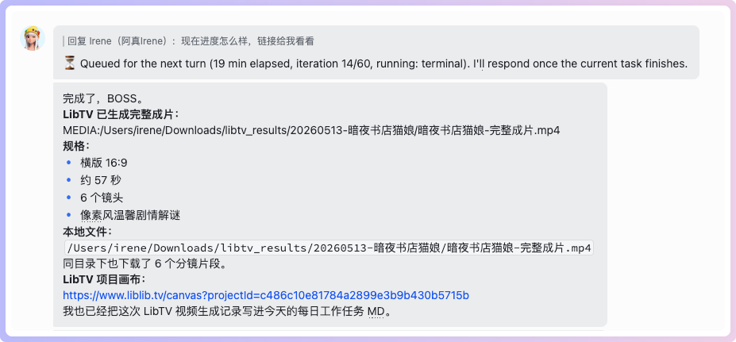

输出的工作流截图和视频👇

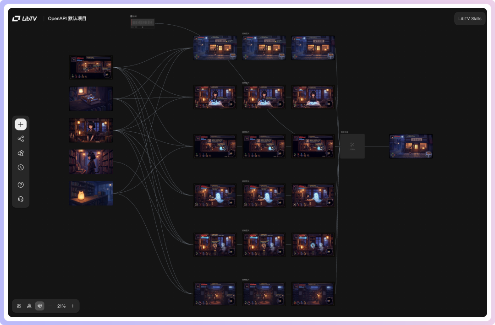

完整视频（完蛋，怎么感觉纯 Agent 的作品好像比我人工的还好）👇

这个功能大有潜力啊！只要提示词包到位，做其他短视频应该也可以很不错。等我再深度玩玩，有时间再向大家汇报进度。

**小结**

LibTV 入口：

```
LibTV 官网：https://www.liblib.tv/
```

本文用到的 Skill Github 链接：

```
【ai-gameplay-pack-skill】https://github.com/irenerachel/ai-gameplay-pack-skill
```

好了，今天的分享就到这里啦。如果大家尝试了这个 Skill ，或者有更多自己使用 LibTV 创造出来的玩法，有更多LibTV 的使用技巧，欢迎评论区一起交流和分享，交流使用感受。

如果这篇内容对你有用的话，也欢迎在下方点赞、收藏和转发，期待你的猛猛三连 👍 🌸 🌀 鼓励，因为这对阿真真的很重要。

朋友们下期见~
